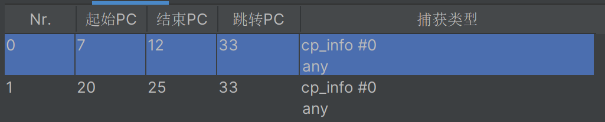
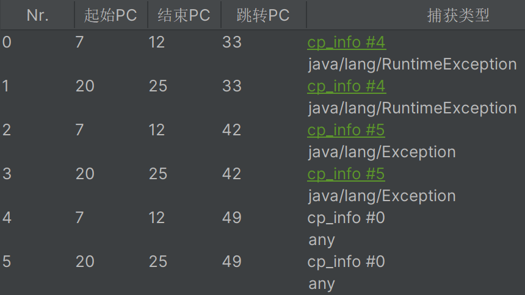

## 问题

写代码时，突然遇到了finally的执行顺序问题：for循环里continue了，finally还会不会执行。

```java
@Test
public void test1() {
  for (int i = 0; i < 5; i++) {
    try {
      if (i == 3) {
        continue;
      }
      printTry(i);
    } finally {
      printFinally(i);
    }
  }
}
```

```
try : 0
finally : 0
try : 1
finally : 1
try : 2
finally : 2
finally : 3
try : 4
finally : 4
```

从这段代码的执行结果可以看到，finally每次都会执行。


## 分析

### 反编译

**字节码**

```
 0 iconst_0
 1 istore_1
 2 iload_1
 3 iconst_5
 4 if_icmpge 47 (+43)
 7 iload_1
 8 iconst_3
 9 if_icmpne 20 (+11)
12 aload_0
13 iload_1
14 invokevirtual #2 <cn/addenda/fp/dayplan/test/FinallyContinueTest.printFinally : (I)V>
17 goto 41 (+24)
20 aload_0
21 iload_1
22 invokevirtual #3 <cn/addenda/fp/dayplan/test/FinallyContinueTest.printTry : (I)V>
25 aload_0
26 iload_1
27 invokevirtual #2 <cn/addenda/fp/dayplan/test/FinallyContinueTest.printFinally : (I)V>
30 goto 41 (+11)
33 astore_2
34 aload_0
35 iload_1
36 invokevirtual #2 <cn/addenda/fp/dayplan/test/FinallyContinueTest.printFinally : (I)V>
39 aload_2
40 athrow
41 iinc 1 by 1
44 goto 2 (-42)
47 return
```

**异常表**

<center><br/>图1-异常表</center>

### 解释

我利用自己的理解结合AI工具，解释这段字节码：

初始化变量：

- 0 iconst_0：将整数常量 0 压入操作数栈。
- 1 istore_1：将操作数栈顶的值弹出并存储到局部变量表中的第1个位置（即 i = 0）。

循环条件判断：

- 2 iload_1：将局部变量表中的第1个位置的值（即 i）压入操作数栈。
- 3 iconst_5：将整数常量 5 压入操作数栈。
- 4 if_icmpge 47 (+43)：比较操作数栈顶的两个值，如果 i >= 5，则跳转到第47行（即 return）。

条件分支：

- 7 iload_1：将局部变量表中的第1个位置的值（即 i）压入操作数栈。
- 8 iconst_3：将整数常量 3 压入操作数栈。
- 9 if_icmpne 20 (+11)：比较操作数栈顶的两个值，如果 i != 3，则跳转到第20行。

处理 i == 3 的情况：

- 12 aload_0：将局部变量表中的第0个位置的值（即 this）压入操作数栈。
- 13 iload_1：将局部变量表中的第1个位置的值（即 i）压入操作数栈。
- 14 invokevirtual #2 <cn/addenda/fp/dayplan/test/FinallyContinueTest.printFinally : (I)V>：调用 printFinally(i) 方法。
- 17 goto 41 (+24)：无条件跳转到第41行，继续下一次循环。

处理 i != 3 的情况：

- 20 aload_0：将局部变量表中的第0个位置的值（即 this）压入操作数栈。
- 21 iload_1：将局部变量表中的第1个位置的值（即 i）压入操作数栈。
- 22 invokevirtual #3 <cn/addenda/fp/dayplan/test/FinallyContinueTest.printTry : (I)V>：调用 printTry(i) 方法。
- 25 aload_0：将局部变量表中的第0个位置的值（即 this）压入操作数栈。
- 26 iload_1：将局部变量表中的第1个位置的值（即 i）压入操作数栈。
- 27 invokevirtual #2 <cn/addenda/fp/dayplan/test/FinallyContinueTest.printFinally : (I)V>：调用 printFinally(i) 方法。
- 30 goto 41 (+11)：无条件跳转到第41行，继续下一次循环。

异常处理：

- 33 astore_2：将操作数栈顶的值（即异常对象）存储到局部变量表中的第2个位置。
- 34 aload_0：将局部变量表中的第0个位置的值（即 this）压入操作数栈。
- 35 iload_1：将局部变量表中的第1个位置的值（即 i）压入操作数栈。
- 36 invokevirtual #2 <cn/addenda/fp/dayplan/test/FinallyContinueTest.printFinally : (I)V>：调用 printFinally(i) 方法。
- 39 aload_2：将局部变量表中的第2个位置的值（即异常对象）压入操作数栈。
- 40 athrow：抛出异常。

循环迭代：

- 41 iinc 1 by 1：将局部变量表中的第1个位置的值（即 i）加1。
- 44 goto 2 (-42)：无条件跳转到第2行，继续循环。

结束：

- 47 return：方法返回。

### 总结

可以看到，finally的实现方式是在每一个出口的地方都注入finally里的代码。所以，只要出try-finally代码块之前都会执行finally里的代码。


## 拓展

finally和return的执行顺序。

### 反编译

**代码**

```java
@Test
public void test2() {
  for (int i = 0; i < 5; i++) {
    try {
      if (i == 3) {
        continue;
      }
      printTry(i);
    } catch (RuntimeException e) {
      continue;
    } catch (Exception e) {
      return;
    } finally {
      printFinally(i);
    }
  }
}
```

**字节码**

```java
 0 iconst_0
 1 istore_1
 2 iload_1
 3 iconst_5
 4 if_icmpge 63 (+59)
 7 iload_1
 8 iconst_3
 9 if_icmpne 20 (+11)
12 aload_0
13 iload_1
14 invokevirtual #2 <cn/addenda/fp/dayplan/test/FinallyContinueTest.printFinally : (I)V>
17 goto 57 (+40)
20 aload_0
21 iload_1
22 invokevirtual #3 <cn/addenda/fp/dayplan/test/FinallyContinueTest.printTry : (I)V>
25 aload_0
26 iload_1
27 invokevirtual #2 <cn/addenda/fp/dayplan/test/FinallyContinueTest.printFinally : (I)V>
30 goto 57 (+27)
33 astore_2
34 aload_0
35 iload_1
36 invokevirtual #2 <cn/addenda/fp/dayplan/test/FinallyContinueTest.printFinally : (I)V>
39 goto 57 (+18)
42 astore_2
43 aload_0
44 iload_1
45 invokevirtual #2 <cn/addenda/fp/dayplan/test/FinallyContinueTest.printFinally : (I)V>
48 return
49 astore_3
50 aload_0
51 iload_1
52 invokevirtual #2 <cn/addenda/fp/dayplan/test/FinallyContinueTest.printFinally : (I)V>
55 aload_3
56 athrow
57 iinc 1 by 1
60 goto 2 (-58)
63 return
```

**异常表**

<center><br/>图2-拓展异常表</center>

### 解释

初始化变量：

- 0 iconst_0：将整数常量 0 压入操作数栈。
- 1 istore_1：将操作数栈顶的值弹出并存储到局部变量表中的第1个位置（即 i = 0）。

循环条件判断：

- 2 iload_1：将局部变量表中的第1个位置的值（即 i）压入操作数栈。
- 3 iconst_5：将整数常量 5 压入操作数栈。
- 4 if_icmpge 63 (+59)：比较操作数栈顶的两个值，如果 i >= 5，则跳转到第63行（即 return）。

条件分支：

- 7 iload_1：将局部变量表中的第1个位置的值（即 i）压入操作数栈。
- 8 iconst_3：将整数常量 3 压入操作数栈。
- 9 if_icmpne 20 (+11)：比较操作数栈顶的两个值，如果 i != 3，则跳转到第20行。

处理 i == 3 的情况：

- 12 aload_0：将局部变量表中的第0个位置的值（即 this）压入操作数栈。
- 13 iload_1：将局部变量表中的第1个位置的值（即 i）压入操作数栈。
- 14 invokevirtual #2 <cn/addenda/fp/dayplan/test/FinallyContinueTest.printFinally : (I)V>：调用 printFinally(i) 方法。
- 17 goto 57 (+40)：无条件跳转到第57行，继续下一次循环。

处理 i != 3 的情况：

- 20 aload_0：将局部变量表中的第0个位置的值（即 this）压入操作数栈。
- 21 iload_1：将局部变量表中的第1个位置的值（即 i）压入操作数栈。
- 22 invokevirtual #3 <cn/addenda/fp/dayplan/test/FinallyContinueTest.printTry : (I)V>：调用 printTry(i) 方法。
- 25 aload_0：将局部变量表中的第0个位置的值（即 this）压入操作数栈。
- 26 iload_1：将局部变量表中的第1个位置的值（即 i）压入操作数栈。
- 27 invokevirtual #2 <cn/addenda/fp/dayplan/test/FinallyContinueTest.printFinally : (I)V>：调用 printFinally(i) 方法。
- 30 goto 57 (+27)：无条件跳转到第57行，继续下一次循环。

处理 RuntimeException 异常：

- 33 astore_2：将操作数栈顶的值（即异常对象）存储到局部变量表中的第2个位置。
- 34 aload_0：将局部变量表中的第0个位置的值（即 this）压入操作数栈。
- 35 iload_1：将局部变量表中的第1个位置的值（即 i）压入操作数栈。
- 36 invokevirtual #2 <cn/addenda/fp/dayplan/test/FinallyContinueTest.printFinally : (I)V>：调用 printFinally(i) 方法。
- 39 goto 57 (+18)：无条件跳转到第57行，继续下一次循环。

处理 Exception 异常：

- 42 astore_2：将操作数栈顶的值（即异常对象）存储到局部变量表中的第2个位置。
- 43 aload_0：将局部变量表中的第0个位置的值（即 this）压入操作数栈。
- 44 iload_1：将局部变量表中的第1个位置的值（即 i）压入操作数栈。
- 45 invokevirtual #2 <cn/addenda/fp/dayplan/test/FinallyContinueTest.printFinally : (I)V>：调用 printFinally(i) 方法。
- 48 return：方法返回。

处理未捕获的异常：

- 49 astore_3：将操作数栈顶的值（即异常对象）存储到局部变量表中的第3个位置。
- 50 aload_0：将局部变量表中的第0个位置的值（即 this）压入操作数栈。
- 51 iload_1：将局部变量表中的第1个位置的值（即 i）压入操作数栈。
- 52 invokevirtual #2 <cn/addenda/fp/dayplan/test/FinallyContinueTest.printFinally : (I)V>：调用 printFinally(i) 方法。
- 55 aload_3：将局部变量表中的第3个位置的值（即异常对象）压入操作数栈。
- 56 athrow：抛出异常。

循环迭代：

- 57 iinc 1 by 1：将局部变量表中的第1个位置的值（即 i）加1。
- 60 goto 2 (-58)：无条件跳转到第2行，继续循环。

结束：

- 63 return：方法返回。

### 总结

在拓展的案例里，主要是分析catch代码块里return的执行顺序。可以看到，在return之前，依然会执行finally块代码。所以，可以得到， 只要出try-catch-finally代码块，一定会执行finally的代码。


## 参考

1. [Java异常机制-从底层原理到使用实践_java catch底层-CSDN博客](https://blog.csdn.net/zzz_zjz/article/details/114107716)
