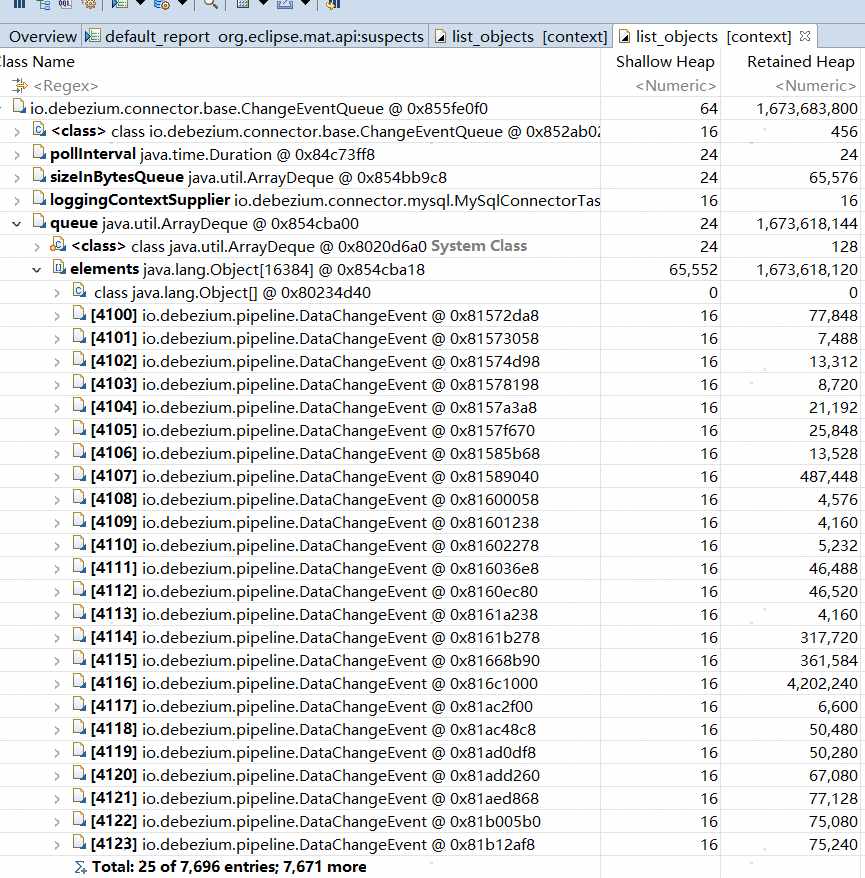
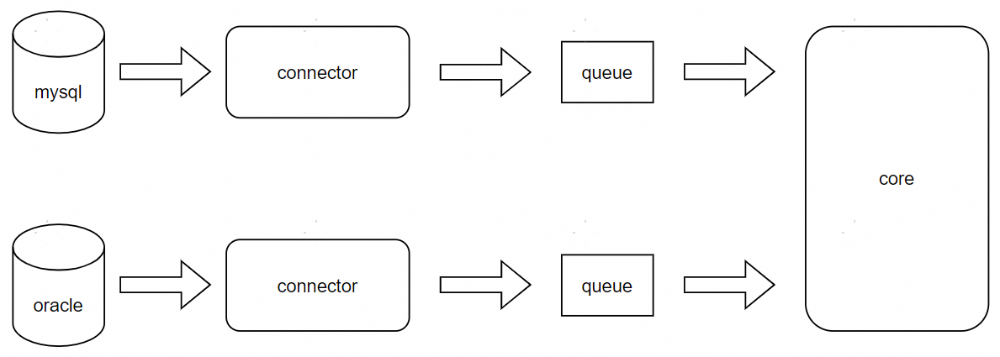
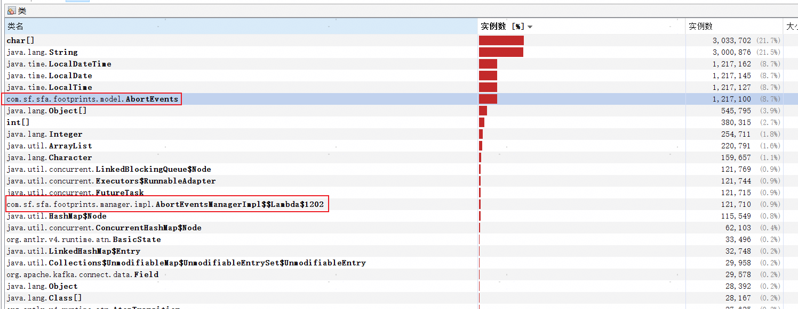
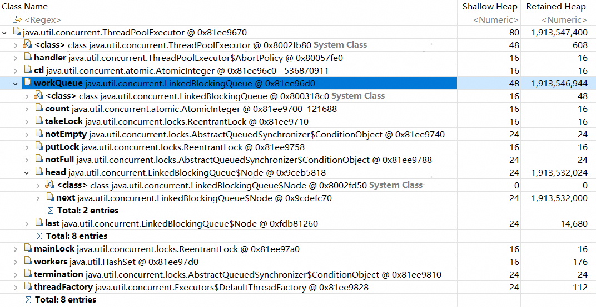

## 楔子

有一个基于Debezium组件开发的数据库日志监听服务在生产环境中连续报了两种OOM。解决问题的时候又引入了OOM并在测试环境报了出来。通过MAT和jvisualvm分析三次OOM发现分别是由无界队列、大事务、无界线程池导致的。


## 无界队列

找运维拿到第一次OOM的heap信息后，使用jvisualvm打开寻找大对象和大集合。如图1所示：

<center><br><div>图1：无界队列-jvisualvm</div></center>

从图1中我们可以看到char[]占据了堆大小的87.6%，同时java.lang.String的实例数和char[]的实例数差不多。所以基本是字符串引起的OOM。但是字符串是被谁引用而无法查询得到。

于是我们又使用MAT打开heap。使用leak suspect功能查看找到了字符串的引用链。如图2所示：

<center><br><div>图2：无界队列-MAT</div></center>

从图2的引用链可以看到由DateChangeEvent组成的queue占用了1.6G的内存。所以我们翻了一下Debezium的源码，研究了一下对象的创建逻辑。

对象具体的创建代码就不看了，调用链比较长，也没什么价值。理解了Debezium的结构就能明白原因：

Debezium为了兼容不同类型的数据库，设计的时候分成了connector和core两个部分。数据在两部分之间的流动是基于阻塞队列实现的生产者消费者模型。如图3所示：

<center><br><div>图3：debezium设计结构</div></center>

在core中可以注册监听器来消费队列的数据。当监听器消费数据的速度大于connector生产数据的数据时，数据就会在队列中堆积。队列可以配置大小，但是我们生产配置的值太大，实际上等同于无界队列了。

修复方法很简单，调节队列的maxSize就好了。


## 大事务

刚处理完无界队列的问题，第二天又出了OOM。我们又是拿到heap并继续分析问题。

用jvisualvm打开heap，如图4所示：

<center><br><div>图4：大事务-jvisualvm</div></center>

可以很明显看到debezium对象的实例数很多，但是依然无法得到引用链，所以还是得上MAT。如图5所示：

<center><br><div>图5：大事务-MAT</div></center>

从图5的引用链可以看出来有一个叫MemoryTransaction的对象占据了95.05%的堆内存。所以我们又翻源码寻找MemoryTransaction和DmlEvent队列的usage。核心源码如下：

```java
public class MemoryTransaction extends AbstractTransaction {

    private static final Logger LOGGER = LoggerFactory.getLogger(MemoryTransaction.class);

    private int numberOfEvents;
    private List<LogMinerEvent> events;

}
```

```java
public class MemoryLogMinerEventProcessor extends AbstractLogMinerEventProcessor<MemoryTransaction> {

	private final Map<String, MemoryTransaction> transactionCache = new HashMap<>();

    @Override
    protected Map<String, MemoryTransaction> getTransactionCache() {
        return transactionCache;
    }

    @Override
    protected void addToTransaction(String transactionId, LogMinerEventRow row, Supplier<LogMinerEvent> eventSupplier) {
        if (abandonedTransactionsCache.contains(transactionId)) {
            LOGGER.warn("Event for abandoned transaction {}, skipped.", transactionId);
            return;
        }
        if (!isRecentlyProcessed(transactionId)) {
            MemoryTransaction transaction = getTransactionCache().get(transactionId);
            if (transaction == null) {
                LOGGER.trace("Transaction {} not in cache for DML, creating.", transactionId);
                transaction = createTransaction(row);
                getTransactionCache().put(transactionId, transaction);
            }

            int eventId = transaction.getNextEventId();
            if (transaction.getEvents().size() <= eventId) {
                // Add new event at eventId offset
                LOGGER.trace("Transaction {}, adding event reference at index {}", transactionId, eventId);
                transaction.getEvents().add(eventSupplier.get());
                metrics.calculateLagMetrics(row.getChangeTime());
            }

            metrics.setActiveTransactions(getTransactionCache().size());
        }
        else if (!getConfig().isLobEnabled()) {
            // Explicitly only log this warning when LobEnabled is false because its commonplace for a
            // transaction to be re-mined and therefore seen as already processed until the SCN low
            // watermark is advanced after a long transaction is committed.
            LOGGER.warn("Event for transaction {} has already been processed, skipped.", transactionId);
        }
    }

}
```

```java
public abstract class AbstractLogMinerEventProcessor<T extends AbstractTransaction> implements LogMinerEventProcessor {

    protected void processRow(OraclePartition partition, LogMinerEventRow row) throws SQLException, InterruptedException {
        if (!row.getEventType().equals(EventType.MISSING_SCN)) {
            lastProcessedScn = row.getScn();
        }
        // filter out all events that are captured as part of the initial snapshot
        if (row.getScn().compareTo(offsetContext.getSnapshotScn()) < 0) {
            Map<String, Scn> snapshotPendingTransactions = offsetContext.getSnapshotPendingTransactions();
            if (snapshotPendingTransactions == null || !snapshotPendingTransactions.containsKey(row.getTransactionId())) {
                LOGGER.debug("Skipping event {} (SCN {}) because it is already encompassed by the initial snapshot", row.getEventType(), row.getScn());
                return;
            }
        }
        switch (row.getEventType()) {
            case MISSING_SCN:
                handleMissingScn(row);
            case START:
                handleStart(row);
                break;
            case COMMIT:
                handleCommit(partition, row);
                break;
            case ROLLBACK:
                handleRollback(row);
                break;
            case DDL:
                handleSchemaChange(row);
                break;
            case SELECT_LOB_LOCATOR:
                handleSelectLobLocator(row);
                break;
            case LOB_WRITE:
                handleLobWrite(row);
                break;
            case LOB_ERASE:
                handleLobErase(row);
                break;
            case INSERT:
            case UPDATE:
            case DELETE:
                handleDataEvent(row);
                break;
            case UNSUPPORTED:
                handleUnsupportedEvent(row);
                break;
        }
    }
}
```

代码解释：

1. Debezium-Oracle-Connector能捕获到事务的开始、处理和结束命令。
2. 在捕获到事务开始的命令时会创建一个MemoryTransaction对象，用于存储当前事务处理的数据。
3. 事务里对数据的处理是按照row模式记录的。每一个row的每一次处理都会用DmlEvent封装并存在MemoryTransaction里。
4. 当接收到rollback命令时将MemoryTransaction里的数据销毁。当收到commit命令时将MemoryTransaction里的数据提交。

所以如果一个事务处理了大量的数据MemoryTransaction就会把内存吃满。

这个问题的根因是在应用端，但是我们没法完全限制应用层开发的的SQL。所以采用了两种方式处理：

1. 扩大容器的内存，以缓解问题。
2. 丢弃大事务。

### 丢弃大事务

丢弃大事务的策略是在每次处理数据时判断DmlEvent队列的大小，如果超过阈值就将已收集到的数据丢弃。相关代码如下：

```java
public class MyMemoryLogMinerEventProcessor extends MemoryLogMinerEventProcessor {

    @Override
    protected void handleDataEvent(LogMinerEventRow row) throws SQLException, InterruptedException {

        abortEvents(row);

        super.handleDataEvent(row);
    }

    private void abortEvents(LogMinerEventRow row) {
        String transactionId = row.getTransactionId();
        MemoryTransaction transaction = getTransactionCache().get(transactionId);
        if (transaction == null) {
            return;
        }
        List<LogMinerEvent> events = transaction.getEvents();
        if (events == null || events.size() < abortEventThreshold) {
            return;
        }
        transaction = getAndRemoveTransactionFromCache(transactionId);
        if (transaction == null) {
            LOGGER.trace("Transaction {} not found, abort skipped.", transactionId);
            return;
        }

        abortTransactionIdSet.add(transactionId);

        Map<Binary<TableId, EventType>, AtomicInteger> tableEventCount = new HashMap<>();
        for (LogMinerEvent next : events) {
            tableEventCount.computeIfAbsent(new Binary<>(next.getTableId(), next.getEventType()), s -> new AtomicInteger(0)).getAndIncrement();
        }
        for (Entry<Binary<TableId, EventType>, AtomicInteger> entry : tableEventCount.entrySet()) {
            LOGGER.error("Event size of Transaction {} has exceed {}. abort event. tableId: {}, eventType:{}, count: {}.",
                transactionId, abortEventThreshold, entry.getKey().getF1(), entry.getKey().getF2(), entry.getValue().get());
        }

        events.removeIf(a -> !(a instanceof DmlEvent));

        List<AbortEvents> abortEventsList = new ArrayList<>();
        Iterator<LogMinerEvent> iterator = events.iterator();
        while (iterator.hasNext()) {
            DmlEvent next = (DmlEvent) iterator.next();
            iterator.remove();

            LogMinerDmlEntry dmlEntry = next.getDmlEntry();
            EventType eventType = dmlEntry.getEventType();
            Object[] oldValues = dmlEntry.getOldValues();
            Object[] newValues = dmlEntry.getNewValues();

            AbortEvents abortEvents = new AbortEvents();
            abortEvents.setEventType(String.valueOf(eventType));
            abortEvents.setBefore(toJson(oldValues));
            abortEvents.setAfter(toJson(newValues));
            abortEvents.setTableId(row.getTableId().toString());
            abortEvents.setTransactionId(transactionId);
            abortEvents.setStatus(AbortEvents.STATUS_NEW);
            abortEvents.setDbType(DatabaseConfig.DB_TYPE_ORACLE);
            abortEvents.setChangeTime(
                Optional.ofNullable(next.getChangeTime())
                    .map(a -> Jdk8DateUtils.timestampToLocalDateTime(a.toEpochMilli())).orElse(null));
            abortEventsList.add(abortEvents);

            if (abortEventsList.size() == 1000) {
                abortEventsManager.batchInsert(abortEventsList);
                abortEventsList = new ArrayList<>();
            }
        }

        abortEventsManager.batchInsert(abortEventsList);

        removeTransactionAndEventsFromCache(transaction);
    }
}
```

```java
public class AbortEventsManagerImpl implements AbortEventsManager {

    @Autowired
    private AbortEventsMapper abortEventsMapper;

    @Autowired
    private BatchOperationHelper batchOperationHelper;

    @Autowired
    private TransactionHelperNew transactionHelperNew;

    private final ExecutorService executorService = Executors.newFixedThreadPool(1);

    @Override
    public void batchInsert(List<AbortEvents> abortEventsList) {
        if (CollectionUtils.isEmpty(abortEventsList)) {
            return;
        }
        executorService.submit(() -> {
            try {
                transactionHelperNew.doTransaction(() -> {
                    batchOperationHelper.mybatisBatch(AbortEventsMapper.class, abortEventsList, AbortEventsMapper::insert);
                });
            } catch (Exception e) {
                log.error("存储丢弃事件时异常。", e);
            }
        });
    }

}
```

```java
public class AbortEvents implements Serializable {

    public static final String STATUS_NEW = "NEW";
    public static final String STATUS_COMMIT = "COMMIT";
    public static final String STATUS_ROLLBACK = "ROLLBACK";

    private static final long serialVersionUID = 105290927193843165L;
    private Long id;
    /**
     * 事件类型，
     */
    private String eventType;
    /**
     * 操作前
     */
    private String before;
    /**
     * 操作后
     */
    private String after;
    /**
     * 表ID
     */
    private String tableId;
    /**
     * 事务ID
     */
    private String transactionId;
    /**
     * 状态：NEW、COMMIT、ROLLBACK
     */
    private String status;
    /**
     * 数据库类型
     */
    private String dbType;

    private LocalDateTime changeTime;

}
```

在开发的时候想到这部分数据既然都采取丢失策略了，也就不在乎有没有真正入库了，所以开了一个异步任务处理，处理成功失败都不影响主流程。但代码里使用了`ExecutorService executorService = Executors.newFixedThreadPool(1);`，为测试环境OOM埋下了伏笔。


## 无界线程池

处理完大事务之后就放在测试环境测试了，测试的过程中突然又报了OOM。当时整个人都快蒙了。不过依然是按照之前的过程把heap弄出来分析。

使用jvisualvm打开堆之后发现导致OOM的罪魁祸首就是我们刚开发AbortEvents类。如图6所示：

<center><br><div>图6：无界线程池-jvisualvm</div></center>

再使用MAT打开堆，立刻就发现了线程池队列过大的问题。如图7所示：

<center><br><div>图7：无界线程池-MAT</div></center>

解决方式就是不用Executors工具类，而是直接创建ThreadPoolExecutor队列并设置队列大小。而拒绝策略直接设置为丢弃即可，毕竟遇到大事务的兜底策略就是丢弃。

```java
public ThreadPoolExecutor(int corePoolSize,
                          int maximumPoolSize,
                          long keepAliveTime,
                          TimeUnit unit,
                          BlockingQueue<Runnable> workQueue,
                          ThreadFactory threadFactory,
                          RejectedExecutionHandler handler);
```


## 总结

一周内由三种问题引起了三次OOM，听起来很可怕，但是排查和解决起来并不困难。

这三个问题其实都是我们背八股文的时候常备的，但是在生产环境却依然无法避免。还是要敬畏代码敬畏生产！

至于为什么无界队列和大事务的问题相隔一天爆出，是因为那个时间点是月底月初，应用端有很多的报表处理任务在跑。


