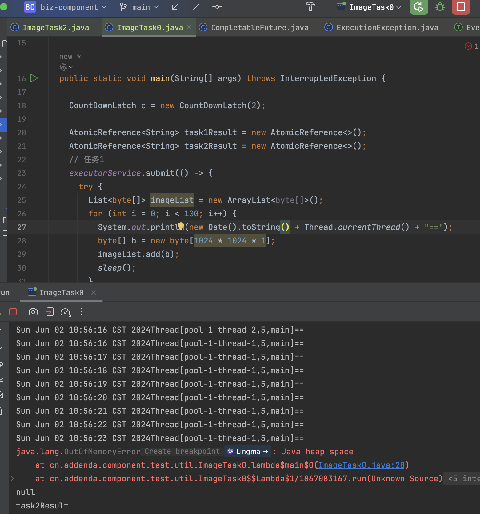
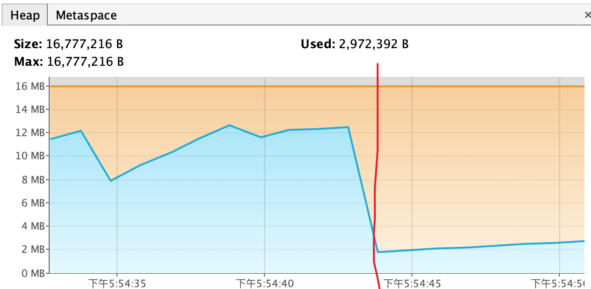

## 楔子

生产环境有一个服务用户报pdf无法查看。最终分析出来是OOM以及线程池使用不当导致的问题。

这个接口的逻辑是从OSS下载图片以生成pdf，并将生成的pdf存在OSS里，再将OSS地址返回给前端。

由于有多个pdf，所以接口内使用了线程池并发的生成。

我们以两个任务为例，复现一下问题：

````java
public class ImageTask {

  static ExecutorService executorService = Executors.newFixedThreadPool(4);

  public static void main(String[] args) throws InterruptedException {

    CountDownLatch c = new CountDownLatch(2);

    AtomicReference<String> task1Result = new AtomicReference<>();
    AtomicReference<String> task2Result = new AtomicReference<>();
    // 任务1
    executorService.submit(() -> {
      try {
        List<byte[]> imageList = new ArrayList<byte[]>();
        for (int i = 0; i < 100; i++) {
          System.out.println(new Date().toString() + Thread.currentThread() + "==");
          byte[] b = new byte[1024 * 1024 * 1];
          imageList.add(b);
          sleep();
        }
        task1Result.set("task1Result");
      } catch (Exception ex) {
        ex.printStackTrace();
      } finally {
        c.countDown();
      }
    });

    // 任务2
    executorService.submit(() -> {
      try {
        List<byte[]> imageList = new ArrayList<byte[]>();
        for (int i = 0; i < 5; i++) {
          System.out.println(new Date().toString() + Thread.currentThread() + "==");
          byte[] b = new byte[1024 * 1024 * 1];
          imageList.add(b);
          sleep();
        }
        task2Result.set("task2Result");
      } catch (Exception ex) {
        ex.printStackTrace();
      } finally {
        c.countDown();
      }
    });

    c.await();
    System.out.println(task1Result.get());
    System.out.println(task2Result.get());

  }

  private static void sleep() {
    try {
      Thread.sleep(1000);
    } catch (Exception e) {
      e.printStackTrace();
    }
  }

}
````

代码ImageTask每1s都动态申请一个1M的数组，我们将虚拟机参数配置为：`-Xms8M -Xmx16M`，执行的结果是：

````
Sun Jun 02 10:20:10 CST 2024Thread[pool-1-thread-2,5,main]==
Sun Jun 02 10:20:10 CST 2024Thread[pool-1-thread-1,5,main]==
Sun Jun 02 10:20:11 CST 2024Thread[pool-1-thread-1,5,main]==
Sun Jun 02 10:20:11 CST 2024Thread[pool-1-thread-2,5,main]==
Sun Jun 02 10:20:12 CST 2024Thread[pool-1-thread-1,5,main]==
Sun Jun 02 10:20:12 CST 2024Thread[pool-1-thread-2,5,main]==
Sun Jun 02 10:20:13 CST 2024Thread[pool-1-thread-1,5,main]==
Sun Jun 02 10:20:13 CST 2024Thread[pool-1-thread-2,5,main]==
Sun Jun 02 10:20:14 CST 2024Thread[pool-1-thread-1,5,main]==
Sun Jun 02 10:20:14 CST 2024Thread[pool-1-thread-2,5,main]==
Sun Jun 02 10:20:15 CST 2024Thread[pool-1-thread-1,5,main]==
Sun Jun 02 10:20:16 CST 2024Thread[pool-1-thread-1,5,main]==
Sun Jun 02 10:20:17 CST 2024Thread[pool-1-thread-1,5,main]==
Sun Jun 02 10:20:18 CST 2024Thread[pool-1-thread-1,5,main]==
Sun Jun 02 10:20:19 CST 2024Thread[pool-1-thread-1,5,main]==
Sun Jun 02 10:20:20 CST 2024Thread[pool-1-thread-1,5,main]==
Sun Jun 02 10:20:21 CST 2024Thread[pool-1-thread-1,5,main]==
null
task2Result
````

这和我们生产环境的结果一致：一张pdf返回给前端的是null，同时没有任务报错。

task1Result没有值，所以一定是`task1Result.set("task1Result")`代码没有执行到。那么任务1就一定在报错。我们把任务1的catch由Exception 提升至 Throwable。

````java
public class ImageTask0 {

  static ExecutorService executorService = Executors.newFixedThreadPool(4);

  public static void main(String[] args) throws InterruptedException {

    CountDownLatch c = new CountDownLatch(2);

    AtomicReference<String> task1Result = new AtomicReference<>();
    AtomicReference<String> task2Result = new AtomicReference<>();
    // 任务1
    executorService.submit(() -> {
      try {
        List<byte[]> imageList = new ArrayList<byte[]>();
        for (int i = 0; i < 100; i++) {
          System.out.println(new Date().toString() + Thread.currentThread() + "==");
          byte[] b = new byte[1024 * 1024 * 1];
          imageList.add(b);
          sleep();
        }
        task1Result.set("task1Result");
      } catch (Throwable ex) {
        ex.printStackTrace();
      } finally {
        c.countDown();
      }
    });

    // 线程二
    executorService.submit(() -> {
      try {
        List<byte[]> imageList = new ArrayList<byte[]>();
        for (int i = 0; i < 5; i++) {
          System.out.println(new Date().toString() + Thread.currentThread() + "==");
          byte[] b = new byte[1024 * 1024 * 1];
          imageList.add(b);
          sleep();
        }
        task2Result.set("task2Result");
      } catch (Throwable ex) {
        ex.printStackTrace();
      } finally {
        c.countDown();
      }
    });

    c.await();
    System.out.println(task1Result.get());
    System.out.println(task2Result.get());

  }

  private static void sleep() {
    try {
      Thread.sleep(1000);
    } catch (Exception e) {
      e.printStackTrace();
    }
  }

}
````

一下就发现了问题：

````
Sun Jun 02 10:56:11 CST 2024Thread[pool-1-thread-2,5,main]==
Sun Jun 02 10:56:11 CST 2024Thread[pool-1-thread-1,5,main]==
Sun Jun 02 10:56:12 CST 2024Thread[pool-1-thread-2,5,main]==
Sun Jun 02 10:56:13 CST 2024Thread[pool-1-thread-1,5,main]==
Sun Jun 02 10:56:14 CST 2024Thread[pool-1-thread-2,5,main]==
Sun Jun 02 10:56:14 CST 2024Thread[pool-1-thread-1,5,main]==
Sun Jun 02 10:56:15 CST 2024Thread[pool-1-thread-2,5,main]==
Sun Jun 02 10:56:15 CST 2024Thread[pool-1-thread-1,5,main]==
Sun Jun 02 10:56:16 CST 2024Thread[pool-1-thread-2,5,main]==
Sun Jun 02 10:56:16 CST 2024Thread[pool-1-thread-1,5,main]==
Sun Jun 02 10:56:17 CST 2024Thread[pool-1-thread-1,5,main]==
Sun Jun 02 10:56:18 CST 2024Thread[pool-1-thread-1,5,main]==
Sun Jun 02 10:56:19 CST 2024Thread[pool-1-thread-1,5,main]==
Sun Jun 02 10:56:20 CST 2024Thread[pool-1-thread-1,5,main]==
Sun Jun 02 10:56:21 CST 2024Thread[pool-1-thread-1,5,main]==
Sun Jun 02 10:56:22 CST 2024Thread[pool-1-thread-1,5,main]==
Sun Jun 02 10:56:23 CST 2024Thread[pool-1-thread-1,5,main]==
java.lang.OutOfMemoryError: Java heap space
	at cn.addenda.component.test.util.ImageTask0.lambda$main$0(ImageTask0.java:28)
	at cn.addenda.component.test.util.ImageTask0$$Lambda$1/1867083167.run(Unknown Source)
	at java.util.concurrent.Executors$RunnableAdapter.call(Executors.java:511)
	at java.util.concurrent.FutureTask.run(FutureTask.java:266)
	at java.util.concurrent.ThreadPoolExecutor.runWorker(ThreadPoolExecutor.java:1149)
	at java.util.concurrent.ThreadPoolExecutor$Worker.run(ThreadPoolExecutor.java:624)
	at java.lang.Thread.run(Thread.java:750)
null
task2Result
````

我们把生产环境的堆内存调大之后接口就正常了。但是有两个问题引发了思考：

1. 为什么OOM之后容器没有停止？
2. 线程池内的异常去哪了？


## JVM退出机制

OOM会让容器停止，是我的固有的错误认知。

其实只要平时使用过线程池的人都知道，main线程关闭的时候，假如线程池没有shutdown，进程是不关闭的。如图1。

<center><br><div>图1：任务执行完成JVM不退出</div></center>

但当遇到这个问题的时候，我下意识的就想到容器重启，是因为平时遇到的OOM都会引发容器重启，例如[4]：[一周三次OOM的分析及处理](https://github.com/zhanjinhao/java-backend-cases/tree/master/JVM/排查-一周三次OOM的分析及处理)。所以我也是在复盘这个生产问题的时候才发现自己的潜意识里的错误。这也是为什么这篇文章的标题会命名为“深刻认知虚拟机的退出条件”的原因。

事实上，OOM只会导致线程退出，不会导致JVM进程退出。JVM进程退出的条件是：所有非守护线程都退出。

再来看为什么平时遇到的OOM都会引发容器重启这个问题，其以发现其取决于两个条件：

1. 线程退出后，线程申请的资源能否被回收：假如线程退出后不能释放其申请的资源，那么其他线程在执行的时候也会产生OOM进而导致其他线程的执行异常。
2. 是否有探活机制：对外提供的探活接口也是需要线程来提供服务的。其无法对外提供服务时，就会认为当前JVM假死，进而触发重启逻辑。

所以重启的原因链是：

1. OOM导致无法线程申请内存。
2. 对外提供的探活接口无法响应。
3. 外部的监控重启容器。

在[1]的案例中，大对象都不是局部变量，而是对象的属性。当某一个线程OOM时，这些对象依然能被Gc Roots可达。所以他们不会被释放。在本次的案例中，图片对象仅被方法的栈帧所引用，当线程退出时，栈帧连带着图片对象都会被回收掉，所以探活接口依然能正常提供服务。图2展示了GC回收对象的现象。

<center><br><div>图2：GC回收对象</div></center>

这也告知我们，仅判断线程是否存活是无法知道JVM是否能正常提供服务的。这种OOM导致的假死需要探活接口来监控。


## 线程池如何处理异常

### submit()方法会吞掉异常

ExecutorService里有两个异步执行任务的方法：execute()和submit()。前者执行异常时会扔异常出来，而后者不会。

````java
public class ImageTask1 {

  static ExecutorService executorService = Executors.newFixedThreadPool(4);

  public static void main(String[] args) throws InterruptedException {

    CountDownLatch c = new CountDownLatch(2);

    AtomicReference<String> task1Result = new AtomicReference<>();
    AtomicReference<String> task2Result = new AtomicReference<>();
    // 任务1
    executorService.execute(() -> {
      try {
        List<byte[]> imageList = new ArrayList<byte[]>();
        for (int i = 0; i < 100; i++) {
          System.out.println(new Date().toString() + Thread.currentThread() + "==");
          byte[] b = new byte[1024 * 1024 * 1];
          imageList.add(b);
          sleep();
        }
        task1Result.set("task1Result");
      } catch (Exception ex) {
        ex.printStackTrace();
      } finally {
        c.countDown();
      }
    });

    // 线程二
    executorService.execute(() -> {
      try {
        List<byte[]> imageList = new ArrayList<byte[]>();
        for (int i = 0; i < 5; i++) {
          System.out.println(new Date().toString() + Thread.currentThread() + "==");
          byte[] b = new byte[1024 * 1024 * 1];
          imageList.add(b);
          sleep();
        }
        task2Result.set("task2Result");
      } catch (Exception ex) {
        ex.printStackTrace();
      } finally {
        c.countDown();
      }
    });

    c.await();
    System.out.println(task1Result.get());
    System.out.println(task2Result.get());
  }

  private static void sleep() {
    try {
      Thread.sleep(1000);
    } catch (Exception e) {
      e.printStackTrace();
    }
  }

}
````

````
Connected to the target VM, address: '127.0.0.1:55423', transport: 'socket'
Sun Jun 02 15:49:11 CST 2024Thread[pool-1-thread-1,5,main]==
Sun Jun 02 15:49:11 CST 2024Thread[pool-1-thread-2,5,main]==
Sun Jun 02 15:49:12 CST 2024Thread[pool-1-thread-2,5,main]==
Sun Jun 02 15:49:12 CST 2024Thread[pool-1-thread-1,5,main]==
Sun Jun 02 15:49:13 CST 2024Thread[pool-1-thread-1,5,main]==
Sun Jun 02 15:49:13 CST 2024Thread[pool-1-thread-2,5,main]==
Sun Jun 02 15:49:14 CST 2024Thread[pool-1-thread-1,5,main]==
Sun Jun 02 15:49:14 CST 2024Thread[pool-1-thread-2,5,main]==
Sun Jun 02 15:49:15 CST 2024Thread[pool-1-thread-1,5,main]==
Sun Jun 02 15:49:15 CST 2024Thread[pool-1-thread-2,5,main]==
Sun Jun 02 15:49:16 CST 2024Thread[pool-1-thread-1,5,main]==
Sun Jun 02 15:49:17 CST 2024Thread[pool-1-thread-1,5,main]==
Sun Jun 02 15:49:18 CST 2024Thread[pool-1-thread-1,5,main]==
Sun Jun 02 15:49:19 CST 2024Thread[pool-1-thread-1,5,main]==
Sun Jun 02 15:49:20 CST 2024Thread[pool-1-thread-1,5,main]==
Sun Jun 02 15:49:21 CST 2024Thread[pool-1-thread-1,5,main]==
Sun Jun 02 15:49:22 CST 2024Thread[pool-1-thread-1,5,main]==
null
task2Result
Exception in thread "pool-1-thread-1" java.lang.OutOfMemoryError: Java heap space
	at cn.addenda.component.test.util.ImageTask1.lambda$main$0(ImageTask1.java:28)
	at cn.addenda.component.test.util.ImageTask1$$Lambda$1/2137211482.run(Unknown Source)
	at java.util.concurrent.ThreadPoolExecutor.runWorker(ThreadPoolExecutor.java:1149)
	at java.util.concurrent.ThreadPoolExecutor$Worker.run(ThreadPoolExecutor.java:624)
	at java.lang.Thread.run(Thread.java:750)
````

#### execute()

无论是execute()还是submit()最终都是执行runWorker()方法。在runWorker()的23行里，是真正执行我们自己业务的入口。可以看到当OOM异常发生时，会被直接扔出。

````java
final void runWorker(Worker w) {
    Thread wt = Thread.currentThread();
    Runnable task = w.firstTask;
    w.firstTask = null;
    w.unlock(); // allow interrupts
    boolean completedAbruptly = true;
    try {
        while (task != null || (task = getTask()) != null) {
            w.lock();
            // If pool is stopping, ensure thread is interrupted;
            // if not, ensure thread is not interrupted.  This
            // requires a recheck in second case to deal with
            // shutdownNow race while clearing interrupt
            if ((runStateAtLeast(ctl.get(), STOP) ||
                 (Thread.interrupted() &&
                  runStateAtLeast(ctl.get(), STOP))) &&
                !wt.isInterrupted())
                wt.interrupt();
            try {
                beforeExecute(wt, task);
                Throwable thrown = null;
                try {
                    task.run();
                } catch (RuntimeException x) {
                    thrown = x; throw x;
                } catch (Error x) {
                    thrown = x; throw x;
                } catch (Throwable x) {
                    thrown = x; throw new Error(x);
                } finally {
                    afterExecute(task, thrown);
                }
            } finally {
                task = null;
                w.completedTasks++;
                w.unlock();
            }
        }
        completedAbruptly = false;
    } finally {
        processWorkerExit(w, completedAbruptly);
    }
}
````

线程在run方法里扔出异常后，JVM会调用此线程的dispatchUncaughtException()方法，进而在uncaughtException()里打印日志。

````java
// Thread.java
/**
 * Dispatch an uncaught exception to the handler. This method is
 * intended to be called only by the JVM.
 */
private void dispatchUncaughtException(Throwable e) {
    getUncaughtExceptionHandler().uncaughtException(this, e);
}
````

````java
// ThreadGroup.java
public void uncaughtException(Thread t, Throwable e) {
    if (parent != null) {
        parent.uncaughtException(t, e);
    } else {
        Thread.UncaughtExceptionHandler ueh =
            Thread.getDefaultUncaughtExceptionHandler();
        if (ueh != null) {
            ueh.uncaughtException(t, e);
        } else if (!(e instanceof ThreadDeath)) {
            System.err.print("Exception in thread \""
                             + t.getName() + "\" ");
            e.printStackTrace(System.err);
        }
    }
}
````

#### submit()

````java
/**
 * @throws RejectedExecutionException {@inheritDoc}
 * @throws NullPointerException       {@inheritDoc}
 */
public Future<?> submit(Runnable task) {
    if (task == null) throw new NullPointerException();
    RunnableFuture<Void> ftask = newTaskFor(task, null);
    execute(ftask);
    return ftask;
}

protected <T> RunnableFuture<T> newTaskFor(Runnable runnable, T value) {
    return new FutureTask<T>(runnable, value);
}
````

````java
// FutureTask.java
public FutureTask(Runnable runnable, V result) {
		this.callable = Executors.callable(runnable, result);
		this.state = NEW;       // ensure visibility of callable
}
public void run() {
    if (state != NEW ||
        !UNSAFE.compareAndSwapObject(this, runnerOffset,
                                     null, Thread.currentThread()))
        return;
    try {
        Callable<V> c = callable;
        if (c != null && state == NEW) {
            V result;
            boolean ran;
            try {
                result = c.call();
                ran = true;
            } catch (Throwable ex) {
                result = null;
                ran = false;
                setException(ex);
            }
            if (ran)
                set(result);
        }
    } finally {
        // runner must be non-null until state is settled to
        // prevent concurrent calls to run()
        runner = null;
        // state must be re-read after nulling runner to prevent
        // leaked interrupts
        int s = state;
        if (s >= INTERRUPTING)
            handlePossibleCancellationInterrupt(s);
    }
}

````

````java
// Executors.java
public static <T> Callable<T> callable(Runnable task, T result) {
    if (task == null)
        throw new NullPointerException();
    return new RunnableAdapter<T>(task, result);
}

  static final class RunnableAdapter<T> implements Callable<T> {
    final Runnable task;
    final T result;
    RunnableAdapter(Runnable task, T result) {
        this.task = task;
        this.result = result;
    }
    public T call() {
        task.run();
        return result;
    }
}
````

submit()与execute()的区别是，submit()将Runable封装成了FutureTask，并最终返回一个Future对象。在FutureTask对象的run()方法里可以看到其捕获了业务代码执行时的异常并存在了当前对象中。

我们拿到submit()执行返回的Future再调用get()方法。即可得到异常信息。

````java
public class ImageTask2 {

  static ExecutorService executorService = Executors.newFixedThreadPool(4);

  public static void main(String[] args) throws InterruptedException, ExecutionException, TimeoutException {

    CountDownLatch c = new CountDownLatch(2);

    AtomicReference<String> task1Result = new AtomicReference<>();
    AtomicReference<String> task2Result = new AtomicReference<>();
    // 任务1
    Future<?> task1ResultFuture = executorService.submit(() -> {
      try {
        List<byte[]> imageList = new ArrayList<byte[]>();
        for (int i = 0; i < 100; i++) {
          System.out.println(new Date().toString() + Thread.currentThread() + "==");
          byte[] b = new byte[1024 * 1024 * 1];
          imageList.add(b);
          sleep();
        }
        task1Result.set("task1Result");
      } catch (Exception ex) {
        ex.printStackTrace();
      } finally {
        c.countDown();
      }
    });

    // 线程二
    Future<?> task2ResultFuture = executorService.submit(() -> {
      try {
        List<byte[]> imageList = new ArrayList<byte[]>();
        for (int i = 0; i < 5; i++) {
          System.out.println(new Date().toString() + Thread.currentThread() + "==");
          byte[] b = new byte[1024 * 1024 * 1];
          imageList.add(b);
          sleep();
        }
        task2Result.set("task2Result");
      } catch (Exception ex) {
        ex.printStackTrace();
      } finally {
        c.countDown();
      }
    });

    c.await();
    System.out.println(task1Result.get());
    System.out.println(task2Result.get());
    task1ResultFuture.get();
    task2ResultFuture.get();
  }

  private static void sleep() {
    try {
      Thread.sleep(1000);
    } catch (Exception e) {
      e.printStackTrace();
    }
  }

}
````

````java
Sun Jun 02 17:11:46 CST 2024Thread[pool-1-thread-1,5,main]==
Sun Jun 02 17:11:46 CST 2024Thread[pool-1-thread-2,5,main]==
Sun Jun 02 17:11:47 CST 2024Thread[pool-1-thread-2,5,main]==
Sun Jun 02 17:11:47 CST 2024Thread[pool-1-thread-1,5,main]==
Sun Jun 02 17:11:48 CST 2024Thread[pool-1-thread-2,5,main]==
Sun Jun 02 17:11:49 CST 2024Thread[pool-1-thread-1,5,main]==
Sun Jun 02 17:11:49 CST 2024Thread[pool-1-thread-2,5,main]==
Sun Jun 02 17:11:50 CST 2024Thread[pool-1-thread-1,5,main]==
Sun Jun 02 17:11:51 CST 2024Thread[pool-1-thread-2,5,main]==
Sun Jun 02 17:11:51 CST 2024Thread[pool-1-thread-1,5,main]==
Sun Jun 02 17:11:52 CST 2024Thread[pool-1-thread-1,5,main]==
Sun Jun 02 17:11:53 CST 2024Thread[pool-1-thread-1,5,main]==
Sun Jun 02 17:11:54 CST 2024Thread[pool-1-thread-1,5,main]==
Sun Jun 02 17:11:55 CST 2024Thread[pool-1-thread-1,5,main]==
Sun Jun 02 17:11:56 CST 2024Thread[pool-1-thread-1,5,main]==
Sun Jun 02 17:11:57 CST 2024Thread[pool-1-thread-1,5,main]==
Sun Jun 02 17:11:58 CST 2024Thread[pool-1-thread-1,5,main]==
null
task2Result
Exception in thread "main" java.util.concurrent.ExecutionException: java.lang.OutOfMemoryError: Java heap space
	at java.util.concurrent.FutureTask.report(FutureTask.java:122)
	at java.util.concurrent.FutureTask.get(FutureTask.java:192)
	at cn.addenda.component.test.util.ImageTask2.main(ImageTask2.java:58)
Caused by: java.lang.OutOfMemoryError: Java heap space
	at cn.addenda.component.test.util.ImageTask2.lambda$main$0(ImageTask2.java:25)
	at cn.addenda.component.test.util.ImageTask2$$Lambda$1/1867083167.run(Unknown Source)
	at java.util.concurrent.Executors$RunnableAdapter.call(Executors.java:511)
	at java.util.concurrent.FutureTask.run(FutureTask.java:266)
	at java.util.concurrent.ThreadPoolExecutor.runWorker(ThreadPoolExecutor.java:1149)
	at java.util.concurrent.ThreadPoolExecutor$Worker.run(ThreadPoolExecutor.java:624)
	at java.lang.Thread.run(Thread.java:750)
````

### 优雅的解决方法

sumbit()会将异常信息封装在Future中，调用Future的get方法又是阻塞式编程 - 不优雅。

最简单的方式就是将catch Exception提升到catch Throwable。以保证任务在线程池内执行的时候不会将异常抛到run()方法外。但是每个任务都包上try-catch其实也很冗余。

#### CompletableFuture

CompletableFuture提供了一种全异步的任务执行解决方案。

````java
public class ImageTask3 {

  static ExecutorService executorService = Executors.newFixedThreadPool(4);

  public static void main(String[] args) throws InterruptedException {

    CountDownLatch c = new CountDownLatch(2);

    AtomicReference<String> task1Result = new AtomicReference<>();
    AtomicReference<String> task2Result = new AtomicReference<>();

    CompletableFuture.supplyAsync(() -> {
      try {
        List<byte[]> imageList = new ArrayList<>();
        for (int i = 0; i < 100; i++) {
          System.out.println(new Date().toString() + Thread.currentThread() + "==");
          byte[] b = new byte[1024 * 1024 * 1];
          imageList.add(b);
          sleep();
        }
        return "task1Result";
      } finally {
        c.countDown();
      }
    }, executorService).whenComplete((result, error) -> {
      if (error == null) {
        task1Result.set(result);
      } else {
        error.printStackTrace();
      }
    });

    CompletableFuture.supplyAsync(() -> {
      try {
        List<byte[]> imageList = new ArrayList<>();
        for (int i = 0; i < 5; i++) {
          System.out.println(new Date().toString() + Thread.currentThread() + "==");
          byte[] b = new byte[1024 * 1024 * 1];
          imageList.add(b);
          sleep();
        }
        return "task2Result";
      } finally {
        c.countDown();
      }
    }, executorService).whenComplete((result, error) -> {
      if (error == null) {
        task2Result.set(result);
      } else {
        error.printStackTrace();
      }
    });

    c.await();
    System.out.println(task1Result.get());
    System.out.println(task2Result.get());

  }

  private static void sleep() {
    try {
      Thread.sleep(1000);
    } catch (Exception e) {
      e.printStackTrace();
    }
  }

}
````

````
Sun Jun 02 17:22:56 CST 2024Thread[pool-1-thread-2,5,main]==
Sun Jun 02 17:22:56 CST 2024Thread[pool-1-thread-1,5,main]==
Sun Jun 02 17:22:57 CST 2024Thread[pool-1-thread-2,5,main]==
Sun Jun 02 17:22:57 CST 2024Thread[pool-1-thread-1,5,main]==
Sun Jun 02 17:22:58 CST 2024Thread[pool-1-thread-2,5,main]==
Sun Jun 02 17:22:58 CST 2024Thread[pool-1-thread-1,5,main]==
Sun Jun 02 17:22:59 CST 2024Thread[pool-1-thread-2,5,main]==
Sun Jun 02 17:22:59 CST 2024Thread[pool-1-thread-1,5,main]==
Sun Jun 02 17:23:00 CST 2024Thread[pool-1-thread-1,5,main]==
Sun Jun 02 17:23:00 CST 2024Thread[pool-1-thread-2,5,main]==
Sun Jun 02 17:23:01 CST 2024Thread[pool-1-thread-1,5,main]==
Sun Jun 02 17:23:02 CST 2024Thread[pool-1-thread-1,5,main]==
Sun Jun 02 17:23:03 CST 2024Thread[pool-1-thread-1,5,main]==
Sun Jun 02 17:23:04 CST 2024Thread[pool-1-thread-1,5,main]==
Sun Jun 02 17:23:05 CST 2024Thread[pool-1-thread-1,5,main]==
Sun Jun 02 17:23:06 CST 2024Thread[pool-1-thread-1,5,main]==
Sun Jun 02 17:23:07 CST 2024Thread[pool-1-thread-1,5,main]==
null
task2Result
java.util.concurrent.CompletionException: java.lang.OutOfMemoryError: Java heap space
	at java.util.concurrent.CompletableFuture.encodeThrowable(CompletableFuture.java:273)
	at java.util.concurrent.CompletableFuture.completeThrowable(CompletableFuture.java:280)
	at java.util.concurrent.CompletableFuture$AsyncSupply.run(CompletableFuture.java:1606)
	at java.util.concurrent.ThreadPoolExecutor.runWorker(ThreadPoolExecutor.java:1149)
	at java.util.concurrent.ThreadPoolExecutor$Worker.run(ThreadPoolExecutor.java:624)
	at java.lang.Thread.run(Thread.java:750)
Caused by: java.lang.OutOfMemoryError: Java heap space
	at cn.addenda.component.test.util.ImageTask3.lambda$main$0(ImageTask3.java:28)
	at cn.addenda.component.test.util.ImageTask3$$Lambda$1/1867083167.get(Unknown Source)
	at java.util.concurrent.CompletableFuture$AsyncSupply.run(CompletableFuture.java:1604)
	... 3 more
````

从ImageTask3的代码里可以看到，CompletableFuture提供了链式的异步API，我们可以不try-catch业务代码，同时也不调用阻塞式的get()方法。

#### Netty的Promise

````java
public class ImageTask4 {

  static EventLoopGroup eventGroup = new NioEventLoopGroup(2);

  public static void main(String[] args) throws InterruptedException {

    CountDownLatch c = new CountDownLatch(2);

    AtomicReference<String> task1Result = new AtomicReference<>();
    AtomicReference<String> task2Result = new AtomicReference<>();

    EventLoop next1 = eventGroup.next();
    Promise<String> promise1 = next1.newPromise();
    promise1.addListener(future -> {
      if (future.isSuccess()) {
        task1Result.set((String) future.get());
      } else {
        future.cause().printStackTrace();
      }
      c.countDown();
    });
    next1.execute(() -> {
      try {
        List<byte[]> imageList = new ArrayList<>();
        for (int i = 0; i < 100; i++) {
          System.out.println(new Date().toString() + Thread.currentThread() + "==");
          byte[] b = new byte[1024 * 1024 * 1];
          imageList.add(b);
          sleep();
        }
        promise1.setSuccess("task1Result");
      } catch (Throwable e) {
        promise1.setFailure(e);
      }
    });

    EventLoop next2 = eventGroup.next();
    Promise<String> promise2 = next2.newPromise();
    promise2.addListener(future -> {
      if (future.isSuccess()) {
        task2Result.set((String) future.get());
      } else {
        future.cause().printStackTrace();
      }
      c.countDown();
    });
    next2.execute(() -> {
      try {
        List<byte[]> imageList = new ArrayList<>();
        for (int i = 0; i < 5; i++) {
          System.out.println(new Date().toString() + Thread.currentThread() + "==");
          byte[] b = new byte[1024 * 1024 * 1];
          imageList.add(b);
          sleep();
        }
        promise2.setSuccess("task2Result");
      } catch (Throwable e) {
        promise2.setFailure(e);
      }
    });


    c.await();
    System.out.println(task1Result.get());
    System.out.println(task2Result.get());
  }

  private static void sleep() {
    try {
      Thread.sleep(1000);
    } catch (Exception e) {
      e.printStackTrace();
    }
  }

}
````

````
Sun Jun 02 17:45:45 CST 2024Thread[nioEventLoopGroup-2-1,10,main]==
Sun Jun 02 17:45:45 CST 2024Thread[nioEventLoopGroup-2-2,10,main]==
Sun Jun 02 17:45:46 CST 2024Thread[nioEventLoopGroup-2-2,10,main]==
Sun Jun 02 17:45:46 CST 2024Thread[nioEventLoopGroup-2-1,10,main]==
Sun Jun 02 17:45:47 CST 2024Thread[nioEventLoopGroup-2-2,10,main]==
Sun Jun 02 17:45:47 CST 2024Thread[nioEventLoopGroup-2-1,10,main]==
Sun Jun 02 17:45:48 CST 2024Thread[nioEventLoopGroup-2-2,10,main]==
Sun Jun 02 17:45:48 CST 2024Thread[nioEventLoopGroup-2-1,10,main]==
Sun Jun 02 17:45:49 CST 2024Thread[nioEventLoopGroup-2-1,10,main]==
Sun Jun 02 17:45:49 CST 2024Thread[nioEventLoopGroup-2-2,10,main]==
Sun Jun 02 17:45:50 CST 2024Thread[nioEventLoopGroup-2-1,10,main]==
java.lang.OutOfMemoryError: Java heap space
	at ImageTask4.lambda$main$1(ImageTask4.java:38)
	at ImageTask4$$Lambda$2/510113906.run(Unknown Source)
	at io.netty.util.concurrent.AbstractEventExecutor.runTask(AbstractEventExecutor.java:174)
	at io.netty.util.concurrent.AbstractEventExecutor.safeExecute(AbstractEventExecutor.java:167)
	at io.netty.util.concurrent.SingleThreadEventExecutor.runAllTasks(SingleThreadEventExecutor.java:470)
	at io.netty.channel.nio.NioEventLoop.run(NioEventLoop.java:569)
	at io.netty.util.concurrent.SingleThreadEventExecutor$4.run(SingleThreadEventExecutor.java:997)
	at io.netty.util.internal.ThreadExecutorMap$2.run(ThreadExecutorMap.java:74)
	at io.netty.util.concurrent.FastThreadLocalRunnable.run(FastThreadLocalRunnable.java:30)
	at java.lang.Thread.run(Thread.java:750)
null
task2Result
````

Netty也提供了一种全异步的任务执行方案。代码如ImageTask4所示。但这种方案依然需要进行try-catch。


## 参考

1. [一个线程池中的线程异常了，那么线程池会怎么处理这个线程? - 反光的小鱼儿 - 博客园 (cnblogs.com)](https://www.cnblogs.com/fanguangdexiaoyuer/p/12332082.html)
2. [Netty 中的异步编程 Future 和 Promise - rickiyang - 博客园 (cnblogs.com)](https://www.cnblogs.com/rickiyang/p/12742091.html)
3. [JVM OOM异常会导致JVM退出吗？ - myseries - 博客园 (cnblogs.com)](https://www.cnblogs.com/myseries/p/12079708.html)
4. [java-backend-cases/JVM/排查-一周三次OOM的分析及处理/排查-一周三次OOM的分析及处理.md at master · zhanjinhao/java-backend-cases (github.com)](https://github.com/zhanjinhao/java-backend-cases/blob/master/JVM/排查-一周三次OOM的分析及处理/排查-一周三次OOM的分析及处理.md)


