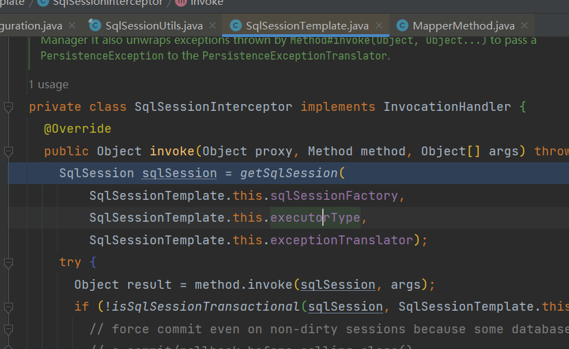

## 研发-MyBatis-一级缓存

### 问题

在开发过程中发现在同一个事务中，刚刚插入的数据却无法被查询出来。问题复现：

```java
@Slf4j
@RunWith(SpringJUnit4ClassRunner.class)
@ContextConfiguration(locations = "classpath*:spring-test-service.xml")
public class DayNavigationTest {

    @Autowired
    private DayNavigationMapper dayNavigationMapper;
    @Autowired
    private DayNavigationManager dayNavigationManager;

    @Test
    @Transactional(rollbackFor = Exception.class)
    public void test1() {

        // ---------
        //  查询数据
        // ---------
        List<DayNavigation> dayNavigationListBefore = dayNavigationMapper.queryByNavigationId(123L);

        // ------------
        //  批量插入数据
        // ------------
        final DayNavigation dayNavigation = new DayNavigation();
        dayNavigation.setNavigationId(123L);
        // ...set property
        dayNavigationManager.batchInsert(Arrays.asList(dayNavigation));

        // -----------------
        //  同样的参数查询数据
        // -----------------
        List<DayNavigation> dayNavigationListAfter = dayNavigationMapper.queryByNavigationId(123L);

        System.out.println(dayNavigationListBefore.size());
        System.out.println(dayNavigationListAfter.size());
    }

}
```

batchInsert的实现

```java
    @Override
    @Transactional(rollbackFor = Exception.class)
    public void batchInsert(List<DayNavigation> dayNavigationList) {
        if (CollectionUtils.isEmpty(dayNavigationList)) {
            return;
        }
        long start = System.currentTimeMillis();
        try (SqlSession session = sqlSessionFactory.openSession(ExecutorType.BATCH)) {
            DayNavigationMapper mapper = session.getMapper(DayNavigationMapper.class);
            for (int i = 0; i < dayNavigationList.size(); i++) {
                DayNavigation info = dayNavigationList.get(i);
                mapper.insert(info);
                // 每200条数据执行一次操作，防止数据量过大
                if (i >= 1 && i % 200 == 0) {
                    session.flushStatements();
                }
            }
            session.flushStatements();
        }
        long end = System.currentTimeMillis();
        log.info("execute batch operation total time:{}", (end - start));
    }
```

### 分析

第一反应：是不是插入和查询在不同的事务里面。但是@Transactional默认的事务传播行为会将这些sql都放在同一个事务里面执行。

<div align="center"></div>

跟踪查询代码之后发现，其实第二次查询是没有走DB的，直接从MyBatis一级缓存拿到了数据。

第一次查询：MyBatis缓存是空的，所以会从数据库里面查数据。

<div align="center"></div>

第二次查询：MyBatis缓存能命中数据，所以会从缓存里面查数据。

<div align="center"></div>

但是MyBatis的insert操作会清理一级缓存。

<div align="center"></div>

所以问题就被定位为一级缓存的数据没有被清理。所以再跟一下插入过程。

<div align="center"></div>

一跟踪就发现了问题，插入时的缓存是空的。同时插入时使用的Executor变了。

MyBatis的一级缓存是存在Executor里面的，所以当Executor变了的时候，自然缓存里没有数据，同时清理缓存清理的也不是查询Executor的缓存了。

### 解决

在我们项目里是禁用了MyBatis的二级缓存，但是启用了MyBatis的一级缓存的。

```xml
	<settings>
		<setting name="mapUnderscoreToCamelCase" value="true" />
		<!-- 控制台sql语句输出 -->
		<setting name="logImpl" value="${mybatis_logging:NO_LOGGING}" />
		<setting name="cacheEnabled" value="false"/>
	</settings>
```

所以解决这个问题的方案就是关闭一级缓存。

```xml
	<settings>
		<setting name="mapUnderscoreToCamelCase" value="true" />
		<!-- 控制台sql语句输出 -->
		<setting name="logImpl" value="${mybatis_logging:NO_LOGGING}" />
		<setting name="cacheEnabled" value="false"/>
		<setting name="localCacheScope" value="STATEMENT"/>
	</settings>
```

localCacheScope=STATEMENT是在query方法里生效的，在每条sql执行完成之后都会清理掉Executor里的缓存。

<div align="center"></div>

### Executor的创建

额外分析了一下MyBatis关于Executor创建的代码。


mybatis-spring自动引入动态代理是使用FactoryBean实现的：`org.mybatis.spring.mapper.MapperFactoryBean#getObject`。

```java
  @Override
  public T getObject() throws Exception {
    return getSqlSession().getMapper(this.mapperInterface);
  }
```

沿着getMapper一路往下跟会发现sqlSession作为mapperProxy的属性

```java
public class MapperProxyFactory<T> {

  @SuppressWarnings("unchecked")
  protected T newInstance(MapperProxy<T> mapperProxy) {
    return (T) Proxy.newProxyInstance(mapperInterface.getClassLoader(), new Class[] { mapperInterface }, mapperProxy);
  }

  public T newInstance(SqlSession sqlSession) {
    final MapperProxy<T> mapperProxy = new MapperProxy<T>(sqlSession, mapperInterface, methodCache);
    return newInstance(mapperProxy);
  }

}
```

在执行查询方法的时候，一直往下跟，发现确定默认Executor类型的就是SqlSession里的executorType。

<div align="center"></div>

MapperProxy：

```java
  @Override
  public Object invoke(Object proxy, Method method, Object[] args) throws Throwable {
    try {
      if (Object.class.equals(method.getDeclaringClass())) {
        return method.invoke(this, args);
      } else if (isDefaultMethod(method)) {
        return invokeDefaultMethod(proxy, method, args);
      }
    } catch (Throwable t) {
      throw ExceptionUtil.unwrapThrowable(t);
    }
    final MapperMethod mapperMethod = cachedMapperMethod(method);
    return mapperMethod.execute(sqlSession, args);
  }
```

DefaultSqlSessionFactory：

```java
  private SqlSession openSessionFromDataSource(ExecutorType execType, TransactionIsolationLevel level, boolean autoCommit) {
    Transaction tx = null;
    try {
      final Environment environment = configuration.getEnvironment();
      final TransactionFactory transactionFactory = getTransactionFactoryFromEnvironment(environment);
      tx = transactionFactory.newTransaction(environment.getDataSource(), level, autoCommit);
      final Executor executor = configuration.newExecutor(tx, execType);
      return new DefaultSqlSession(configuration, executor, autoCommit);
    } catch (Exception e) {
      closeTransaction(tx); // may have fetched a connection so lets call close()
      throw ExceptionFactory.wrapException("Error opening session.  Cause: " + e, e);
    } finally {
      ErrorContext.instance().reset();
    }
  }
```

Configuration：

```
  public Executor newExecutor(Transaction transaction, ExecutorType executorType) {
    executorType = executorType == null ? defaultExecutorType : executorType;
    executorType = executorType == null ? ExecutorType.SIMPLE : executorType;
    Executor executor;
    if (ExecutorType.BATCH == executorType) {
      executor = new BatchExecutor(this, transaction);
    } else if (ExecutorType.REUSE == executorType) {
      executor = new ReuseExecutor(this, transaction);
    } else {
      executor = new SimpleExecutor(this, transaction);
    }
    if (cacheEnabled) {
      executor = new CachingExecutor(executor);
    }
    executor = (Executor) interceptorChain.pluginAll(executor);
    return executor;
  }
```

这个SqlSession是在Spring启动期间创建的，需要先看一下MyBatis扫描包创建动态代理的代码：org.mybatis.spring.mapper.ClassPathMapperScanner#processBeanDefinitions。

```java
private void processBeanDefinitions(Set<BeanDefinitionHolder> beanDefinitions) {
    GenericBeanDefinition definition;
    for (BeanDefinitionHolder holder : beanDefinitions) {
        definition = (GenericBeanDefinition) holder.getBeanDefinition();

        // ..................
        
        boolean explicitFactoryUsed = false;
        if (StringUtils.hasText(this.sqlSessionFactoryBeanName)) {
            definition.getPropertyValues().add("sqlSessionFactory", new RuntimeBeanReference(this.sqlSessionFactoryBeanName));
            explicitFactoryUsed = true;
        } else if (this.sqlSessionFactory != null) {
            definition.getPropertyValues().add("sqlSessionFactory", this.sqlSessionFactory);
            explicitFactoryUsed = true;
        }
        
        // ................
    }
}
```

这里给BeanDefinition添加了一个sqlSessionFactory。在执行setSqlSessionFactory的时候，会创建SqlSession。

```java
public abstract class SqlSessionDaoSupport extends DaoSupport {

  public void setSqlSessionFactory(SqlSessionFactory sqlSessionFactory) {
    if (!this.externalSqlSession) {
      this.sqlSession = new SqlSessionTemplate(sqlSessionFactory);
    }
  }

  public void setSqlSessionTemplate(SqlSessionTemplate sqlSessionTemplate) {
    this.sqlSession = sqlSessionTemplate;
    this.externalSqlSession = true;
  }

}

public class MapperFactoryBean<T> extends SqlSessionDaoSupport implements FactoryBean<T> {}
```

SqlSessionFactory是用SqlSessionFactoryBean创建的。代码逻辑在org.mybatis.spring.SqlSessionFactoryBean#buildSqlSessionFactory里面。

默认的executorType是在Configuration里面，但是这个里面并没有配置的地方，所以默认就是SIMPLE了。

<div align="center"></div>


