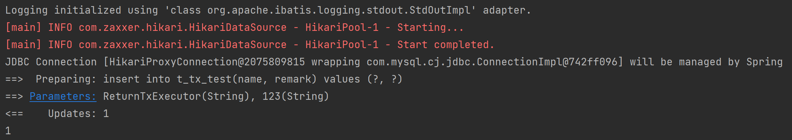

## 研发-SqlSessionTemplate

### 问题

写了一段代码，在Spring中使用MyBatis向数据库插入数据。

#### 代码

TransactionTemplateTest.java

```java
public class TransactionTemplateTest {

    public static void main(String[] args) {
        
        ClassPathXmlApplicationContext context =
                new ClassPathXmlApplicationContext("classpath:cn/addenda/se/transaction/spring-transactionhelper-context.xml");

        SqlSessionFactory sqlSessionFactory = context.getBean(SqlSessionFactory.class);
        SqlSession sqlSession = sqlSessionFactory.openSession(ExecutorType.SIMPLE);
        TxTestMapper txTestMapper = sqlSession.getMapper(TxTestMapper.class);

        TransactionTemplate transactionTemplate = context.getBean(TransactionTemplate.class);
        Integer integer = transactionTemplate.execute(status -> {
            try {
                return txTestMapper.insert(new TxTest("ReturnTxExecutor", "123"));
            } catch (Exception e) {
                e.printStackTrace();
                status.setRollbackOnly();
            }
            return null;
        });
        System.out.println(integer);

        transactionTemplate.executeWithoutResult(status -> {
            try {
                txTestMapper.insert(new TxTest("VoidTxExecutor", "123"));
            } catch (Exception e) {
                e.printStackTrace();
                status.setRollbackOnly();
            }
        });

        context.close();

    }

}
```

spring-transactionhelper-context.xml

```xml
<?xml version="1.0" encoding="UTF-8"?>
<beans
        xmlns="http://www.springframework.org/schema/beans"
        xmlns:aop="http://www.springframework.org/schema/aop"
        xmlns:context="http://www.springframework.org/schema/context"
        xmlns:xsi="http://www.w3.org/2001/XMLSchema-instance"
        xsi:schemaLocation="http://www.springframework.org/schema/beans
        https://www.springframework.org/schema/beans/spring-beans.xsd
        http://www.springframework.org/schema/aop
        https://www.springframework.org/schema/aop/spring-aop.xsd
        http://www.springframework.org/schema/context
        https://www.springframework.org/schema/context/spring-context.xsd">

    <context:property-placeholder
            ignore-resource-not-found="true"
            location="classpath*:/db.properties"/>

    <bean id="dataSource" class="com.zaxxer.hikari.HikariDataSource">
        <property name="driverClassName" value="${db.driver}"/>
        <property name="jdbcUrl" value="${db.url}"/>
        <property name="username" value="${db.username}"/>
        <property name="password" value="${db.password}"/>
        <property name="autoCommit" value="false"/>
        <property name="minimumIdle" value="1"/>
        <property name="maximumPoolSize" value="1"/>
    </bean>

    <bean id="sqlSessionFactory" class="org.mybatis.spring.SqlSessionFactoryBean">
        <!--dataSource属性指定要用到的连接池-->
        <property name="dataSource" ref="dataSource"/>
        <!--configLocation属性指定mybatis的核心配置文件-->
        <property name="configLocation"
                  value="cn/addenda/se/transaction/mybatis-config-transactionhelper.xml"/>
    </bean>

    <bean id="dataSourceTransactionManager" class="org.springframework.jdbc.datasource.DataSourceTransactionManager">
        <property name="dataSource" ref="dataSource"/>
    </bean>

    <bean class="org.springframework.transaction.support.TransactionTemplate">
        <property name="isolationLevel" value="2"/>
        <property name="transactionManager" ref="dataSourceTransactionManager"/>
    </bean>

</beans>
```

mybatis-config-transactionhelper.xml

```xml
<?xml version="1.0" encoding="UTF-8" ?>
<!DOCTYPE configuration
        PUBLIC "-//mybatis.org//DTD Config 3.0//EN"
        "http://mybatis.org/dtd/mybatis-3-config.dtd">
<configuration>

    <settings>
        <setting name="logImpl" value="STDOUT_LOGGING"/>
        <!-- 开启自动驼峰映射缓存 -->
        <setting name="mapUnderscoreToCamelCase" value="true"/>
    </settings>

    <mappers>
        <mapper resource="cn/addenda/se/mapper/TxTestMapper.xml"/>
    </mappers>
</configuration>
```

#### 现象

执行之后发现第一条数据能正常插入



第二条数据会报错`Connection is closed`。


### 分析

#### 数据库连接池的问题×

从结果来看是数据库连接被close了之后又使用这个连接操作数据库，所以第一反应是不是数据库连接池有问题。所以便看了一下第一次和第二次从数据库连接池里面拿出来的连接是什么？

第一次拿到的连接，连接对象是3351，内部的delegate对象是3356：


第二次拿到的连接，连接对象是3452，内部的delegate对象是3356：


由此可见，从数据库连接池里拿出来的连接是正常的。因为Hikari连接池创建的连接如果被关闭了，内部的delegate对象会变成ClosedConnection。

#### MyBatis的问题√

既然不是数据库连接池的问题，那可能是ORM框架的问题，所以看一下第二次MyBatis使用的连接对象是什么。


这一看就发现问题了：Spring从数据库连接池里获取到的连接是正常的，但是MyBatis使用连接和上一次操作数据库的连接一样，同时内部的delegate对象此时已经变成ClosedConnection了。

#### MyBatis执行SQL的过程

**SqlSessionFactory**

SqlSession是执行sql的入口，它是由SqlSessionFactory创建的，MyBatis中默认的实现是DefaultSqlSessionFactory。在通过SqlSessionFactoryBean创建DefaultSqlSessionFactory的时候，有一个属性environment，其内部的transactionFactory属性标识着执行sql的事务是怎么创建的。

```java
// org.mybatis.spring.SqlSessionFactoryBean#buildSqlSessionFactory
protected SqlSessionFactory buildSqlSessionFactory() throws Exception {

    final Configuration targetConfiguration;
	
    // ...
    
    targetConfiguration.setEnvironment(new Environment(this.environment,
                                                       this.transactionFactory == null ? new SpringManagedTransactionFactory() : this.transactionFactory,
                                                       this.dataSource));
	
    // ...

    return this.sqlSessionFactoryBuilder.build(targetConfiguration);
}
```

**TransactionFactory**

SqlSessionFactoryBean默认使用的实现是SpringManagedTransactionFactory。

```java
// org.mybatis.spring.transaction.SpringManagedTransactionFactory#newTransaction(...)
@Override
public Transaction newTransaction(DataSource dataSource, TransactionIsolationLevel level, boolean autoCommit) {
    return new SpringManagedTransaction(dataSource);
}
```

**SpringManagedTransaction**

在调用SqlSessionFactory的openSession方法时会创建一个Transaction。

```java
@Override
public SqlSession openSession(ExecutorType execType) {
    return openSessionFromDataSource(execType, null, false);
}

private SqlSession openSessionFromDataSource(ExecutorType execType, TransactionIsolationLevel level, boolean autoCommit) {
    Transaction tx = null;
    try {
        final Environment environment = configuration.getEnvironment();
        final TransactionFactory transactionFactory = getTransactionFactoryFromEnvironment(environment);
        tx = transactionFactory.newTransaction(environment.getDataSource(), level, autoCommit);
        final Executor executor = configuration.newExecutor(tx, execType);
        return new DefaultSqlSession(configuration, executor, autoCommit);
    } catch (Exception e) {
        closeTransaction(tx); // may have fetched a connection so lets call close()
        throw ExceptionFactory.wrapException("Error opening session.  Cause: " + e, e);
    } finally {
        ErrorContext.instance().reset();
    }
}
```

**获取连接**

BaseExecutor里面的getConnection()从Transaction里拿连接。

```java
// org.apache.ibatis.executor.BaseExecutor#getConnection
protected Connection getConnection(Log statementLog) throws SQLException {
    Connection connection = transaction.getConnection();
    if (statementLog.isDebugEnabled()) {
        return ConnectionLogger.newInstance(connection, statementLog, queryStack);
    } else {
        return connection;
    }
}
```

Spring在获取到数据库连接之后会将连接绑定在当前线程，SpringManagedTransaction使用的连接就是从当前线程拿的。

```java
// org.mybatis.spring.transaction.SpringManagedTransaction#getConnection
@Override
public Connection getConnection() throws SQLException {
    // 注意，只有第一次调用getConnection()方法的时候才会从当前线程拿连接
    if (this.connection == null) {
        openConnection();
    }
    return this.connection;
}

private void openConnection() throws SQLException {
    this.connection = DataSourceUtils.getConnection(this.dataSource);
    this.autoCommit = this.connection.getAutoCommit();
    this.isConnectionTransactional = DataSourceUtils.isConnectionTransactional(this.connection, this.dataSource);

    LOGGER.debug(() -> "JDBC Connection [" + this.connection + "] will"
                 + (this.isConnectionTransactional ? " " : " not ") + "be managed by Spring");
}
```

**释放连接**

Spring在事务提交之后就会调用连接的close方法释放连接。

```java
// org.springframework.jdbc.datasource.DataSourceTransactionManager#doCleanupAfterCompletion
@Override
protected void doCleanupAfterCompletion(Object transaction) {
    DataSourceTransactionObject txObject = (DataSourceTransactionObject) transaction;

    // ...
    
    if (txObject.isNewConnectionHolder()) {
        if (logger.isDebugEnabled()) {
            logger.debug("Releasing JDBC Connection [" + con + "] after transaction");
        }
        DataSourceUtils.releaseConnection(con, this.dataSource);
    }

    txObject.getConnectionHolder().clear();
}
```

```java
// org.springframework.jdbc.datasource.DataSourceUtils#doCloseConnection
public static void doCloseConnection(Connection con, @Nullable DataSource dataSource) throws SQLException {
    if (!(dataSource instanceof SmartDataSource) || ((SmartDataSource) dataSource).shouldClose(con)) {
        con.close();
    }
}
```

```java
// com.zaxxer.hikari.pool.ProxyConnection#close
@Override
public final void close() throws SQLException
{
    // Closing statements can cause connection eviction, so this must run before the conditional below
    closeStatements();

    if (delegate != ClosedConnection.CLOSED_CONNECTION) {
        leakTask.cancel();

        try {
            // ...
        }
        finally {
            // 将真实的连接设置为ClosedConnection
            delegate = ClosedConnection.CLOSED_CONNECTION;
            poolEntry.recycle(lastAccess);
        }
    }
}
```

#### 问题定位

通过上面的分析，我们知道了：

- Spring管理的事务，在事务完成之后会调用连接的close方法释放连接。
- SqlSession对象和Transaction对象是一一对应的，MyBatis在openSession()创建SqlSession的时候才会创建新的Transaction对象。
- SpringManagedTransaction的连接是第一次调用getConnection()方法的时候从当前线程拿连接。后续再调用getConnection()方法只会拿到SpringManagedTransaction内部保存的连接。

所以问题就是第一次事务执行完成后连接已经被释放了，第二次事务执行后由于和第一次事务时共用一个SqlSession，进而导致拿到的是第一次已经释放的连接。

### 问题解决

#### 每次getConnection都从当前线程里拿

从上面的分析可知，只要能让MyBatis每次都从当前线程里拿连接就好了，所以方法修改为如下即可：

```java
// org.mybatis.spring.transaction.SpringManagedTransaction#getConnection
@Override
public Connection getConnection() throws SQLException {
    openConnection();
    return this.connection;
}
```

我尝试了一下，发现在上面的单元测试场景中是可以运行的。（不保证没有其他问题）

```java
public class MySpringManagedTransactionFactory implements TransactionFactory {
    @Override
    public Transaction newTransaction(DataSource dataSource, TransactionIsolationLevel level, boolean autoCommit) {
        return new MySpringManagedTransaction(dataSource);
    }
    @Override
    public Transaction newTransaction(Connection conn) {
        throw new UnsupportedOperationException("New Spring transactions require a DataSource");
    }
    @Override
    public void setProperties(Properties props) {
        // not needed in this version
    }
}
```

```java
/**
 * @author addenda
 * @datetime 2023/1/4 23:19
 */
public class MySpringManagedTransaction implements Transaction {

    private static final Logger LOGGER = LoggerFactory.getLogger(SpringManagedTransaction.class);

    private final DataSource dataSource;

    private Connection connection;

    private boolean isConnectionTransactional;

    private boolean autoCommit;

    public MySpringManagedTransaction(DataSource dataSource) {
        notNull(dataSource, "No DataSource specified");
        this.dataSource = dataSource;
    }

    @Override
    public Connection getConnection() throws SQLException {
        openConnection();
        return this.connection;
    }

    private void openConnection() throws SQLException {
        this.connection = DataSourceUtils.getConnection(this.dataSource);
        this.autoCommit = this.connection.getAutoCommit();
        this.isConnectionTransactional = DataSourceUtils.isConnectionTransactional(this.connection, this.dataSource);

        LOGGER.debug(() -> "JDBC Connection [" + this.connection + "] will"
                     + (this.isConnectionTransactional ? " " : " not ") + "be managed by Spring");
    }

    // ...

}
```

```xml
    <bean class="cn.addenda.se.transaction.MySpringManagedTransactionFactory" id="mySpringManagedTransactionFactory"/>

    <bean id="sqlSessionFactory" class="org.mybatis.spring.SqlSessionFactoryBean">
        <!--dataSource属性指定要用到的连接池-->
        <property name="dataSource" ref="dataSource"/>
        <!--configLocation属性指定mybatis的核心配置文件-->
        <property name="configLocation"
                  value="cn/addenda/se/transaction/mybatis-config-transactionhelper.xml"/>
        <property name="transactionFactory" ref="mySpringManagedTransactionFactory"/>
    </bean>
```

#### SqlSesssionTemplate

上面的方案可以运行，但是不太符合语义，因为MyBatis的Transaction指的就是事务，所以一个事务应该对于一个Transaction对象。

> Transaction: Wraps a database connection. Handles the connection lifecycle that comprises: its creation, preparation, commit/rollback and close.

又由于一个Transaction对象会对应一个SqlSession对象，所以每个事务都创建一个新的SqlSession对象可以解决问题。MyBatis默认的Spring容器中使用的SqlSession实现SqlSesssionTemplate便是用的这种方案。

将测试代码修改如下：

```java
public class TransactionTemplateTest {

    public static void main(String[] args) {
        
        ClassPathXmlApplicationContext context =
                new ClassPathXmlApplicationContext("classpath:cn/addenda/se/transaction/spring-transactionhelper-context.xml");

        SqlSessionFactory sqlSessionFactory = context.getBean(SqlSessionFactory.class);
        SqlSessionTemplate sqlSession = new SqlSessionTemplate(sqlSessionFactory, ExecutorType.SIMPLE);
        TxTestMapper txTestMapper = sqlSession.getMapper(TxTestMapper.class);

        TransactionTemplate transactionTemplate = context.getBean(TransactionTemplate.class);
        Integer integer = transactionTemplate.execute(status -> {
            try {
                return txTestMapper.insert(new TxTest("ReturnTxExecutor", "123"));
            } catch (Exception e) {
                e.printStackTrace();
                status.setRollbackOnly();
            }
            return null;
        });
        System.out.println(integer);

        transactionTemplate.executeWithoutResult(status -> {
            try {
                txTestMapper.insert(new TxTest("VoidTxExecutor", "123"));
            } catch (Exception e) {
                e.printStackTrace();
                status.setRollbackOnly();
            }
        });

        context.close();

    }

}
```

**分析SqlSessionTemplate源码**

SqlSessionTemplate里真正执行方法是会经过如下的代理，可以看到在代理里，真正执行sql的每次都是一个新的SqlSession。

```java
// org.mybatis.spring.SqlSessionTemplate.SqlSessionInterceptor
private class SqlSessionInterceptor implements InvocationHandler {
    @Override
    public Object invoke(Object proxy, Method method, Object[] args) throws Throwable {
        // 
        SqlSession sqlSession = getSqlSession(SqlSessionTemplate.this.sqlSessionFactory,
                                              SqlSessionTemplate.this.executorType, SqlSessionTemplate.this.exceptionTranslator);
        try {
            Object result = method.invoke(sqlSession, args);
            if (!isSqlSessionTransactional(sqlSession, SqlSessionTemplate.this.sqlSessionFactory)) {
                // force commit even on non-dirty sessions because some databases require
                // a commit/rollback before calling close()
                sqlSession.commit(true);
            }
            return result;
        } catch (Throwable t) {
            // ...
        } finally {
            if (sqlSession != null) {
                closeSqlSession(sqlSession, SqlSessionTemplate.this.sqlSessionFactory);
            }
        }
    }
}
```

```java
// org.mybatis.spring.SqlSessionUtils#getSqlSession(...)
public static SqlSession getSqlSession(SqlSessionFactory sessionFactory, ExecutorType executorType,
                                       PersistenceExceptionTranslator exceptionTranslator) {

    // ...

    LOGGER.debug(() -> "Creating a new SqlSession");
    session = sessionFactory.openSession(executorType);

    registerSessionHolder(sessionFactory, executorType, exceptionTranslator, session);

    return session;
}
```

可以看出MyBatis不仅不是给每个事务创建一个SqlSession，而是每次执行sql时都创建一个SqlSession。我猜测可能是因为事务被Spring接管之后，MyBatis的Transaction就失去了其原有的语义。

### 总结

- 在Spring环境下使用MyBatis，需要使用SqlSessionTemplate，不能使用DefaultSqlSession。
- MyBatis的代码在和Spring结合之后有一些语义的问题，一个事务里会创建多个Transaction对象。


