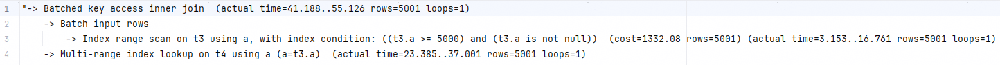

## 楔子

最近在生产上遇到了四个表做JOIN导致CPU异常增高的问题。我本来想基于MRR优化，但是测试之后发现效果并不明显。虽未成功，但也增强对MRR的理解。最终排查出来是执行计划的问题。同时借此机会，系统分析了一下MySQL对JOIN的处理。

本文使用的MySQL环境是：8.0.22。

先建表。

```mysql
CREATE TABLE `t2` (
  `id` int(11) NOT NULL,
  `a` int(11) DEFAULT NULL,
  `b` int(11) DEFAULT NULL,
  PRIMARY KEY (`id`),
  KEY `a` (`a`)
) ENGINE=InnoDB;

drop procedure idata;
delimiter ;;
create procedure idata()
begin
  declare i int;
  set i=1;
  while(i<=1000)do
    insert into t2 values(i, i, i);
    set i=i+1;
  end while;
end;;
delimiter ;
call idata();

create table t1 like t2;
insert into t1 (select * from t2 where id<=100)

create table t3(id int primary key, a int, b int, index(a));
create table t4 like t3;
drop procedure idata;
delimiter ;;
create procedure idata()
begin
  declare i int;
  set i=1;
  while(i<=10000)do
    insert into t3 values(i, 10001-i, i);
    set i=i+1;
  end while;
  
  set i=1;
  while(i<=1000000)do
    insert into t4 values(i, i, i);
    set i=i+1;
  end while;

end;;
delimiter ;
call idata();
```

1. 这四个表都有一个主键索引 id 和一个索引 a，字段 b 上无索引。
2. t1表有1000条数据，id升序，a列升序。
3. t2表有100条数据，id升序，a列升序。
4. t3表有10000条数据，id升序，a列降序。
5. t4表有1000000条数据，id升序，a列升序。


## JOIN

### Index Nested-Loop Join（NLJ）

先看一条SQL的执行：

```mysql
select * from t1 straight_join t2 on (t1.a=t2.a);
```

如果直接使用 join 语句，MySQL 优化器可能会选择表 t1 或 t2 作为驱动表，这样会影响我们分析 SQL 语句的执行过程。所以，为了便于分析执行过程中的性能问题，我改用 straight_join 让 MySQL 使用固定的连接方式执行查询，这样优化器只会按照我们指定的方式去 join。在这个语句里，t1 是驱动表，t2 是被驱动表。现在，我们来看一下这条语句的 explain 结果。

<div align="center"></div>

可以看到，在这条语句里，被驱动表 t2 的字段 a 上有索引，join 过程用上了这个索引，因此这个语句的执行流程是这样的：

1. 从表 t1 中读入一行数据 R；
2. 从数据行 R 中，取出 a 字段到表 t2 里去查找；
3. 取出表 t2 中满足条件的行，跟 R 组成一行，作为结果集的一部分；
4. 重复执行步骤 1 到 3，直到表 t1 的末尾循环结束。

<div align="center"></div>

这个过程是先遍历表 t1，然后根据从表 t1 中取出的每行数据中的 a 值，去表 t2 中查找满足条件的记录。在形式上，这个过程就跟我们写程序时的嵌套查询类似，并且可以用上被驱动表的索引，所以我们称之为“Index Nested-Loop Join”，简称 NLJ。

在这个 join 语句执行过程中，驱动表是走全表扫描，而被驱动表是走树搜索。假设被驱动表的行数是 M，B+树每个节点拥有a个子节点。被驱动表一次搜索的成本由两部分构成：

1. 读盘的次数是树的层高，即logaM。由于B+树的非叶子节点不存数据，所以每个非叶子节点能拥有很多的子节点，即a的值很大。由对数的性质可知，随着M的增大，logaM不会增的太大，所以logaM可以看做一个常量。
2. 有序数组的搜索采用的是二分法，所以搜索的时间复杂度是 log2M。

由于MySQL有LRU做缓存。大部分都不会产生读盘，所以大部分情况节点都是在内存中读取到的，读盘的成本可以忽略。

在被驱动表上查一行的时间复杂度是 2log2M（需要回表，即扫描了两次索引）。假设驱动表的行数是 N，执行过程就要扫描驱动表 N 行，然后对于每一行，到被驱动表上匹配一次。因此整个执行过程，近似复杂度是 N(1 + 2log2M)。

所以整个复杂度里 N 对扫描行数的影响更大，因此应该让小表来做驱动表。所以在BNL算法里需要让小表做驱动表。

**NLJ算法依赖被驱动表的索引。**

### Multi-Range Read（MRR）

MRR 是优化器将随机 IO 转化为顺序 IO 以降低查询过程中 IO 开销的一种手段。第一个应用场景是走二级索引的查询。

假如有一个查询：

```mysql
select * from t3 where t3.a >= 600;
```

其对索引a的访问如红线所示，这是是一个顺序访问。但是在回表时，由于所对应的主键不是顺序的（上面的查询得到的主键是逆序的，下面的图示主键是随机的），导致了无法对主键索引做数据访问。

<div align="center"></div>

启用MRR之后，MySQL在按索引a取出id之后，会先对a进行排序，再用排序后的数据取回表，这样回表时就是顺序IO了。

此时，语句的执行流程变成了这样：

1. 根据索引 a，定位到满足条件的记录，将 id 值放入 read_rnd_buffer 中 ;
2. 将 read_rnd_buffer 中的 id 进行递增排序；
3. 排序后的 id 数组，依次到主键 id 索引中查记录，并作为结果返回。

这里，read_rnd_buffer 的大小是由 read_rnd_buffer_size 参数控制的。如果步骤 1 中，read_rnd_buffer 放满了，就会先执行完步骤 2 和 3，然后清空 read_rnd_buffer。之后继续找索引 a 的下个记录，并继续循环。

<div align="center"></div>

想要稳定地使用 MRR 优化的话，需要设置set optimizer_switch="mrr_cost_based=off"。（官方文档的说法，是现在的优化器策略，判断消耗的时候，会更倾向于不使用 MRR，把 mrr_cost_based 设置为 off，就是固定使用 MRR 了。）

修改优化器策略后，explain结果如下：

<div align="center"></div>

### Batched Key Access（BKA）

看这条SQL：

```mysql
select * from t1 straight_join t2 on (t1.a=t2.a);
```

在 NLJ 算法下，它的执行逻辑是：从驱动表 t1，一行行地取出 a 的值，再到被驱动表 t2 去做 join。也就是说，对于表 t2 来说，每次都是匹配一个值，即此时无法使用MRR优化性能。如果t2的索引a和主键索引之间的关系是无序的，执行流程如下。

<div align="center"></div>

想要使用MRR优化性能，需要从表 t1 里一次性地多拿些行出来，一起传给表 t2。既然如此，我们就把表 t1 的数据取出来一部分，先放到 join_buffer 里。在将join_buffer里排序后的数据批量传入t2，这就是BKA算法。

<div align="center"></div>

如果要使用 BKA 优化算法的话，你需要在执行 SQL 语句之前，先设置：

```
set optimizer_switch='mrr=on,mrr_cost_based=off,batched_key_access=on';
```

其中，前两个参数的作用是要启用 MRR。这么做的原因是，BKA 算法的优化要依赖于 MRR。

我们拿一条SQL测试一下：

```mysql
select * from t3 join t4 on t3.a = t4.a where t3.a >= 5000;
```

<div align="center"></div>

<div align="center"></div>

我们结合着explain和explain analyze看一下执行过程：

首先在t3表上range scan索引a，并使用MRR去回表。过程如图：

<div align="center"></div>

然后从t3取出来的a按批排序后在t4表上取数，即使用BKA。

<div align="center"></div>

总结一下MRR的应用场景：一个是单表range查询，一个是join时走BKA算法。

<div align="center"></div>

### Block Nested-Loop Join（BNL）

NLJ和BKA都是当被驱动表上存在索引时才能使用，所以下面的SQL会使用BNL算法。

```mysql
select * from t1 straight_join t2 on (t1.a=t2.b);
```

过程如下：

1. 把表 t1 的数据读入线程内存 join_buffer 中，由于我们这个语句中写的是 select *，因此是把整个表 t1 放入了内存；
2. 扫描表 t2，把表 t2 中的每一行取出来，跟 join_buffer 中的数据做对比，满足 join 条件的，作为结果集的一部分返回。

<div align="center"></div>

join_buffer 的大小是由参数 join_buffer_size 设定的。我测试所用的MySQL默认值是4×1024×1024M。

```
show variables like 'join_buffer_size';  -- 单位 B
```

<div align="center"></div>

如果放不下表 t1 的所有数据的话，策略很简单，就是分段放。

比如 join_buffer 里只能装得下88行 t1 的索引a记录，再执行。执行过程就变成了：

1. 扫描表 t1，顺序读取数据行放入 join_buffer 中，放完第 88 行 join_buffer 满了，继续第 2 步；
2. 扫描表 t2，把 t2 中的每一行取出来，跟 join_buffer 中的数据做对比，满足 join 条件的，作为结果集的一部分返回；
3. 清空 join_buffer；
4. 继续扫描表 t1，顺序读取最后的 12 行数据放入 join_buffer 中，继续执行第 2 步。

<div align="center"></div>

这个流程才体现出了这个算法名字中“Block”的由来，表示“分块去 join”。可以看到，这时候由于表 t1 被分成了两次放入 join_buffer 中，导致表 t2 会被扫描两次。假设，驱动表的数据行数是 N，需要分 K 段才能完成算法流程，被驱动表的数据行数是 M。注意，这里的 K 不是常数，N 越大 K 就会越大，因此把 K 表示为λN，显然λ的取值范围是 (0,1)。所以，在这个算法的执行过程中：

1. 扫描行数是 N+λNM；
2. 内存判断 NM 次。

显然，内存判断次数是不受选择哪个表作为驱动表影响的。而考虑到扫描行数，在 M 和 N 大小确定的情况下，N 小一些，整个算式的结果会更小。所以结论是，应该让小表当驱动表。当然，你会发现，在 N+λNM 这个式子里，λ才是影响扫描行数的关键因素，这个值越小越好。

刚刚我们说了 N 越大，分段数 K 越大。那么，N 固定的时候，什么参数会影响 K 的大小呢（也就是λ的大小）？答案是 join_buffer_size。join_buffer_size 越大，一次可以放入的行越多，分成的段数也就越少，对被驱动表的全表扫描次数就越少。

### Hash Join

在BNL算法的实现里可以看到，其实上面计算 10 亿次那个操作看上去有点儿傻。如果 join_buffer 里面维护的不是一个无序数组，而是一个哈希表的话，那么就不是 NM 亿次判断，而是 λNM 次 hash 查找。这样的话，整条语句的执行速度就快多了。

MySQL在8.0.18版本后支持了Hash Join，并且在8.0.20版本彻底移除了BNL，所以此后的MySQL在不走索引情况下，比之前提升了很大的性能。

```mysql
select * from t1 straight_join t2 on (t1.a=t2.b);
```

<div align="center"></div>

Extra里Using join buffer(Hash join)表示使用了Hash Join。

即使使用了Hash Join，增加 join_buffer_size 依然可以提升性能。λN 的最小值是1，此时驱动表的数据能在join buffer中的一次性放的下。

引入Hash Join之后，被驱动表的扫描次数并没有减少，减少的是连接条件的比较次数。

### LRU

增加 join_buffer_size 的大小之后，除了能提升本次查询的性能，还能提升全局的cache命中率。

InnoDB读取页之后，会将也缓存在 Buffer Pool 中。Buffer Pool 的大小由 innodb_buffer_pool_size 参数确认，一般为物理内存的60%。

由于内存的大小是远远小于外存的，所以 Buffer Pool 不可能存放所有的磁盘页。长时间不用的页就会被从内存中移走，即淘汰。

按照常规的LRU实现，一旦某个页被读取后，就会立即被放在LRU的头部，这时就存在一个问题：冷数据被查询后即使后面一段时间不再被使用了也得很久才会被淘汰。同时热数据被挤到LRU的尾部导致被淘汰，后续再次读就需要读磁盘了。一个常见的案例是业务低峰期跑统计任务，此时大量的冷数据会被读取出来，但是它们每天也只会被读取出来这么一次。

下面是常规LRU算法的执行过程：

<div align="center"></div>

1. 链表头部是 P1，表示 P1 是最近刚刚被访问过的数据页；假设内存里只能放下这么多数据页；
2. 这时候有一个读请求访问 P3，因此变成状态 2，P3 被移到最前面；
3. 状态 3 表示，这次访问的数据页是不存在于链表中的，所以需要在 Buffer Pool 中新申请一个数据页 Px，加到链表头部。但是由于内存已经满了，不能申请新的内存。于是，会清空链表末尾 Pm 这个数据页的内存，存入 Px 的内容，然后放到链表头部。
4. 从效果上看，就是最久没有被访问的数据页 Pm，被淘汰了。

为了解决这个问题，InnoDB设计了一套分区LRU。其按照 5:3 的比例把整个 LRU 链表分成了 young 区域和 old 区域。

<div align="center"></div>

图中 LRU_old 指向的就是 old 区域的第一个位置，是整个链表的 5/8 处。也就是说，靠近链表头部的 5/8 是 young 区域，靠近链表尾部的 3/8 是 old 区域。改进后的 LRU 算法执行流程变成了下面这样。

1. 要访问数据页 P3，由于 P3 在 young 区域，因此和优化前的 LRU 算法一样，将其移到链表头部，变成状态 2。
2. 之后要访问一个新的不存在于当前链表的数据页，这时候依然是淘汰掉数据页 Pm，但是新插入的数据页 Px，是放在 LRU_old 处。
3. 处于 old 区域的数据页，每次被访问的时候都要做下面这个判断：
   1. 若这个数据页在 LRU 链表中存在的时间超过了 1 秒，就把它移动到链表头部；
   2. 如果这个数据页在 LRU 链表中存在的时间短于 1 秒，位置保持不变。1 秒这个时间，是由参数 innodb_old_blocks_time 控制的。其默认值是 1000，单位毫秒。

如果 join_buffer_size 很小，被驱动表就被会被多次读取，如果第一次读取和最后一次读取的时间超过了1s，大量的冷页就会被提升至young区域，而真正的热点数据就会被淘汰。所以对于偶尔执行一次的大查询来说，增加 join_buffer_size 的大小可以避免降低缓存命中率。

### 小表

从上面对NLJ、BKA、BNL、Hash Join算法的分析可知，驱动表应该一直选小表。

这里需要分析一下小表在不同算法里的好处：

1. 对于NLJ算法和BKA算法来说，被驱动表一定需要索引，所以即使是小表，如果被驱动表无法走索引，也不一定被选做驱动表。
2. 对于NLJ算法来说，执行过程不使用Join Buffer，所以使用小表做驱动表的目的是减少循环取数。
3. 对于BKA算法来说，执行过程中需要使用Join Buffer和read_rnd_buffer，使用小表做驱动表，目的是减少循环取数的批数。
4. 对于BNL算法/Hash Join算法来说，执行过程中需要使用Join Buffer，使用小表做驱动表，目的是减少对被驱动表的全表扫描次数。

小表不是指表所占的空间小，而是两个表按照各自的条件过滤，过滤完成之后，计算参与 join 的各个字段的总数据量（行数、字段数量、字段长度等），数据量小的那个表，就是“小表”。


## SQL优化

虽然MRR和BKA看起来可以提升很多性能，但是MySQL的优化器默认基本不会使用MRR，BKA更是直接关掉了。这是为什么呢？这就得回到MRR提升性能的原因上来了：MRR 是将随机 IO 转化为顺序 IO 以降低查询过程中 IO 开销的一种手段。所以：

1. 如果查询命中的页本来就很相近，本来就就接近于随机IO了，MRR就很难再提示性能了。
2. MySQL从磁盘中读页后都做了LRU，所以对于热点数据，事实上走到磁盘IO的概率不大。
3. 我们现在使用的都是SSD了，相比于机械硬盘，SSD里随机IO与顺序IO的差距远小于HDD。

### 场景及测试

最近我负责的业务遇到了一个四表查询的SQL：

```mysql
SELECT FLIGHT_ID,
       TASK_NAME,
       PLAN_TIME,
       WARN_TIME,
       ALERT_TIME,
       TASK_END_DATE                  as completeTime,
       TASK_CODE,
       ARRIVAL_DEPARTURE,
       REMARK,
       group_concat(V1.OPERATOR_CODE) AS OPERATOR_CODE,
       monitor_id
FROM (SELECT T2.FLIGHT_ID,
             T4.CODE              AS TASK_CODE,
             T4.ID                AS TASK_ID,
             T2.ARRIVAL_DEPARTURE as ARRIVAL_DEPARTURE,
             T4.NAME              AS TASK_NAME,
             null                 AS PLAN_TIME,
             null                 AS WARN_TIME,
             null                 AS ALERT_TIME,
             T3.TASK_END_DATE     AS TASK_END_DATE,
             T3.REMARK            as REMARK,
             T2.ID                as monitor_id,
             CASE
                 WHEN T5.USER_CODE IS NOT NULL THEN T5.USER_CODE
                 WHEN T3.FEEDBACK_USER IS NOT NULL THEN T3.FEEDBACK_USER
                 ELSE '' END      AS OPERATOR_CODE
      FROM T_FLIGHT_MONITOR_TASK T3
               INNER JOIN T_FLIGHT_MONITOR T2 ON T3.FLIGHT_MONITOR_ID = T2.ID
               LEFT JOIN T_FLIGHT_MONITOR_TASK_USER_REF T5 ON T5.FLIGHT_MONITOR_TASK_ID = T3.ID
               LEFT JOIN T_TASK_TEMPLATE T4 ON T4.ID = T3.TASK_TEMPLATE_ID
      WHERE 1= 1 and T2.ARRIVAL_DEPARTURE = 2
        AND T2.FLIGHT_ID IN (#{flightIdList})
              AND T3.IF_DEL = 0
        AND T4.TYPE = 1 AND T4.IF_DEL = 0
      ) V1
GROUP BY FLIGHT_ID, TASK_NAME, PLAN_TIME, WARN_TIME, ALERT_TIME, TASK_END_DATE, REMARK, TASK_CODE, ARRIVAL_DEPARTURE, monitor_id;
```

四个表的关联关系如图所示：

<div align="center"></div>

为了让测试环境和生产尽量保持一致，我让DBA将生产的数据全量导入这四张表：从左上到右下分别数量为552850、1399464、892604、3566。

在这条SQL里，传过来的参数是航班ID的集合。所以我带入不同的航班ID集合，在开启BKA和关闭BKA的情况下分别测试执行耗时。

|                         | 禁用MRR | 启用MRR | 启用MRR后耗时降低比例 |
| ----------------------- | ------- | ------- | --------------------- |
| 10个航班在同一天        | 35      | 36      | -2.86%                |
| 88个航班在同一天        | 73      | 73      | 0                     |
| 取1天的航班，共184个    | 137     | 137     | 0                     |
| 取1天的航班+1，共185个  | 5686    | 4070    | 28.42%                |
| 取1天的航班，共209个    | 5710    | 4110    | 28.02%                |
| 取2天的航班，共284个    | 5677    | 4151    | 26.88%                |
| 取5天的航班，共774个    | 5841    | 4383    | 24.96%                |
| 每天取1条航班，共2226个 | 5631    | 4020    | 28.61%                |

我的本意是测试一下BKA算法和Hash Join算法性能差距，但是测试结果却反映了更多的问题：

1. 开启MRR之后，如果航班数据量比较小，没有任何耗时降低。
2. 开启MRR之后，如果航班数据量比较大，耗时降低的比例基本在25%左右。
3. 当航班数量在184个及以内时，耗时基本是随航班ID数量线性增长。
4. 当航班数量在184个以外时，耗时基本维持不变。
5. 航班数量在185时，查询耗时发生巨增。

### 执行计划分析

184和185耗时发生巨增是第一个需要分析的问题。我们分别看看他俩在不开启MRR下的执行计划。

184不开启MRR的执行计划：

<div align="center"></div>

<div align="center"></div>

1. range index scan **T_FLIGHT_MONITOR（552850）**。并按传入的航班ID做过滤。
2. 拿  **T_FLIGHT_MONITOR（552850）的ID** 和 **T_FLIGHT_MONITOR_TASK（1399464）的FLIGHT_MONITOR_ID** 做NLJ。
3. 拿 **T_FLIGHT_MONITOR_TASK（1399464）的TASK_TMPLATE_ID** 和 **T_TASK_TEMPLATE（3566）的ID** 做NLJ。
4. 拿 **T_FLIGHT_MONITOR_TASK（1399464）的ID** 和 **T_FLIGHT_MONITOR_TASK_USER_REF（892604）的FLIGHT_MONITOR_TASK_ID** 做NLJ。

185不开启MRR的执行计划：

<div align="center"></div>

<div align="center"></div>

1. 全表扫描T_TASK_TEMPLATE（3566）
2. 拿 **T_TASK_TEMPLATE的ID（3566）** 和 **T_FLIGHT_MONITOR_TASK（1399464）的TASK_TMPLATE_ID** 做NLJ。
3. 拿 **T_FLIGHT_MONITOR_TASK（1399464）的FLIGHT_MONITOR_ID** 和 **T_FLIGHT_MONITOR（552850）的ID** 做NLJ。并按传入的航班ID做过滤。
4. 拿 **T_FLIGHT_MONITOR_TASK（1399464）的ID** 和 **T_FLIGHT_MONITOR_TASK_USER_REF（892604）的FLIGHT_MONITOR_TASK_ID** 做NLJ。

看到这就看出来了：

1. 当航班ID是184个的时候，MySQL选取的执行计划是先对T_FLIGHT_MONITOR按航班ID过滤（1个航班对应2条T_FLIGHT_MONITOR记录），再和T_FLIGHT_MONITOR_TASK做JOIN（1条T_FLIGHT_MONITOR记录对应20条T_FLIGHT_MONITOR_TASK记录），再和T_TASK_TEMPLATE做JOIN。
   1. 对T_FLIGHT_MONITOR的搜索次数是常数
   2. 对T_FLIGHT_MONITOR_TASK的搜索次数是184 × 2
   3. 对T_TASK_TEMPLATE的搜索次数是184 × 2 * 20

2. 当航班ID是185个的时候，MySQL选取的执行计划是先全表扫描T_TASK_TEMPLATE，再和T_FLIGHT_MONITOR_TASK做JOIN，再和T_FLIGHT_MONITOR做JOIN，再按航班ID过滤。
   1. 对T_TASK_TEMPLATE的搜索次数是常数
   2. 对T_FLIGHT_MONITOR_TASK的搜索次数是3566
   3. T_FLIGHT_MONITOR做搜索的次数是3566 × 552850


生产我们的数据量正好触发了临界值，由于SQL执行很长，直接把应用的数据库连接池干满了，导致服务重启。而且数据库的CPU直接干到了85%，查点把数据库也干满了。

<div align="center"></div>

184及以下的航班量，开启MRR后没有什么提升，所以我们看一下185开启MRR后的执行计划。

185开启MRR的执行计划：

<div align="center"></div>

<div align="center"></div>

1. 全表扫描T_TASK_TEMPLATE（3566）。
2. 对 **T_TASK_TEMPLATE的ID** 排序后，和 **T_FLIGHT_MONITOR_TASK的TASK_TMPLATE_ID** 走MRR做JOIN，即使用了BKA。
3. 拿 **T_FLIGHT_MONITOR_TASK（1399464）的FLIGHT_MONITOR_ID** 和 **T_FLIGHT_MONITOR（552850）的ID** 做NLJ。并按传入的航班ID做过滤。
4. 对 **T_FLIGHT_MONITOR_TASK（1399464）的ID** 排序后，和 **T_FLIGHT_MONITOR_TASK_USER_REF（892604）的FLIGHT_MONITOR_ID** 走MRR做JOIN，即使用了BKA。

185个航班ID的场景下，MySQL在默认的执行计划下，走BKA和不走BKA性能是有提升的，毕竟全表JOIN，读取的磁盘页应该是挺多的。

基于此，我们可以解释测试现象：

1. 如果航班ID的数量不大，MySQL选取的执行策略是"先过滤再JOIN"，所以耗时随着航班ID的数量线性增长。
2. 如果航班ID的数量大，MySQL选取的执行策略是"先JOIN再过滤"，所以耗时是稳定的。同时由于做了全表JOIN，性能相当的差。
3. 如果航班ID的数量大，开启BKA算法之后，性能提升在25%左右。由于全表JOIN后数据量差不错，所以这个提升也是稳定的。

### 优化思路

这条SQL直接把容器干重启，所以花费了不小的心思在优化上。问题发生之后的处理过程分为四步：第一步是临时缓解问题，第二步是排查SQL本身的问题，第三步是优化SQL，第四步是对类似的SQL做预处理。

临时缓解问题：

1. 将业务生命周期结束的数据通过ETL抽到数仓里去，不存在业务系统表里。
2. 前端调用接口后增加Loading，后端接口按用户维度做限流。
3. 对参数限制，最多一次查3天的数据（当时限制的是3天，从事后的分析来看，3天的航班量是会触发临界值，所以这个方案实际上并没有解决问题。但限制数据量是一个缓解问题的手段）。

排查SQL本身：

1. 先排查索引，索引是否命中，索引区分度如何。发现索引没有问题。
2. 再分析Join算法，是否选取了错误的算法。发现NLJ算法是正确的算法。
3. 再分析是不是有大量的随机IO。我让DBA导了全量的数据到测试环境，并开启MRR和BKA，发现性能提升在25%。说明随机IO不是把CPU拉满的原因。
4. 再分析数据量。选取航班[10，3000]，二分法逼近，找到了184这个临界值。分析临界值两边的执行计划，最终发现是MySQL选错了执行计划。

优化SQL：

1. 使用STRAIGHT_JOIN强制选取T_FLIGHT_MONITOR为第一个驱动表
2. 在应用层对航班ID做分片后循环查库。

对类似的SQL做预处理：

1. 全部使用STRAIGHT_JOIN改写不太现实，这个模块是从ORACLE改造成MySQL的，大JOIN较多且历史功能不好分析，也没有测试资源。所以改写就不做了。
2. 类似的SQL都在应用层对航班ID做分片后循环查库。

做完之后数据库CPU峰值维持在40%。


## 参考

1. [Multi Range Read Optimization - MariaDB Knowledge Base](https://mariadb.com/kb/en/multi-range-read-optimization/)
1. [【性能提升神器】STRAIGHT_JOIN-腾讯云开发者社区-腾讯云 (tencent.com)](https://cloud.tencent.com/developer/article/1193344)
1. [MySQL :: MySQL 8.0 Reference Manual :: 8.2.1.12 Block Nested-Loop and Batched Key Access Joins](https://dev.mysql.com/doc/refman/8.0/en/bnl-bka-optimization.html)
1. [神奇的 SQL 之 联表细节 → MySQL JOIN 的执行过程（二） - 青石路 - 博客园 (cnblogs.com)](https://www.cnblogs.com/youzhibing/p/12012952.html)
1. [MySQL :: MySQL 8.0 Reference Manual :: 8.2.1.11 Multi-Range Read Optimization](https://dev.mysql.com/doc/refman/8.0/en/mrr-optimization.html)
1. 极客时间MySQL 45讲。
1. [MySQL :: MySQL 8.0 Reference Manual :: 8.2.1.7 Nested-Loop Join Algorithms](https://dev.mysql.com/doc/refman/8.0/en/nested-loop-joins.html#nested-loop-join-algorithm)


