## 索引合并

> The Index Merge access method retrieves rows with multiple [`range`](https://dev.mysql.com/doc/refman/8.0/en/explain-output.html#jointype_range) scans and merges their results into one. This access method merges index scans from a single table only, not scans across multiple tables. The merge can produce unions, intersections, or unions-of-intersections of its underlying scans.
>
> 简单点讲：将where条件拆分，并将拆分后的子条件分别带入不同的索引中过滤数据。再将过滤出来的数据做intersect或union。

Example queries for which Index Merge may be used:

```mysql
SELECT * FROM tbl_name WHERE key1 = 10 OR key2 = 20;

SELECT * FROM tbl_name
  WHERE (key1 = 10 OR key2 = 20) AND non_key = 30;

SELECT * FROM t1, t2
  WHERE (t1.key1 IN (1,2) OR t1.key2 LIKE 'value%') AND t2.key1 = t1.some_col;	-- t1表扫描两个索引

SELECT * FROM t1, t2
  WHERE t1.key1 = 1 AND (t2.key1 = t1.some_col OR t2.key2 = t1.some_col2); -- t2表扫描两个索引
```

The Index Merge optimization algorithm has the following known limitations:

- If your query has a complex `WHERE` clause with deep [`AND`](https://dev.mysql.com/doc/refman/8.0/en/logical-operators.html#operator_and)/[`OR`](https://dev.mysql.com/doc/refman/8.0/en/logical-operators.html#operator_or) nesting and MySQL does not choose the optimal plan, try distributing terms using the following identity transformations:

  ```sql
  (x AND y) OR z => (x OR z) AND (y OR z)
  (x OR y) AND z => (x AND z) OR (y AND z)
  ```

- Index Merge is not applicable to full-text indexes.

In [`EXPLAIN`](https://dev.mysql.com/doc/refman/8.0/en/explain.html) output, the Index Merge method appears as [`index_merge`](https://dev.mysql.com/doc/refman/8.0/en/explain-output.html#jointype_index_merge) in the `type` column. In this case, the `key` column contains a list of indexes used, and `key_len` contains a list of the longest key parts for those indexes.

The Index Merge access method has several algorithms, which are displayed in the `Extra` field of [`EXPLAIN`](https://dev.mysql.com/doc/refman/8.0/en/explain.html) output:

- `Using intersect(...)`
- `Using union(...)`
- `Using sort_union(...)`

The following sections describe these algorithms in greater detail. The optimizer chooses between different possible Index Merge algorithms and other access methods based on cost estimates of the various available options.

在分析索引合并算法前，我们需要思考一个问题，索引合并存在的目的是什么？这个在不同的算法下还不太一样！

假如查询使用了某一个索引，但查询出来的数据还是很多，我们会怎么优化性能呢？

1. 如果此时满足最左匹配原则，可以通过增加索引列实现数据过滤。
2. 如果不满足最左匹配原则，也还可以使用索引下推来实现数据过滤。
3. 如果此时既无法增加列也无法使用索引下推，那么就需要回表，并在server层做过滤。

引入索引合并（intersect）的目的就是在不满足最左匹配原则和索引下推的情况下减少回表和Server层过滤。比如条件a=10命中数据[1,2,3]，b='z'命中数据[3,4,5]，引入索引合并后只需回表一条数据，如果这条SQL还有c=29条件，Server层只需要判断一次。所以优化器决定是否使用索引合并（intersect）比较的是：

1. 回表成本 + Server层过滤的成本
2. 扫描一个索引的成本 + 做intersect的成本

对于索引合并（union）来说，回表成本是一定存在的，比如条件a=10命中数据[1,2,3]，b='z'命中数据[3,4,5]，[1,2,3,4,5]都需要回表。所以对于union来说，回表不是成本比较的方向了。其目的是让or语法能用上索引，否则or后面的条件就得执行全表扫描，所以优化器决定是否使用索引合并（union）比较的是：

1. 全表扫描
2. 扫描一个索引的成本 + 做union的成本

### Index Merge Intersection

#### OFFICIAL DOC

This access algorithm is applicable when a `WHERE` clause is converted to several range conditions on different keys combined with [`AND`](https://dev.mysql.com/doc/refman/8.0/en/logical-operators.html#operator_and), and each condition is one of the following:

- An *`N`*-part expression of this form, where the index has exactly *`N`* parts (that is, all index parts are covered):

  ```sql
  key_part1 = const1 AND key_part2 = const2 ... AND key_partN = constN
  ```

- Any range condition over the primary key of an `InnoDB` table. 

Examples:

```sql
SELECT * FROM innodb_table
  WHERE primary_key < 10 AND key_col1 = 20;

SELECT * FROM tbl_name
  WHERE key1_part1 = 1 AND key1_part2 = 2 AND key2 = 2;
```

The Index Merge intersection algorithm performs simultaneous scans on all used indexes and produces the intersection of row sequences that it receives from the merged index scans.

If all columns used in the query are covered by the used indexes, full table rows are not retrieved ([`EXPLAIN`](https://dev.mysql.com/doc/refman/8.0/en/explain.html) output contains `Using index` in `Extra` field in this case). Here is an example of such a query:

```sql
SELECT COUNT(*) FROM t1 WHERE key1 = 1 AND key2 = 1;
```

If the used indexes do not cover all columns used in the query, full rows are retrieved only when the range conditions for all used keys are satisfied.

If one of the merged conditions is a condition over the primary key of an `InnoDB` table, it is not used for row retrieval, but is used to filter out rows retrieved using other conditions.

#### 分析

从上面官方文档的解释可以看出，Intersection算法的使用是有限制的：

1. 对于二级索引，只能使用等值查询且索引里所有的字段都得被条件包含
2. 对于主键索引，只能使用范围查询

这里就产生了两个问题：

1. 为什么二级索引只能使用等值查询且索引里所有的字段都得被条件包含？
2. 主键索引不能使用等值查询吗

第二个问题好回答，因为主键的等值查询，已经不再需要回表了，所以优化器此时压根就不会选择走索引合并，而是选择主键索引+Server层过滤。如图1所示：

<center>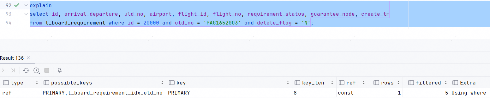<br><div>图1</div></center>

第一个问题的原因是：二级索引查询出来的主键需要是有序的，MySQL的优化器才会选择使用Intersection。这样就衍生了两个问题：

1. 为什么等值查询且索引里所有的字段都得被条件包含，查询出的主键就是有序的？
2. 为什么Intersection严格限制查询出来的主键需要是有序的呢？

第二个问题的答案是，MySQL实现的Intersection算法是在有序集合的基础下实现的。假设`idx_a`过滤出的id是`[1,3,5]`，`idx_b`过滤出的id集合是`[2,3,4]`，取交集的过程其实是这样的：

1. 从`idx_a`取出第一条记录，id值是1。再从`idx_b`取出第一条记录，id值是2，因为`1<2`所以id为1的那条记录直接丢弃。
2. 从`idx_a`取出第二条记录，id值是3，因为`2<3`，所以id为2的那条记录直接丢弃。
3. 从`idx_b`取出第二条记录，id值是3，因为`3=3`，所以拿3去回表查询，结果返回给客户端，同时id为3的两条记录也直接丢弃。
4. 从`idx_a`取出第三条记录，id值是5。从`idx_b`取出第三条记录，id值是4。因为`4<5`所以id为4的记录被丢弃。
5. 因为双方都没有记录了，id为5的记录也被丢弃，交集过程结束。

基于此算法，MySQL不需要申请内存取存两个索引查出来的ID集合，同时这样的时间复杂度是M+N。由此可以看出，MySQL对Intersection的使用是非常严格的，即不占用额外内存且时间复杂度是线性。

看到这个过程之后，我们也明白了为什么文档里说是同时扫描多个索引而不是依次扫描多个索引：

> performs simultaneous scans on all used indexes

第一个问题的答案和MySQL索引的组织格式有关。我们知道主键索引有一个特点，就是主键一定是有序的，因为这样，查询的时候才能使用二分查找，否则就只能使用循环遍历了。比如已经有了主键1和123，再想插入一个12，那么主键12一定在1和123之间。这也是为什么插入数据的时候要求主键递增的原因，因为如果不递增，如果当前页满了，在中间插入一个值会产生页分裂。

<center>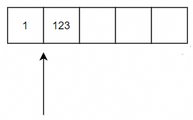<br><div>图2</div></center> 

一个MySQL二级索引，如果索引列的值相同的记录可能会有好多条，这些索引列的值相同的记录是按照主键的值进行排序的。所以如果条件完全覆盖索引列，那么根据二级索引查出来的主键集合一定是有序的。按照有序主键去回表的过程被称为：Rowid Ordered Retrieval，简称 ROR。很明显，这种有序回表可以解决随机IO的问题。

<center>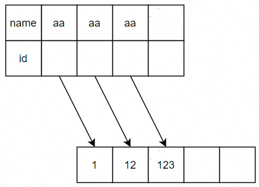<br><div>图3</div></center> 

如果条件不能完全覆盖索引列，二级索引内就会有多个值，多个值构成的主键集合就无序了，如图4：

<center>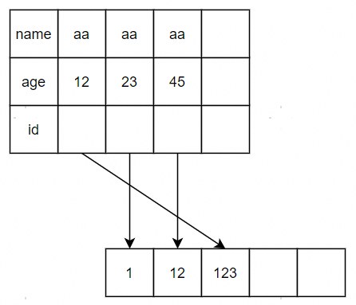<br><div>图4</div></center> 

此索引的构建过程为：

1. 插入aa,23，主键为1
2. 插入aa,45，主键为12
3. 插入aa,12，主键为123

所以这就是为什么二级索引需满足：等值查询且索引里所有的字段都得被条件包含。

intersection算法的应用场景非常有限，因为绝大多数的查询都能被联合索引解决，而且联合索引的性能更好。我想到了一个使用intersection算法而使用联合索引的场景：

```
a & b				频繁
a & b & c & d		不频繁
c & d				频繁

idx1(a, b)
idx2(c, d)
```

一共有三条SQL，其中以(a,b)做条件的查询频繁，以(c,d)做条件的查询频繁，以(a,b,c,d)做条件的查询不频繁。此时建立(a,b)和(c,d)连个索引即可覆盖所有场景。

### Index Merge Union

#### OFFICIAL DOC

The criteria for this algorithm are similar to those for the Index Merge intersection algorithm. The algorithm is applicable when the table's `WHERE` clause is converted to several range conditions on different keys combined with [`OR`](https://dev.mysql.com/doc/refman/8.0/en/logical-operators.html#operator_or), and each condition is one of the following:

- An *`N`*-part expression of this form, where the index has exactly *`N`* parts (that is, all index parts are covered):

  ```sql
  key_part1 = const1 OR key_part2 = const2 ... OR key_partN = constN
  ```

- Any range condition over a primary key of an `InnoDB` table.

- A condition for which the Index Merge intersection algorithm is applicable.

Examples:

```sql
SELECT * FROM t1
  WHERE key1 = 1 OR key2 = 2 OR key3 = 3;

SELECT * FROM innodb_table
  WHERE (key1 = 1 AND key2 = 2) OR (key3 = 'foo' AND key4 = 'bar') AND key5 = 5;
```

#### 分析

从上面官方文档的解释可以看出，Union算法的使用是有限制的：

1. 对于二级索引，只能使用等值查询且索引里所有的字段都得被条件包含
2. 对于主键索引，为什么只能使用范围查询？

这里就产生了两个问题：

1. 为什么二级索引只能使用等值查询且索引里所有的字段都得被条件包含？
2. 主键索引不能使用等值查询吗

第二个问题实测是可以使用Union算法的，如图5：

<center>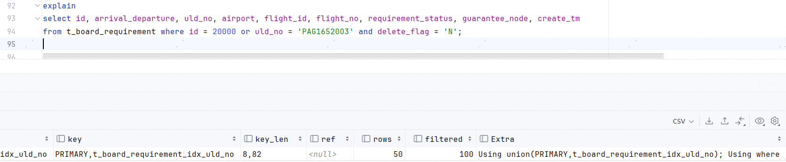<br><div>图5</div></center> 

第一个问题的答案和Intersection算法的答案类似。我们描述一下Union算法的执行过程就可以明白：

假设`idx_a`过滤出的id是`[1,3,5]`，`idx_b`过滤出的id集合是`[2,3,4]`，取并集的过程其实是这样的：

1. 从`idx_a`取出第一条记录，id值是1。再从`idx_b`取出第一条记录，id值是2，因为`1<2`所以id为1的那条记录回表后返回给客户端。
2. 从`idx_a`取出第二条记录，id值是3，因为`2<3`，所以id为2的那条记录回表后返回给客户端。
3. 从`idx_b`取出第二条记录，id值是3，因为`3=3`，所以id为3的那条记录回表后返回给客户端，同时id为3的两条记录直接丢弃。
4. 从`idx_a`取出第三条记录，id值是5。从`idx_b`取出第三条记录，id值是4。因为`4<5`所以id为4的记录回表后返回给客户端
5. 因为双方都没有记录了，id为5的记录回表后返回给客户端，交集过程结束。

union算法的应用场景主要是解决or后面的条件无法走索引的情况。

```
(a & b) or (c & d)

idx1(a, b)
idx2(c, d)
```

### Index Merge Sort-Union

#### OFFICIAL DOC

This access algorithm is applicable when the `WHERE` clause is converted to several range conditions combined by [`OR`](https://dev.mysql.com/doc/refman/8.0/en/logical-operators.html#operator_or), but the Index Merge union algorithm is not applicable.

Examples:

```sql
SELECT * FROM tbl_name
  WHERE key_col1 < 10 OR key_col2 < 20;

SELECT * FROM tbl_name
  WHERE (key_col1 > 10 OR key_col2 = 20) AND nonkey_col = 30;
```

The difference between the sort-union algorithm and the union algorithm is that the sort-union algorithm must first fetch row IDs for all rows and sort them before returning any rows.

#### 分析

Intersection算法和union算法的使用都非常苛刻：必须保证从每个索引里获取的主键都是有序的。这个苛刻的条件放在Intersection算法没有问题，因为此算法对比的成本是：

1. 回表成本 + Server层过滤的成本
2. 扫描一个索引的成本 + 做intersect的成本

对于union算法来说如果or无法使用索引，就必须增加全表扫描，即比较的是：

1. 全表扫描
2. 扫描一个索引的成本 + 做union的成本

此时很明显，应该更优先选择索引合并。MySQL为了能使用之前union算法里描述过的执行过程，先对索引查询出来的数据做了一次排序，然后再应用union算法。这种算法被叫做sort-union。

我们可以测试一下，下面的图里：

1. flight_id,airport是联合索引，即flight_id查出来的主键不是有序的；
2. uld_no有单独索引；
3. 此时可以看到使用了sort-union算法。

<center>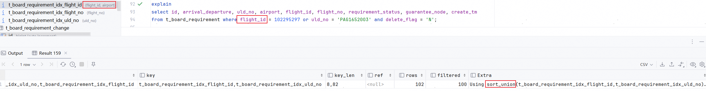<br><div>图6</div></center> 

sort-union需要使用额外的内存来储存无序集合，同时需要对无序集合进行排序。空间成本和时间成本相比于intersection或union都有增加。

MySQL没有sort-intersection算法，这个原因很简单：intersection算法的成本是扫描一个索引的成本 + 做intersect的成本，如果再增加两块内存和两次排序，整体的成本可能比回表还高，所以MySQL就没有支持这个算法。

同时从Intersection算法的严苛条件可以看出来，MySQL官方肯定是更推荐使用联合索引而不是Intersection。

### 索引合并的风险

如果网上查询索引合并的博客，可以查到很多索引合并导致的死锁。所以我们下面分析一下。

死锁产生的条件是：

1. 互斥条件：一个资源每次只能被一个进程使用。
2. 请求与保持条件：一个进程因请求资源而阻塞时，对已获得的资源保持不放。
3. 不剥夺条件：进程已获得的资源，在末使用完之前，不能强行剥夺。
4. 循环等待条件：若干进程之间形成一种头尾相接的循环等待资源关系。

其中1、2、3都是加锁过程中必须满足的条件。所以避免死锁的方法就是打破循环等待。打破循环等待的方法是对每个资源都增加一个优先级，按优先级访问即可避免死锁。所以索引合并产生死锁的原因是没有按优先级访问资源。

假设有SQL：

```mysql
update tbl set a = ? where b = ? and c = ?
```

图7是产生死锁的过程：

<center>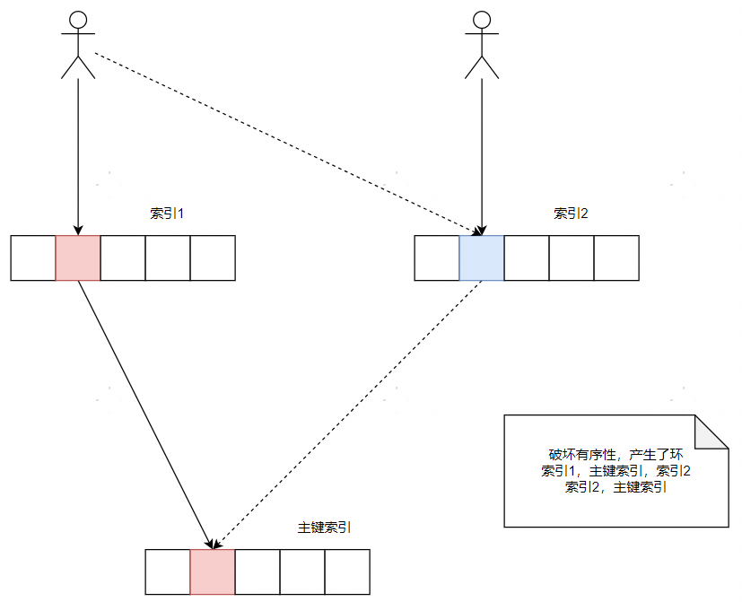<br><div>图7</div></center> 

过程：

1. 线程A的条件b申请索引1的锁成功
2. 线程A回表主键索引，申请主键p1的锁成功
3. 线程B的条件b由于没有命中任何一个数据，所以不对索引1加锁，也不需要回表。
4. 线程B的条件c命中了索引2的c1，并申请成功
5. 线程B此时需要回表申请主键p1的锁，陷入等待
6. 线程A的条件c命中了索引2的c1，陷入等待。

可以清楚的看到对于线程A，其申请锁的过程是：索引1 -> 主键索引 -> 索引2；对于线程B，其申请锁的过程是：索引2 -> 主键索引，即产生了循环加锁。

### Influencing Index Merge Optimization

Use of Index Merge is subject to the value of the [`index_merge`](https://dev.mysql.com/doc/refman/8.0/en/switchable-optimizations.html#optflag_index-merge), [`index_merge_intersection`](https://dev.mysql.com/doc/refman/8.0/en/switchable-optimizations.html#optflag_index-merge-intersection), [`index_merge_union`](https://dev.mysql.com/doc/refman/8.0/en/switchable-optimizations.html#optflag_index-merge-union), and [`index_merge_sort_union`](https://dev.mysql.com/doc/refman/8.0/en/switchable-optimizations.html#optflag_index-merge-sort-union) flags of the [`optimizer_switch`](https://dev.mysql.com/doc/refman/8.0/en/server-system-variables.html#sysvar_optimizer_switch) system variable. See [Section 8.9.2, “Switchable Optimizations”](https://dev.mysql.com/doc/refman/8.0/en/switchable-optimizations.html). By default, all those flags are `on`. To enable only certain algorithms, set [`index_merge`](https://dev.mysql.com/doc/refman/8.0/en/switchable-optimizations.html#optflag_index-merge) to `off`, and enable only such of the others as should be permitted.

In addition to using the [`optimizer_switch`](https://dev.mysql.com/doc/refman/8.0/en/server-system-variables.html#sysvar_optimizer_switch) system variable to control optimizer use of the Index Merge algorithms session-wide, MySQL supports optimizer hints to influence the optimizer on a per-statement basis. See [Section 8.9.3, “Optimizer Hints”](https://dev.mysql.com/doc/refman/8.0/en/optimizer-hints.html).

由于索引合并在更新语句中有风险，所以我司是默认关闭索引合并的。

开启索引合并的设置：

```
set optimizer_switch='index_merge=on,index_merge_union=on,index_merge_sort_union=on,index_merge_intersection=on';
```

关闭索引合并的设置：

```
set optimizer_switch='index_merge=off,index_merge_union=off,index_merge_sort_union=off,index_merge_intersection=off';
```


## GROUP BY OPTIMIZATION

The most general way to satisfy a `GROUP BY` clause is to scan the whole table and create a new temporary table where all rows from each group are consecutive, and then use this temporary table to discover groups and apply aggregate functions (if any). In some cases, MySQL is able to do much better than that and avoid creation of temporary tables by using index access.

The most important preconditions for using indexes for `GROUP BY` are that all `GROUP BY` columns reference attributes from the same index, and that the index stores its keys in order (as is true, for example, for a `BTREE` index, but not for a `HASH` index). Whether use of temporary tables can be replaced by index access also depends on which parts of an index are used in a query, the conditions specified for these parts, and the selected aggregate functions.

There are two ways to execute a `GROUP BY` query through index access, as detailed in the following sections. The first method applies the grouping operation together with all range predicates (if any). The second method first performs a range scan, and then groups the resulting tuples.

- [Loose Index Scan](https://dev.mysql.com/doc/refman/8.0/en/group-by-optimization.html#loose-index-scan)
- [Tight Index Scan](https://dev.mysql.com/doc/refman/8.0/en/group-by-optimization.html#tight-index-scan)

Loose Index Scan can also be used in the absence of `GROUP BY` under some conditions. See [Skip Scan Range Access Method](https://dev.mysql.com/doc/refman/8.0/en/range-optimization.html#range-access-skip-scan).

### Loose Index Scan

#### OFFICIAL DOC

The most efficient way to process `GROUP BY` is when an index is used to directly retrieve the grouping columns. With this access method, MySQL uses the property of some index types that the keys are ordered (for example, `BTREE`). This property enables use of lookup groups in an index without having to consider all keys in the index that satisfy all `WHERE` conditions. This access method considers only a fraction of the keys in an index, so it is called a Loose Index Scan. When there is no `WHERE` clause, a Loose Index Scan reads as many keys as the number of groups, which may be a much smaller number than that of all keys. If the `WHERE` clause contains range predicates (see the discussion of the [`range`](https://dev.mysql.com/doc/refman/8.0/en/explain-output.html#jointype_range) join type in [Section 8.8.1, “Optimizing Queries with EXPLAIN”](https://dev.mysql.com/doc/refman/8.0/en/using-explain.html)), a Loose Index Scan looks up the first key of each group that satisfies the range conditions, and again reads the smallest possible number of keys.

Assume that there is an index `idx(c1,c2,c3)` on table `t1(c1,c2,c3,c4)`. The Loose Index Scan access method can be used for the following queries:

```sql
SELECT c1, c2 FROM t1 GROUP BY c1, c2;
SELECT DISTINCT c1, c2 FROM t1;
SELECT c1, MIN(c2) FROM t1 GROUP BY c1;
SELECT c1, c2 FROM t1 WHERE c1 < const GROUP BY c1, c2;
SELECT MAX(c3), MIN(c3), c1, c2 FROM t1 WHERE c2 > const GROUP BY c1, c2;
SELECT c2 FROM t1 WHERE c1 < const GROUP BY c1, c2;
SELECT c1, c2 FROM t1 WHERE c3 = const GROUP BY c1, c2;
```

If Loose Index Scan is applicable to a query, the [`EXPLAIN`](https://dev.mysql.com/doc/refman/8.0/en/explain.html) output shows `Using index for group-by` in the `Extra` column. 

This is possible under the following conditions:

- The query is over a single table.
- The `GROUP BY` names only columns that form a leftmost prefix of the index and no other columns. (If, instead of `GROUP BY`, the query has a `DISTINCT` clause, all distinct attributes refer to columns that form a leftmost prefix of the index.) For example, if a table `t1` has an index on `(c1,c2,c3)`, Loose Index Scan is applicable if the query has `GROUP BY c1, c2`. It is not applicable if the query has `GROUP BY c2, c3` (the columns are not a leftmost prefix) or `GROUP BY c1, c2, c4` (`c4` is not in the index).
- The only aggregate functions used in the select list (if any) are [`MIN()`](https://dev.mysql.com/doc/refman/8.0/en/aggregate-functions.html#function_min) and [`MAX()`](https://dev.mysql.com/doc/refman/8.0/en/aggregate-functions.html#function_max), and all of them refer to the same column. The column must be in the index and must immediately follow the columns in the `GROUP BY`.
- Any other parts of the index than those from the `GROUP BY` referenced in the query must be constants (that is, they must be referenced in equalities with constants), except for the argument of [`MIN()`](https://dev.mysql.com/doc/refman/8.0/en/aggregate-functions.html#function_min) or [`MAX()`](https://dev.mysql.com/doc/refman/8.0/en/aggregate-functions.html#function_max) functions.
- For columns in the index, full column values must be indexed, not just a prefix. For example, with `c1 VARCHAR(20), INDEX (c1(10))`, the index uses only a prefix of `c1` values and cannot be used for Loose Index Scan.

The following queries cannot be executed with this quick select method, for the reasons given:

- There are aggregate functions other than [`MIN()`](https://dev.mysql.com/doc/refman/8.0/en/aggregate-functions.html#function_min) or [`MAX()`](https://dev.mysql.com/doc/refman/8.0/en/aggregate-functions.html#function_max):

  ```sql
  SELECT c1, SUM(c2) FROM t1 GROUP BY c1;
  ```

- The columns in the `GROUP BY` clause do not form a leftmost prefix of the index:

  ```sql
  SELECT c1, c2 FROM t1 GROUP BY c2, c3;
  ```

- The query refers to a part of a key that comes after the `GROUP BY` part, and for which there is no equality with a constant:

  ```sql
  SELECT c1, c3 FROM t1 GROUP BY c1, c2;
  
  Were the query to include WHERE c3 = const, Loose Index Scan could be used.
  ```

The Loose Index Scan access method can be applied to other forms of aggregate function references in the select list, in addition to the [`MIN()`](https://dev.mysql.com/doc/refman/8.0/en/aggregate-functions.html#function_min) and [`MAX()`](https://dev.mysql.com/doc/refman/8.0/en/aggregate-functions.html#function_max) references already supported:

- [`AVG(DISTINCT)`](https://dev.mysql.com/doc/refman/8.0/en/aggregate-functions.html#function_avg), [`SUM(DISTINCT)`](https://dev.mysql.com/doc/refman/8.0/en/aggregate-functions.html#function_sum), and [`COUNT(DISTINCT)`](https://dev.mysql.com/doc/refman/8.0/en/aggregate-functions.html#function_count) are supported. [`AVG(DISTINCT)`](https://dev.mysql.com/doc/refman/8.0/en/aggregate-functions.html#function_avg) and [`SUM(DISTINCT)`](https://dev.mysql.com/doc/refman/8.0/en/aggregate-functions.html#function_sum) take a single argument. [`COUNT(DISTINCT)`](https://dev.mysql.com/doc/refman/8.0/en/aggregate-functions.html#function_count) can have more than one column argument.
- There must be no `GROUP BY` or `DISTINCT` clause in the query.
- The Loose Index Scan limitations described previously still apply.

Assume that there is an index `idx(c1,c2,c3)` on table `t1(c1,c2,c3,c4)`. The Loose Index Scan access method can be used for the following queries:

```sql
SELECT COUNT(DISTINCT c1), SUM(DISTINCT c1) FROM t1;

SELECT COUNT(DISTINCT c1, c2), COUNT(DISTINCT c2, c1) FROM t1;
```

#### 分析

先总结一下Loose Index Scan的限制：

1. 单表查询
2. 无条件列的情况下：分组列都必须在索引中 & 分组列满足最左匹配原则
3. 有条件列的情况下：分组列和条件列都必须在索引中 & 条件列仅支持=const & 分组列满足最左匹配原则 & \<分组列,条件列>满足最左匹配原则 
4. 返回列必须存在于分组列或条件列

通俗的解释Loose Index Scan：如果能在索引上拿到所有分组所需的数据，只需拿每个分组的第一条数据就好了。假如我们一个人员表，两个字段(sex,age)，索引t_idx(sex,age)如下：

<center>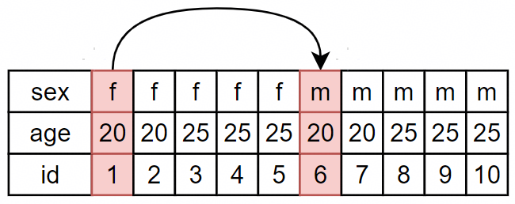<br><div>图8</div></center> 

当执行select sex from t group by sex查询所有存在的年龄时，MySQL只会从索引中拿PK1、PK6三个记录出来，而不是所有的数据。由于取出来的数据天然是分组的，所以自然不需要在Server层再分组了。

除此以外，Loose Index Scan会扫描更少的节点，而不是全量扫描。比如上面的索引扫描过程。

1. 寻找到索引里的第一个sex值，找到f
2. 寻找第一个sex不是f的sex值，找到m
3. 寻找第一个sex不是m的sex值，找不到，退出。

索引扫描过程里最核心的是快速查找下一个different值。如果是挨个节点判断，那就是full index scan了。

InnoDB确定下一个different值的方式和确定扫描区间的方式一致。比如在图9的结构中，我们想查找key1=2，InnoDB使用二分查找找到第一个key1为2的记录。那么自然二分查找可以找到最后一个key1为2的记录。而InnoDB的每个记录都有指向下一个记录的引用，所以最后一个key1为2的记录的下一个记录就是我们要找到的different值。

<center>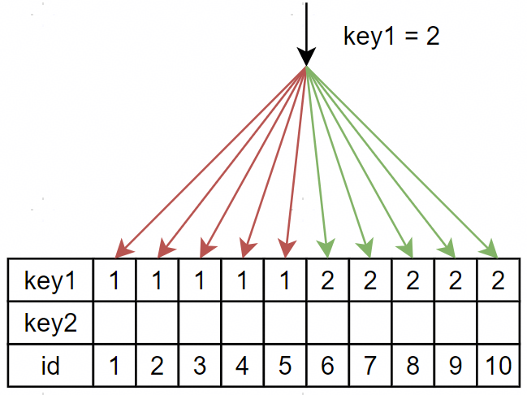<br><div>图9</div></center> 

由于查找过程采用了2分查找，所以不需要full index scan，在sex单值数据量大的情况下，时间复杂度基本由线性提升为常数。

### Tight Index Scan

#### OFFICAL DOC

A Tight Index Scan may be either a full index scan or a range index scan, depending on the query conditions.

When the conditions for a Loose Index Scan are not met, it still may be possible to avoid creation of temporary tables for `GROUP BY` queries. If there are range conditions in the `WHERE` clause, this method reads only the keys that satisfy these conditions. Otherwise, it performs an index scan. Because this method reads all keys in each range defined by the `WHERE` clause, or scans the whole index if there are no range conditions, it is called a Tight Index Scan. With a Tight Index Scan, the grouping operation is performed only after all keys that satisfy the range conditions have been found.

For this method to work, it is sufficient that there be a constant equality condition for all columns in a query referring to parts of the key coming before or in between parts of the `GROUP BY` key. The constants from the equality conditions fill in any “gaps” in the search keys so that it is possible to form complete prefixes of the index. These index prefixes then can be used for index lookups. If the `GROUP BY` result requires sorting, and it is possible to form search keys that are prefixes of the index, MySQL also avoids extra sorting operations because searching with prefixes in an ordered index already retrieves all the keys in order.

Assume that there is an index `idx(c1,c2,c3)` on table `t1(c1,c2,c3,c4)`. The following queries do not work with the Loose Index Scan access method described previously, but still work with the Tight Index Scan access method.

- There is a gap in the `GROUP BY`, but it is covered by the condition `c2 = 'a'`:

  ```sql
  SELECT c1, c2, c3 FROM t1 WHERE c2 = 'a' GROUP BY c1, c3;
  ```

- The `GROUP BY` does not begin with the first part of the key, but there is a condition that provides a constant for that part:

  ```sql
  SELECT c1, c2, c3 FROM t1 WHERE c1 = 'a' GROUP BY c2, c3;
  ```

#### 分析

总结一下Tight Index Scan的限制：

1. 单表查询
2. 有条件列 & 分组列和条件列都必须在索引中 & 条件列仅支持=const & 分组列不满足最左匹配原则 & \<分组列,条件列>满足最左匹配原则 
3. 返回列必须存在于分组列或条件列

Tight Index Scan只需要修改一个条件就可以使用Loose Index Scan：分组列不满足最左匹配原则 -> 分组列满足最左匹配原则。

其实也就是说，当条件列存在时，条件列如果在索引里的位置是左边或中间，不能使用Loose Index Scan，只能使用Tight Index Scan。

当条件列在中间时，此时分组列不再满足a分查找，因为满足条件的索引值不再是有续的。比如下面的SQL，当满足age=20的条件后，name值是：z1、z2、z1、z2，此时已经不再有序了

```mysql
select sex, age, name from t where age = 20 group by sex, name
```

<center>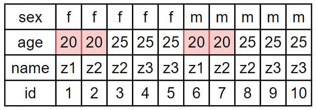<br><div>图10</div></center> 

当条件列在右边时，满足Loose index scan的条件。

```mysql
select sex, age, name from t where name = 'z1' group by sex, age
```

<center>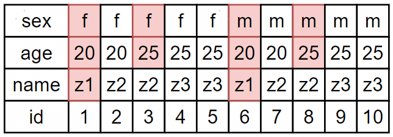<br><div>图11</div></center> 

当条件列在左边时，我的理解是可以使用Loose Index Scan。比如下面的SQL，只需要对sex,age,name分组，并当sex != 'f'时终止寻找下个节点就好了。

```mysql
select sex, age, name from t where sex = 'f' group by age, name
```

<center>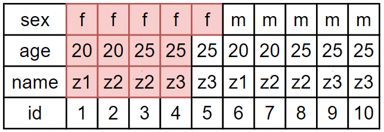<br><div>图12</div></center> 

所以我不弄明白为什么当条件列在左边时MySQL没有使用Loose Index Scan。但是我们可以通过将sex加入group，使这条SQL可以走Loose Index Scan。

```mysql
select sex, age, name from t where sex = 'f' group by sex, age, name
```


## Skip Scan

### OFFICIAL DOC

Consider the following scenario:

```sql
CREATE TABLE t1 (f1 INT NOT NULL, f2 INT NOT NULL, PRIMARY KEY(f1, f2));
INSERT INTO t1 VALUES
  (1,1), (1,2), (1,3), (1,4), (1,5),
  (2,1), (2,2), (2,3), (2,4), (2,5);
INSERT INTO t1 SELECT f1, f2 + 5 FROM t1;
INSERT INTO t1 SELECT f1, f2 + 10 FROM t1;
INSERT INTO t1 SELECT f1, f2 + 20 FROM t1;
INSERT INTO t1 SELECT f1, f2 + 40 FROM t1;
ANALYZE TABLE t1;

EXPLAIN SELECT f1, f2 FROM t1 WHERE f2 > 40;
```

To execute this query, MySQL can choose an index scan to fetch all rows (the index includes all columns to be selected), then apply the `f2 > 40` condition from the `WHERE` clause to produce the final result set.

A range scan is more efficient than a full index scan, but cannot be used in this case because there is no condition on `f1`, the first index column. However, as of MySQL 8.0.13, the optimizer can perform multiple range scans, one for each value of `f1`, using a method called Skip Scan that is similar to Loose Index Scan (see [Section 8.2.1.17, “GROUP BY Optimization”](https://dev.mysql.com/doc/refman/8.0/en/group-by-optimization.html)):

1. Skip between distinct values of the first index part, `f1` (the index prefix).
2. Perform a subrange scan on each distinct prefix value for the `f2 > 40` condition on the remaining index part.

For the data set shown earlier, the algorithm operates like this:

1. Get the first distinct value of the first key part (`f1 = 1`).
2. Construct the range based on the first and second key parts (`f1 = 1 AND f2 > 40`).
3. Perform a range scan.
4. Get the next distinct value of the first key part (`f1 = 2`).
5. Construct the range based on the first and second key parts (`f1 = 2 AND f2 > 40`).
6. Perform a range scan.

Using this strategy decreases the number of accessed rows because MySQL skips the rows that do not qualify for each constructed range. This Skip Scan access method is applicable under the following conditions:

- Table T has at least one compound index with key parts of the form ([A_1, ..., A_k,] ，\[B_1, ..., B_m\], C [, D_1, ..., D_n]). Key parts A and D may be empty, but B and C must be nonempty.
- The query references only one table.
- The query does not use `GROUP BY` or `DISTINCT`.
- The query references only columns in the index.
- The predicates on A_1, ..., A_k must be equality predicates and they must be constants. This includes the [`IN()`](https://dev.mysql.com/doc/refman/8.0/en/comparison-operators.html#operator_in) operator.
- The query must be a conjunctive query; that is, an `AND` of `OR` conditions: (cond1(key_part1) OR cond2(key_part1)) AND (cond1(key_part2) OR ...) AND ...
- There must be a range condition on C.
- Conditions on D columns are permitted. Conditions on D must be in conjunction with the range condition on C.

Use of Skip Scan is indicated in `EXPLAIN` output as follows:

- `Using index for skip scan` in the `Extra` column indicates that the loose index Skip Scan access method is used.
- If the index can be used for Skip Scan, the index should be visible in the `possible_keys` column.

Use of Skip Scan is indicated in optimizer trace output by a `"skip scan"` element of this form:

```json
"skip_scan_range": {
  "type": "skip_scan",
  "index": index_used_for_skip_scan,
  "key_parts_used_for_access": [key_parts_used_for_access],
  "range": [range]
}
```

You may also see a `"best_skip_scan_summary"` element. If Skip Scan is chosen as the best range access variant, a `"chosen_range_access_summary"` is written. If Skip Scan is chosen as the overall best access method, a `"best_access_path"` element is present.

Use of Skip Scan is subject to the value of the [`skip_scan`](https://dev.mysql.com/doc/refman/8.0/en/switchable-optimizations.html#optflag_skip-scan) flag of the [`optimizer_switch`](https://dev.mysql.com/doc/refman/8.0/en/server-system-variables.html#sysvar_optimizer_switch) system variable. See [Section 8.9.2, “Switchable Optimizations”](https://dev.mysql.com/doc/refman/8.0/en/switchable-optimizations.html). By default, this flag is `on`. To disable it, set [`skip_scan`](https://dev.mysql.com/doc/refman/8.0/en/switchable-optimizations.html#optflag_skip-scan) to `off`.

In addition to using the [`optimizer_switch`](https://dev.mysql.com/doc/refman/8.0/en/server-system-variables.html#sysvar_optimizer_switch) system variable to control optimizer use of Skip Scan session-wide, MySQL supports optimizer hints to influence the optimizer on a per-statement basis. See [Section 8.9.3, “Optimizer Hints”](https://dev.mysql.com/doc/refman/8.0/en/optimizer-hints.html).

### 分析

跳跃扫描的思路就是将没有被纳入查询条件的前导列的每个值带入条件中循环执行查询，这样就可以执行查询了。类似于如下的SQL拆分：

```mysql
select gender,employee_id from employee where employee_id = 100;

-->

select gender,employee_id from employee where gender = 'F' and employee_id = 100 
union all  
select gender,employee_id from employee where gender = 'M' and employee_id = 100;
```

如果前导列的值很多，那么就需要拆分出好多条SQL。这样优化器可就不会使用跳跃扫描了。

我在第一个看这个优化时很是费解，因为它这种将前导列的值依次带入sql再做union的设计存在下面几个问题：

- 区分度不高的列放前面？假如前导列的值不多，为什么需要放在索引的首位呢？这种索引是不是创建的不合理。
- 前导列值如果特别少，比如性别，我们完全可以在SQL中用in去处理。这样的话可以利用索引下推，只需要扫描一遍索引。

<center>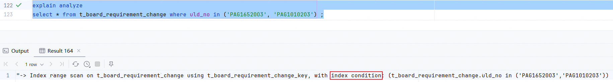<br><div>图13</div></center> 

- 前导列值如果多，但是是固定的，比如生日。可以加一张配置表，将配置表和业务表做join，使其作为驱动表来驱动业务表。

但在看group by优化时，看到了这句话：

> Loose Index Scan can also be used in the absence of `GROUP BY` under some conditions. See [Skip Scan Range Access Method](https://dev.mysql.com/doc/refman/8.0/en/range-optimization.html#range-access-skip-scan).

突然就明白了，Skip Scan是没有group条件的Loose Index Scan。

所以Skip Scan的执行过程和Loose Index Scan是一样的，

1. 找到前导列的第一个值，与原有条件合并，执行查询
2. 寻找前导列的下一个different值，与原有条件合并，执行查询。
3. 直至没有下一个different值

所以Skip Scan的部分限制条件也和Loose Index Scan一致

- The query references only one table.
- The query does not use `GROUP BY` or `DISTINCT`.
- The query references only columns in the index.

Skip Scan的各列之间只支持AND组合。这个很好理解了，只有AND能走索引，OR是无法走索引的。

- The query must be a conjunctive query; that is, an `AND` of `OR` conditions: (cond1(key_part1) OR cond2(key_part1)) AND (cond1(key_part2) OR ...) AND ...
- Conditions on D columns are permitted. Conditions on D must be in conjunction with the range condition on C.

查询的条件需满足如下格式：

- Table T has at least one compound index with key parts of the form ([A_1, ..., A_k,] ，\[B_1, ..., B_m\], C [, D_1, ..., D_n]). Key parts A and D may be empty, but B and C must be nonempty.
- The predicates on A_1, ..., A_k must be equality predicates and they must be constants. This includes the [`IN()`](https://dev.mysql.com/doc/refman/8.0/en/comparison-operators.html#operator_in) operator.
- There must be a range condition on C.

从这个格式中可以看到，AB列是支持有条件的，但是C列必须有条件。我的理解是：

1. AB列都是IN constans，这样可以组合成 {[a1,b1],[a1,b2]...[a1,bn]...[am,bn]} 这样的参数集合。每一个参数都能使用二分查找快速定位。
2. C列是避免走全表扫描。Skip Scan和Loose Index Scan不一样的是，Loose Index Scan每组内只需要保留一个记录就可以，即结果集不重复。而Skip Scan的结果集是重复的。所以如果没有C列的限制走全表扫描性能可能更高一些。

AB列有值走Skip Scan的场景我没测出来。但是没有AB列的场景我测出来了，如图14（索引idx_flight_no的列是airport, flight_no，对airport做了skip）：

<center>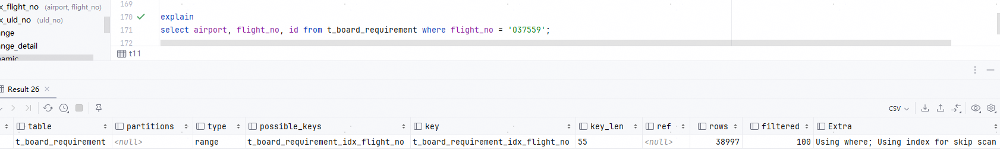<br><div>图14</div></center> 


## 参考

1. [MySQL :: MySQL 8.0 Reference Manual :: 8.2.1.3 Index Merge Optimization](https://dev.mysql.com/doc/refman/8.0/en/index-merge-optimization.html)
1. [MySQL :: MySQL 8.0 Reference Manual :: 8.2.1.17 GROUP BY Optimization](https://dev.mysql.com/doc/refman/8.0/en/group-by-optimization.html)
1. [MySQL :: MySQL 8.0 Reference Manual :: 8.8.2 EXPLAIN Output Format](https://dev.mysql.com/doc/refman/8.0/en/explain-output.html)
1. [数据库内核月报 (taobao.org)](http://mysql.taobao.org/monthly/2019/05/06/)