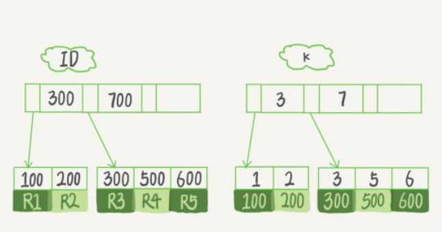
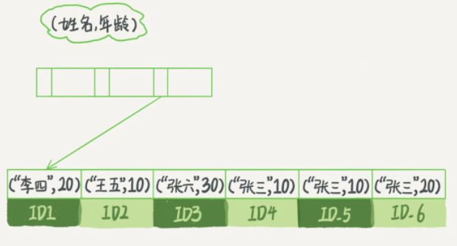
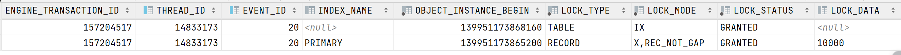
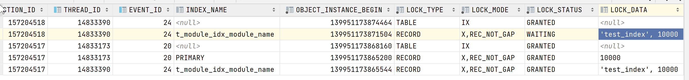
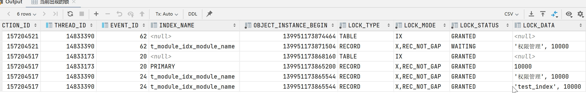

## 排查-修改索引列造成的死锁

进来在生产环境里，MySQL偶尔报死锁异常，所以跟进一下。

通过`show innodb status`看一下最近的一条死锁，具体信息在`死锁日志.txt`文件里。

### 分析

#### 事务1

##### 事务1日志

```
update t_external_met_tel
    set parse_flag = 'N',
        W_TIME     = null
    where can_parse = 'Y'
      and parse_flag = 'W'
      and w_time < '2022-07-25 06:38:00.053'

*** (1) HOLDS THE LOCK(S):
RECORD LOCKS space id 2 page no 16422 n bits 512 index T_EXTERNAL_MET_TEL_INDEX_PARSE of table `metdatasync`.`t_external_met_tel` trx id 11202022 lock_mode X locks rec but not gap
Record lock, heap no 438 PHYSICAL RECORD: n_fields 7; compact format; info bits 0
 0: len 1; hex 59; asc Y;;
 1: len 1; hex 57; asc W;;
 2: len 5; hex 99ad726ac0; asc   rj ;;
 3: len 2; hex 4643; asc FC;;
 4: len 5; hex 99ad716a89; asc   qj ;;
 5: len 4; hex 5a50444c; asc ZPDL;;
 6: len 8; hex 80000000001bc010; asc         ;;


*** (1) WAITING FOR THIS LOCK TO BE GRANTED:
RECORD LOCKS space id 2 page no 10476 n bits 104 index PRIMARY of table `metdatasync`.`t_external_met_tel` trx id 11202022 lock_mode X locks rec but not gap waiting
Record lock, heap no 37 PHYSICAL RECORD: n_fields 18; compact format; info bits 0
 0: len 8; hex 80000000001bc010; asc         ;;
 1: len 6; hex 000000aaede5; asc       ;;
 2: len 7; hex 01000001262fa5; asc     &/ ;;
 3: len 2; hex 4643; asc FC;;
 4: len 4; hex 5a50444c; asc ZPDL;;
 5: len 5; hex 99ad716a89; asc   qj ;;
 6: len 5; hex 99ad716a00; asc   qj ;;
 7: len 3; hex 434143; asc CAC;;
 8: len 26; hex 4643323032323037323432323432303839363630303031303031; asc FC202207242242089660001001;;
 9: len 1; hex 59; asc Y;;
 10: len 5; hex 99ad716aa1; asc   qj ;;
 11: len 1; hex 59; asc Y;;
 12: SQL NULL;
 13: len 30; hex 666331653861653464333861326462613937326630326264306562653330; asc fc1e8ae4d38a2dba972f02bd0ebe30; (total 32 bytes);
 14: len 8; hex 8000000000000001; asc         ;;
 15: len 30; hex 544146205a50444c203234323234305a20323530302f3235303920313430; asc TAF ZPDL 242240Z 2500/2509 140; (total 154 bytes);
 16: SQL NULL;
 17: len 4; hex 4f424343; asc OBCC;;
```

##### 事务1分析

这个事务执行的sql存在能走二级索引：

```mysql
update t_external_met_tel set parse_flag = 'N', W_TIME = null 
	where can_parse = 'Y' and parse_flag = 'W' and w_time < '2022-07-25 06:38:00.053'
```

```mysql
create index T_EXTERNAL_MET_TEL_INDEX_PARSE
    on t_external_met_tel (CAN_PARSE, PARSE_FLAG, W_TIME, TYPE, RECEIVE_TIME, AIRPORT_4CODE);
```

所以在日志中显示，这条sql先拿到了二级索引T_EXTERNAL_MET_TEL_INDEX_PARSE的`X locks rec but not gap Record lock`。然后它想去拿主键索引的锁，发现主键索引上的锁已经被别的事务拿到了，所以当前事务陷入等待。

二级索引锁信息的最后一行便是主键的值（参考二级索引的模型）。

```
6: len 8; hex 80000000001bc010; asc         ;;
```

主键索引第一行是主键的值（参考主键索引模型）

```
0: len 8; hex 80000000001bc010; asc         ;;
```

主键索引：

<div align="center"></div>

二级索引：

<div align="center"></div>

#### 事务2

##### 事务2日志

```
update t_external_met_tel set parse_flag = 'Y',
     
      w_time = null
     
     
    where sqc in
     (  
      1818640
     )

*** (2) HOLDS THE LOCK(S):
RECORD LOCKS space id 2 page no 10476 n bits 104 index PRIMARY of table `metdatasync`.`t_external_met_tel` trx id 11202021 lock_mode X locks rec but not gap
Record lock, heap no 37 PHYSICAL RECORD: n_fields 18; compact format; info bits 0
 0: len 8; hex 80000000001bc010; asc         ;;
 1: len 6; hex 000000aaede5; asc       ;;
 2: len 7; hex 01000001262fa5; asc     &/ ;;
 3: len 2; hex 4643; asc FC;;
 4: len 4; hex 5a50444c; asc ZPDL;;
 5: len 5; hex 99ad716a89; asc   qj ;;
 6: len 5; hex 99ad716a00; asc   qj ;;
 7: len 3; hex 434143; asc CAC;;
 8: len 26; hex 4643323032323037323432323432303839363630303031303031; asc FC202207242242089660001001;;
 9: len 1; hex 59; asc Y;;
 10: len 5; hex 99ad716aa1; asc   qj ;;
 11: len 1; hex 59; asc Y;;
 12: SQL NULL;
 13: len 30; hex 666331653861653464333861326462613937326630326264306562653330; asc fc1e8ae4d38a2dba972f02bd0ebe30; (total 32 bytes);
 14: len 8; hex 8000000000000001; asc         ;;
 15: len 30; hex 544146205a50444c203234323234305a20323530302f3235303920313430; asc TAF ZPDL 242240Z 2500/2509 140; (total 154 bytes);
 16: SQL NULL;
 17: len 4; hex 4f424343; asc OBCC;;


*** (2) WAITING FOR THIS LOCK TO BE GRANTED:
RECORD LOCKS space id 2 page no 16422 n bits 512 index T_EXTERNAL_MET_TEL_INDEX_PARSE of table `metdatasync`.`t_external_met_tel` trx id 11202021 lock_mode X locks rec but not gap waiting
Record lock, heap no 438 PHYSICAL RECORD: n_fields 7; compact format; info bits 0
 0: len 1; hex 59; asc Y;;
 1: len 1; hex 57; asc W;;
 2: len 5; hex 99ad726ac0; asc   rj ;;
 3: len 2; hex 4643; asc FC;;
 4: len 5; hex 99ad716a89; asc   qj ;;
 5: len 4; hex 5a50444c; asc ZPDL;;
 6: len 8; hex 80000000001bc010; asc         ;;
```

##### 事务2分析

这条SQL是走主键索引更新数据的。可以看到它已经拿到了主键索引上的锁，想去拿二级索引上的锁。

主键索引第一行是主键的值（参考主键索引模型）

```
 0: len 8; hex 80000000001bc010; asc         ;;
```

二级索引锁信息的最后一行便是主键的值（参考二级索引的模型）。
```
 6: len 8; hex 80000000001bc010; asc         ;;
```

所以可以得到，这两个事务死锁了。

这里需要注意一点，就是为什么事务二回去拿二级索引的锁。因为这条sql更新的字段在二级索引中：

```mysql
update t_external_met_tel set parse_flag = 'Y', w_time = null where sqc in (1818640)
```

```mysql
create index T_EXTERNAL_MET_TEL_INDEX_PARSE
    on t_external_met_tel (CAN_PARSE, PARSE_FLAG, W_TIME, TYPE, RECEIVE_TIME, AIRPORT_4CODE);
```

**我的理解是由于二级索引的值被修改了，所以会进行B+树的调整，在修改前需要拿到这个节点的锁防止别的事务再修改这个节点。**

### 解决方案

#### 业务逻辑

表里有一些待解析的原始数据，

- 定时任务1（xxl-job分片调度）不断的查询解析，然后标记此数据已被解析：

```mysql
update t_external_met_tel set parse_flag = 'Y', w_time = null where sqc in (1818640)
```

- 每条数据的解析正常情况下是200ms，查询出来的数据被标记为W来告知其他节点不要解析这条数据，但是由于解析过程可能会中断，定时任务2会将超过5分钟还没有解析完成的数据重新标记为未解析状态。

```mysql
update t_external_met_tel set parse_flag = 'N', W_TIME = null 
	where can_parse = 'Y' and parse_flag = 'W' and w_time < '2022-07-25 06:38:00.053'
```

#### 改造定时任务2的实现

由于parse_flag是索引的字段，而且改造索引很麻烦（涉及到多个sql），所以定时任务1的加锁（先加二级锁，再加主键锁）保持不变。定时任务2改造为两条sql：

```mysql
select sqc
from t_external_met_tel
where can_parse = 'Y' and parse_flag = 'W' and w_time < '2022-07-25 06:38:00.053'
```

```mysql
update t_external_met_tel
set parse_flag = 'N', W_TIME = null
where sqc in XXX
```

这样定时任务2在update的时候就不会再拿二级索引的锁了。

**需要注意，在多个事务同时in list的时候，需要对in集合中的sqc进行同向排序来解决循环加锁以至于死锁的问题。**


### 分析修改索引列的加锁情况

我们建一张表，表里sqc是主键，同时对module_name做了索引。如下：

```sql
create table t_module
(
    sqc              bigint       not null
        primary key,
    module_code      varchar(50)  not null,
    module_name      varchar(50)  not null,
    access_type      varchar(1)   not null,
    show_type        varchar(2)   null,
    response_to_type varchar(1)   not null,
    parent_sqc       bigint       not null,
    action           varchar(100) not null,
    status           varchar(1)   not null
)
    charset = utf8mb4;

create index t_module_idx_module_name
    on t_module (module_name desc);
```

表里有一条数据

```
10000,quanxianguanli,权限管理,R,N,C,0,/quanxianguanli,A
```

我们先在RC模式下写一个更新语句，不提交。

```sql
update t_module set module_name = 'test_index' where sqc = 10000;
```

此时，查询锁的情况：

```sql
-- 当前出现的锁
select ENGINE,
       ENGINE_LOCK_ID,
       ENGINE_TRANSACTION_ID,
       THREAD_ID,
       EVENT_ID,
       INDEX_NAME,
       OBJECT_INSTANCE_BEGIN,
       LOCK_TYPE,
       LOCK_MODE,
       LOCK_STATUS,
       LOCK_DATA
from performance_schema.data_locks;
```

结果如下：



可以看到，此时加了两把锁：一把是意向锁，与我们分析的问题无关；一把是行锁，锁住的数据是10000。但没有看到对module_name加的锁，难道之前的猜测不对？接着看下去。

我又开了一个事务，进行for update查询：

```sql
select * from t_module where module_name = 'test_index' for update;
```

再查询锁的情况：



这一次我们就看见了，在事务517里，其获得了`'test_index',10000`这一把锁。而for update对应的518事务在等待这把锁。这说明当索引列被修改时确实会加锁，只是mysql做了延迟处理，在真正遇到锁冲突的时候才会加锁，而不是在第一次修改的时候就对索引列加锁（从上面517事务的`'test_index',10000`锁是被THREAD_ID获取的也可以证实这一点）。

module_name字段从`权限管理`修改到`test_index`时，除了`test_index`这个节点会被加锁，`权限管理`这个节点也会被加锁。

执行下面的for update语句（刚才的for update因为获取不到锁，已经回滚了）：

```sql
select * from t_module where module_name = '权限管理' for update;
```



可以看到，此时517事务，获得了三把行锁。第一把锁是主键索引的10000，第二把锁是之前执行for update语句时获得的t_module_idx_module_name的`'test_index',10000`，第三把锁是本次执行for update语句时获得的t_module_idx_module_name的`'权限管理',10000`。

从以上的分析可以看出，当修改索引列时，修改前的值和修改后的值都会被加锁。


## 参考

1. [MySQL加锁分析 | Yilun Fan's Blog (fanyilun.me)](http://www.fanyilun.me/2017/04/20/MySQL加锁分析/#5-对索引键值有修改)


