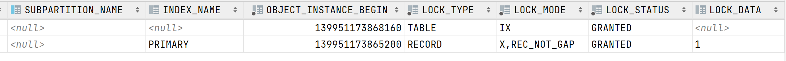
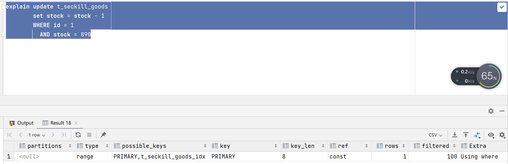

## 排查-选错索引

### 问题

写了一段乐观锁扣库存的代码。

```java
@Override
@Transactional(rollbackFor = Exception.class)
public ServiceResult<Boolean> seckillWithOptimisticLock(Long id) {
    assertSeckillActive(id);
    String userId = UserHolder.getUserId();

    return doSeckillWithOptimisticLock(id, userId);
}

private ServiceResult<Boolean> doSeckillWithOptimisticLock(Long id, String userId) {
    for (int i = 0; i < 3; i++) {
        Long stock = seckillGoodsManager.queryStock(id);
        if (stock <= 0) {
            return ServiceResult.success(false);
        }
        
        // update t_seckill_goods
        // set stock = stock - 1
        // WHERE id = #{id,jdbcType=BIGINT}
        // 	AND stock = #{stock,jdbcType=BIGINT}
        if (!seckillGoodsManager.seckillWithOptimisticLock(id, stock)) {
            continue;
        }
        seckillOrderManager.insert(new SeckillOrder(userId, id));
        log.info("{} 第 {} 次尝试成功！", userId, i + 1);
        return ServiceResult.success(true);
    }

    return ServiceResult.success(false);
}
```

表结构如下：

```sql
create table t_seckill_goods
(
    id             bigint auto_increment
        primary key,
    goods_id       bigint         not null,
    price          decimal(10, 2) not null,
    stock          int            not null,
    start_datetime datetime       not null,
    end_datetime   datetime       not null,
    del_fg         tinyint        not null
);

create index t_seckill_goods_idx
    on t_seckill_goods (id, stock);
```

运行的时候发现，几乎所有的线程都打印 `第 2 次尝试成功！`。

### 分析

继续分析数据发现所有的线程都能下单，这种行为和悲观锁一样了。而这段代码中能够阻塞线程的只有乐观锁扣库存的代码（第一条SQL是快照读，最后一条SQL是RC级别下的插入），也就是如下SQL：

```sql
update t_seckill_goods set stock = stock - 1
WHERE id = #{id,jdbcType=BIGINT} AND stock = #{stock,jdbcType=BIGINT}
```

对这个SQL进行了一下测试：

**事务1：**

```sql
-- 此时id为1的商品，确实库存为1000
update t_seckill_goods set stock = stock - 1
WHERE id = 1 AND stock = 1000
```

**事务2：**

```sql
update t_seckill_goods set stock = stock - 1
WHERE id = 1 AND stock = 890
```

按照我的理解，这两个事务是不会阻塞的，但是验证结果确实是事务2被阻塞了。

查看事务1的锁信息，发现其拿到的是行锁。：



查看Innodb引擎的状态，发现其正在等待的就是ID为1的锁：

```
------- TRX HAS BEEN WAITING 28 SEC FOR THIS LOCK TO BE GRANTED:
RECORD LOCKS space id 142 page no 4 n bits 72 index PRIMARY of table `seckill-demo`.`t_seckill_goods` trx id 82394 lock_mode X locks rec but not gap waiting
Record lock, heap no 2 PHYSICAL RECORD: n_fields 9; compact format; info bits 0
 0: len 8; hex 8000000000000001; asc         ;;
 1: len 6; hex 0000000141d9; asc     A ;;
 2: len 7; hex 010000011f2df8; asc      - ;;
 3: len 8; hex 8000000000000001; asc         ;;
 4: len 5; hex 800003e763; asc     c;;
 5: len 4; hex 800003e7; asc     ;;
 6: len 5; hex 99ae96e000; asc      ;;
 7: len 5; hex 99aea4e000; asc      ;;
 8: len 1; hex 80; asc  ;;
```

索引命中有一个原则是：**查找过程中访问到的对象才会加锁。**所以现在的问题就出现在了事务2上。

表上一共有两个索引：主键索引和二级索引。

```sql
create index t_seckill_goods_idx
    on t_seckill_goods (id, stock);
```

按照我最开始的理解，MySQL会选择二级索引去加锁，因为此时能过滤更多的数据。

```sql
update t_seckill_goods set stock = stock - 1
WHERE id = 1 AND stock = 890
```

但是实际情况是MySQL拿了主键索引去过滤数据。



到这里，就明白为什么事务2会被阻塞了，因为他走的是主键索引，所以要去拿id = 1的主键索引，此时是能命中数据的，所以就陷入了锁等待。

### 现象分析

分析一下为什么几乎所有的线程都打印 `第 2 次尝试成功！`，而且所有的线程都能下单。

```java
private ServiceResult<Boolean> doSeckillWithOptimisticLock(Long id, String userId) {
    for (int i = 0; i < 3; i++) {
        Long stock = seckillGoodsManager.queryStock(id);
        if (stock <= 0) {
            return ServiceResult.success(false);
        }
        
        // update t_seckill_goods
        // set stock = stock - 1
        // WHERE id = #{id,jdbcType=BIGINT}
        // 	AND stock = #{stock,jdbcType=BIGINT}
        if (!seckillGoodsManager.seckillWithOptimisticLock(id, stock)) {
            continue;
        }
        seckillOrderManager.insert(new SeckillOrder(userId, id));
        log.info("{} 第 {} 次尝试成功！", userId, i + 1);
        return ServiceResult.success(true);
    }

    return ServiceResult.success(false);
}
```

- 当第一个线程来到`seckillGoodsManager.seckillWithOptimisticLock`时会将数据锁住，然后进行库存扣减，成功，后面的很多个线程只能等待。
- 当第一个线程进行完之后，会有一个等待着的线程争抢到锁，然后进行库存扣减，失败，然后当前线程重新获取stock，再进行库存扣减，成功。
- 当第二个线程执行完成之后，又会有一个等待着的线程争抢到锁，重复着第二个线程做的事情。。。

### 解决方案

#### force index

第一个解决方案就是force index，执行sql走哪条索引。

```mysql
update t_seckill_goods force index (t_seckill_goods_idx)
set stock = stock - 1
WHERE id = #{id,jdbcType=BIGINT} AND stock = #{stock,jdbcType=BIGINT}
```

但是这个索引本身是有问题的，stock是一个经常更改的字段，每次变化之后都需要更新索引，而且维护索引的开销很大。

#### 循环开启事务

如果在线程扣减库存失败之后就结束事务，再重新开启一个事务去扣减库存，就可以避免在一个线程内一直把数据锁着的问题。所以完全可以将二级索引删除，用循环开启事务的方式实现乐观锁。


