## 楔子

分组取TopN是业务开发中常用到的SQL，但是写好这个SQL对于OLTP系统的开发来说是不容易的（我个人最近也是被APM抓出来了慢SQL）。下面以我负责的模块的一张表分析一下常见的写法。

业务逻辑是：有一些货物需要从A点送到B点。管理员创建运输任务后，系统调用运筹算法服务推荐一个司机。有张表存储运货任务与分配的司机的数据。在资源不足的时候，运筹算法无法匹配司机，系统会定时重试直至分配到司机。算法将任务分配到司机后，司机觉得不合适可以取消任务，即分配的记录和分配成功的记录都会有多次。 产品希望能将分配失败的原因（remark字段，还有很多业务字段就不列了）记录下来。当查询任务第N次分配成功/失败的数据时，就是分组取TopN的问题了。

每个任务每一次调用算法都生成一个唯一的递增的version，不同任务之间的version可能相同，相同任务之内的version不会相同。分组取topN就是按任务分组后取每个任务里version最大的N个数据。t_algorithm_result表一共有24万条数据。

```mysql
create table t_algorithm_result
(
    id                bigint auto_increment comment '主键id'
        primary key,
    task_id           varchar(100)  null comment '任务id',
    driver_id         varchar(100)  null comment '司机编号',
    remark			  varchar(100)  null comment '分配失败的原因',
    version           bigint        null comment '用于区分同一次请求的数据',
    `status`          varchar(1)    null comment 'S：成功，F：失败',
)
    comment '任务调度算法分配结果暂存';

create index t_ar_idx_cd
    on t_algorithm_result (create_date);

create index t_ar_idx_task
    on t_algorithm_result (task_id, version);
```

任务ID（task_id）的来源是另外一张表，这里我们建一张t_test_data表来模拟。t_test_data里一共有433个任务。

```mysql
create table t_test_data
(
    id      bigint auto_increment
        primary key,
    task_id varchar(100) null
);

create index t_test_data_idx_task_id
    on t_test_data (task_id);
```


## 分组取最大

### 窗口函数row_number

```mysql
select tt.task_id, tt.driver_id, tt.version from (
select t1.id, t1.task_id, t1.driver_id, t1.version, row_number() over (partition by t1.task_id order by version desc) as num
from t_test_data join t_algorithm_result t1
    on t_test_data.task_id = t1.task_id) tt where num = 1 order by tt.id desc;
```

这条SQL的思路是：

1. 用t_test_data和t_algorithm_result以task_id字段做join。（走索引t_ar_idx_task）
1. 使用row_number函数对join后的数据按task_id分组并按version降序排序，并对组内的每行设置行号
1. 过滤出来行号为1的数据

执行耗时是300ms左右。

我们explain一下，看一下执行计划（由上至下设为序号1、2、3）。

<div align="center">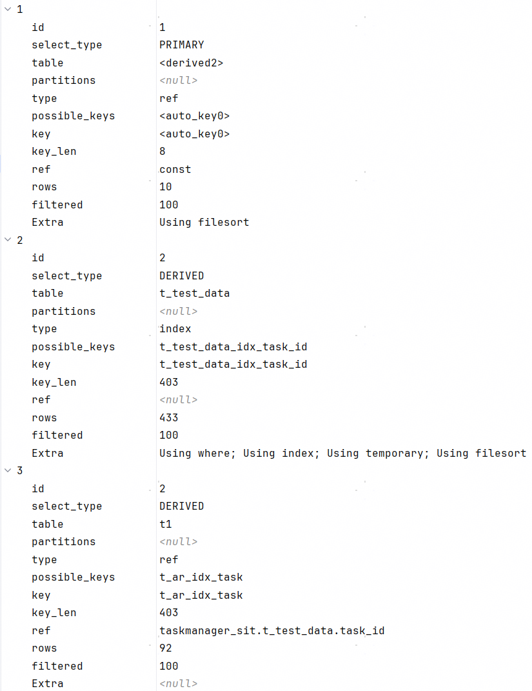</div>

分析一下explain的结果：

1. 最先执行的是序号2，此表作为驱动表。MySQL在取task_id的时候，没有走全表扫描，而是走的t_test_data_idx_task_id这个索引，同时，所有的数据都能从此索引拿到，不需要回表，所以Extra里出现了Using Index。（在这里使用t_test_data_idx_task_id还是全表扫描对性能没有影响，但是如果表的字段很多，走索引可以减小读盘的数据进而提升性能）
2. 序号3是序号2的被驱动表，用t_ar_idx_task与t_test_data的task_id做关联。
3. id为2的查询处理完结果后派生了一张表derived2，序号1对此derived2做了查询和排序。

explain展示的执行计划不是很明确：

1. 序号2的Using where、Using temporary、Using filesort不知从何而来。
2. 三个执行计划的filtered都是100，说明按type从存储层过滤出来的数据全部都被server层examine通过了。序号2读索引，序号3是按索引字段循环取数，filtered是100可以理解。但是序号1是为什么呢？
3. 序号2的rows是433，序号3做了join之后的rows怎么又变成了92呢？序号1的rows怎么又变成了10呢？

使用explain analyze看一下详细的执行计划。

<div align="center">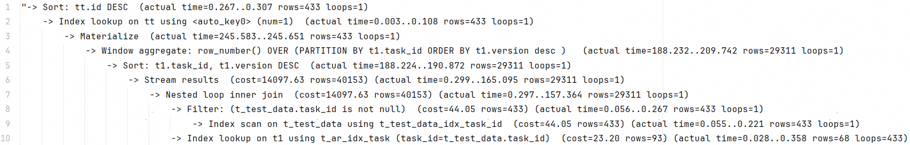</div>

1. 第9行：扫描t_test_data的索引t_test_data_idx_task_id，task_id字段为驱动表的驱动数据
2. 第8行：只有非空的task_id字段才能用来做驱动数据，所以过滤了空数据
3. 第10行：用驱动数据去被驱动表t_algorithm_result里按索引t_ar_idx_task的task_id字段扫描数据
4. 第7行：说明t_test_data和t_algorithm_result做join采用的是NLJ算法。
5. 第6行：应该是聚合数据吧，我猜的。。。
6. 第5行：对t_algorithm_result表按task_id升序和version降序来排序
7. 第4行：执行窗口函数，对每行数据赋值一个num
8. 第3行：物化视图，就是将数据存在临时表里
9. 第2行：用auto_key0索引来访问临时表
10. 第1行：对临时表按id降序排序

从explain analyze的结果可以回答explain的前两个问题

1. 序号2的Using where反映的是第8行，序号2的Using temporary反映的是第3行，序号2的Using filesort反映的是第5行。
2. 窗口函数聚合出来的数据存了临时表，且使用num（\<auto_key0>num=1）做了索引。

explain analyze的结果依然无法解释explain的问题3，因为explain analyze出来的数据是真实数据，而explain的结果是预估结果，这两个结果值无法精确的对应上。所以如果想知道rows怎么产生的，需要看explain format=json的结果。

```json
{
    "query_block":{
        "select_id":1,
        "cost_info":{
            "query_cost":"3.50"
        },
        "ordering_operation":{
            "using_filesort":true,
            "table":{
                "table_name":"tt",
                "access_type":"ref",
                "possible_keys":[
                    "<auto_key0>"
                ],
                "key":"<auto_key0>",
                "used_key_parts":[
                    "num"
                ],
                "key_length":"8",
                "ref":[
                    "const"
                ],
                "rows_examined_per_scan":10,
                "rows_produced_per_join":10,
                "filtered":"100.00",
                "cost_info":{
                    "read_cost":"2.50",
                    "eval_cost":"1.00",
                    "prefix_cost":"3.50",
                    "data_read_per_join":"8K"
                },
                "used_columns":[
                    "id",
                    "task_id",
                    "driver_id",
                    "version",
                    "num"
                ],
                "materialized_from_subquery":{
                    "using_temporary_table":true,
                    "dependent":false,
                    "cacheable":true,
                    "query_block":{
                        "select_id":2,
                        "cost_info":{
                            "query_cost":"54251.60"
                        },
                        "windowing":{
                            "windows":[
                                {
                                    "name":"<unnamed window>",
                                    "using_filesort":true,
                                    "filesort_key":[
                                        "`task_id`",
                                        "`version` desc"
                                    ],
                                    "functions":[
                                        "row_number"
                                    ]
                                }
                            ],
                            "cost_info":{
                                "sort_cost":"40153.74"
                            },
                            "buffer_result":{
                                "using_temporary_table":true,
                                "nested_loop":[
                                    {
                                        "table":{
                                            "table_name":"t_test_data",
                                            "access_type":"index",
                                            "possible_keys":[
                                                "t_test_data_idx_task_id"
                                            ],
                                            "key":"t_test_data_idx_task_id",
                                            "used_key_parts":[
                                                "task_id"
                                            ],
                                            "key_length":"403",
                                            "rows_examined_per_scan":433,
                                            "rows_produced_per_join":433,
                                            "filtered":"100.00",
                                            "using_index":true,
                                            "cost_info":{
                                                "read_cost":"0.75",
                                                "eval_cost":"43.30",
                                                "prefix_cost":"44.05",
                                                "data_read_per_join":"175K"
                                            },
                                            "used_columns":[
                                                "id",
                                                "task_id"
                                            ],
                                            "attached_condition":"(`taskmanager_sit`.`t_test_data`.`task_id` is not null)"
                                        }
                                    },
                                    {
                                        "table":{
                                            "table_name":"t1",
                                            "access_type":"ref",
                                            "possible_keys":[
                                                "t_ar_idx_task"
                                            ],
                                            "key":"t_ar_idx_task",
                                            "used_key_parts":[
                                                "task_id"
                                            ],
                                            "key_length":"403",
                                            "ref":[
                                                "taskmanager_sit.t_test_data.task_id"
                                            ],
                                            "rows_examined_per_scan":92,
                                            "rows_produced_per_join":40153,
                                            "filtered":"100.00",
                                            "cost_info":{
                                                "read_cost":"10038.44",
                                                "eval_cost":"4015.37",
                                                "prefix_cost":"14097.86",
                                                "data_read_per_join":"218M"
                                            },
                                            "used_columns":[
                                                "id",
                                                "task_id",
                                                "driver_id",
                                                "version"
                                            ]
                                        }
                                    }
                                ]
                            }
                        }
                    }
                }
            }
        }
    }
}
```

explain format=json的结果里，先看第70行的nested_loop里第一张表t_test_data，

1. rows_examined_per_scan：一次扫描索引后mysql server层需要examine的数据条数，433。
2. rows_produced_per_join：所有扫描索引后且mysql server层examine为真的数据条数，433。

所以filtered的值为100。此值与explain里序号2的filtered:100，rows:433正好对应。

再看第99行的nested_loop里第二张表t1（t_algorithm_result），

1. rows_examined_per_scan：一次扫描索引后mysql server层需要examine的数据条数，92。此数值是一个平均值。意味着驱动表每条数据在被驱动表里平均能取出92条数据。此数值与explain里的序号2的filtered:92正好对应。
2. rows_produced_per_join：所有扫描索引后且mysql server层examine为真的数据条数，40153。

由于所有的数据都是通过索引拿到的，所以序号3的filtered为100。

我们再看一下第10行的tt表，explain formar=json预估出来的rows_produced_per_join为10，但是实际上是433。所以预估的数据有时候和真实数据的差距还是挺大的。


### join+聚合函数max

```mysql
select t1.task_id, t1.driver_id, t1.version
from (select max(t2.version) as version, t2.task_id
      from t_algorithm_result t2
               join t_test_data on t_test_data.task_id = t2.task_id
      group by t2.task_id) t3 straight_join t_algorithm_result t1
     on t1.version = t3.version and t1.task_id = t3.task_id
order by t1.id desc;
```

上面的那条SQL由于使用row_number函数对join后的数据按task_id分组并按version降序排序，所以相对于我们的需求是查询最新的记录，做了额外排序的操作，即有不必要的耗时。此条SQL的的思路：

1. 用t_test_data和t_algorithm_result以task_id字段做join（走索引t_ar_idx_task）
2. 对join后的数据按task_id做分组，取最大的version。
3. 以task_id和version与t_algorithm_result做join。（走索引t_ar_idx_task）

执行耗时是150ms左右。比上一条快了一倍。

explain看一下执行计划。

<div align="center">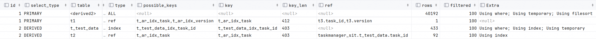</div>

分析一下explain的结果：

1. 最先执行的是序号3，此表作为驱动表。MySQL在取task_id的时候，没有走全表扫描，而是走的t_test_data_idx_task_id这个索引，同时，所有的数据都能从此索引拿到，不需要回表，所以Extra里出现了Using Index。在我们这里使用t_test_data_idx_task_id还是全表扫描对性能没有影响，但是如果表的字段很多，走索引可以减小读盘的数据进而提升性能。预计server层要examine 433行数据。
2. 序号4是序号3的被驱动表，用t_ar_idx_task索引与t_test_data的task_id做关联。使用的索引的字段为task_id，所有的数据都能从索引t_ar_idx_task拿到，不需要回表，所以Extra里出现了Using Index。预计驱动表的每条数据，server层平均要examine 92行数据。
3. id为2的查询处理完结果后派生了一张表derived2。预计server层要examine 40192行数据。但是Extra里的信息不知道是从哪来的。
4. 序号2对序号1的派生表按task_id和version做join。预计驱动表的每条数据，server层平均要examine 1行数据。

explain展示的执行计划不是很明确：

1. 序号3的Using where、Using temporary不知从何而来。
2. 序号1的Using where、Using temporary、Using filesort不知从何而来。

<div align="center">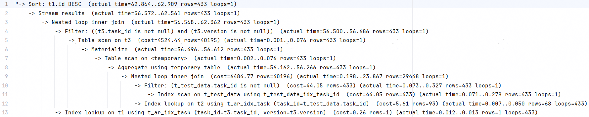</div>

分析一下explain analyze的结果：

1. 序号3的Using where对应着第10行。只有t_test_data.task_id不是null的才能进行连接。
2. 序号3的Using temporary对应着第8行。此行描述的是group by后生成临时表。
3. 序号1的Using where对应着第4行。只有task_id和version不是null的才能进行连接。
4. 序号1的Using temporary和Using filesort对应着第一行。表示对t1和t3连接后的临时表排序。

基于上面对explain analyze的分析，我们可以看见，如果数据量大的话，可以将字段设置为not null，这样能避免在server层做examine，进而提升性能。比如我将t_test_data的task_id设置为not null之后的explain analyze结果：

<div align="center">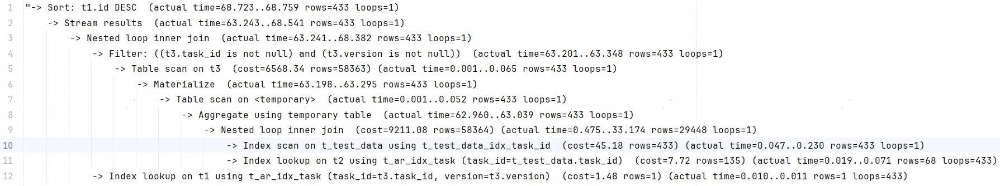</div>

可以看到第9行的Nested loop inner join下面没有Filter了。

这条SQL的分析最后，我们再附上一下explain format=json的结果。

```json
{
  "query_block": {
    "select_id": 1,
    "cost_info": {
      "query_cost": "61739.25"
    },
    "ordering_operation": {
      "using_temporary_table": true,
      "using_filesort": true,
      "cost_info": {
        "sort_cost": "42381.34"
      },
      "nested_loop": [
        {
          "table": {
            "table_name": "t3",
            "access_type": "ALL",
            "rows_examined_per_scan": 40195,
            "rows_produced_per_join": 40195,
            "filtered": "100.00",
            "cost_info": {
              "read_cost": "504.94",
              "eval_cost": "4019.50",
              "prefix_cost": "4524.44",
              "data_read_per_join": "15M"
            },
            "used_columns": [
              "version",
              "task_id"
            ],
            "attached_condition": "((`t3`.`task_id` is not null) and (`t3`.`version` is not null))",
            "materialized_from_subquery": {
              "using_temporary_table": true,
              "dependent": false,
              "cacheable": true,
              "query_block": {
                "select_id": 2,
                "cost_info": {
                  "query_cost": "6484.77"
                },
                "grouping_operation": {
                  "using_temporary_table": true,
                  "using_filesort": false,
                  "nested_loop": [
                    {
                      "table": {
                        "table_name": "t_test_data",
                        "access_type": "index",
                        "possible_keys": [
                          "t_test_data_idx_task_id"
                        ],
                        "key": "t_test_data_idx_task_id",
                        "used_key_parts": [
                          "task_id"
                        ],
                        "key_length": "403",
                        "rows_examined_per_scan": 433,
                        "rows_produced_per_join": 433,
                        "filtered": "100.00",
                        "using_index": true,
                        "cost_info": {
                          "read_cost": "0.75",
                          "eval_cost": "43.30",
                          "prefix_cost": "44.05",
                          "data_read_per_join": "175K"
                        },
                        "used_columns": [
                          "id",
                          "task_id"
                        ],
                        "attached_condition": "(`taskmanager_sit`.`t_test_data`.`task_id` is not null)"
                      }
                    },
                    {
                      "table": {
                        "table_name": "t2",
                        "access_type": "ref",
                        "possible_keys": [
                          "t_ar_idx_task"
                        ],
                        "key": "t_ar_idx_task",
                        "used_key_parts": [
                          "task_id"
                        ],
                        "key_length": "403",
                        "ref": [
                          "taskmanager_sit.t_test_data.task_id"
                        ],
                        "rows_examined_per_scan": 92,
                        "rows_produced_per_join": 40195,
                        "filtered": "100.00",
                        "using_index": true,
                        "cost_info": {
                          "read_cost": "2421.14",
                          "eval_cost": "4019.58",
                          "prefix_cost": "6484.77",
                          "data_read_per_join": "218M"
                        },
                        "used_columns": [
                          "id",
                          "task_id",
                          "version"
                        ]
                      }
                    }
                  ]
                }
              }
            }
          }
        },
        {
          "table": {
            "table_name": "t1",
            "access_type": "ref",
            "possible_keys": [
              "t_ar_idx_task",
              "t_ar_idx_version"
            ],
            "key": "t_ar_idx_task",
            "used_key_parts": [
              "task_id",
              "version"
            ],
            "key_length": "412",
            "ref": [
              "t3.task_id",
              "t3.version"
            ],
            "rows_examined_per_scan": 1,
            "rows_produced_per_join": 42381,
            "filtered": "100.00",
            "cost_info": {
              "read_cost": "10595.34",
              "eval_cost": "4238.13",
              "prefix_cost": "19357.91",
              "data_read_per_join": "230M"
            },
            "used_columns": [
              "id",
              "task_id",
              "driver_id",
              "version"
            ]
          }
        }
      ]
    }
  }
}
```


### 子查询+聚合函数max

```mysql
select t1.task_id, t1.driver_id, t1.version
from t_algorithm_result t1
         join t_test_data on t1.task_id = t_test_data.task_id
where t1.version = (select max(version) from t_algorithm_result t2 where t2.task_id = t1.task_id);
```

这个SQL的性能非常差，因为需要执行几万次内部的查询。最终实测性能在36s左右。

贴上explain看一下执行计划：

<div align="center"></div>

序号3的最先执行，但是它的参数是来源于ID为1的结果。由此可知，所以遇到相关子查询时，explain不能明显看出执行计划了。

再看一下explain analyze的执行计划。

<div align="center">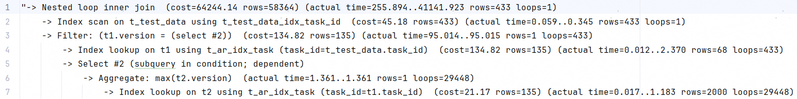</div>

explain analyze依然看不出来完整的执行计划，因为很明显我们这条SQL的执行是内存依赖外层的。但是执行计划里却没有相关体现。

再看一下explain format=json的执行计划。

```json
{
  "query_block": {
    "select_id": 1,
    "cost_info": {
      "query_cost": "64244.14"
    },
    "nested_loop": [
      {
        "table": {
          "table_name": "t_test_data",
          "access_type": "index",
          "possible_keys": [
            "t_test_data_idx_task_id"
          ],
          "key": "t_test_data_idx_task_id",
          "used_key_parts": [
            "task_id"
          ],
          "key_length": "402",
          "rows_examined_per_scan": 433,
          "rows_produced_per_join": 433,
          "filtered": "100.00",
          "using_index": true,
          "cost_info": {
            "read_cost": "1.88",
            "eval_cost": "43.30",
            "prefix_cost": "45.18",
            "data_read_per_join": "175K"
          },
          "used_columns": [
            "task_id"
          ]
        }
      },
      {
        "table": {
          "table_name": "t1",
          "access_type": "ref",
          "possible_keys": [
            "t_ar_idx_task"
          ],
          "key": "t_ar_idx_task",
          "used_key_parts": [
            "task_id"
          ],
          "key_length": "403",
          "ref": [
            "taskmanager_sit.t_test_data.task_id"
          ],
          "rows_examined_per_scan": 134,
          "rows_produced_per_join": 58363,
          "filtered": "100.00",
          "cost_info": {
            "read_cost": "58362.58",
            "eval_cost": "5836.38",
            "prefix_cost": "64244.14",
            "data_read_per_join": "317M"
          },
          "used_columns": [
            "task_id",
            "driver_id",
            "version"
          ],
          "attached_condition": "(`taskmanager_sit`.`t1`.`version` = (/* select#2 */ select max(`taskmanager_sit`.`t2`.`version`) from `taskmanager_sit`.`t_algorithm_result` `t2` where (`taskmanager_sit`.`t2`.`task_id` = `taskmanager_sit`.`t1`.`task_id`)))",
          "attached_subqueries": [
            {
              "dependent": true,
              "cacheable": false,
              "query_block": {
                "select_id": 2,
                "cost_info": {
                  "query_cost": "21.17"
                },
                "table": {
                  "table_name": "t2",
                  "access_type": "ref",
                  "possible_keys": [
                    "t_ar_idx_task"
                  ],
                  "key": "t_ar_idx_task",
                  "used_key_parts": [
                    "task_id"
                  ],
                  "key_length": "403",
                  "ref": [
                    "taskmanager_sit.t1.task_id"
                  ],
                  "rows_examined_per_scan": 134,
                  "rows_produced_per_join": 134,
                  "filtered": "100.00",
                  "using_index": true,
                  "cost_info": {
                    "read_cost": "7.69",
                    "eval_cost": "13.48",
                    "prefix_cost": "21.17",
                    "data_read_per_join": "751K"
                  },
                  "used_columns": [
                    "task_id",
                    "version"
                  ]
                }
              }
            }
          ]
        }
      }
    ]
  }
}
```

explain format=json的执行计划能完整的体现出这条SQL的执行过程。

1. 第10行的t_test_data是最先被执行的表，也是第一个被驱动表。
2. 第37行的t1表是被t_test_data驱动的表。用t_ar_idx_task的task_id进行关联。
3. 第64行的attached_condition，是相关子查询的核心。存在attached_condition表明server层参与计算了。server层计算的内容是一次查询，这也是为什么说相关子查询需要多次查询数据库的原因。
4. 第75行可以看到对t2表做了查询，走的是索引t_ar_idx_task的task_id字段。

从上面的分析可以看得，此条SQL全程走了ref类型的索引，但是由于使用了相关子查询，性能依然非常差。


### 反连接

```mysql
select t1.task_id, t1.driver_id, t1.version
from t_algorithm_result t1
         join t_test_data on t_test_data.task_id = t1.task_id
         left join t_algorithm_result t2 on t1.task_id = t2.task_id and t1.version < t2.version
where t2.id is null;
```

这个SQL的执行计划比较简单：

<div align="center">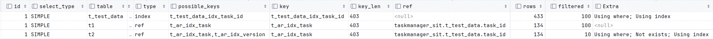</div>

这个SQL的性能非常差，我们看一下这个SQL的explain analyze执行计划（analyze1），实测执行了21s：

<div align="center"></div>

可以看到，在第7行里，一共对t_ar_idx_task做了29448次查询，平均每次读取1001行数据。也就是相比于之前的窗口耗时方案，多读取了29448次数据库。

为什么SQL里用的是左连接，我把标题写成反连接（antijoin）呢？

看下面这条SQL，其和上面SQL的区别就是没有where t2.id is null这个条件。

```mysql
select t1.task_id, t1.driver_id, t1.version
from t_algorithm_result t1
         join t_test_data on t_test_data.task_id = t1.task_id
         left join t_algorithm_result t2 on t1.task_id = t2.task_id and t1.version < t2.version
```

但是这条SQL的实际执行时间是41秒，比上面的21s还多了20s（analyze2）：

<div align="center">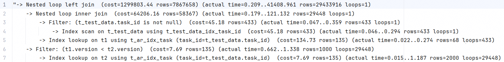</div>

这个乍一看很令人费解，明明少了一个步骤（这里需要解释一下，t2表是左连接的被驱动表，所以不是先应用where t2.id is null再left join，而是先left join再过滤数据），为什么还多耗时了？

其实是反连接造成的：带where t2.id is null条件的join类型是antijoin，不带条件的join类型是left join。

什么是反连接呢？ only those tuples in *R* for which there is *no* tuple in *S* that is equal on their common attribute names。

反连接最常见的就是not exists，比如下面的图可以转换为SQL：

<div align="center">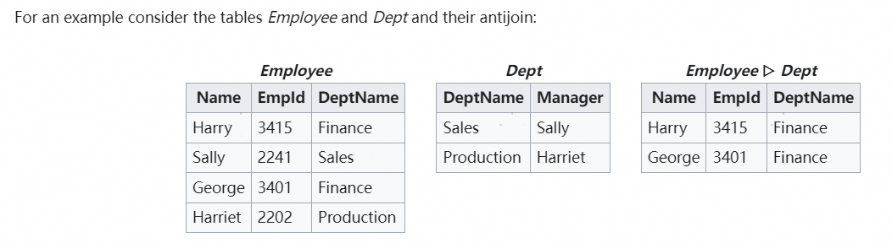</div>

```mysql
select employee.* from employee where not exists (select 1 from dept where employee.name = dept.manager)
```

翻译一下就是：查询员工姓名在employee表的name字段但不在dept表的manager字段的员工。

将查询t_test_data和t1按task_id字段join后的临时数据命名为ttt，则带where t2.id is null条件的SQL的语义是：查询任务ID在ttt表的task_id中但不存在此任务ID在表t2中且ttt.version<t2.version的记录。即如下SQL：

```mysql
select t1.task_id, t1.driver_id, t1.version
from t_algorithm_result t1
         join t_test_data on t_test_data.task_id = t1.task_id
where not exists(select 1 from t_algorithm_result t2 where t1.task_id = t2.task_id and t1.version < t2.version);
```

将SQL由外连接改成反连接后，由于只要t2中存在一条满足条件的数据，ttt的此行数据就不会被返回了，即可以减少对t2表的遍历进而提升性能。

analyze1第8行的平均rows是1001，analyze2第7行的平均rows是2000。恰好反映了analyze2的耗时是analyze1的两倍。

带where t2.id is null条件之后，MySQL自动将left join转为了反连接来提升性能。这一点除了在explain analyze中可以看到反连接，在explain中也能看得见。explain序号3的Extra里有not exists，这个就表示MySQL将外连接优化成了反连接。

再贴一下explain format=json的结果。

```json
{
  "query_block": {
    "select_id": 1,
    "cost_info": {
      "query_cost": "1299714.26"
    },
    "nested_loop": [
      {
        "table": {
          "table_name": "t_test_data",
          "access_type": "index",
          "possible_keys": [
            "t_test_data_idx_task_id"
          ],
          "key": "t_test_data_idx_task_id",
          "used_key_parts": [
            "task_id"
          ],
          "key_length": "402",
          "rows_examined_per_scan": 433,
          "rows_produced_per_join": 433,
          "filtered": "100.00",
          "using_index": true,
          "cost_info": {
            "read_cost": "1.88",
            "eval_cost": "43.30",
            "prefix_cost": "45.18",
            "data_read_per_join": "175K"
          },
          "used_columns": [
            "task_id"
          ]
        }
      },
      {
        "table": {
          "table_name": "t1",
          "access_type": "ref",
          "possible_keys": [
            "t_ar_idx_task"
          ],
          "key": "t_ar_idx_task",
          "used_key_parts": [
            "task_id"
          ],
          "key_length": "403",
          "ref": [
            "taskmanager_sit.t_test_data.task_id"
          ],
          "rows_examined_per_scan": 134,
          "rows_produced_per_join": 58363,
          "filtered": "100.00",
          "cost_info": {
            "read_cost": "58362.58",
            "eval_cost": "5836.38",
            "prefix_cost": "64244.14",
            "data_read_per_join": "317M"
          },
          "used_columns": [
            "task_id",
            "driver_id",
            "version"
          ]
        }
      },
      {
        "table": {
          "table_name": "t2",
          "access_type": "ref",
          "possible_keys": [
            "t_ar_idx_task",
            "t_ar_idx_version"
          ],
          "key": "t_ar_idx_task",
          "used_key_parts": [
            "task_id"
          ],
          "key_length": "403",
          "ref": [
            "taskmanager_sit.t_test_data.task_id"
          ],
          "rows_examined_per_scan": 134,
          "rows_produced_per_join": 786682,
          "filtered": "10.00",
          "not_exists": true,
          "using_index": true,
          "cost_info": {
            "read_cost": "448787.14",
            "eval_cost": "78668.30",
            "prefix_cost": "1299714.27",
            "data_read_per_join": "4G"
          },
          "used_columns": [
            "id",
            "task_id",
            "version"
          ],
          "attached_condition": "(<if>(found_match(t2), (`taskmanager_sit`.`t2`.`id` is null), true) and <if>(is_not_null_compl(t2), (`taskmanager_sit`.`t1`.`version` < `taskmanager_sit`.`t2`.`version`), true))"
        }
      }
    ]
  }
}
```

98行的attached_condition我没找到解释，自己猜测一下：寻找t2.id is null的数据 and 寻找t1.version < t2.version。

```
<if>(found_match(t2), (`taskmanager_sit`.`t2`.`id` is null), true) : 
and 
<if>(is_not_null_compl(t2), (`taskmanager_sit`.`t1`.`version` < `taskmanager_sit`.`t2`.`version`), true)) 
```


### group by+having count+join

```mysql
select t1.task_id, t1.driver_id, t1.version
from t_algorithm_result t1
         join t_test_data on t_test_data.task_id = t1.task_id
         join t_algorithm_result t2 on t1.task_id = t2.task_id and t1.version <= t2.version
group by t1.task_id, t1.version
having count(t1.task_id) = 1;
```

这个SQL和左连接的写法类似。explain analyze结果如下：

<div align="center">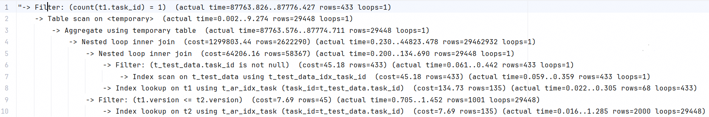</div>

这个SQL执行需要80s，属于上了生产就爆炸的存在。


### join+count+子查询

```mysql
select t1.task_id, t1.driver_id, t1.version
from t_algorithm_result t1
         join t_test_data on t_test_data.task_id = t1.task_id
         where (select count(*)
               from t_algorithm_result t2
                   where t1.task_id = t2.task_id and t1.version < t2.version) = 0 order by t1.id desc;
```

这个SQL和左连接的写法和not exists语义一样类似。但是where条件里使用了全表计数。所以也是上了生产就爆炸的存在。实测是40s。

<div align="center">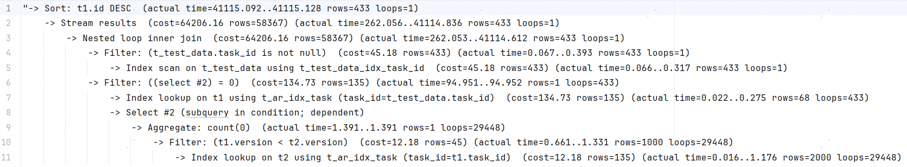</div>

一旦出现相关子查询，explain和explain analyze的执行计划就比较乱，所以这条SQL我贴一下format=json的结果。

```json
{
  "query_block": {
    "select_id": 1,
    "cost_info": {
      "query_cost": "122573.07"
    },
    "ordering_operation": {
      "using_temporary_table": true,
      "using_filesort": true,
      "cost_info": {
        "sort_cost": "58366.91"
      },
      "nested_loop": [
        {
          "table": {
            "table_name": "t_test_data",
            "access_type": "index",
            "possible_keys": [
              "t_test_data_idx_task_id"
            ],
            "key": "t_test_data_idx_task_id",
            "used_key_parts": [
              "task_id"
            ],
            "key_length": "403",
            "rows_examined_per_scan": 433,
            "rows_produced_per_join": 433,
            "filtered": "100.00",
            "using_index": true,
            "cost_info": {
              "read_cost": "1.88",
              "eval_cost": "43.30",
              "prefix_cost": "45.18",
              "data_read_per_join": "175K"
            },
            "used_columns": [
              "id",
              "task_id"
            ],
            "attached_condition": "(`taskmanager_sit`.`t_test_data`.`task_id` is not null)"
          }
        },
        {
          "table": {
            "table_name": "t1",
            "access_type": "ref",
            "possible_keys": [
              "t_ar_idx_task"
            ],
            "key": "t_ar_idx_task",
            "used_key_parts": [
              "task_id"
            ],
            "key_length": "403",
            "ref": [
              "taskmanager_sit.t_test_data.task_id"
            ],
            "rows_examined_per_scan": 134,
            "rows_produced_per_join": 58366,
            "filtered": "100.00",
            "cost_info": {
              "read_cost": "58324.29",
              "eval_cost": "5836.69",
              "prefix_cost": "64206.16",
              "data_read_per_join": "317M"
            },
            "used_columns": [
              "id",
              "task_id",
              "driver_id",
              "version"
            ],
            "attached_condition": "((/* select#2 */ select count(0) from `taskmanager_sit`.`t_algorithm_result` `t2` where ((`taskmanager_sit`.`t1`.`task_id` = `taskmanager_sit`.`t2`.`task_id`) and (`taskmanager_sit`.`t1`.`version` < `taskmanager_sit`.`t2`.`version`))) = 0)",
            "attached_subqueries": [
              {
                "dependent": true,
                "cacheable": false,
                "query_block": {
                  "select_id": 2,
                  "cost_info": {
                    "query_cost": "21.17"
                  },
                  "table": {
                    "table_name": "t2",
                    "access_type": "ref",
                    "possible_keys": [
                      "t_ar_idx_task",
                      "t_ar_idx_version"
                    ],
                    "key": "t_ar_idx_task",
                    "used_key_parts": [
                      "task_id"
                    ],
                    "key_length": "403",
                    "ref": [
                      "taskmanager_sit.t1.task_id"
                    ],
                    "rows_examined_per_scan": 134,
                    "rows_produced_per_join": 44,
                    "filtered": "33.33",
                    "using_index": true,
                    "cost_info": {
                      "read_cost": "7.69",
                      "eval_cost": "4.49",
                      "prefix_cost": "21.17",
                      "data_read_per_join": "250K"
                    },
                    "used_columns": [
                      "task_id",
                      "version"
                    ],
                    "attached_condition": "(`taskmanager_sit`.`t1`.`version` < `taskmanager_sit`.`t2`.`version`)"
                  }
                }
              }
            ]
          }
        }
      ]
    }
  }
}
```


## 分组取TopN

上面的分组取最大有的可以拓展为分区取TopN，有的不行，表格如下：

|                            | 分组取最大 | 分组取TopN |
| -------------------------- | ---------- | ---------- |
| 窗口函数row_number         | 300ms      | √          |
| join+聚合函数max           | 150ms      | ×          |
| 子查询+聚合函数max         | 36s        | ×          |
| 左连接（反连接）           | 21s        | ×          |
| group by+having count+join | 80s        | √          |
| join+count+子查询          | 40s        | √          |

从表格中可以看出，如果分组取TopN的方案应该使用窗口函数row_number。


## 参考

1. [新特性解读 | MySQL 8.0：explain analyze 分析 SQL 执行过程-腾讯云开发者社区-腾讯云 (tencent.com)](https://cloud.tencent.com/developer/article/1940970)
1. [MySQL :: MySQL EXPLAIN ANALYZE](https://dev.mysql.com/blog-archive/mysql-explain-analyze/)
1. [MySQL 8.0中的 explain analyze（译） - MSSQL123 - 博客园 (cnblogs.com)](https://www.cnblogs.com/wy123/p/12984774.html)
1. [连接查询你一定不陌生，但你知道还有半连接和反连接吗？_执行计划中的反半连接是指什么-CSDN博客](https://blog.csdn.net/horses/article/details/108152329)
1. [MySQL 8.0反连接(antijoin)_51CTO博客_mysql8.0连接](https://blog.51cto.com/u_15080026/2642652)
1. [关于MySQL explain 中的ID(推荐) | 学习笔记 (haohtml.com)](https://blog.haohtml.com/archives/4141/)
1. [MySQL :: MySQL 8.0 Reference Manual :: 8.2.1.17 GROUP BY Optimization](https://dev.mysql.com/doc/refman/8.0/en/group-by-optimization.html)
1. [MySQL :: MySQL 8.0 Reference Manual :: 8.8.2 EXPLAIN Output Format](https://dev.mysql.com/doc/refman/8.0/en/explain-output.html)
1. [Relational algebra - Wikipedia](https://en.wikipedia.org/wiki/Relational_algebra#Antijoin_.28.E2.96.B7.29)