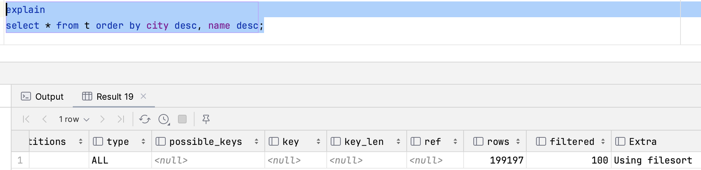

## 文件排序

```mysql
CREATE TABLE `t`
(
    `id`   int(11)     NOT NULL auto_increment,
    `city` varchar(16) NOT NULL,
    `name` varchar(16) NOT NULL,
    `age`  int(11)     NOT NULL,
    `addr` varchar(128) DEFAULT NULL,
    PRIMARY KEY (`id`),
    KEY `city` (`city`)
) ENGINE = InnoDB;
drop procedure idata;
create procedure idata()
begin
    declare i int;
    set i = 1;
    while(i <= 100000)
        do
            insert into t(city, name, age, addr) values ('杭州', concat('杭州', cast(i as char)), 10, '中国浙江杭州');
            set i = i + 1;
        end while;
    set i = 1;
    while(i <= 100000)
        do
            insert into t(city, name, age, addr) values ('深圳', concat('深圳', cast(i as char)), 20, '中国广东深圳');
            set i = i + 1;
        end while;
end;;
delimiter ;
call idata();
```

### 全字段排序

查询城市是“杭州”的所有人名字，并且按照姓名排序返回前 1000 个人的姓名、年龄。

```mysql
select city, name, age from t where city='杭州' order by name limit 1000;
```

explain可知：city字段走了索引，name字段做了文件排序。

<center><br><div>图0</div></center>

这个语句执行流程如下所示：

1. 初始化 sort_buffer，确定放入 name、city、age 这三个字段；
2. 从索引 city 找到第一个满足 city='杭州’条件的主键 id；
3. 到主键 id 索引取出整行，取 name、city、age 三个字段的值，存入 sort_buffer 中；
4. 从索引 city 取下一个记录的主键 id；
5. 重复步骤 3、4 直到 city 的值不满足查询条件为止；
6. 对 sort_buffer 中的数据按照字段 name 做排序；
7. 按照排序结果取前 1000 行返回给客户端。

这个排序过程，称为全字段排序，执行流程如图1所示：

<center><br><div>图1：全字段排序</div></center>

图中“按 name 排序”这个动作，可能在内存中完成，也可能需要使用外部排序，这取决于排序所需的内存和参数 sort_buffer_size。此参数指的是 MySQL 为排序开辟的内存（sort_buffer）的大小。我测试所用的 sort_buffer 的大小是 262144B = 256KB

```
show variables like 'sort_buffer_size';
+------------------+--------+
| Variable_name    | Value  |
+------------------+--------+
| sort_buffer_size | 262144 |
+------------------+--------+
```

如果要排序的数据量小于 sort_buffer_size，排序就在内存中完成。但如果排序数据量太大，内存放不下，则不得不利用磁盘临时文件辅助排序。通过 optimizer_trace 可以看是否使用了外部排序。

为了更好的看到外部排序，我将 sort_buffer_size 改成32KB。

```
set sort_buffer_size = 32768;
```

执行如下命令，查看 optimizer_trace。

```mysql
/* 打开optimizer_trace，只对本线程有效 */
SET optimizer_trace='enabled=on'; 

/* 执行语句 */
select city, name, age from t where city='杭州' order by name limit 1000; 

/* 查看 OPTIMIZER_TRACE 输出 */
SELECT * FROM `information_schema`.`OPTIMIZER_TRACE`\G;
```

我把 optimizer_trace 里和排序有关的部分抽取出来了。

```json
{
  "join_execution": {
    "select#": 1,
    "steps": [
      {
        "sorting_table": "t",
        "filesort_information": [
          {
            "direction": "asc",
            "expression": "`t`.`name`"
          }
        ],
        "filesort_priority_queue_optimization": {
          "limit": 8000
        },
        "filesort_execution": [
        ],
        "filesort_summary": {
          "memory_available": 32768,
          "key_size": 264,
          "row_size": 406,
          "max_rows_per_buffer": 80,
          "num_rows_estimate": 18446744073709551615,
          "num_rows_found": 100000,
          "num_initial_chunks_spilled_to_disk": 177,
          "peak_memory_used": 40328,
          "sort_algorithm": "std::sort",
          "sort_mode": "<varlen_sort_key, packed_additional_fields>"
        }
      }
    ]
  }
}
```

num_initial_chunks_spilled_to_disk 反应的是本次一共使用了177个外部文件。除此之外：

1. memory_available：sort_buffer_size 的大小
2. num_rows_found：一共排序了100000行数据
3. peak_memory_used：使用的内存峰值，MySQL会尽量保证此值靠齐sort_buffer_size。
4. sort_mode有三个值：
   1. `<sort_key, additional_fields>`: This indicates that sort buffer tuples contain the sort key value and columns referenced by the query. Tuples are sorted by sort key value and column values are read directly from the tuple.（全字段排序）
   2. `<sort_key, packed_additional_fields>`: Like the previous variant, but the additional columns are packed tightly together instead of using a fixed-length encoding.（全字段排序）
   3. `<sort_key, rowid>`: This indicates that sort buffer tuples are pairs that contain the sort key value and row ID of the original table row. Tuples are sorted by sort key value and the row ID is used to read the row from the table.（rowid排序）

### rowid排序

在上面这个算法过程里面，只对原表的数据读了一遍，剩下的操作都是在 sort_buffer 和临时文件中执行的。但这个算法有一个问题，就是如果查询要返回的字段很多的话，那么 sort_buffer 里面要放的字段数太多，这样内存里能够同时放下的行数很少，要分成很多个临时文件，排序的性能会很差。所以如果单行很大，这个方法效率不够好。

新的算法放入 sort_buffer 的字段，只有要排序的列（即 name 字段）和主键 id。但这时，排序的结果就因为少了 city 和 age 字段的值，不能直接返回了，整个执行流程就变成如下所示的样子：

1. 初始化 sort_buffer，确定放入两个字段，即 name 和 id；
2. 从索引 city 找到第一个满足 city='杭州’条件的主键 id；
3. 到主键 id 索引取出整行，取 name、id 这两个字段，存入 sort_buffer 中；
4. 从索引 city 取下一个记录的主键 id；
5. 重复步骤 3、4 直到不满足 city='杭州’条件为止；
6. 对 sort_buffer 中的数据按照字段 name 进行排序；
7. 遍历排序结果，取前 1000 行，并按照 id 的值回到原表中取出 city、name 和 age 三个字段返回给客户端。

这个执行流程如图2，我把它称为 rowid 排序。

<center><br><div>图2：rowid排序</div></center>

对比图 2 的全字段排序流程图你会发现，rowid 排序多访问了一次表 t 的主键索引，就是步骤 7。需要说明的是，最后的“结果集”是一个逻辑概念，实际上 MySQL 服务端从排序后的 sort_buffer 中依次取出 id，然后到原表查到 city、name 和 age 这三个字段的结果，不需要在服务端再耗费内存存储结果，是直接返回给客户端的。

如果 MySQL 实在是担心排序内存太小，会影响排序效率，才会采用 rowid 排序算法，这样排序过程中一次可以排序更多行，但是需要再回到原表去取数据。如果 MySQL 认为内存足够大，会优先选择全字段排序，把需要的字段都放到 sort_buffer 中，这样排序后就会直接从内存里面返回查询结果了，不用再回到原表去取数据。这也就体现了 MySQL 的一个设计思想：如果内存够，就要多利用内存，尽量减少磁盘访问。对于 InnoDB 表来说，rowid 排序会要求回表多造成磁盘读，因此不会被优先选择。

在8.0.20之前，可以通过配置 max_length_for_sort_data 让 MySQL 选择rowid算法。但是8.0.20之后，max_length_for_sort_data 参数被废弃了。在8.0.20之后，可以在应用层改写SQL来实现rowid算法的效果。

```sql
select city, name, age from t t1 
	join (select id from t t2 where t2.city = '杭州' order by t2.name limit 1000) t3
		on t1.id = t3.id
```

### 优先队列排序

```mysql
select city, name, age from t where city='杭州' order by name limit 8;
```

当把查询条件的 limit 修改为8时，optimizer_trace 的输出里 filesort_priority_queue_optimization 字段下的 chosen 字段被标记为true。此时表示使用了堆排序算法。

```json
{
  "join_execution": {
    "select#": 1,
    "steps": [
      {
        "sorting_table": "t",
        "filesort_information": [
          {
            "direction": "asc",
            "expression": "`t`.`name`"
          }
        ],
        "filesort_priority_queue_optimization": {
          "limit": 8,
          "chosen": true
        },
        "filesort_execution": [
        ],
        "filesort_summary": {
          "memory_available": 32768,
          "key_size": 264,
          "row_size": 402,
          "max_rows_per_buffer": 9,
          "num_rows_estimate": 18446744073709551615,
          "num_rows_found": 100000,
          "num_initial_chunks_spilled_to_disk": 0,
          "peak_memory_used": 3690,
          "sort_algorithm": "std::sort",
          "unpacked_addon_fields": "using_priority_queue",
          "sort_mode": "<varlen_sort_key, additional_fields>"
        }
      }
    ]
  }
}
```

堆排序算法是不稳定的。我们以一个案例看一下。

我又向表t中插入了一条name为深圳99999的数据，此时有两条name为深圳99999的数据。

<center><div>图3：name为深圳99999的数据</div></center>

但是下面两条sql查出来的是相同的数据：

<center><br><div>图4：优先队列排序不稳定的现象</div></center>

为了解决这个问题也很简单，在排序时加上id字段即可。

```mysql
select * from t order by name desc, id desc limit 1 offset 0;
select * from t order by name desc, id desc limit 1 offset 1;
```


## 索引排序

### OFFICAL DOC

In some cases, MySQL may use an index to satisfy an `ORDER BY` clause and avoid the extra sorting involved in performing a `filesort` operation.

The index may also be used even if the `ORDER BY` does not match the index exactly, as long as all unused portions of the index and all extra `ORDER BY` columns are constants in the `WHERE` clause. If the index does not contain all columns accessed by the query, the index is used only if index access is cheaper than other access methods.

Assuming that there is an index on (`key_part1`, `key_part2`), the following queries may use the index to resolve the `ORDER BY` part. Whether the optimizer actually does so depends on whether reading the index is more efficient than a table scan if columns not in the index must also be read.

下面的官方文档里描述了很多场景。我们先建一个索引用于后续的测试。

````sql
create index city_name
    on t (city, name);
````

注意一下：explain里的执行计划，如果走的是文件排序，Extra会显示using filesort；如果走的是索引排序，Extra不会显示排序方法。

#### 能用上索引 

In this query, the index on (`key_part1`, `key_part2`) enables the optimizer to avoid sorting:

```sql
SELECT * FROM t1
  ORDER BY key_part1, key_part2;
```

However, the query uses `SELECT *`, which may select more columns than *`key_part1`* and *`key_part2`*. In that case, scanning an entire index and looking up table rows to find columns not in the index may be more expensive than scanning the table and sorting the results. If so, the optimizer probably does not use the index. If `SELECT *` selects only the index columns, the index is used and sorting avoided.

由于存在select *，所以MySQL不一定会使用索引来访问顺序，因为索引索引之后还会回表，有时候会比全表扫描的成本高。所以如果想一定使用索引，需要设置查询列为索引列（主键亦可）。

If `t1` is an `InnoDB` table, the table primary key is implicitly part of the index, and the index can be used to resolve the `ORDER BY` for this query:

```sql
SELECT pk, key_part1, key_part2 FROM t1
  ORDER BY key_part1, key_part2;
```

索引顺序和排序顺序一致，走索引&无需回表：

<center><br><div>图5</div></center>

索引顺序和排序顺序一致，需回表，不走索引：

<center><br><div>图6</div></center>

索引顺序和排序顺序相反，不需回表，走索引（后续再解释什么是Backward index scan）：

<center><br><div>图7</div></center>

In this query, *`key_part1`* is constant, so all rows accessed through the index are in *`key_part2`* order, and an index on (`key_part1`, `key_part2`) avoids sorting if the `WHERE` clause is selective enough to make an index range scan cheaper than a table scan:

```sql
SELECT * FROM t1
  WHERE key_part1 = constant
  ORDER BY key_part2;
```

<center><br><div>图8</div></center>

In the next two queries, whether the index is used is similar to the same queries without `DESC` shown previously:

```sql
SELECT * FROM t1
  ORDER BY key_part1 DESC, key_part2 DESC;

SELECT * FROM t1
  WHERE key_part1 = constant
  ORDER BY key_part2 DESC;
```

<center><br><div>图9</div></center>

Two columns in an `ORDER BY` can sort in the same direction (both `ASC`, or both `DESC`) or in opposite directions (one `ASC`, one `DESC`). A condition for index use is that the index must have the same homogeneity（同质性）, but need not have the same actual direction.

If a query mixes `ASC` and `DESC`, the optimizer can use an index on the columns if the index also uses corresponding mixed ascending and descending columns:

SQL里的排序条件的需要和索引里的排序条件完全相同或完全相反。

```sql
SELECT * FROM t1
  ORDER BY key_part1 DESC, key_part2 ASC;
```

The optimizer can use an index on (*`key_part1`*, *`key_part2`*) if *`key_part1`* is descending and *`key_part2`* is ascending. It can also use an index on those columns (with a backward scan) if *`key_part1`* is ascending and *`key_part2`* is descending. See [Section 8.3.13, “Descending Indexes”](https://dev.mysql.com/doc/refman/8.0/en/descending-indexes.html).

In the next two queries, *`key_part1`* is compared to a constant. The index is used if the `WHERE` clause is selective enough to make an index range scan cheaper than a table scan:

下面的代码可以走index排序，同时条件列可以应用索引下推。

```sql
SELECT * FROM t1
  WHERE key_part1 > constant
  ORDER BY key_part1 ASC;

SELECT * FROM t1
  WHERE key_part1 < constant
  ORDER BY key_part1 DESC;
```

<center><br><div>图10</div></center>

In the next query, the `ORDER BY` does not name *`key_part1`*, but all rows selected have a constant *`key_part1`* value, so the index can still be used:

```sql
SELECT * FROM t1
  WHERE key_part1 = constant1 AND key_part2 > constant2
  ORDER BY key_part2;
```

<center><br><div>图11</div></center>

#### 用不上索引

In some cases, MySQL *cannot* use indexes to resolve the `ORDER BY`, although it may still use indexes to find the rows that match the `WHERE` clause. Examples:

The query uses `ORDER BY` on different indexes:

```sql
SELECT * FROM t1 ORDER BY key1, key2;
```

The query uses `ORDER BY` on nonconsecutive parts of an index:

```sql
SELECT * FROM t1 WHERE key2=constant ORDER BY key1_part1, key1_part3;
```

The index used to fetch the rows differs from the one used in the `ORDER BY`:

```sql
SELECT * FROM t1 WHERE key2=constant ORDER BY key1;
```

The query uses `ORDER BY` with an expression that includes terms other than the index column name:

```sql
SELECT * FROM t1 ORDER BY ABS(key);
SELECT * FROM t1 ORDER BY -key;
```

The query joins many tables, and the columns in the `ORDER BY` are not all from the first nonconstant table that is used to retrieve rows. (This is the first table in the [`EXPLAIN`](https://dev.mysql.com/doc/refman/8.0/en/explain.html) output that does not have a [`const`](https://dev.mysql.com/doc/refman/8.0/en/explain-output.html#jointype_const) join type.)

The query has different `ORDER BY` and `GROUP BY` expressions.

There is an index on only a prefix of a column named in the `ORDER BY` clause. In this case, the index cannot be used to fully resolve the sort order. For example, if only the first 10 bytes of a [`CHAR(20)`](https://dev.mysql.com/doc/refman/8.0/en/char.html) column are indexed, the index cannot distinguish values past the 10th byte and a `filesort` is needed.

The index does not store rows in order. For example, this is true for a `HASH` index in a `MEMORY` table.

#### 别名

Availability of an index for sorting may be affected by the use of column aliases. Suppose that the column `t1.a` is indexed. In this statement, the name of the column in the select list is `a`. It refers to `t1.a`, as does the reference to `a` in the `ORDER BY`, so the index on `t1.a` can be used:

```sql
SELECT a FROM t1 ORDER BY a;
```

In this statement, the name of the column in the select list is also `a`, but it is the alias name. It refers to `ABS(a)`, as does the reference to `a` in the `ORDER BY`, so the index on `t1.a` cannot be used:

```sql
SELECT ABS(a) AS a FROM t1 ORDER BY a;
```

In the following statement, the `ORDER BY` refers to a name that is not the name of a column in the select list. But there is a column in `t1` named `a`, so the `ORDER BY` refers to `t1.a` and the index on `t1.a` can be used. (The resulting sort order may be completely different from the order for `ABS(a)`, of course.)

```sql
SELECT ABS(a) AS b FROM t1 ORDER BY a;
```

#### 补充

索引字段和排序字段一致可以使用索引。

索引字段比排序字段多时可以使用索引：

<center><br><div>图12</div></center>

索引字段比排序字段少时不能使用索引：

<center><br><div>图13</div></center>

因为建表时主键都是递增的，所以id asc是每个索引默认的一部分，排序条件存在id asc时可以走索引：

<center><br><div>图14</div></center>

<center><br><div>图15</div></center>

<center><br><div>图16</div></center>

<center><br><div>图17</div></center>

### limit

索引排序遇到limit时不会产生不稳定的现象。

```sql
create index name
    on t (name);
```

<center><br><div>图18</div></center>

<center><br><div>图19</div></center>


## descending index

之前在Extra里遇到过Backward index scan。下面便分析一下：

### OFFICAL DOC

MySQL supports descending indexes: `DESC` in an index definition is no longer ignored but causes storage of key values in descending order. Previously, indexes could be scanned in reverse order but at a performance penalty. A descending index can be scanned in forward order, which is more efficient. Descending indexes also make it possible for the optimizer to use multiple-column indexes when the most efficient scan order mixes ascending order for some columns and descending order for others.

Consider the following table definition, which contains two columns and four two-column index definitions for the various combinations of ascending and descending indexes on the columns:

```sql
CREATE TABLE t2 (
  c1 INT, c2 INT,
  INDEX idx1 (c1 ASC, c2 ASC),
  INDEX idx2 (c1 ASC, c2 DESC),
  INDEX idx3 (c1 DESC, c2 ASC),
  INDEX idx4 (c1 DESC, c2 DESC)
);
```

The table definition results in four distinct indexes. The optimizer can perform a forward index scan for each of the `ORDER BY` clauses and need not use a `filesort` operation:

```sql
ORDER BY c1 ASC, c2 ASC    -- optimizer can use idx1
ORDER BY c1 DESC, c2 DESC  -- optimizer can use idx4
ORDER BY c1 ASC, c2 DESC   -- optimizer can use idx2
ORDER BY c1 DESC, c2 ASC   -- optimizer can use idx3
```

Use of descending indexes is subject to these conditions:

- Descending indexes are supported only for the `InnoDB` storage engine, with these limitations:

  - Change buffering is not supported for a secondary index if the index contains a descending index key column or if the primary key includes a descending index column.
  - The `InnoDB` SQL parser does not use descending indexes. For `InnoDB` full-text search, this means that the index required on the `FTS_DOC_ID` column of the indexed table cannot be defined as a descending index. For more information, see [Section 15.6.2.4, “InnoDB Full-Text Indexes”](https://dev.mysql.com/doc/refman/8.0/en/innodb-fulltext-index.html).

- Descending indexes are supported for all data types for which ascending indexes are available.

- Descending indexes are supported for ordinary (nongenerated) and generated columns (both `VIRTUAL` and `STORED`).

- `DISTINCT` can use any index containing matching columns, including descending key parts.

- Indexes that have descending key parts are not used for [`MIN()`](https://dev.mysql.com/doc/refman/8.0/en/aggregate-functions.html#function_min)/[`MAX()`](https://dev.mysql.com/doc/refman/8.0/en/aggregate-functions.html#function_max) optimization of queries that invoke aggregate functions but do not have a `GROUP BY` clause.

- Descending indexes are supported for `BTREE` but not `HASH` indexes. Descending indexes are not supported for `FULLTEXT` or `SPATIAL` indexes.

  Explicitly specified `ASC` and `DESC` designators for `HASH`, `FULLTEXT`, and `SPATIAL` indexes results in an error.

You can see in the **`Extra`** column of the output of [`EXPLAIN`](https://dev.mysql.com/doc/refman/8.0/en/explain.html) that the optimizer is able to use a descending index, as shown here:

```sql
mysql> CREATE TABLE t1 (
    -> a INT, 
    -> b INT, 
    -> INDEX a_desc_b_asc (a DESC, b ASC)
    -> );

mysql> EXPLAIN SELECT * FROM t1 ORDER BY a ASC\G
*************************** 1. row ***************************
           id: 1
  select_type: SIMPLE
        table: t1
   partitions: NULL
         type: index
possible_keys: NULL
          key: a_desc_b_asc
      key_len: 10
          ref: NULL
         rows: 1
     filtered: 100.00
        Extra: Backward index scan; Using index
```

In `EXPLAIN FORMAT=TREE` output, use of a descending index is indicated by the addition of `(reverse)` following the name of the index, like this:

```sql
mysql> EXPLAIN FORMAT=TREE SELECT * FROM t1 ORDER BY a ASC\G 
*************************** 1. row ***************************
EXPLAIN: -> Index scan on t1 using a_desc_b_asc (reverse)  (cost=0.35 rows=1)
```

### 分析

MySQL8在建立索引时，如果索引标注了desc，那么索引在建立的时候就是倒序的，比如官方文档里表t2的idx4的结构当如下：

<center><br><div>图20：descending index</div></center>

我把表t2的idx2和idx3删除后测一下Backward index scan：

```
ORDER BY c1 ASC, c2 ASC
```

- 走索引idx1。

<center><br><div>图21</div></center>

```
ORDER BY c1 DESC, c2 DESC
```

- 走索引idx4。可以看到使用descending index时Extra里没有Backward index scan。

<center><br><div>图22</div></center>

```
force index(idx1) ORDER BY c1 DESC, c2 DESC
```

- 倒序查询强制走索引idx1。可以看到Extra里有Backward index scan。所以Backward index scan指的是索引顺序与排序顺序相反，并不是指descending index。descending index直接从索引的定义里就能看出来。

<center><br><div>图23</div></center>

官方文档里描述到：使用Descending index时，Change buffer不被支持。

Change buffer的作用是将命中的页不在Buffer Pool的CUD操作存起来，等到该页从磁盘读到 buffer pool 中时再批量的apply。这样可以减少随机IO。

<center><br><div>图24</div></center>

但是Change buffer的使用有一个限制：batch apply时不能存在页分裂和页合并。

这是因为Change Buffer的Entry里存储了这个Entry所更新的页的地址。这个就好理解了，如果没有存储页号，从磁盘中读出的时候，也不知道哪些Entry可以被应用。

页分分裂或页合并会导致页号发生改变。假如图24里的 Entry2 使得 P2 发生分裂，那么 Entry3 无法正确的定位至分裂后的 P2，此时Entry3就无法apply了。所以批量应用Entry时不能发生页分裂。页合并也是如此。

MySQL在决定是将操作缓存在Change Buffer中还是直接应用，会根据页的大小以及已经存储的节点数等信息进行计算。如果算出来的是不会产生页合并和页分裂，才会将操作缓存到Chang Buffer。

我们在设计表时主键索引都是需要递增的，这样才能尽可能不发生页分裂。二级索引在系统设计时没有这个限制，但由于二级索引只有表的几个字段，所以每页能存储的节点数量多，所以页分裂的概率也不大。而降序索引由于和递增规则是完全相反的，所以我猜测MySQL可能是认为页分裂的概率大，为降序字段开发Change Buffer功能收益不大。在Mariadb中，11.0版本之后就没有change buffer了，因为Mariadb认为change buffer带来的收益不大，但是大大增加了出bug的概率。

假如MySQL没有将页号写入Entry中，每次从磁盘读新页的时候计算Chang Buffer的Entry对应的页号，批量应用Entry时就可以兼容页分裂和页合并了。这种方案非常损耗性能。我们在做业务系统设计的时候也常遇到这种问题：如果数据在写入时就计算好了，后续的查询会简单，但不灵活；如果数据在查询时再计算，灵活但性能差。这需要我们按业务场景去选择了。而MySQL必须要选择性能，毕竟Change Buffer用不上顶多是没有提升性能，而每次从磁盘读页就去计算一遍所有的Entry，属于纯纯的捡了芝麻丢了西瓜。


## 临时表

当多表做join时，如果排序字段仅涉及到一张表且满足索引排序的规则时，可以使用索引做排序。如图25里的SQL仅对表t的city,name做排序，此时满足索引排序的使用条件，索引Extra里没有出现using filesort。

<center><br><div>图25</div></center>

如果排序字段仅涉及到多张表时，需要使用临时表排序，如图26。

<center><br><div>图26</div></center>

但是如果能命中索引，是可以减少排序字段的，比如图26里的SQL，由于city本身在索引中是有序的，所以做NLJ之后得到的临时表也是按city有序的，这样文件排序就只需排序t.name和t2.c1字段。通过explain analyze命令可以看到，如下：

```
-> Sort: t.`name`, t2.c1  (actual time=227.781..227.781 rows=0 loops=1)
    -> Stream results  (cost=45467.85 rows=99598) (actual time=227.766..227.766 rows=0 loops=1)
        -> Nested loop inner join  (cost=45467.85 rows=99598) (actual time=227.763..227.763 rows=0 loops=1)
            -> Index lookup on t using city (city='杭州')  (cost=10608.55 rows=99598) (actual time=0.167..132.252 rows=100000 loops=1)
            -> Filter: (cast(t.city as double) = cast(t2.c1 as double))  (cost=0.25 rows=1) (actual time=0.001..0.001 rows=0 loops=100000)
                -> Covering index lookup on t2 using idx1 (c1=t.city)  (cost=0.25 rows=1) (actual time=0.001..0.001 rows=0 loops=100000)
```

排序字段涉及到多个表时，能不能利用索引降低排序字段是针对一张表进行的，比如图27里的SQL，虽然t2.c1是排序的第一位，但是针对表t来看`where city = '杭州' order by t.city, t.name`依然满足表t应用索引排序的条件，所以排序字段里没有city。

<center><br><div>图27</div></center>


## 应用排序

索引排序使用的条件还是比较苛刻的，尤其是字段涉及到多个表时。有些时候为了增强查询的性能，会专门建一张表用于查询。这个时候就可以将排序所需的字段设为表的字段并建上索引，这样就可以使用索引排序了。如果查询条件仅仅涉及一张表，将排序字段设置为表的字段并建上索引就好了，连表都不需要建的。

有时候排序的顺序和索引的顺序不一致，为了少建索引，可以将排序工作放在应用层进行。

比如索引创建的时候是`a asc, d asc`，用户的需求既有排序`a asc, d asc`也有排序`a asc, d desc`。前者可以使用索引排序。后者先使用索引排序，再在应用层利用栈完成b的倒序。利用栈倒序b的过程如下：

1. 构造一个空栈（stack），栈中的节点可以保存数据行；
2. 读入第一行，入栈；
3. 读入下一行，
   1. 如果新一行中a值与上一行相同，将新一行入栈；
   2. 如果新一行中a值与上一行不同，则将栈中的所有数据行依次出栈并输出，直到栈清空；然后新一行入栈。
   3. 重复步骤3直到遍历完整个索引，将栈中的所有数据行依次出栈并输出，直到栈清空。
4. 输出的顺序就是最终结果的顺序。

<center><br><div>图28</div></center>

上述的排序过程对于排序`a desc, b asc`也同样适用。唯一的区别就是将图28的最终结果reverse一下即可。


## 参考

1. [MySQL :: MySQL 8.0 Reference Manual :: 8.2.1.16 ORDER BY Optimization](https://dev.mysql.com/doc/refman/8.0/en/order-by-optimization.html)
2. [MySQL :: MySQL 8.0 Reference Manual :: 8.3.13 Descending Indexes](https://dev.mysql.com/doc/refman/8.0/en/descending-indexes.html)
3. [大咖丁奇：索引存储顺序和order by不一致，怎么办？-鸿蒙开发者社区-51CTO.COM](https://ost.51cto.com/posts/12612)
4. [InnoDB：Change Buffer - 知乎 (zhihu.com)](https://zhuanlan.zhihu.com/p/583261987)
5. [MySQL的聚簇和非聚簇索引&页分裂&页合并 - 个人文章 - SegmentFault 思否](https://segmentfault.com/a/1190000043870965)
6. [InnoDB Change Buffering - MariaDB Knowledge Base](https://mariadb.com/kb/en/innodb-change-buffering/)


