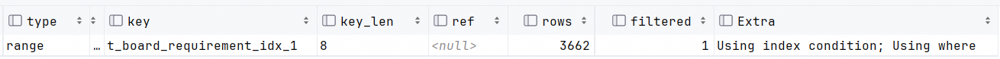

## 业务背景

<div align="center"></div>

航班在两个机场（内部叫航站，后面都叫航站了）之间飞行，在起飞前需要对航班进行保障，落地后也需要对航班进行保障。每一次保障我们叫做一次保障需求（后面简称需求）。每个需求在业务上由`航班ID（flightId）、板箱号（uldNo）、航站（airport）`这个三元组确定。同时每个需求里有两个额外的字段：一个是航班号，一个区分进港还是出港（arrival_departure）的字段。

年数据增长量300万，80个字段。

对于需求表现在有如下的查询：

- 按业务主键查询：

```mysql
select id, arrival_departure, uld_no, airport, flight_id, requirement_status, guarantee_node, create_tm
from t_board_requirement
where airport = {airport} and flight_id = {flightId} and uld_no = {uldNo} and delete_flag = 'N';
```

- 按航班ID集合（和关键字）查询（需求池）：

```mysql
select id, arrival_departure, uld_no, airport, flight_id, requirement_status, guarantee_node, create_tm
from t_board_requirement
where flight_id in {flightIdList} and delete_flag = 'N';
```

```mysql
select id, arrival_departure, uld_no, airport, flight_id, requirement_status, guarantee_node, create_tm
from t_board_requirement
where flight_id in {flightIdList} and (uld_no = {keyWord} or flight_no = {keyWord}) and delete_flag = 'N';
```

- 按航站和航班ID集合（和进出港）查询（航站管理员对当前航站需求的监控）：

```mysql
select id, arrival_departure, uld_no, airport, flight_id, requirement_status, guarantee_node, create_tm
from t_board_requirement
where airport = {airport} and flight_id in {flightIdList} and delete_flag = 'N';
```

```mysql
select id, arrival_departure, uld_no, airport, flight_id, requirement_status, guarantee_node, create_tm
from t_board_requirement
where airport = {airport} and flight_id in {flightIdList} and arrival_departure = {arrivalDeparture} and delete_flag = 'N';
```

- 按航班ID集合和进出港查询（中转进港需求的结束依赖其下程出港需求的开始）：

```mysql
select id, arrival_departure, uld_no, airport, flight_id, requirement_status, guarantee_node, create_tm
from t_board_requirement
where flight_id in {flightIdList} and arrival_departure = {arrivalDeparture} and delete_flag = 'N';
```

- 按板号和进出港查询（查询板在航站间的进出港记录）：

```mysql
select id, arrival_departure, uld_no, airport, flight_id, requirement_status, guarantee_node, create_tm
from t_board_requirement
where uld_no = ? and arrival_departure = ? and delete_flag = 'N' order by id asc;
```

- 按板号和航班ID查询（查询板在一次航班的保障记录）：

```mysql
select id, arrival_departure, uld_no, airport, flight_id, requirement_status, guarantee_node, create_tm
from t_board_requirement
where uld_no = ? and flight_id = ? and delete_flag = 'N' order by id desc limit 1;
```

- 按板号和航站查询（查询板在指定航站的历史记录）：

```mysql
select id, arrival_departure, uld_no, airport, flight_id, requirement_status, guarantee_node, create_tm
from t_board_requirement
where uld_no = ? and airport = ? and delete_flag = 'N' order by id;
```

- 按关键字全局查询（关键字搜索，相比于之前的关键字搜索，增加了flight_id）：

```mysql
select id, arrival_departure, uld_no, airport, flight_id, requirement_status, guarantee_node, create_tm
from t_board_requirement
where (flight_id = ? or uld_no = ? or flight_no = ?) and delete_flag = 'N';
```

```mysql
select id, arrival_departure, uld_no, airport, flight_id, requirement_status, guarantee_node, create_tm
from t_board_requirement
where (flight_id like ? or uld_no like ? or flight_no like ?) and delete_flag = 'N';
```

- 按航站查询所有的航班号（查询航班出现的航站，给下拉框使用）：

```mysql
select flight_no from t_board_requirement where airport = ? group by flight_no;
```

- 按航班查询所有的航站（查询航班经过的航站，给下拉框使用）：

```mysql
select airport from t_board_requirement where flight_no = ? group by airport;
```


## 优化手段

### using index

using index的全称是only using index。中文是覆盖索引。指的是从索引中可以拿得到所有的返回列，不需要再回表。比如下面的一个索引执行SQL：

```mysql
select sex, age, name, id from t where sex = 'f' and age = 20
```

<center><br><div>图1</div></center> 

### using condition pushdown

using condition pushdown是一种减少回表来提升性能的方案。Explain 的 Extra 里展示的是using index conditon。我们知道索引的使用需要满足最左匹配原则，所以对于能最左匹配的条件字段，是可以走索引的，但是对于无法最左匹配的条件字段，如果索引里有这些字段，可以通过索引的值进行判断，这样就可以减少从索引回表的数据。比如下面的SQL，假如没有索引下推，MySQL需要读取5条聚簇索引的记录，有了索引下推MySQL只需要回表1条聚簇索引的记录。

```mysql
select * from t where sex = 'f' and name = 'z1'
```

<center><br><div>图2</div></center> 

如果表的字段很多，降低回表数据量可以提升很大的性能。

### 索引合并&GROUP BY

[java-backend-cases/MySQL/研发-想方设法让查询用上索引 at master · zhanjinhao/java-backend-cases (github.com)](https://github.com/zhanjinhao/java-backend-cases/tree/master/MySQL/研发-想方设法让查询用上索引)


## 分析

### 区分度

上诉涉及到5个字段，但是每个字段的区分度不一样，建立索引的时候区分度最高的应该优先：

- flight_id：一个航班下关联的需求约为100个，每年100个
- airport：一个机场下每天关联的需求有5000个，每年180万
- uld_no：一个板箱号每天约关联的需求有2个，每年700个
- flight_no：一个航班号每天关联的需求约为50个，每年16万
- arrival_departure：这是个布尔值，非1即2

所以我们建立的索引的时候应该优先使用flight_id和uld_no。因为这两个字段的区分度高。按年统计，前者每年累计有100个需求，后者每年累计有700个需求。

### 单表查询优化的技术

1. 联合索引+最左匹配：这个是最核心最基础的建索引策略
2. 索引覆盖：利用索引覆盖避免回表。
3. 索引下推：利用索引下推减少回表数据量
4. 索引合并：利用多索引同时过滤数据。用于or。intersection算法和union算法应用很困难，但是sort-union可以应用。
5. 分组优化：最好应用Loose Index Scan。其次是Tight Index Scan。
6. Skip Scan：没有应用场景

### 优化思路

- 对于and型查询，应该利用联合索引+最左匹配来过滤数据；
- 对于or型查询，应该利用索引合并sort-union算法过滤数据。
- 不能最左匹配的利用索引下推减少回表
- 返回字段不多的，利用覆盖索引避免回表
- delete_flag字段不加入索引列。一方面是此字段的区分度不高，建立索引对性能提升不大但会占用空间。第二方面是此字段会修改，由于修改前和修改后的记录都会加锁，所以容易造成死锁。

### 建索引

将上面查询的条件抽取出来：

1. flight_id & airport & uld_no（频繁）
2. flight_id（频繁）
3. flight_id & (uld_no | flight_no)（频繁）
4. airport & flight_id（频繁）
5. airport & flight_id & arrival_departure（频繁）
6. flight_id & arrival_departure（频繁）
7. uld_no & arrival_departure & id
8. uld_no & flight_id & id
9. uld_no & airport & id
10. flight_id | uld_no | flight_no（频繁）
11. flight_id like | uld_no like | flight_no like（频繁）
12. where airport group by flight_no （频繁）
13. where flight_no group by airport（频繁）

其中第11个是不在MySQL上实现的，因为对MySQL做like无法走索引，会把数据库查死机。

对于剩下的12个查询，由于flight_id存在的比例很高，将flight_id作为首位：

1. flight_id & airport & uld_no（频繁）
2. flight_id（频繁）
3. flight_id & (uld_no | flight_no)（频繁）
4. flight_id & airport（频繁）
5. flight_id & airport & arrival_departure（频繁）
6. flight_id & arrival_departure（频繁）
7. uld_no & arrival_departure & id
8. flight_id & uld_no & id
9. uld_no & airport & id
10. flight_id | uld_no | flight_no（频繁）
11. where airport group by flight_no （频繁）
12. where flight_no group by airport（频繁）

将flight_id放在首位之后，查询【1、2、3、4、5、6、8】性能都很高了，因为一个航班ID最多只有100个需求，这是个区分度很高的字段。

但是我们还是要对后面的列建立索引，因为这个表有80个字段，是个大宽表。尽可能的利用最左匹配和索引下推减少回表。所以建立的第一个索引为：

```mysql
create index t_board_requirement_idx_1
    on t_board_requirement (flight_id, airport, uld_no, arrival_departure);
```

uld_no的区分度也很高，且7、9使用了这个字段。我们依然联合上arrival_departure和airport列，以实现索引下推：

```mysql
create index t_board_requirement_idx_2
    on t_board_requirement (uld_no, airport, arrival_departure);
```

对11、12建立的第三个索引，使其能使用上Loose/Tight Index Scan算法。

```mysql
create index t_board_requirement_idx_3
    on t_board_requirement (flight_no, airport);
```

第10个查询走三个索引的sort-union合并。


## 测试

测试表数据量40万。是从生产同步下来的数据。

### 测试数据

#### 按业务主键

```mysql
-- 12ms
select id, arrival_departure, uld_no, airport, flight_id, requirement_status, guarantee_node, create_tm
from t_board_requirement
where airport = 'EHU' and flight_id = 102275151 and uld_no = 'PAG10309O3' and delete_flag = 'N';
```

<div align="center"></div>


```json
{
  "query_block": {
    "select_id": 1,
    "cost_info": {
      "query_cost": "1.10"
    },
    "table": {
      "table_name": "t_board_requirement",
      "access_type": "ref",
      "possible_keys": [
        "t_board_requirement_idx_1",
        "t_board_requirement_idx_2"
      ],
      "key": "t_board_requirement_idx_1",
      "used_key_parts": [
        "flight_id",
        "airport",
        "uld_no"
      ],
      "key_length": "102",
      "ref": [
        "const",
        "const",
        "const"
      ],
      "rows_examined_per_scan": 1,
      "rows_produced_per_join": 0,
      "filtered": "10.00",
      "cost_info": {
        "read_cost": "1.00",
        "eval_cost": "0.01",
        "prefix_cost": "1.10",
        "data_read_per_join": "479"
      },
      "used_columns": [
        "id",
        "arrival_departure",
        "uld_no",
        "requirement_status",
        "guarantee_node",
        "airport",
        "flight_id",
        "create_tm",
        "delete_flag"
      ],
      "attached_condition": "(`task`.`t_board_requirement`.`delete_flag` = 'N')"
    }
  }
}
```

走索引idx_1。完全覆盖条件列airport、flight_id、uld_no。

#### 按航班ID集合（和关键字）

```mysql
-- 15ms
select id, arrival_departure, uld_no, airport, flight_id, requirement_status, guarantee_node, create_tm
from t_board_requirement
where flight_id in (102275151, 102275152, 102275154, 102275174, 102275185, 102275195, 102275197, 102275199, 102275201, 102275203,
       102275204, 102275207, 102275209, 102275217, 102275220, 102275223, 102275270, 102275275, 102275276, 102275281,
       102275282, 102275284, 102275287, 102275288, 102275295, 102275296, 102275299, 102275306, 102275309, 102275310,
       102275312, 102275332, 102275343, 102275347, 102275348, 102275350, 102275353, 102275355, 102275357, 102275359,
       102275361, 102275362, 102275365, 102275367, 102275371, 102275373, 102275375, 102275376, 102275378, 102275381,
       102275383, 102275384, 102275426, 102275428, 102275433, 102275434, 102275437, 102275439, 102275440, 102275442,
       102275445, 102275446, 102275448, 102275450, 102275453, 102275454, 102275457, 102275505, 102275506, 102275592,
       102275595, 102275598, 102275606, 102275753, 102294608, 102294620, 102294906, 102294918, 102294924, 102294939,
       102295064) and delete_flag = 'N';
```

<div align="center"></div>

```json
{
  "query_block": {
    "select_id": 1,
    "cost_info": {
      "query_cost": "4474.91"
    },
    "table": {
      "table_name": "t_board_requirement",
      "access_type": "range",
      "possible_keys": [
        "t_board_requirement_idx_1"
      ],
      "key": "t_board_requirement_idx_1",
      "used_key_parts": [
        "flight_id"
      ],
      "key_length": "8",
      "rows_examined_per_scan": 3662,
      "rows_produced_per_join": 366,
      "filtered": "10.00",
      "index_condition": "(`task`.`t_board_requirement`.`flight_id` in (102275151,102275152,102275154,102275174,102275185,102275195,102275197,102275199,102275201,102275203,102275204,102275207,102275209,102275217,102275220,102275223,102275270,102275275,102275276,102275281,102275282,102275284,102275287,102275288,102275295,102275296,102275299,102275306,102275309,102275310,102275312,102275332,102275343,102275347,102275348,102275350,102275353,102275355,102275357,102275359,102275361,102275362,102275365,102275367,102275371,102275373,102275375,102275376,102275378,102275381,102275383,102275384,102275426,102275428,102275433,102275434,102275437,102275439,102275440,102275442,102275445,102275446,102275448,102275450,102275453,102275454,102275457,102275505,102275506,102275592,102275595,102275598,102275606,102275753,102294608,102294620,102294906,102294918,102294924,102294939,102295064))",
      "cost_info": {
        "read_cost": "4438.29",
        "eval_cost": "36.62",
        "prefix_cost": "4474.91",
        "data_read_per_join": "1M"
      },
      "used_columns": [
        "id",
        "arrival_departure",
        "uld_no",
        "requirement_status",
        "guarantee_node",
        "airport",
        "flight_id",
        "create_tm",
        "delete_flag"
      ],
      "attached_condition": "(`task`.`t_board_requirement`.`delete_flag` = 'N')"
    }
  }
}
```

走索引idx_1。完全覆盖条件列flight_id。

```mysql
-- 22ms
select id, arrival_departure, uld_no, airport, flight_id, requirement_status, guarantee_node, create_tm
from t_board_requirement
where flight_id in {flightIdList} and (uld_no = {uldNo} or flight_no = {flightNo}) and delete_flag = 'N';
```

<div align="center"></div>

```json
{
  "query_block": {
    "select_id": 1,
    "cost_info": {
      "query_cost": "4474.91"
    },
    "table": {
      "table_name": "t_board_requirement",
      "access_type": "range",
      "possible_keys": [
        "t_board_requirement_idx_1",
        "t_board_requirement_idx_2"
      ],
      "key": "t_board_requirement_idx_1",
      "used_key_parts": [
        "flight_id"
      ],
      "key_length": "8",
      "rows_examined_per_scan": 3662,
      "rows_produced_per_join": 69,
      "filtered": "1.90",
      "index_condition": "((`task`.`t_board_requirement`.`flight_id` in (102275151,102275152,102275154,102275174,102275185,102275195,102275197,102275199,102275201,102275203,102275204,102275207,102275209,102275217,102275220,102275223,102275270,102275275,102275276,102275281,102275282,102275284,102275287,102275288,102275295,102275296,102275299,102275306,102275309,102275310,102275312,102275332,102275343,102275347,102275348,102275350,102275353,102275355,102275357,102275359,102275361,102275362,102275365,102275367,102275371,102275373,102275375,102275376,102275378,102275381,102275383,102275384,102275426,102275428,102275433,102275434,102275437,102275439,102275440,102275442,102275445,102275446,102275448,102275450,102275453,102275454,102275457,102275505,102275506,102275592,102275595,102275598,102275606,102275753,102294608,102294620,102294906,102294918,102294924,102294939,102295064)) and ((`task`.`t_board_requirement`.`uld_no` = 'PAG10309O3') or (`task`.`t_board_requirement`.`airport` = 'PAG10309O3')))",
      "cost_info": {
        "read_cost": "4467.96",
        "eval_cost": "6.96",
        "prefix_cost": "4474.91",
        "data_read_per_join": "325K"
      },
      "used_columns": [
        "id",
        "arrival_departure",
        "uld_no",
        "requirement_status",
        "guarantee_node",
        "airport",
        "flight_id",
        "create_tm",
        "delete_flag"
      ],
      "attached_condition": "(`task`.`t_board_requirement`.`delete_flag` = 'N')"
    }
  }
}
```

走索引idx_1。覆盖条件列flight_id。uld_no和flight_no应用索引下推。

#### 按航站和航班ID集合（和进出港）

```mysql
-- 15ms
select id, arrival_departure, uld_no, airport, flight_id, requirement_status, guarantee_node, create_tm
from t_board_requirement
where airport = 'EHU' and flight_id in (102275151, 102275152, 102275154, 102275174, 102275185, 102275195, 102275197, 102275199, 102275201, 102275203,
       102275204, 102275207, 102275209, 102275217, 102275220, 102275223, 102275270, 102275275, 102275276, 102275281,
       102275282, 102275284, 102275287, 102275288, 102275295, 102275296, 102275299, 102275306, 102275309, 102275310,
       102275312, 102275332, 102275343, 102275347, 102275348, 102275350, 102275353, 102275355, 102275357, 102275359,
       102275361, 102275362, 102275365, 102275367, 102275371, 102275373, 102275375, 102275376, 102275378, 102275381,
       102275383, 102275384, 102275426, 102275428, 102275433, 102275434, 102275437, 102275439, 102275440, 102275442,
       102275445, 102275446, 102275448, 102275450, 102275453, 102275454, 102275457, 102275505, 102275506, 102275592,
       102275595, 102275598, 102275606, 102275753, 102294608, 102294620, 102294906, 102294918, 102294924, 102294939,
       102295064) and delete_flag = 'N';
```

<div align="center"></div>

```json
{
  "query_block": {
    "select_id": 1,
    "cost_info": {
      "query_cost": "2235.96"
    },
    "table": {
      "table_name": "t_board_requirement",
      "access_type": "range",
      "possible_keys": [
        "t_board_requirement_idx_1"
      ],
      "key": "t_board_requirement_idx_1",
      "used_key_parts": [
        "flight_id",
        "airport"
      ],
      "key_length": "20",
      "rows_examined_per_scan": 1796,
      "rows_produced_per_join": 179,
      "filtered": "10.00",
      "index_condition": "((`task`.`t_board_requirement`.`airport` = 'EHU') and (`task`.`t_board_requirement`.`flight_id` in (102275151,102275152,102275154,102275174,102275185,102275195,102275197,102275199,102275201,102275203,102275204,102275207,102275209,102275217,102275220,102275223,102275270,102275275,102275276,102275281,102275282,102275284,102275287,102275288,102275295,102275296,102275299,102275306,102275309,102275310,102275312,102275332,102275343,102275347,102275348,102275350,102275353,102275355,102275357,102275359,102275361,102275362,102275365,102275367,102275371,102275373,102275375,102275376,102275378,102275381,102275383,102275384,102275426,102275428,102275433,102275434,102275437,102275439,102275440,102275442,102275445,102275446,102275448,102275450,102275453,102275454,102275457,102275505,102275506,102275592,102275595,102275598,102275606,102275753,102294608,102294620,102294906,102294918,102294924,102294939,102295064)))",
      "cost_info": {
        "read_cost": "2218.00",
        "eval_cost": "17.96",
        "prefix_cost": "2235.96",
        "data_read_per_join": "840K"
      },
      "used_columns": [
        "id",
        "arrival_departure",
        "uld_no",
        "requirement_status",
        "guarantee_node",
        "airport",
        "flight_id",
        "create_tm",
        "delete_flag"
      ],
      "attached_condition": "(`task`.`t_board_requirement`.`delete_flag` = 'N')"
    }
  }
}
```

走索引idx_1。完全覆盖条件列flight_id，airport。

```mysql
-- 13 ms
select id, arrival_departure, uld_no, airport, flight_id, requirement_status, guarantee_node, create_tm
from t_board_requirement
where airport = 'EHU' and flight_id in (102275151, 102275152, 102275154, 102275174, 102275185, 102275195, 102275197, 102275199, 102275201, 102275203,
       102275204, 102275207, 102275209, 102275217, 102275220, 102275223, 102275270, 102275275, 102275276, 102275281,
       102275282, 102275284, 102275287, 102275288, 102275295, 102275296, 102275299, 102275306, 102275309, 102275310,
       102275312, 102275332, 102275343, 102275347, 102275348, 102275350, 102275353, 102275355, 102275357, 102275359,
       102275361, 102275362, 102275365, 102275367, 102275371, 102275373, 102275375, 102275376, 102275378, 102275381,
       102275383, 102275384, 102275426, 102275428, 102275433, 102275434, 102275437, 102275439, 102275440, 102275442,
       102275445, 102275446, 102275448, 102275450, 102275453, 102275454, 102275457, 102275505, 102275506, 102275592,
       102275595, 102275598, 102275606, 102275753, 102294608, 102294620, 102294906, 102294918, 102294924, 102294939,
       102295064) and arrival_departure = 1 and delete_flag = 'N';
```

<div align="center"></div>

```json
{
  "query_block": {
    "select_id": 1,
    "cost_info": {
      "query_cost": "2235.96"
    },
    "table": {
      "table_name": "t_board_requirement",
      "access_type": "range",
      "possible_keys": [
        "t_board_requirement_idx_1"
      ],
      "key": "t_board_requirement_idx_1",
      "used_key_parts": [
        "flight_id",
        "airport"
      ],
      "key_length": "20",
      "rows_examined_per_scan": 1796,
      "rows_produced_per_join": 17,
      "filtered": "1.00",
      "index_condition": "((`task`.`t_board_requirement`.`arrival_departure` = 1) and (`task`.`t_board_requirement`.`airport` = 'EHU') and (`task`.`t_board_requirement`.`flight_id` in (102275151,102275152,102275154,102275174,102275185,102275195,102275197,102275199,102275201,102275203,102275204,102275207,102275209,102275217,102275220,102275223,102275270,102275275,102275276,102275281,102275282,102275284,102275287,102275288,102275295,102275296,102275299,102275306,102275309,102275310,102275312,102275332,102275343,102275347,102275348,102275350,102275353,102275355,102275357,102275359,102275361,102275362,102275365,102275367,102275371,102275373,102275375,102275376,102275378,102275381,102275383,102275384,102275426,102275428,102275433,102275434,102275437,102275439,102275440,102275442,102275445,102275446,102275448,102275450,102275453,102275454,102275457,102275505,102275506,102275592,102275595,102275598,102275606,102275753,102294608,102294620,102294906,102294918,102294924,102294939,102295064)))",
      "cost_info": {
        "read_cost": "2234.17",
        "eval_cost": "1.80",
        "prefix_cost": "2235.96",
        "data_read_per_join": "84K"
      },
      "used_columns": [
        "id",
        "arrival_departure",
        "uld_no",
        "requirement_status",
        "guarantee_node",
        "airport",
        "flight_id",
        "create_tm",
        "delete_flag"
      ],
      "attached_condition": "(`task`.`t_board_requirement`.`delete_flag` = 'N')"
    }
  }
}
```

走索引idx_1。覆盖条件列flight_id，airport。arrival_departure应用索引下推。

#### 按航班ID集合和进出港

```mysql
-- 15ms
select id, arrival_departure, uld_no, airport, flight_id, requirement_status, guarantee_node, create_tm
from t_board_requirement
where flight_id in (102275151, 102275152, 102275154, 102275174, 102275185, 102275195, 102275197, 102275199, 102275201, 102275203,
       102275204, 102275207, 102275209, 102275217, 102275220, 102275223, 102275270, 102275275, 102275276, 102275281,
       102275282, 102275284, 102275287, 102275288, 102275295, 102275296, 102275299, 102275306, 102275309, 102275310,
       102275312, 102275332, 102275343, 102275347, 102275348, 102275350, 102275353, 102275355, 102275357, 102275359,
       102275361, 102275362, 102275365, 102275367, 102275371, 102275373, 102275375, 102275376, 102275378, 102275381,
       102275383, 102275384, 102275426, 102275428, 102275433, 102275434, 102275437, 102275439, 102275440, 102275442,
       102275445, 102275446, 102275448, 102275450, 102275453, 102275454, 102275457, 102275505, 102275506, 102275592,
       102275595, 102275598, 102275606, 102275753, 102294608, 102294620, 102294906, 102294918, 102294924, 102294939,
       102295064) and arrival_departure = 1 and delete_flag = 'N';
```

<div align="center"></div>

```json
{
  "query_block": {
    "select_id": 1,
    "cost_info": {
      "query_cost": "4474.91"
    },
    "table": {
      "table_name": "t_board_requirement",
      "access_type": "range",
      "possible_keys": [
        "t_board_requirement_idx_1"
      ],
      "key": "t_board_requirement_idx_1",
      "used_key_parts": [
        "flight_id"
      ],
      "key_length": "8",
      "rows_examined_per_scan": 3662,
      "rows_produced_per_join": 36,
      "filtered": "1.00",
      "index_condition": "((`task`.`t_board_requirement`.`arrival_departure` = 1) and (`task`.`t_board_requirement`.`flight_id` in (102275151,102275152,102275154,102275174,102275185,102275195,102275197,102275199,102275201,102275203,102275204,102275207,102275209,102275217,102275220,102275223,102275270,102275275,102275276,102275281,102275282,102275284,102275287,102275288,102275295,102275296,102275299,102275306,102275309,102275310,102275312,102275332,102275343,102275347,102275348,102275350,102275353,102275355,102275357,102275359,102275361,102275362,102275365,102275367,102275371,102275373,102275375,102275376,102275378,102275381,102275383,102275384,102275426,102275428,102275433,102275434,102275437,102275439,102275440,102275442,102275445,102275446,102275448,102275450,102275453,102275454,102275457,102275505,102275506,102275592,102275595,102275598,102275606,102275753,102294608,102294620,102294906,102294918,102294924,102294939,102295064)))",
      "cost_info": {
        "read_cost": "4471.25",
        "eval_cost": "3.66",
        "prefix_cost": "4474.91",
        "data_read_per_join": "171K"
      },
      "used_columns": [
        "id",
        "arrival_departure",
        "uld_no",
        "requirement_status",
        "guarantee_node",
        "airport",
        "flight_id",
        "create_tm",
        "delete_flag"
      ],
      "attached_condition": "(`task`.`t_board_requirement`.`delete_flag` = 'N')"
    }
  }
}
```

走索引idx_1。覆盖条件列flight_id。arrival_departure应用索引下推。

#### 按板号和进出港

```mysql
-- 12ms
select id, arrival_departure, uld_no, airport, flight_id, requirement_status, guarantee_node, create_tm
from t_board_requirement
where uld_no = 'PAG10037O3' and arrival_departure = 1 and delete_flag = 'N' order by id asc;
```

<div align="center"></div>

```json
{
  "query_block": {
    "select_id": 1,
    "cost_info": {
      "query_cost": "24.20"
    },
    "ordering_operation": {
      "using_filesort": true,
      "table": {
        "table_name": "t_board_requirement",
        "access_type": "ref",
        "possible_keys": [
          "t_board_requirement_idx_2"
        ],
        "key": "t_board_requirement_idx_2",
        "used_key_parts": [
          "uld_no"
        ],
        "key_length": "82",
        "ref": [
          "const"
        ],
        "rows_examined_per_scan": 22,
        "rows_produced_per_join": 0,
        "filtered": "1.00",
        "index_condition": "(`task`.`t_board_requirement`.`arrival_departure` = 1)",
        "cost_info": {
          "read_cost": "22.00",
          "eval_cost": "0.02",
          "prefix_cost": "24.20",
          "data_read_per_join": "1K"
        },
        "used_columns": [
          "id",
          "arrival_departure",
          "uld_no",
          "requirement_status",
          "guarantee_node",
          "airport",
          "flight_id",
          "create_tm",
          "delete_flag"
        ],
        "attached_condition": "(`task`.`t_board_requirement`.`delete_flag` = 'N')"
      }
    }
  }
}
```

走索引idx_2。覆盖条件列uld_no。arrival_departure应用索引下推。由于条件列没有完全覆盖索引，所以需要一次额外的排序。这个排序的过程最好放在应用层做（应用层可拓展，数据库不能拓展）。

#### 按板号和航班ID

```mysql
-- 10ms
select id, arrival_departure, uld_no, airport, flight_id, requirement_status, guarantee_node, create_tm
from t_board_requirement
where uld_no = 'PAG10037O3' and flight_id = 102274311 and delete_flag = 'N' order by id desc limit 1;
```

<div align="center"></div>

```json
{
  "query_block": {
    "select_id": 1,
    "cost_info": {
      "query_cost": "24.20"
    },
    "ordering_operation": {
      "using_filesort": true,
      "table": {
        "table_name": "t_board_requirement",
        "access_type": "ref",
        "possible_keys": [
          "t_board_requirement_idx_1",
          "t_board_requirement_idx_2"
        ],
        "key": "t_board_requirement_idx_2",
        "used_key_parts": [
          "uld_no"
        ],
        "key_length": "82",
        "ref": [
          "const"
        ],
        "rows_examined_per_scan": 22,
        "rows_produced_per_join": 0,
        "filtered": "0.23",
        "cost_info": {
          "read_cost": "22.00",
          "eval_cost": "0.00",
          "prefix_cost": "24.20",
          "data_read_per_join": "239"
        },
        "used_columns": [
          "id",
          "arrival_departure",
          "uld_no",
          "requirement_status",
          "guarantee_node",
          "airport",
          "flight_id",
          "create_tm",
          "delete_flag"
        ],
        "attached_condition": "((`task`.`t_board_requirement`.`flight_id` = 102274311) and (`task`.`t_board_requirement`.`delete_flag` = 'N'))"
      }
    }
  }
}
```

```sql
-- 10ms
select id, arrival_departure, uld_no, airport, flight_id, requirement_status, guarantee_node, create_tm
from t_board_requirement force index (t_board_requirement_idx_1)
where uld_no = 'PAG10037O3' and flight_id = 102274311 and delete_flag = 'N' order by id desc limit 1;
```

<center></center> 

```json
{
  "query_block": {
    "select_id": 1,
    "cost_info": {
      "query_cost": "11.90"
    },
    "ordering_operation": {
      "using_filesort": true,
      "table": {
        "table_name": "t_board_requirement",
        "access_type": "ref",
        "possible_keys": [
          "t_board_requirement_idx_1"
        ],
        "key": "t_board_requirement_idx_1",
        "used_key_parts": [
          "flight_id"
        ],
        "key_length": "9",
        "ref": [
          "const"
        ],
        "rows_examined_per_scan": 34,
        "rows_produced_per_join": 0,
        "filtered": "1.00",
        "index_condition": "(`task`.`t_board_requirement`.`uld_no` = 'PAG10037O3')",
        "cost_info": {
          "read_cost": "8.50",
          "eval_cost": "0.03",
          "prefix_cost": "11.90",
          "data_read_per_join": "1K"
        },
        "used_columns": [
          "id",
          "arrival_departure",
          "uld_no",
          "requirement_status",
          "guarantee_node",
          "airport",
          "flight_id",
          "create_tm",
          "delete_flag"
        ],
        "attached_condition": "(`task`.`t_board_requirement`.`delete_flag` = 'N')"
      }
    }
  }
}
```

默认走索引idx2，但是最好的索引是idx_1。覆盖条件列flight_id。uld_no应用索引下推。由于条件列没有完全覆盖索引，所以需要一次额外的排序。由于加了limit 1，所以这个排序的过程不能放在应用层做。

#### 按板号和航站

```mysql
-- 10ms
select id, arrival_departure, uld_no, airport, flight_id, requirement_status, guarantee_node, create_tm
from t_board_requirement
where uld_no = 'PAG10037O3' and airport = 'SZX' and delete_flag = 'N' order by id;
```

<div align="center"></div>

```json
{
  "query_block": {
    "select_id": 1,
    "cost_info": {
      "query_cost": "6.60"
    },
    "ordering_operation": {
      "using_filesort": true,
      "table": {
        "table_name": "t_board_requirement",
        "access_type": "ref",
        "possible_keys": [
          "t_board_requirement_idx_2"
        ],
        "key": "t_board_requirement_idx_2",
        "used_key_parts": [
          "uld_no",
          "airport"
        ],
        "key_length": "94",
        "ref": [
          "const",
          "const"
        ],
        "rows_examined_per_scan": 6,
        "rows_produced_per_join": 0,
        "filtered": "10.00",
        "cost_info": {
          "read_cost": "6.00",
          "eval_cost": "0.06",
          "prefix_cost": "6.60",
          "data_read_per_join": "2K"
        },
        "used_columns": [
          "id",
          "arrival_departure",
          "uld_no",
          "requirement_status",
          "guarantee_node",
          "airport",
          "flight_id",
          "create_tm",
          "delete_flag"
        ],
        "attached_condition": "(`task`.`t_board_requirement`.`delete_flag` = 'N')"
      }
    }
  }
}
```

走索引idx_2。完全覆盖条件列uld_no、airport。由于条件列没有完全覆盖索引字段，所以需要额外的排序。这个排序的过程最好放在应用层做（应用层可拓展，数据库不能拓展）。

#### 按关键字：355 ms  ->  15 ms

```mysql
-- 15ms
select id, arrival_departure, uld_no, airport, flight_id, requirement_status, guarantee_node, create_tm
from t_board_requirement
where (flight_id = 'PAG10037O3' or uld_no = 'PAG10037O3' or flight_no = 'PAG10037O3') and delete_flag = 'N';
```

<div align="center"></div>

走索引idx_1、idx_2、idx_3。完全覆盖条件列flight_id、uld_no、airport。如果关闭索引合并，耗时是355ms。

#### 按航站查询所有的航班号

```mysql
-- 13ms
select flight_no from t_board_requirement where airport = 'EHU' group by flight_no;
```

<div align="center"></div>

```json
{
  "query_block": {
    "select_id": 1,
    "cost_info": {
      "query_cost": "921.20"
    },
    "grouping_operation": {
      "using_filesort": false,
      "table": {
        "table_name": "t_board_requirement",
        "access_type": "range",
        "possible_keys": [
          "t_board_requirement_idx_3"
        ],
        "key": "t_board_requirement_idx_3",
        "used_key_parts": [
          "flight_no",
          "airport"
        ],
        "key_length": "55",
        "rows_examined_per_scan": 392,
        "rows_produced_per_join": 392,
        "filtered": "100.00",
        "using_index_for_group_by": true,
        "cost_info": {
          "read_cost": "882.00",
          "eval_cost": "39.20",
          "prefix_cost": "921.20",
          "data_read_per_join": "1M"
        },
        "used_columns": [
          "id",
          "airport",
          "flight_no",
          "create_tm"
        ],
        "attached_condition": "(`task`.`t_board_requirement`.`airport` = 'EHU')"
      }
    }
  }
}
```

走索引idx_3。using_index_for_group_by表示使用Loose Index Scan算法跳跃扫描。

#### 按航班号查询所有的航站

```mysql
-- 10 ms
select airport from t_board_requirement where flight_no = 'O33011' group by airport;
```

<div align="center"></div>

```json
{
  "query_block": {
    "select_id": 1,
    "cost_info": {
      "query_cost": "3.91"
    },
    "grouping_operation": {
      "using_filesort": false,
      "table": {
        "table_name": "t_board_requirement",
        "access_type": "ref",
        "possible_keys": [
          "t_board_requirement_idx_1",
          "t_board_requirement_idx_2",
          "t_board_requirement_idx_3"
        ],
        "key": "t_board_requirement_idx_3",
        "used_key_parts": [
          "flight_no"
        ],
        "key_length": "43",
        "ref": [
          "const"
        ],
        "rows_examined_per_scan": 27,
        "rows_produced_per_join": 27,
        "filtered": "100.00",
        "using_index": true,
        "cost_info": {
          "read_cost": "1.21",
          "eval_cost": "2.70",
          "prefix_cost": "3.91",
          "data_read_per_join": "126K"
        },
        "used_columns": [
          "id",
          "airport",
          "flight_no",
          "create_tm"
        ]
      }
    }
  }
}
```

走索引idx_3。覆盖条件列flight_no。对airport利用Tight Index Scan算法分组。这里不走Tight Index Scan，性能也很好，原因是flight_no走索引后，可以过滤99%的数据。做分组的数据只有1%且无回表。如果想走Loose Index Scan，需要增加一个索引，写入成本高。

如果希望走Loose Index Scan算法，SQL如下。

```sql
-- 12ms
select airport from t_board_requirement where flight_no = 'O33011' group by flight_no, airport;
```

<center></center> 

````json
{
  "query_block": {
    "select_id": 1,
    "cost_info": {
      "query_cost": "1.35"
    },
    "grouping_operation": {
      "using_temporary_table": true,
      "using_filesort": false,
      "table": {
        "table_name": "t_board_requirement",
        "access_type": "range",
        "possible_keys": [
          "t_board_requirement_idx_3"
        ],
        "key": "t_board_requirement_idx_3",
        "used_key_parts": [
          "flight_no",
          "airport"
        ],
        "key_length": "56",
        "rows_examined_per_scan": 1,
        "rows_produced_per_join": 1,
        "filtered": "100.00",
        "using_index_for_group_by": true,
        "cost_info": {
          "read_cost": "1.25",
          "eval_cost": "0.10",
          "prefix_cost": "1.35",
          "data_read_per_join": "4K"
        },
        "used_columns": [
          "id",
          "airport",
          "flight_no",
          "create_tm"
        ],
        "attached_condition": "(`task`.`t_board_requirement`.`flight_no` = 'O33011')"
      }
    }
  }
}
````

此时虽然走了Loose Index Scan，但性能没有什么提升（还上升了）。因为MySQL是先分组，再将分组的结果存临时表，再对临时表做过滤。临时表的成本是较高的。


### 结论

表数据量为40万条情况下。每条SQL都能稳定在30ms以内的查询时间。


## 参考

1. [MySQL :: MySQL 8.0 Reference Manual :: 8.2.1.3 Index Merge Optimization](https://dev.mysql.com/doc/refman/8.0/en/index-merge-optimization.html)
1. [MySQL :: MySQL 8.0 Reference Manual :: 8.2.1.17 GROUP BY Optimization](https://dev.mysql.com/doc/refman/8.0/en/group-by-optimization.html)
1. [MySQL :: MySQL 8.0 Reference Manual :: 8.8.2 EXPLAIN Output Format](https://dev.mysql.com/doc/refman/8.0/en/explain-output.html)
1. [数据库内核月报 (taobao.org)](http://mysql.taobao.org/monthly/2019/05/06/)