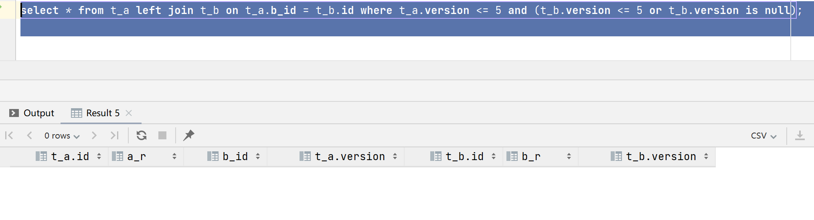
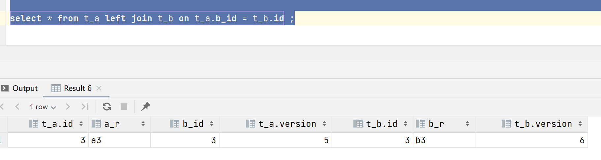
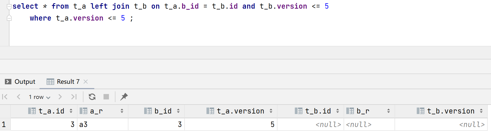
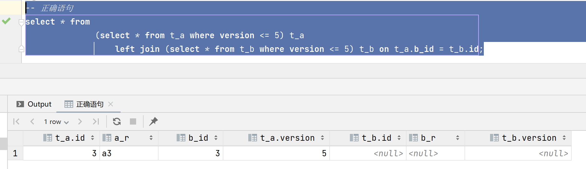

## 研发-左连接逻辑删除

测试说查出来的数据和数据库里的数据对不上。

### 复现

```mysql
// version <= 5 的数据是没被删除的，version > 5的数据是被删除的。
create table t_a
(
    id     int         not null
        primary key,
    a_r    varchar(10) null,
    b_id   int         null,
    version int         null
);
create table t_b
(
    id     int         not null
        primary key,
    b_r    varchar(10) null,
    version int         null
);
insert into t_a (id, a_r, b_id, version) values (3, 'a3', 3, 5);
insert into t_b (id, b_r, version) values (3, 'b3', 6);
```

sql写法

```java
select * from t_a left join t_b on t_a.b_id = t_b.id 
	where t_a.version <= 5 and (t_b.version <= 5 or t_b.version is null);
```

正常情况下应该是有一条记录但是t_b表的字段没有数据。按照上面的sql查出来一条记录都没有。



我们把where条件去掉试试：



很明显就发现问题了，因为t_b的version已经为6了，所有自然这条记录不能被保存。

### 解决

sql修改为就有记录了。

```java
select * from t_a left join t_b on t_a.b_id = t_b.id and t_b.version <= 5
    where t_a.version <= 5 ;
```



### 通用解决方案

在外连接的时候，如果遇到这种问题如何添加条件其实很复杂。一种通用的解决方案是对表添加过滤，如：

```java
select * from
              (select * from t_a where version <= 5) t_a
                  left join (select * from t_b where version <= 5) t_b on t_a.b_id = t_b.id;
```



这种模式会引入临时表，但是在优化器阶段，MySQL会帮助我们把sql优化为最适合执行的结构，如上面的sql优化后会变成：

```mysql
select 

`dao-easy-test`.`t_a`.`id` AS `id`,
`dao-easy-test`.`t_a`.`a_r` AS `a_r`,
`dao-easy-test`.`t_a`.`b_id` AS `b_id`,
`dao-easy-test`.`t_a`.`version` AS `version`,
`dao-easy-test`.`t_b`.`id` AS `id`,
`dao-easy-test`.`t_b`.`b_r` AS `b_r`,
`dao-easy-test`.`t_b`.`version` AS `version` 

from 

`dao-easy-test`.`t_a` left join (`dao-easy-test`.`t_b`) 
	on(((`dao-easy-test`.`t_b`.`id` = `dao-easy-test`.`t_a`.`b_id`) 
        and (`dao-easy-test`.`t_b`.`version` <= 5))) 
	
	where (`dao-easy-test`.`t_a`.`version` <= 5) |
```

可以看出来，优化有的SQL不存在子表了，子表的version条件被移动到了on条件里面。这样的话就不存在临时表的问题了。

这个SQL比较简单，对于复杂SQL能否消除临时表不太清楚，不过通常我们业务开发表的连接都控制在4个甚至3个以内，这样的话优化器应该能优化的动。


