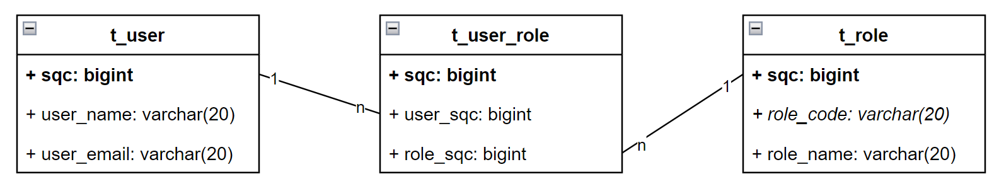
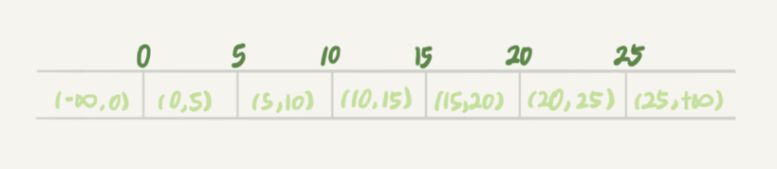
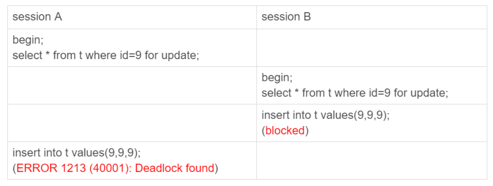

## 研发-并发”增删改级联“下的事务安全

### 事务安全

事务安全不是一个专业术语（至少在维基百科上搜不到），是我在思考如何保证多表增删改级联的情况下系统不出错而总结的一个概念。

我们知道关系型数据库（后续简称数据库）有ACID四种特性，其中Atomicity（原子性）、Consistency（一致性）、Durability（持久性）是每个数据库都会保证且使用者无法控制的特性，但是Isolation（隔离性）是使用者需要控制并且需要格外注意的特性，否则不仅不隔离，甚至会产生死锁而直接将整个系统拖垮。

在日常开发中，我对事务安全的要求有三点：

1. 不能出现死锁
2. 不能出现脏数据
3. 不能存在粗粒度的串行化

如何做到这三点便是需要深入分析的问题了。我们以一个RBAC系统为例，思考这一问题。

### RBAC业务

对于一个RBAC管理系统，用户表，角色表，用户角色表如下：



对于用户表，有如下的三个方法：

```java
// 新增用户
fun userInsert() {
	if userEmail exists then
		throw "用户已存在"
	else 
		insert
}

// 更新用户信息
fun userUpdate() {
	update
}

// 删除用户
fun userDelete() {
	delete
	deleteRoleOfUser
}
```

对于角色表，有如下的三个方法：

```java
// 新增角色
fun roleInsert() {
	if roleCode exists then
		throw "角色已存在"
	else 
		insert
}

// 更新角色信息
fun roleUpdate() {
	update
}

// 删除角色
fun roleDelete() {
	if roleExistsInUserRole then
		throw "角色正在被用户使用，不可以删除"
	else
		delete
}
```

对于用户角色表，有如下的方法：

```java
// 保存用户的角色
fun userRoleSave(userSqc, roleSqcList) {
	if userSqc exists && roleSqcList exists then
		deleteRoleOfUser
		insertRoleOfUser
	else
		throw "用户或角色不存在"
}
```

当基本的代码写完之后，后面就是如何控制事务了。

### 行锁和间隙锁

行锁是MySQL的Innodb引擎在RC（读提交）级别和RR（可重复读）级别下都会存在的锁，顾名思义就是对表的记录行加锁。**当数据存在时，可以保证数据不被多个事务同时修改。**不过当数据不存在时，无法加行锁，所以行锁无法解决`if notExists then insert`这样的问题。间隙锁是在RR级别下存在的锁，他锁住的是两个值之间的空隙。如下面的6个记录有7个间隙。



跟行锁有冲突关系的是“另外一个行锁”。但是间隙锁不一样，跟间隙锁存在冲突关系的，是“往这个间隙中插入一个记录”这个操作。间隙锁之间都不存在冲突关系。所以间隙锁也不能解决`if notExists then insert`这样的问题，更糟的是并发加间隙锁会产生死锁。



1. session A 执行 select … for update 语句，由于 id=9 这一行并不存在，因此会加上间隙锁 (5,10);
2. session B 执行 select … for update 语句，同样会加上间隙锁 (5,10)，间隙锁之间不会冲突，因此这个语句可以执行成功；
3. session B 试图插入一行 (9,9,9)，被 session A 的间隙锁挡住了，进入等待；
4. session A 试图插入一行 (9,9,9)，被 session B 的间隙锁挡住了，进入等待。

至此，两个 session 进入互相等待状态，形成死锁。当然，InnoDB的死锁检测会检测出这对死锁关系，通过回滚其中一个事务的方式让死锁消除，但是客户端就会看见异常了。

**对于`if notExists then insert`这样的问题最好的方式就是使用外部的分布式锁，在应用层让线程串行起来**（但是分布式锁受到网络的影响可能会失效，所以再数据库层面需要再对字段加唯一索引兜底）。

至于RR级别，其实在日常中很少使用（至少在OLTP的系统中很少使用），甚至有些数据库，如Oracle是没有RR级别的。

而更高的串行化级别，由于会对表加锁，锁的粒度太粗，在实际执行中几乎不会使用。

掌握了修改数据和新增数据时的基本的处理方法之后，我们代入RBAC业务分析问题。

### 方法只操作一张表

如果方法只操作一个表

- 对于`deleteById/updateById`这样的代码，使用RC级别即可；
- 对于`if notExists then insert`这样的代码，如上面的分析在RR级别下执行会产生死锁，在串行化级别下执行时锁的粒度太粗。这时需要使用分布式锁在应用层处理。

```java
// 新增用户
fun userInsert() {
	if userEmail exists then						// DL（distribute lock）
		throw "用户已存在"
	else 
		insert										// RC
}

// 更新用户信息
fun userUpdate() {
	update											// RC
}

// 删除用户
fun userDelete() {
	delete
	deleteRoleOfUser
}
```

```java
// 新增角色
fun roleInsert() {
	if roleCode exists then							// DL
		throw "角色已存在"
	else 
		insert										// RC
}

// 更新角色信息
fun roleUpdate() {
	update											// RC
}

// 删除角色
fun roleDelete() {
	if roleExistsInUserRole then
		throw "角色正在被用户使用，不可以删除"
	else
		delete
}
```

```java
// 保存用户的角色
fun userRoleSave(userSqc, roleSqcList) {
	if userSqc exists && roleSqcList exists then
		deleteRoleOfUser
		insertRoleOfUser
	else
		throw "用户或角色不存在"
}
```

至此，涉及到用户表、角色表单表插入修改的事务控制就完成，但是对于用户角色表这个级联表的插入删除还需要分析，因为此时方法操作了多张表，涉及到循环加锁的场景。

### 方法操作多张表

当方法操作多张表时，单纯的进行数据库层面的加锁是无法控制数据的完整性的。

我们基于`roleDelete()`和`userRoleSave()`并发执行下面的序列时进行分析：

```java
fun roleDelete()       roleExistsInUserRole			// userRole表里没有当前角色
fun userRoleSave()     userSqc exists
fun userRoleSave()     roleSqcList exists
fun userRoleSave()     deleteRoleOfUser
fun userRoleSave()     insertRoleOfUser
fun roleDelete()       delete
```

**RC**

由于`roleDelete()`线程在第1行执行时不对用户角色表加锁，所以`userRoleSave()`线程可以顺畅的完成，执行完成之后用户角色表里存在角色的数据，但此角色在两个线程都执行完成之后就会被删除了。

**RR**

`roleDelete()`线程在第1行执行时会对用户角色表加间隙锁，阻塞`userRoleSave()`执行第5行的插入行为。`userRoleSave()`线程在第三行执行时会对角色表加行锁，阻塞`roleDelete()`线程第6行的删除行为，陷入死锁。

**RC+RR**

如果`roleDelete()`线程以RC级别执行，那么不会对用户角色表加锁。`userRoleSave()`线程顺畅的执行完成之后数据库里会存在脏数据。

**RR+RC**

`roleDelete()`线程在第1行执行时会对用户角色表加间隙锁，阻塞`userRoleSave()`执行第5行的插入行为。`userRoleSave()`线程在第三行执行时会对角色表加行锁，阻塞`roleDelete()`线程第6行的删除行为，陷入死锁。

至此，可以看到无论加什么隔离级别都会出现问题。

这种问题的统一解决方案就是锁粗化，最极限的方式就是对两个方法加锁，让两个方法串行执行。但这样会存在粗粒度的串行化，所以不太可取。我一般采用的方案是对主表的数据行加分布式锁，这种做法可以避免考虑关联表的加锁问题，因为在主表的数据加锁后关联表自然就被锁住了。

```java
// 删除用户
fun userDelete() {
	delete											// DL
	deleteRoleOfUser
}

// 删除角色
fun roleDelete() {
	if roleExistsInUserRole then					// DL
		throw "角色正在被用户使用，不可以删除"
	else
		delete
}

// 保存用户的角色
fun userRoleSave(userSqc, roleSqcList) {
	if userSqc exists && roleSqcList exists then	// DL
		deleteRoleOfUser
		insertRoleOfUser
	else
		throw "用户或角色不存在"
}
```

1. 对于`userDelete()`和`roleDelete()`并发执行的场景，分布式锁不会相互限制。同时`userDelete()`依次操作的是用户表和用户角色表，`roleDelete()`依次操作的是用户角色表和角色表，无法形成环，所以不会陷入死锁。易知，不会产生脏数据。
2. 对于`userDelete()`和`userRoleSave()`并发执行时，两个方法会在用户级别串行执行。易知，不会产生脏数据。
3. 对于`roleDelete()`和`userRoleSave()`并发执行时，两个方法会在角色级别串行执行。易知，不会产生脏数据。
4. 当三个方法在并行执行的时候，由于`userDelete()`和`roleDelete()`都只会加一把锁，所以不会陷入死锁。同时两个方法的锁都会阻塞`userRoleSave()`的执行，所以不会产生脏数据。

### 死锁避免

#### 技术上避免死锁

**有序加锁**

技术上减少死锁的第一个方法就是有序加锁，即在两个或多个事务（方法）内，如果需要加多个锁，那么每个事务内的加锁顺序需要保持一致。`userRoleSave()`方法在对roleSqcList循环加锁时需要注意这一点。日常开发时，SQL的in语法也要尤其注意这一点。

**分布式锁**

分布式锁本质上是一种锁粗化的手段。通过对**某类数据**进行加锁来避免更细粒度的加锁。只要类别划分的好其实粒度也是很细的，比如上诉的RBAC案例里的用户行和角色行，粒度足够细的。

#### 业务上避免死锁

**限制删除**

数据的创建操作是必须存在的，修改操作在业务上几乎都会存在，但是在业务上其实很少使用删除，一般一条数据被创建之后，会一直存在表里，直至其生命周期完全结束后再迁移至历史表中。比如订单表里的数据，一个订单被创建之后，可能修改收货地址，但是不会被删除，即使是取消订单，也只是将其置为取消状态，后续这条记录的消费方，如运输付款这样的业务会判断这条记录是否处于取消状态。

**限制操作**

限制用户操作的方式有多种，一个方式是将实时并发提交数据改为异步串行提交数据，即用户只是提交一个修改数据或删除数据的任务，后台按时间存起来，再串行执行这些任务。另一种就是系统存在一个不可用期，将一些与高频业务冲突的操作放在这个时间内执行，比如很多政府系统都有凌晨不可用的现象。

**最终一致性**

有些数据短暂脏了其实也没有什么大事情，比如下面的操作会产生脏数据。

> 对于都是RC的隔离级别，如下的执行顺序会产生脏数据：
>
> ```java
> fun roleDelete()       roleExistsInUserRole
> fun userRoleSave()     userSqc exists
> fun userRoleSave()     roleSqcList exists
> fun userRoleSave()     deleteRoleOfUser
> fun userRoleSave()     insertRoleOfUser
> fun roleDelete()       delete
> ```
>
> 由于`roleDelete()`线程在第1行执行时不对用户角色表加锁，所以`userRoleSave()`线程可以顺畅的完成，执行完成之后用户角色表里存在角色的数据，但此角色在两个线程都执行完成之后就会被删除了。

但是业务上在使用用户角色表的时候，肯定会去关联用户表和角色表，因为单使用userRole来获取userSqc和roleSqc是没有业务价值的。在内连接的时候，如果角色不存在于角色表，这条用户角色记录是查询不出来的。

当然，为了数据的最终正确性，需要再开一个后台线程，定期的去轮询用户角色表，将脏数据删除。

### 小结

小结一下事务安全的解决方法：

- 死锁避免：从上面的分析可以看到，为了避免死锁，我们日常开发是不使用RR隔离级别的，当遇到RC隔离级别无法解决的`if notExists then insert`的场景时，使用在应用层加分布式锁的方式解决。
- 细粒度加锁：应用层加锁会产生锁粗化，但是如果类别划分的好，性能是可以接受的，至少比串行化级别好太多。
- 脏数据：对于脏数据问题，如果能不产生脏数据是最好的，但在业务复杂时，往往对锁的控制往往比较困难，此时在技术上可以采用最终一致性解决或者在业务上采用限制数据删除的方法。

## 参考

- 极客时间-MySQL45讲
- [zhanjinhao/pipa-rbac: 实现了一个基于rbac的权限管理系统的基本结构 (github.com)](https://github.com/zhanjinhao/pipa-rbac)
