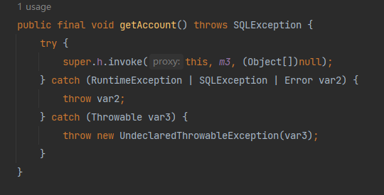
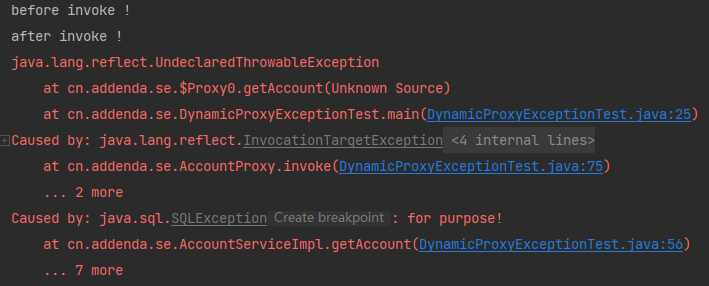
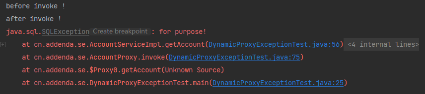
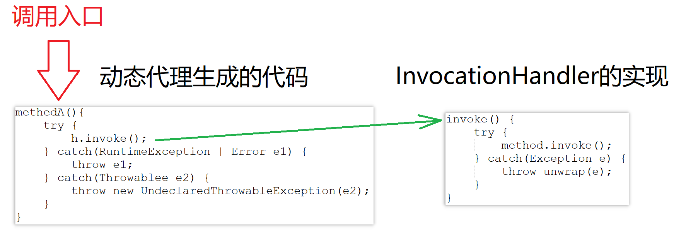
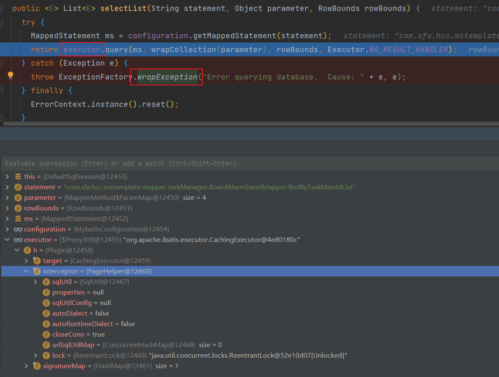

## AOP内异常的处理

当我们使用AOP时，如果被代理的业务方法出现了异常，如何让调用者捕获到真实异常是一个很关键的问题。


### 反射&动态代理产生的异常

由于AOP绝大多数都是基于动态代理和反射实现的，我们需要先认识一下与动态代理和反射相绑定的两个异常。

#### 反射

当使用反射的时候，如果方法出现了异常，会把真实的异常用InvocationTargetException异常包一层再抛出。

> InvocationTargetException is a checked exception that wraps an exception thrown by an invoked method or constructor.

所以当使用反射调用方法的时候，需要catch住method.invoke()，再从拦截到的异常里获取原始异常抛出。否则调用者无法获取到真实的异常。

#### 动态代理

当使用动态代理的时候，如果被代理的方法抛出了未声明的checkException（非RuntimeExcpetion&非Error），会把真实的异常用UndeclaredThrowableException异常包一层再抛出。

> Thrown by a method invocation on a proxy instance if its invocation handler's invoke method throws a checked exception (a Throwable that is not assignable to RuntimeException or Error) that is not assignable to any of the exception types declared in the throws clause of the method that was invoked on the proxy instance and dispatched to the invocation handler.
> An UndeclaredThrowableException instance contains the undeclared checked exception that was thrown by the invocation handler, and it can be retrieved with the getUndeclaredThrowable() method. UndeclaredThrowableException extends RuntimeException, so it is an unchecked exception that wraps a checked exception.

所以当使用动态代理的时候，也需要catch住method.invoke()，再从拦截到的异常里获取原始异常抛出。否则调用者无法获取到真实的异常。

下面是一个被代理的方法在JDK动态代理类里的是实现，可以看到未声明的checkException被包了一层。

```java
@Override
public void getAccount() throws SQLException {
    throw new CustomException("for purpose!");
}
```

<div align="center"></div>

#### 案例

```java
public class DynamicProxyExceptionTest {

    public static void main(String[] args) {
        System.getProperties().put("jdk.proxy.ProxyGenerator.saveGeneratedFiles", "true");
        System.getProperties().put("sun.misc.ProxyGenerator.saveGeneratedFiles", "true");
        AccountService accountService = new AccountServiceImpl();
        AccountService accountServiceProxy = (AccountService) Proxy.newProxyInstance(
            accountService.getClass().getClassLoader(),
            accountService.getClass().getInterfaces(),
            new AccountProxy(accountService));

        try {
            accountServiceProxy.getAccount();
        } catch (Exception e) {
            e.printStackTrace();
        }
    }

}

interface AccountService {

    void getAccount() throws SQLException;
}
class AccountServiceImpl implements AccountService {

    @Override
    public void getAccount() throws SQLException {
        throw new SQLException("for purpose!");
    }
}

/**
 * JDK动态代理类
 */
class AccountProxy implements InvocationHandler {

    private Object target;

    public AccountProxy(Object target) {
        this.target = target;
    }

    @Override
    public Object invoke(Object proxy, Method method, Object[] args) throws Throwable {
        System.out.println("before invoke !");
        try {
            return method.invoke(target, args);
        } catch (InvocationTargetException e) {
            // throw e;
            throw e.getTargetException();
        } finally {
            System.out.println("after invoke !");
        }
    }
}
```

如果AccountProxy里在catch里扔出的是e，结果如下：

<div align="center"></div>

如果AccountProxy里在catch里扔出的是e.getTargetException()，结果如下：

<div align="center"></div>

#### MyBatis的处理

MyBatis的动态代理模式是最常用的Mapper开发模式，所以它也会遇到上面的两个异常。

```java
// org.apache.ibatis.binding.MapperProxy#invoke
@Override
public Object invoke(Object proxy, Method method, Object[] args) throws Throwable {
    try {
        if (Object.class.equals(method.getDeclaringClass())) {
            return method.invoke(this, args);
        } else {
            return cachedInvoker(method).invoke(proxy, method, args, sqlSession);
        }
    } catch (Throwable t) {
        // 将执行过程中的异常unwrap之后再抛出
        throw ExceptionUtil.unwrapThrowable(t);
    }
}
```

```java
// org.apache.ibatis.reflection.ExceptionUtil#unwrapThrowable
public static Throwable unwrapThrowable(Throwable wrapped) {
    Throwable unwrapped = wrapped;
    while (true) {
        if (unwrapped instanceof InvocationTargetException) {
            unwrapped = ((InvocationTargetException) unwrapped).getTargetException();
        } else if (unwrapped instanceof UndeclaredThrowableException) {
            unwrapped = ((UndeclaredThrowableException) unwrapped).getUndeclaredThrowable();
        } else {
            return unwrapped;
        }
    }
}
```

可以看到，MyBatis定义了一个unwrapThrowable()用于获取真实的异常。

补充一点知识，MyBatis里面有一个wrapException()方法。此方法是将受查异常（SQLException）转换成RuntimeException，所以此方法和unwrapThrowable()完全不同，不要弄混了。

```java
public class ExceptionFactory {

    private ExceptionFactory() {
        // Prevent Instantiation
    }

    public static RuntimeException wrapException(String message, Exception e) {
        return new PersistenceException(ErrorContext.instance().message(message).cause(e).toString(), e);
    }

}
```

#### Spring的处理

在Spring中，对原始方法的调用使用的也是反射：

```java
// org.springframework.aop.support.AopUtils#invokeJoinpointUsingReflection
public static Object invokeJoinpointUsingReflection(@Nullable Object target, Method method, Object[] args)
    throws Throwable {

    // Use reflection to invoke the method.
    try {
        ReflectionUtils.makeAccessible(method);
        return method.invoke(target, args);
    }
    catch (InvocationTargetException ex) {
        // Invoked method threw a checked exception.
        // We must rethrow it. The client won't see the interceptor.
        throw ex.getTargetException();
    }
    catch (IllegalArgumentException ex) {
        throw new AopInvocationException("AOP configuration seems to be invalid: tried calling method [" +
                                         method + "] on target [" + target + "]", ex);
    }
    catch (IllegalAccessException ex) {
        throw new AopInvocationException("Could not access method [" + method + "]", ex);
    }
}
```

可以看到，此时方法如果返回了InvocationTargetException，将其原始异常拿出来抛出。

Spring在SpringBoot中默认的代理方式已经是cglib了，在程序启动的时候可以配置输出cglib的代理类。

```
-Dcglib.debugLocation="D:\workspace\2022\spring-easy"
```

当我们打开cglib的代理类可以看到，其并没有JDK动态代理类的异常处理机制。

```java
protected final String completeCheckedExceptionally(String var1) throws SQLException {
    MethodInterceptor var10000 = this.CGLIB$CALLBACK_0;
    if (var10000 == null) {
        CGLIB$BIND_CALLBACKS(this);
        var10000 = this.CGLIB$CALLBACK_0;
    }

    return var10000 != null ? (String)var10000.intercept(this, CGLIB$completeCheckedExceptionally$3$Method, new Object[]{var1}, CGLIB$completeCheckedExceptionally$3$Proxy) : super.completeCheckedExceptionally(var1);
}

```

所以在异常处理这一点上，JDK动态代理和cglib动态代理不一致。不过Spring很贴心的将cglib的异常按JDK动态代理的异常封装了一下：

```java
// org.springframework.aop.framework.CglibAopProxy.CglibMethodInvocation#proceed
public Object proceed() throws Throwable {
    try {
        return super.proceed();
    }
    catch (RuntimeException ex) {
        throw ex;
    }
    catch (Exception ex) {
        // 走到这里的一定是checkedException。
        if (ReflectionUtils.declaresException(getMethod(), ex.getClass()) ||
            KotlinDetector.isKotlinType(getMethod().getDeclaringClass())) {
            // Propagate original exception if declared on the target method
            // (with callers expecting it). Always propagate it for Kotlin code
            // since checked exceptions do not have to be explicitly declared there.
            throw ex;
        }
        else {
            // Checked exception thrown in the interceptor but not declared on the
            // target method signature -> apply an UndeclaredThrowableException,
            // aligned with standard JDK dynamic proxy behavior.
            throw new UndeclaredThrowableException(ex);
        }
    }
}
```

可以看到Spring只处理了RuntimeException，并没有处理Error。

##### 思考1

我们还需要思考一个问题，既然Spring已经在invokeJoinpointUsingReflection中处理了InvocationTargetException，同时受查异常一定会在方法上被声明，什么代码能走到上面的22行呢？我能想到两个答案。

第一个答案是native方法。下面的invoke0()是反射最终的调用方法，可以看到他就是一个native方法，其没有声明任何异常，但是他可以抛出受查异常，即InvocationTargetException。不过这种场景在业务开发时几乎不存在。

```java
// sun.reflect.NativeMethodAccessorImpl
public Object invoke(Object var1, Object[] var2) throws IllegalArgumentException, InvocationTargetException {
    if (++this.numInvocations > ReflectionFactory.inflationThreshold() && !ReflectUtil.isVMAnonymousClass(this.method.getDeclaringClass())) {
        MethodAccessorImpl var3 = (MethodAccessorImpl)(new MethodAccessorGenerator()).generateMethod(this.method.getDeclaringClass(), this.method.getName(), this.method.getParameterTypes(), this.method.getReturnType(), this.method.getExceptionTypes(), this.method.getModifiers());
        this.parent.setDelegate(var3);
    }

    return invoke0(this.method, var1, var2);
}

private static native Object invoke0(Method var0, Object var1, Object[] var2);
```

第二个答案我们写的拦截代码可能抛出未声明的受查异常。如下面的代码里invocation::proceed调用的真实业务方法没有声明SQLException，但是我们的前置拦截代码扔出了SQLException。

```java
@Override
public Object invoke(MethodInvocation invocation) throws Throwable {
    if (1 == 1) {
        throw new SQLException();
    }

    // invocation::proceed == org.springframework.aop.support.AopUtils#invokeJoinpointUsingReflection
    return invocation::proceed;
}
```

##### 思考2

MyBatis会不会抛出UndeclaredThrowableException呢？从异常声明的角度，答案是会抛出，此时的原理图如下。

<div align="center"></div>

但是实际上，MyBatis内部只有Plugin是我们常用的拓展点（可以编写Java代码），但是调用Plugin的地方都被unwrap()了，所以实际上不会。

```java
public Object invoke(Object proxy, Method method, Object[] args) throws Throwable {
    try {
        Set<Method> methods = signatureMap.get(method.getDeclaringClass());
        if (methods != null && methods.contains(method)) {
            return interceptor.intercept(new Invocation(target, method, args));
        }
        return method.invoke(target, args);
    } catch (Exception e) {
        throw ExceptionUtil.unwrapThrowable(e);
    }
}
```

当unwrapThrowable()了之后又会出现一个问题，就是如果Plugin里出现了未声明的受查该如何处理？比如Executor的query()之声明了SQLException，在Plugin里却抛出了IOExcpetion。

```
<E> List<E> query(MappedStatement ms, Object parameter, RowBounds rowBounds, ResultHandler resultHandler) throws SQLException;
```

其实此时MyBatis会将IOExcpetion封装为PersistenceException。如下面的Executor被Plugin包装了，如果内部发生了IOExcpetion，就会进入catch块，然后会被包装为PersistenceException再抛出。这样selectList就不需要声明受查异常了。

<div align="center"></div>

#### 总结

1. 使用反射调用真实的业务方法时，此时如果业务方法内部出现异常，会被包装成InvocationTargetException扔出来，所以在调用反射的地方，向上扔出异常时需要将原始异常提取出来抛出。

2. 使用JDK动态代理或在Spring中使用AOP，可能抛出UndeclaredThrowableException，在调用动态代理方法的地方，向上扔出异常时也需要将原始异常提取出来抛出。
3. Mybatis的Plugin内部如果遇到了异常，会将InvocationTargetException和UndeclaredThrowableException内部的提取出来抛出。如果Plugin内出现了异常，会被包装成PersistenceException抛出。
4. Spring的AOP在遇到InvocationTargetException时会将原始异常抛出，但是如果拦截器的代码有受查异常，会抛出UndeclaredThrowableException。


### Spring AOP内部的异常

从上面对MyBatis的代理异常分析可知，在MyBatis的Plugin内部无论扔出的是什么异常，都会被包装成PersistenceException抛出。但是Spring有所不同，因为对Spring拦截器除了方法代理这个入口以外，往往还会有一个函数式入口（MyBatis的Plugin只有方法代理入口）。

假设我们要写一个拦截器A，先定义一个A的功能实现类：

```java
public class ASupport {

    protected <R> R doInvoke(Arguments arguments, TSupplier<R> supplier) throw Throwable {

        // a before
        R result = supplier.get();
        // a after
        reture result;

    }

    protected interface TSupplier<T> {
        T get() throws Throwable;
    }
}
```

然后实现Spring提供的MethodInterceptor，并继承ASupport。MethodInterceptor会被织入到Spring AOP的处理过程。

```java
public class AInterceptor extends ASupport implements MethodInterceptor {

    @Override
    public Object invoke(MethodInvocation invocation) throws Throwable {

        Arguments = 从 invocation 中收集参数
        return doInvoke(arguments, invocation::proceed);
    }

}
```

此时我们再定义一个函数式工具类。

```java
public class AUtils extends ASupport {

    public static <R> R doA(AExecutor<R> executor, Arguments arguments) {
        try {
            return doInvoke(arguments, executor::process);
        } catch (Throwable throwable) {
            reportAsRuntimeException();
            return null;
        }
    }

    public interface AExecutor<R> {

        R process() throws Throwable;
    }

}
```

可以看到，在异常方面有一个很大的区别，就是AInterceptor的invoke()方法声明了Throwable，而工具类的doLog()方法没有声明受查异常。

在AInterceptor里我们可以直接向外仍异常，而调用者感受到的有三种情况：

1. 方法声明的受查异常
2. RuntimeException
3. 被UndeclaredThrowableException包裹的受查异常。

在AUtils这里，需要让其抛出的异常与AInterceptor的异常保持一致。

```java
protected static void reportAsRuntimeException(Throwable throwable) {
    if (!(throwable instanceof AException)) {
        if (throwable instanceof RuntimeException) {
            throw (RuntimeException) throwable;
        } else {
            throw new UndeclaredThrowableException(throwable);
        }
    }

    throw (AException) throwable;
}
```

需要注意的是，AInterceptor是对方法进行的拦截，所以可以拿得到方法声明的异常，而函数式的AUtils是对代码块的拦截，所以没有声明异常的概念，即代码块等同于没有声明异常的方法。这就是reportAsRuntimeException()里对所有checkedException都用UndeclaredThrowableException包裹的原因。


