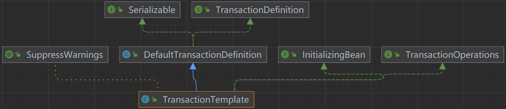
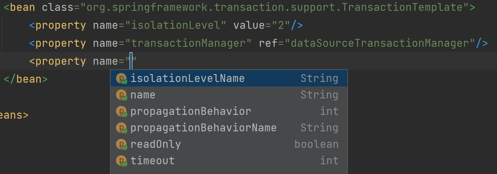

## 研发-TransactionUtils设计与实现

### 声明式事务

日常开发中Spring容器里最方便的事务开启方式是使用@Transactional来对方法进行代理，这也是Spring官方推荐的事务开启方式。

```java
@Override
@Transactional
public ServiceResult<Boolean> insert(TxTest txTest) {
    return null;
}
```

如果想控制事务的参数，需要在注解上增加参数。

```java
@Target({ElementType.TYPE, ElementType.METHOD})
@Retention(RetentionPolicy.RUNTIME)
@Inherited
@Documented
public @interface Transactional {

	@AliasFor("transactionManager")
	String value() default "";

	@AliasFor("value")
	String transactionManager() default "";

	String[] label() default {};

	Propagation propagation() default Propagation.REQUIRED;

	Isolation isolation() default Isolation.DEFAULT;

	int timeout() default TransactionDefinition.TIMEOUT_DEFAULT;

	String timeoutString() default "";

	boolean readOnly() default false;

	Class<? extends Throwable>[] rollbackFor() default {};

	String[] rollbackForClassName() default {};

	Class<? extends Throwable>[] noRollbackFor() default {};

	String[] noRollbackForClassName() default {};

}
```

这种方式虽然在易用性上无可挑剔，但是却存在着其他问题（这些问题都是Spring-AOP带来的）。

**失效问题**

- @Transactional不能应用在非public的方法上（Spring-AOP的限制）
- 同一个类中方法调用，无法走代理，进而导致@Transactional失效（Spring-AOP的限制）
- 方法存在多层代理，内层的其他代理把异常吞了，导致不回滚（Spring-AOP的限制）

**性能问题**

- 声明式事务会将整个方法都加上事务，当方法的业务复杂之后，事务会很大，但事实上只有一部分逻辑使用到了事务。（Spring-AOP的限制）

**调试问题**

- 动态代理出来的方法嵌套太深了，Debug的时候很难受（Spring-AOP的限制）

### 底层的编程式事务

```java
/**
 * @author addenda
 * @datetime 2023/1/5 20:22
 */
public class ProgrammaticTransactionTest {

    public static void main(String[] args) {
        ClassPathXmlApplicationContext context =
                new ClassPathXmlApplicationContext("classpath:cn/addenda/se/transaction/spring-transactionhelper-context.xml");

        SqlSessionFactory sqlSessionFactory = context.getBean(SqlSessionFactory.class);
        SqlSession sqlSession = new SqlSessionTemplate(sqlSessionFactory, ExecutorType.SIMPLE);
        TxTestMapper txTestMapper = sqlSession.getMapper(TxTestMapper.class);

        PlatformTransactionManager transactionManager = context.getBean(PlatformTransactionManager.class);

        DefaultTransactionDefinition def = new DefaultTransactionDefinition();
        def.setIsolationLevel(TransactionDefinition.ISOLATION_READ_COMMITTED);
        def.setPropagationBehavior(TransactionDefinition.PROPAGATION_REQUIRED);
        TransactionStatus status = transactionManager.getTransaction(def);
        try {
            txTestMapper.insert(new TxTest("ReturnTxExecutor", "123"));
        } catch (Exception ex) {
            // log ... 
            status.setRollbackOnly();
        } finally {
            transactionManager.commit(status);
        }

        context.close();
    }

}
```

```xml
<?xml version="1.0" encoding="UTF-8"?>
<beans
        xmlns="http://www.springframework.org/schema/beans"
        xmlns:context="http://www.springframework.org/schema/context"
        xmlns:xsi="http://www.w3.org/2001/XMLSchema-instance"
        xsi:schemaLocation="http://www.springframework.org/schema/beans
        https://www.springframework.org/schema/beans/spring-beans.xsd
        http://www.springframework.org/schema/context
        https://www.springframework.org/schema/context/spring-context.xsd">

    <context:property-placeholder
            ignore-resource-not-found="true"
            location="classpath*:/db.properties"/>

    <bean id="dataSource" class="com.zaxxer.hikari.HikariDataSource">
        <property name="driverClassName" value="${db.driver}"/>
        <property name="jdbcUrl" value="${db.url}"/>
        <property name="username" value="${db.username}"/>
        <property name="password" value="${db.password}"/>
        <property name="autoCommit" value="false"/>
        <property name="minimumIdle" value="1"/>
        <property name="maximumPoolSize" value="1"/>
    </bean>

    <bean id="sqlSessionFactory" class="org.mybatis.spring.SqlSessionFactoryBean">
        <!--dataSource属性指定要用到的连接池-->
        <property name="dataSource" ref="dataSource"/>
        <!--configLocation属性指定mybatis的核心配置文件-->
        <property name="configLocation"
                  value="cn/addenda/se/transaction/mybatis-config-transactionhelper.xml"/>
    </bean>

    <bean id="dataSourceTransactionManager" class="org.springframework.jdbc.datasource.DataSourceTransactionManager">
        <property name="dataSource" ref="dataSource"/>
    </bean>

</beans>
```

底层的编程式事务相比于声明式事务，可以避免Spring-AOP带来的问题，但是易用性下降的厉害。

同时，相比于声明式事务的参数都在注解上控制，底层的编程式事务的参数控制分为两部分：DefaultTransactionDefinition和用户自己catch的异常，也就是说需要回滚时，需要将对应的异常catch住，设置事务状态为rollbackOnly。

底层的编程式事务也存在一些问题：

- 事务的细节暴漏的太多，比如TransactionManager、TransactionStatus、commit()等
- 编程式事务的控制和声明式事务有不同，即DefaultTransactionDefinition对象没有rollbackFor属性，需要自己catch异常并处理
- DefaultTransactionDefinition的创建不优雅，还是传统的pojo方式

### TransactionTemplate

#### 使用

TransactionTemplate是Spring提供的用于简化编程式事务的工具类。

```java
/**
 * @author addenda
 * @date 2022/2/27
 */
public class TransactionTemplateTest {

    public static void main(String[] args) {
        ClassPathXmlApplicationContext context =
                new ClassPathXmlApplicationContext("classpath:cn/addenda/se/transaction/spring-transactionhelper-context.xml");

        SqlSessionFactory sqlSessionFactory = context.getBean(SqlSessionFactory.class);
        SqlSession sqlSession = new SqlSessionTemplate(sqlSessionFactory, ExecutorType.SIMPLE);
        TxTestMapper txTestMapper = sqlSession.getMapper(TxTestMapper.class);

        TransactionTemplate transactionTemplate = context.getBean(TransactionTemplate.class);
        
        // 有返回值场景
        Integer integer = transactionTemplate.execute(status -> {
            try {
                txTestMapper.insert(new TxTest("ReturnTxExecutor", "123"));
            } catch (Exception e) {
                e.printStackTrace();
                status.setRollbackOnly();
            }
            return null;
        });
        System.out.println(integer);

        // 无返回值场景
        transactionTemplate.executeWithoutResult(status -> {
            try {
                txTestMapper.insert(new TxTest("VoidTxExecutor", "123"));
            } catch (Exception e) {
                e.printStackTrace();
                status.setRollbackOnly();
            }
        });

        context.close();
    }
}
```

```xml
<?xml version="1.0" encoding="UTF-8"?>
<beans
        xmlns="http://www.springframework.org/schema/beans"
        xmlns:context="http://www.springframework.org/schema/context"
        xmlns:xsi="http://www.w3.org/2001/XMLSchema-instance"
        xsi:schemaLocation="http://www.springframework.org/schema/beans
        https://www.springframework.org/schema/beans/spring-beans.xsd
        http://www.springframework.org/schema/context
        https://www.springframework.org/schema/context/spring-context.xsd">

    <context:property-placeholder
            ignore-resource-not-found="true"
            location="classpath*:/db.properties"/>

    <bean id="dataSource" class="com.zaxxer.hikari.HikariDataSource">
        <property name="driverClassName" value="${db.driver}"/>
        <property name="jdbcUrl" value="${db.url}"/>
        <property name="username" value="${db.username}"/>
        <property name="password" value="${db.password}"/>
        <property name="autoCommit" value="false"/>
        <property name="minimumIdle" value="1"/>
        <property name="maximumPoolSize" value="1"/>
    </bean>

    <bean id="sqlSessionFactory" class="org.mybatis.spring.SqlSessionFactoryBean">
        <!--dataSource属性指定要用到的连接池-->
        <property name="dataSource" ref="dataSource"/>
        <!--configLocation属性指定mybatis的核心配置文件-->
        <property name="configLocation"
                  value="cn/addenda/se/transaction/mybatis-config-transactionhelper.xml"/>
    </bean>

    <bean id="dataSourceTransactionManager" class="org.springframework.jdbc.datasource.DataSourceTransactionManager">
        <property name="dataSource" ref="dataSource"/>
    </bean>

    <bean class="org.springframework.transaction.support.TransactionTemplate">
        <property name="isolationLevel" value="2"/>
        <property name="transactionManager" ref="dataSourceTransactionManager"/>
    </bean>

</beans>
```

与声明式事务和传统的编程式事务把事务参数作为外部参数传递到事务处理过程不同，TransactionTemplate本身就是事务参数。



所以一种类型的事务对应一个TransactionTemplate的对象。如果系统中需要处理不同类型的事务，就会存在多个TransactionTemplate的Bean了。



#### 原理

看一下TransactionTemplate内部处理事务的过程，它和原始的编程式事务代码差不多。

```java
@Override
@Nullable
public <T> T execute(TransactionCallback<T> action) throws TransactionException {
    Assert.state(this.transactionManager != null, "No PlatformTransactionManager set");

    if (this.transactionManager instanceof CallbackPreferringPlatformTransactionManager) {
        // ...
    }
    else {
        // 自己就是事务参数
        TransactionStatus status = this.transactionManager.getTransaction(this);
        T result;
        try {
            result = action.doInTransaction(status);
        }
        catch (RuntimeException | Error ex) {
            // Transactional code threw application exception -> rollback
            rollbackOnException(status, ex);
            throw ex;
        }
        catch (Throwable ex) {
            // Transactional code threw unexpected exception -> rollback
            rollbackOnException(status, ex);
            throw new UndeclaredThrowableException(ex, "TransactionCallback threw undeclared checked exception");
        }
        this.transactionManager.commit(status);
        return result;
    }
}
```

需要注意一点，**在声明式事务当中，默认情况下只有RuntimeException和Error这种非受查会回滚，但是在TransactionTemplate里受查异常也会回滚**。

底层的编程式事务也存在一些问题：

- 依然有事务细节的暴漏：TransactionExecution#setRollbackOnly
- 编程式事务的控制和声明式事务有不同，即TransactionTemplate对象没有rollbackFor属性
- 每个类别的事务需要不同的TransactionTemplate对象去执行，很不方便。

### TransactionUtils

#### 目标

希望构建一个能完全兼容@Transactional的编程式函数式事务控制类，同时屏蔽事务的细节，并能使用优雅的生成事务参数。

#### TransactionAspectSupport

声明式注解的核心处理逻辑就是在TransactionAspectSupport#invokeWithinTransaction里，这是一个protected的方法，所以后面利用继承来复用这一段代码。

```java
protected Object invokeWithinTransaction(Method method, @Nullable Class<?> targetClass,
                                         final InvocationCallback invocation) throws Throwable {

    // If the transaction attribute is null, the method is non-transactional.
    TransactionAttributeSource tas = getTransactionAttributeSource();
    // 获得事务参数
    final TransactionAttribute txAttr = (tas != null ? tas.getTransactionAttribute(method, targetClass) : null);
    final TransactionManager tm = determineTransactionManager(txAttr);

    if (this.reactiveAdapterRegistry != null && tm instanceof ReactiveTransactionManager) {
        // ...
    }

    PlatformTransactionManager ptm = asPlatformTransactionManager(tm);
    final String joinpointIdentification = methodIdentification(method, targetClass, txAttr);

    if (txAttr == null || !(ptm instanceof CallbackPreferringPlatformTransactionManager)) {
        // Standard transaction demarcation with getTransaction and commit/rollback calls.
        TransactionInfo txInfo = createTransactionIfNecessary(ptm, txAttr, joinpointIdentification);

        Object retVal;
        try {
            // This is an around advice: Invoke the next interceptor in the chain.
            // This will normally result in a target object being invoked.
            retVal = invocation.proceedWithInvocation();
        }
        catch (Throwable ex) {
            // target invocation exception
            completeTransactionAfterThrowing(txInfo, ex);
            throw ex;
        }
        finally {
            cleanupTransactionInfo(txInfo);
        }

        if (retVal != null && vavrPresent && VavrDelegate.isVavrTry(retVal)) {
            // ...
        }

        commitTransactionAfterReturning(txInfo);
        return retVal;
    }

    else {
        // ...
    }
}
```

##### TransactionAttribute

可以看到这段代码里TransactionAttribute是由TransactionAttributeSource根据method和targetClass创建出来的。

```java
TransactionAttribute getTransactionAttribute(Method method, @Nullable Class<?> targetClass);
```

声明式事务使用的TransactionAttributeSource实现是AnnotationTransactionAttributeSource。很明显，在编程式事务里没有标记@Transactional注解的方法，所以需要自定义一个TransactionAttributeSource。那么TransactionAttribute又该如何生成呢？由于Spring事务是依赖于ThreadLocal构建的，所以将TransactionAttribute放在ThreadLocal里，再由getTransactionAttribute方法获取。不过为了更好的支持嵌套事务，将TransactionAttribute的存储结构使用Stack。

```java
/**
 * @author addenda
 * @date 2022/2/27
 */
public class TransactionHelperAttributeSource implements TransactionAttributeSource {

    private static final ThreadLocal<Stack<TransactionAttribute>> THREAD_LOCAL = new ThreadLocal<>();

    @Override
    public TransactionAttribute getTransactionAttribute(Method method, Class<?> targetClass) {
        return THREAD_LOCAL.get().peek();
    }

    public static void setTransactionAttribute(TransactionAttribute transactionAttribute) {
        Stack<TransactionAttribute> transactionAttributes = THREAD_LOCAL.get();
        if (transactionAttributes == null) {
            transactionAttributes = new Stack<>();
            THREAD_LOCAL.set(transactionAttributes);
        }
        transactionAttributes.push(transactionAttribute);
    }

    public static void clear() {
        Stack<TransactionAttribute> transactionAttributes = THREAD_LOCAL.get();
        transactionAttributes.pop();
        if (transactionAttributes.isEmpty()) {
            THREAD_LOCAL.remove();
        }
    }

}
```

不过需要考虑一下事务嵌套时事务参数是否会混淆的问题。

TransactionUtils与声明式事务嵌套

很明显此时不需要考虑事务参数是否会混淆，因为前者是从ThreadLocal里面获取到的后者是从方法标注的注解里提取的。

TransactionUtils与TransactionUtils嵌套

```
setTransactionAttribute()
getTransactionAttribute
doCUD
doCUD
...
    setTransactionAttribute()
    getTransactionAttribute
    doCUD
    doCUD
    ...
    clear()
clear()
```

很明显，Stack数据结构能满足这种嵌套调用。

##### method&targetClass

第一个参数method和第二个参数targetClass除了用于创建TransactionAttribute外，还有一个作用就是用于打印日志。不过这个日志可以由DefaultTransactionAttribute#getDescriptor()确定。

```java
private String methodIdentification(Method method, @Nullable Class<?> targetClass,
                                    @Nullable TransactionAttribute txAttr) {

    String methodIdentification = methodIdentification(method, targetClass);
    if (methodIdentification == null) {
        if (txAttr instanceof DefaultTransactionAttribute) {
            // descriptor的优先级高于 method+targetClass
            methodIdentification = ((DefaultTransactionAttribute) txAttr).getDescriptor();
        }
        if (methodIdentification == null) {
            methodIdentification = ClassUtils.getQualifiedMethodName(method, targetClass);
        }
    }
    return methodIdentification;
}
```

##### TransactionHelper

TransactionAspectSupport种真正用来实现用户业务方法的是InvocationCallback接口，它是一个类似于Supplier的函数式接口

```java
@FunctionalInterface
protected interface InvocationCallback {

    @Nullable
    Object proceedWithInvocation() throws Throwable;
}
```

TransactionAspectSupport的子类TransactionInterceptor在调用invokeWithinTransaction的时候传入了一个CoroutinesInvocationCallback接口的实现，不过他是为了处理反应式事务，我们在调用invokeWithinTransaction的时候只需要传入InvocationCallback的实现接口。

```java
// org.springframework.transaction.interceptor.TransactionInterceptor#invoke
@Override
@Nullable
public Object invoke(MethodInvocation invocation) throws Throwable {
    // Work out the target class: may be {@code null}.
    // The TransactionAttributeSource should be passed the target class
    // as well as the method, which may be from an interface.
    Class<?> targetClass = (invocation.getThis() != null ? AopUtils.getTargetClass(invocation.getThis()) : null);

    // Adapt to TransactionAspectSupport's invokeWithinTransaction...
    return invokeWithinTransaction(invocation.getMethod(), targetClass, new CoroutinesInvocationCallback() {
        @Override
        @Nullable
        public Object proceedWithInvocation() throws Throwable {
            return invocation.proceed();
        }
        @Override
        public Object getTarget() {
            return invocation.getThis();
        }
        @Override
        public Object[] getArguments() {
            return invocation.getArguments();
        }
    });
}
```

定义一个TransactionHelper继承TransactionAspectSupport完成调用protected invokeWithinTransaction()这一步骤。

```java
/**
 * @author addenda
 * @date 2022/4/8
 */
public class TransactionHelper extends TransactionAspectSupport {

    public TransactionHelper() {
        setTransactionAttributeSource(new TransactionHelperAttributeSource());
    }

    public <R> R doTransaction(TransactionAttribute txAttr, TransactionExecutor<R> executor) {
        return _process(txAttr, executor);
    }

    private <R> R _process(TransactionAttribute txAttr, TransactionExecutor<R> executor) {
        TransactionHelperAttributeSource.setTransactionAttribute(txAttr);
        try {
            return (R) invokeWithinTransaction(extractMethod(executor), executor.getClass(), new InvocationCallback() {
                @Override
                public Object proceedWithInvocation() throws Throwable {
                    return executor.process();
                }
            });
        } catch (ServiceException e) {
            throw e;
        } catch (Throwable e) {
            throw new TransactionException("事务在TransactionHelper内执行失败！", e);
        } finally {
            TransactionHelperAttributeSource.clear();
        }
    }

    private Method extractMethod(TransactionExecutor<?> executor) {
        Method[] methods = executor.getClass().getMethods();
        for (Method method : methods) {
            if ("process".equals(method.getName()) && method.getParameterCount() == 0) {
                return method;
            }
        }
        throw new TransactionException("找不到 TransactionExecutor#process() 方法。");
    }

    public interface TransactionExecutor<R> {
        R process() throws Throwable;
    }

    public interface VoidTransactionExecutor {
        void process() throws Throwable;
    }

}
```

#### TransactionAttributeBuilder

声明式事务解析@Transactional的方法是：

```java
// SpringTransactionAnnotationParser#parseTransactionAnnotation(...)
protected TransactionAttribute parseTransactionAnnotation(AnnotationAttributes attributes) {
    RuleBasedTransactionAttribute rbta = new RuleBasedTransactionAttribute();

    Propagation propagation = attributes.getEnum("propagation");
    rbta.setPropagationBehavior(propagation.value());
    Isolation isolation = attributes.getEnum("isolation");
    rbta.setIsolationLevel(isolation.value());

    rbta.setTimeout(attributes.getNumber("timeout").intValue());
    String timeoutString = attributes.getString("timeoutString");
    Assert.isTrue(!StringUtils.hasText(timeoutString) || rbta.getTimeout() < 0,
                  "Specify 'timeout' or 'timeoutString', not both");
    rbta.setTimeoutString(timeoutString);

    rbta.setReadOnly(attributes.getBoolean("readOnly"));
    rbta.setQualifier(attributes.getString("value"));
    rbta.setLabels(Arrays.asList(attributes.getStringArray("label")));

    List<RollbackRuleAttribute> rollbackRules = new ArrayList<>();
    for (Class<?> rbRule : attributes.getClassArray("rollbackFor")) {
        rollbackRules.add(new RollbackRuleAttribute(rbRule));
    }
    for (String rbRule : attributes.getStringArray("rollbackForClassName")) {
        rollbackRules.add(new RollbackRuleAttribute(rbRule));
    }
    for (Class<?> rbRule : attributes.getClassArray("noRollbackFor")) {
        rollbackRules.add(new NoRollbackRuleAttribute(rbRule));
    }
    for (String rbRule : attributes.getStringArray("noRollbackForClassName")) {
        rollbackRules.add(new NoRollbackRuleAttribute(rbRule));
    }
    rbta.setRollbackRules(rollbackRules);

    return rbta;
}
```

所以基于此方法和建造者模式实现一个TransactionAttributeBuilder。

```java
/**
 * 兼容 @Transactional 全部属性
 *
 * @author addenda
 * @date 2022/4/8
 */
public class TransactionAttributeBuilder {

    private String transactionManager = "";
    private Propagation propagation = Propagation.REQUIRED;
    private Isolation isolation = Isolation.DEFAULT;
    private int timeout = TransactionDefinition.TIMEOUT_DEFAULT;
    private boolean readOnly = false;
    private Class<? extends Throwable>[] rollbackFor;
    private String[] rollbackForClassName;
    private Class<? extends Throwable>[] noRollbackFor;
    private String[] noRollbackForClassName;

    public static TransactionAttributeBuilder newRRBuilder() {
        return new TransactionAttributeBuilder()
                .rollbackFor(Exception.class)
                .withIsolation(Isolation.REPEATABLE_READ);
    }

    public static TransactionAttributeBuilder newBuilder() {
        return new TransactionAttributeBuilder();
    }

    private TransactionAttributeBuilder() {

    }

    public TransactionAttributeBuilder withTransactionManager(String transactionManager) {
        this.transactionManager = transactionManager;
        return this;
    }

    public TransactionAttributeBuilder withPropagation(Propagation propagation) {
        this.propagation = propagation;
        return this;
    }

    public TransactionAttributeBuilder withIsolation(Isolation isolation) {
        this.isolation = isolation;
        return this;
    }

    public TransactionAttributeBuilder withTimeout(int timeout) {
        this.timeout = timeout;
        return this;
    }

    public TransactionAttributeBuilder readOnly(boolean readOnly) {
        this.readOnly = readOnly;
        return this;
    }

    public TransactionAttributeBuilder rollbackFor(Class<? extends Throwable>... classes) {
        this.rollbackFor = classes;
        return this;
    }

    public TransactionAttributeBuilder rollbackForWithName(String... classeNames) {
        this.rollbackForClassName = classeNames;
        return this;
    }

    public TransactionAttributeBuilder noRollbackFor(Class<? extends Throwable>... classes) {
        this.noRollbackFor = classes;
        return this;
    }

    public TransactionAttributeBuilder noRollbackForWithName(String... classeNames) {
        this.noRollbackForClassName = classeNames;
        return this;
    }

    public TransactionAttribute build() {
        RuleBasedTransactionAttribute rbta = new RuleBasedTransactionAttribute();
        rbta.setPropagationBehavior(propagation.value());
        rbta.setIsolationLevel(isolation.value());
        rbta.setTimeout(timeout);
        rbta.setReadOnly(readOnly);
        rbta.setQualifier(transactionManager);
        ArrayList<RollbackRuleAttribute> rollBackRules = new ArrayList<RollbackRuleAttribute>();
        if (rollbackFor != null) {
            for (Class<?> rbRule : rollbackFor) {
                RollbackRuleAttribute rule = new RollbackRuleAttribute(rbRule);
                rollBackRules.add(rule);
            }
        }

        if (rollbackForClassName != null) {
            for (String rbRule : rollbackForClassName) {
                RollbackRuleAttribute rule = new RollbackRuleAttribute(rbRule);
                rollBackRules.add(rule);
            }
        }

        if (noRollbackFor != null) {
            for (Class<?> rbRule : noRollbackFor) {
                NoRollbackRuleAttribute rule = new NoRollbackRuleAttribute(rbRule);
                rollBackRules.add(rule);
            }
        }

        if (noRollbackForClassName != null) {
            for (String rbRule : noRollbackForClassName) {
                NoRollbackRuleAttribute rule = new NoRollbackRuleAttribute(rbRule);
                rollBackRules.add(rule);
            }
        }

        rbta.getRollbackRules().addAll(rollBackRules);
        return rbta;
    }
}
```

#### TransactionUtils

TransactionHelper已经可以完成所有想要的功能，但是为了使用的方便，提供一个工具类TransactionUtils。

```java
/**
 * @author addenda
 * @date 2022/4/8
 */
public class TransactionUtils implements ApplicationListener<ContextRefreshedEvent>, ApplicationContextAware {

    private String transactionManagerBeanName;
    private TransactionManager transactionManager;

    private static ApplicationContext applicationContext;
    private static TransactionHelper transactionHelper;

    private static final String SPRING_NOT_START_MSG = "TransactionUtils不能在Spring启动过程中使用。";

    public TransactionUtils() {
    }

    public TransactionUtils(TransactionManager transactionManager) {
        this.transactionManager = transactionManager;
    }

    public TransactionUtils(String transactionManagerBeanName) {
        this.transactionManagerBeanName = transactionManagerBeanName;
    }

    public TransactionUtils(String transactionManagerBeanName, TransactionManager transactionManager) {
        this.transactionManagerBeanName = transactionManagerBeanName;
        this.transactionManager = transactionManager;
    }

    /**
     * 最简单的事务控制场景（当发生任何异常（Exception.class）都回滚事务），
     */
    public static <R> R doTransaction(TransactionExecutor<R> executor) {
        Assert.notNull(transactionHelper, SPRING_NOT_START_MSG);
        return doTransaction(Exception.class, executor);
    }

    public static void doTransaction(VoidTransactionExecutor voidExecutor) {
        Assert.notNull(transactionHelper, SPRING_NOT_START_MSG);
        doTransaction(Exception.class, voidExecutor);
    }

    /**
     * 较上一个场景，该场景可以指定针对特定的异常类型发生事务回滚
     */
    public static <R> R doTransaction(Class<? extends Throwable> rollbackFor, TransactionExecutor<R> executor) {
        Assert.notNull(transactionHelper, SPRING_NOT_START_MSG);
        TransactionAttribute attribute = TransactionAttributeBuilder.newBuilder().rollbackFor(rollbackFor).build();
        return doTransaction(attribute, executor);
    }

    public static void doTransaction(Class<? extends Throwable> rollbackFor, VoidTransactionExecutor voidExecutor) {
        Assert.notNull(transactionHelper, SPRING_NOT_START_MSG);
        TransactionAttribute attribute = TransactionAttributeBuilder.newBuilder().rollbackFor(rollbackFor).build();
        doTransaction(attribute, voidExecutor);
    }

    /**
     * 最复杂的场景，需要手动指定所有的事务控制参数，TransactionAttribute 可以通过 TransactionAttributeBuilder构造
     * TransactionAttributeBuilder的入参跟@Transactional注解的参数保持一致
     */
    public static <R> R doTransaction(TransactionAttribute txAttr, TransactionExecutor<R> executor) {
        Assert.notNull(transactionHelper, SPRING_NOT_START_MSG);
        return transactionHelper.doTransaction(txAttr, executor);
    }

    public static void doTransaction(TransactionAttribute txAttr, VoidTransactionExecutor executor) {
        Assert.notNull(transactionHelper, SPRING_NOT_START_MSG);
        TransactionExecutor<?> transactionExecutor = () -> {
            executor.process();
            return null;
        };
        doTransaction(txAttr, transactionExecutor);
    }

    @Override
    public void setApplicationContext(ApplicationContext applicationContext) throws BeansException {
        this.applicationContext = applicationContext;
    }

    @Override
    public void onApplicationEvent(ContextRefreshedEvent event) {
        transactionHelper = applicationContext.getBean(TransactionHelper.class);
        if (transactionManager != null) {
            transactionHelper.setTransactionManager(transactionManager);
        }
        if (transactionManagerBeanName != null) {
            transactionHelper.setTransactionManagerBeanName(transactionManagerBeanName);
        }
    }
}
```

至此，TransactionUtils设计和实现均完成。

#### 使用

```java
/**
 * @author addenda
 * @date 2022/2/27
 */
public class TransactionUtilsTest {

    public static void main(String[] args) throws Exception {
        ClassPathXmlApplicationContext context =
                new ClassPathXmlApplicationContext("classpath:cn/addenda/se/transaction/spring-transactionhelper-context.xml");

        SqlSessionFactory sqlSessionFactory = context.getBean(SqlSessionFactory.class);
        SqlSessionTemplate sqlSession = new SqlSessionTemplate(sqlSessionFactory, ExecutorType.SIMPLE);
        TxTestMapper txTestMapper = sqlSession.getMapper(TxTestMapper.class);

        Integer integer = TransactionUtils.doTransaction(Exception.class, () -> {
            return txTestMapper.insert(new TxTest("VoidTxExecutor", "123"));
        });
        System.out.println(integer);

        TransactionUtils.doTransaction(Exception.class, () -> {
            txTestMapper.insert(new TxTest("VoidTxExecutor", "123"));
        });

    }

}
```

```xml
<?xml version="1.0" encoding="UTF-8"?>
<beans
        xmlns="http://www.springframework.org/schema/beans"
        xmlns:context="http://www.springframework.org/schema/context"
        xmlns:xsi="http://www.w3.org/2001/XMLSchema-instance"
        xsi:schemaLocation="http://www.springframework.org/schema/beans
        https://www.springframework.org/schema/beans/spring-beans.xsd
		http://www.springframework.org/schema/context
        https://www.springframework.org/schema/context/spring-context.xsd">

    <context:property-placeholder
            ignore-resource-not-found="true"
            location="classpath*:/db.properties"/>

    <bean id="dataSource" class="com.zaxxer.hikari.HikariDataSource">
        <property name="driverClassName" value="${db.driver}"/>
        <property name="jdbcUrl" value="${db.url}"/>
        <property name="username" value="${db.username}"/>
        <property name="password" value="${db.password}"/>
        <property name="autoCommit" value="false"/>
        <property name="minimumIdle" value="1"/>
        <property name="maximumPoolSize" value="1"/>
    </bean>

    <bean id="sqlSessionFactory" class="org.mybatis.spring.SqlSessionFactoryBean">
        <!--dataSource属性指定要用到的连接池-->
        <property name="dataSource" ref="dataSource"/>
        <!--configLocation属性指定mybatis的核心配置文件-->
        <property name="configLocation"
                  value="cn/addenda/se/transaction/mybatis-config-transactionhelper.xml"/>
    </bean>

    <bean id="dataSourceTransactionManager" class="org.springframework.jdbc.datasource.DataSourceTransactionManager">
        <property name="dataSource" ref="dataSource"/>
    </bean>

    <bean class="cn.addenda.se.transaction.TransactionHelper"/>
    <bean class="cn.addenda.se.transaction.TransactionUtils"/>

</beans>
```


## 代码实现

- [spring-easy/src/main/java/cn/addenda/se/transaction at develop · zhanjinhao/spring-easy (github.com)](https://github.com/zhanjinhao/spring-easy/tree/develop/src/main/java/cn/addenda/se/transaction)

