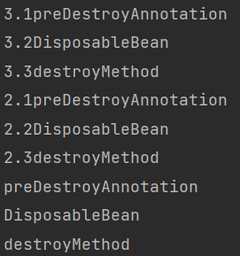

## 研发-定时任务的优雅停止

通过定时任务处理业务数据是很常见的场景，今天思考一下如何优雅的关闭定时任务。

### 任务的中断

通常定时任务会有后台线程不停地调度运行，想关闭任务是首先想到的是停止后台线程。但是stop线程是不被允许的，因为这样的话线程没有足够的时间来处理未处理完的数据，即任务戛然而止会导致出现数据完整性等问题。

停止线程的优雅方案是两阶段终止模式：第一阶段设置一个中断值，第二阶段任务线程捕获到中断值之后进入停止逻辑。有两种方案实现两阶段终止。

#### volatile

通过状态量来判断任务是否停止是最易理解的方式，不过状态量需要用volatile修饰。关于volatile可以参考[1]。

```java
volatile boolean stop = false;

// 线程1
public void taskRun() {
    while (!stop) {
        doSomething();
        try {
            sleep(1000);
        } catch (InterruptedException e) {
            // Thread.currentThread().interrupt();
        }
    }
}

// 线程2
public void setStop() {
    stop = true;
}
```

#### interrupt

用interrupt()设置中断，再在任务线程里捕获中断是第二种方式。需要注意的是，任务线程里捕获了sleep()方法的InterruptedException之后会同时清理中断状态，所以需要在catch块里重新设置当前线程的中断状态。

```java
Thread thread = null;
// 线程1
public void taskRun() {
    // 线程2
    Runnable runnable = () -> {
        while (!Thread.currentThread().isInterrupted()) {
            doSomething();
        }
        try {
            sleep(1000);
        } catch (InterruptedException e) {
            Thread.currentThread().interrupt();
        }
    };
    thread = new Thread(runnable);
    thread.start();
}

// 线程3
public void interrupt() {
    if(thread != null) {
        thread.interrupt();
    }
}
```

### 设置中断

当服务停止的时候需要设置中断，所以我们需要思考如何设置中断。

#### ShutdownHook

JDK提供了一个关闭钩子，当JVM关闭的时候会执行钩子函数。

```java
public void addShutdownHook(Thread hook) {
    SecurityManager sm = System.getSecurityManager();
    if (sm != null) {
        sm.checkPermission(new RuntimePermission("shutdownHooks"));
    }
    ApplicationShutdownHooks.add(hook);
}
```

看一下JVM是怎么运行钩子的

```java
static void runHooks() {
    Collection<Thread> threads;
    synchronized(ApplicationShutdownHooks.class) {
        threads = hooks.keySet();
        hooks = null;
    }

    for (Thread hook : threads) {
        hook.start();
    }
    for (Thread hook : threads) {
        while (true) {
            try {
                hook.join();
                break;
            } catch (InterruptedException ignored) {
            }
        }
    }
}
```

可以看到JVM的钩子是异步运行的，所以这就可能造成一个问题：**资源无法按依赖关系有序释放**。比如我们的任务基本都需要依赖数据库连接池，所以数据库连接池要后于任务关闭。

#### Spring Bean生命周期

##### beforeDestruction

**beforeDestruction的使用**

Java后端的服务大都是基于Spring构建的，在Spring中Bean的生命周期里有一个beforeDestruction阶段，用于执行用户自定义的destroyMethod。

```java
/**
 * @author addenda
 * @datetime 2023/1/6 16:46
 */
public class TestDestroyMethod implements DisposableBean {

    @PreDestroy
    public void preDestroyAnnotation() {
        System.out.println("1.preDestroyAnnotation");
    }

    @Override
    public void destroy() throws Exception {
        System.out.println("2.DisposableBean");
    }

    public void destroyMethod() {
        System.out.println("3.destroyMethod");
    }

}
```

```java
/**
 * @author addenda
 * @datetime 2023/1/6 16:43
 */
@Configuration
public class TestDestroyMethodConfiguration {

    @Bean(destroyMethod = "destroyMethod")
    public TestDestroyMethod testDestroyMethod() {
        return new TestDestroyMethod();
    }

}
```

需要注意一点是，Spring会推断Bean有没有destroyMethod。下面的这段注释是@Bean的注释，不过在xml配置的或注解声明的Bean上都是生效的。

> As a convenience to the user, the container will attempt to infer a destroy method against an object returned from the @Bean method. For example, given an @Bean method returning an Apache Commons DBCP BasicDataSource, the container will notice the close() method available on that object and automatically register it as the destroyMethod. This 'destroy method inference' is currently limited to detecting only public, no-arg methods named 'close' or 'shutdown'. The method may be declared at any level of the inheritance hierarchy and will be detected regardless of the return type of the @Bean method (i.e., detection occurs reflectively against the bean instance itself at creation time).
>
> To disable destroy method inference for a particular @Bean, specify an empty string as the value, e.g. @Bean(destroyMethod=""). Note that the org.springframework.beans.factory.DisposableBean and the java.io.Closeable/AutoCloseable interfaces will nevertheless get detected and the corresponding destroy/close method invoked.

推断destroyMethod的具体实现是

```java
// org.springframework.beans.factory.support.AbstractBeanFactory#registerDisposableBeanIfNecessary
protected void registerDisposableBeanIfNecessary(String beanName, Object bean, RootBeanDefinition mbd) {
    AccessControlContext acc = (System.getSecurityManager() != null ? getAccessControlContext() : null);
    if (!mbd.isPrototype() && requiresDestruction(bean, mbd)) {
        if (mbd.isSingleton()) {
            // Register a DisposableBean implementation that performs all destruction
            // work for the given bean: DestructionAwareBeanPostProcessors,
            // DisposableBean interface, custom destroy method.
            registerDisposableBean(beanName,
                                   new DisposableBeanAdapter(bean, beanName, mbd, getBeanPostProcessors(), acc));
        }
        else {
            // A bean with a custom scope...
            Scope scope = this.scopes.get(mbd.getScope());
            if (scope == null) {
                throw new IllegalStateException("No Scope registered for scope name '" + mbd.getScope() + "'");
            }
            scope.registerDestructionCallback(beanName,
                                              new DisposableBeanAdapter(bean, beanName, mbd, getBeanPostProcessors(), acc));
        }
    }
}
```

```java
// org.springframework.beans.factory.support.DisposableBeanAdapter#inferDestroyMethodIfNecessary
private String inferDestroyMethodIfNecessary(Object bean, RootBeanDefinition beanDefinition) {
    String destroyMethodName = beanDefinition.getDestroyMethodName();
    if (AbstractBeanDefinition.INFER_METHOD.equals(destroyMethodName) ||
        (destroyMethodName == null && closeableInterface.isInstance(bean))) {
        // Only perform destroy method inference or Closeable detection
        // in case of the bean not explicitly implementing DisposableBean
        if (!(bean instanceof DisposableBean)) {
            try {
                return bean.getClass().getMethod(CLOSE_METHOD_NAME).getName();
            }
            catch (NoSuchMethodException ex) {
                try {
                    return bean.getClass().getMethod(SHUTDOWN_METHOD_NAME).getName();
                }
                catch (NoSuchMethodException ex2) {
                    // no candidate destroy method found
                }
            }
        }
        return null;
    }
    return (StringUtils.hasLength(destroyMethodName) ? destroyMethodName : null);
}
```

在上面提到的需要先停止任务再关闭数据库连接池的场景中，Druid连接池和Hiraci连接池都是基于Closeable#close()方法处理关闭的。

```java
public class DruidDataSource extends DruidAbstractDataSource implements DruidDataSourceMBean, ManagedDataSource, Referenceable, Closeable, Cloneable, ConnectionPoolDataSource, MBeanRegistration {
    
    @Override
    public void close() {
        // ...
    }
    
}
```

```java
public class HikariDataSource extends HikariConfig implements DataSource, Closeable 
{
   
   /**
    * Shutdown the DataSource and its associated pool.
    */
   @Override
   public void close()
   {
      // ...
   }
    
}
```

**beforeDestruction的限制**

**DisposableBean无法使用Ordered接口或者@Order来控制destroyMethod的执行顺序**。

```java
/**
 * @author addenda
 * @datetime 2023/1/6 16:46
 */
public class TestDestroyMethod implements DisposableBean, Ordered {

    @PreDestroy
    public void preDestroyAnnotation() {
        System.out.println("preDestroyAnnotation");
    }

    @Override
    public void destroy() throws Exception {
        System.out.println("DisposableBean");
    }

    public void destroyMethod() {
        System.out.println("destroyMethod");
    }

    @Override
    public int getOrder() {
        return 1;
    }
}
```

```java
/**
 * @author addenda
 * @datetime 2023/1/6 16:46
 */
public class TestDestroyMethod2 implements DisposableBean, Ordered {

    @PreDestroy
    public void preDestroyAnnotation() {
        System.out.println("2.1preDestroyAnnotation");
    }

    @Override
    public void destroy() throws Exception {
        System.out.println("2.2DisposableBean");
    }

    public void destroyMethod() {
        System.out.println("2.3destroyMethod");
    }

    @Override
    public int getOrder() {
        return 2;
    }
}
```

```java
/**
 * @author addenda
 * @datetime 2023/1/6 16:46
 */
public class TestDestroyMethod3 implements DisposableBean, Ordered {

    @PreDestroy
    public void preDestroyAnnotation() {
        System.out.println("3.1preDestroyAnnotation");
    }

    @Override
    public void destroy() throws Exception {
        System.out.println("3.2DisposableBean");
    }

    public void destroyMethod() {
        System.out.println("3.3destroyMethod");
    }

    @Override
    public int getOrder() {
        return 3;
    }
}
```

```java
/**
 * @author addenda
 * @datetime 2023/1/6 16:43
 */
@Configuration
public class TestDestroyMethodConfiguration {

    @Bean(destroyMethod = "destroyMethod")
    public TestDestroyMethod testDestroyMethod() {
        return new TestDestroyMethod();
    }

    @Bean(destroyMethod = "destroyMethod")
    public TestDestroyMethod2 testDestroyMethod2() {
        return new TestDestroyMethod2();
    }

    @Bean(destroyMethod = "destroyMethod")
    public TestDestroyMethod3 testDestroyMethod3() {
        return new TestDestroyMethod3();
    }
    
}
```

运行起来会发现，无论怎么调整getOrder()的返回值，输出都如下图：

<div align="center"></div>

看一下DisposableBean的注册过程。

Spring容器里所有的DisposableBean都会被存储在一个LinkedHashMap中，所以disposableBeans的顺序都是按注册顺序有序的。

```java
private final Map<String, Object> disposableBeans = new LinkedHashMap<String, Object>();
// org.springframework.beans.factory.support.DefaultSingletonBeanRegistry#registerDisposableBean
public void registerDisposableBean(String beanName, DisposableBean bean) {
    synchronized (this.disposableBeans) {
        this.disposableBeans.put(beanName, bean);
    }
}
```

当Spring容器关闭时，会按照disposableBeans注册顺序的倒序执行destroyMethod。

```java
public void destroySingletons() {
    // ...

    String[] disposableBeanNames;
    synchronized (this.disposableBeans) {
        disposableBeanNames = StringUtils.toStringArray(this.disposableBeans.keySet());
    }
    for (int i = disposableBeanNames.length - 1; i >= 0; i--) {
        destroySingleton(disposableBeanNames[i]);
    }

    // ...
}
```

控制Spring注册bean的顺序是很困难的，因为Spring注册bean的顺序是按照bean之间的依赖关系进行的。虽然有@DependsOn注解可以控制依赖顺序，但是使用起来还是不太方便。

##### ContextClosedEvent

在关闭Spring容器时，第一步是发送一个ContextClosedEvent，然后才会进入beforeDestruction阶段，同时ApplicationListener的执行是有序的。所以我们可以利用ContextClosedEvent这个事件来设置任务的中断，这样的话我们的定时任务就会先于DataSource关闭。

```java
@Override
public void onApplicationEvent(ContextClosedEvent event) {
    log.info("开始停止[{}]任务！", taskName());
    shutDown();
    log.info("停止[{}]任务完成！", taskName());
}
```

看一下Spring处理事件的逻辑

```java
// org.springframework.context.support.AbstractApplicationContext#doClose
protected void doClose() {
    if (this.active.get() && this.closed.compareAndSet(false, true)) {
		// ...
        try {
            // Publish shutdown event.
            publishEvent(new ContextClosedEvent(this));
        }
        catch (Throwable ex) {
            logger.warn("Exception thrown from ApplicationListener handling ContextClosedEvent", ex);
        }
        
        // ...
    }
}
```

```java
// org.springframework.context.support.AbstractApplicationContext#publishEvent(...)
protected void publishEvent(Object event, ResolvableType eventType) {
    // ...

    // Decorate event as an ApplicationEvent if necessary
    ApplicationEvent applicationEvent;
    if (event instanceof ApplicationEvent) {
        applicationEvent = (ApplicationEvent) event;
    }
    else {
        // ...
    }

    // Multicast right now if possible - or lazily once the multicaster is initialized
    if (this.earlyApplicationEvents != null) {
        this.earlyApplicationEvents.add(applicationEvent);
    }
    else {
        // 除了在Spring启动阶段，否则都会走else逻辑
        getApplicationEventMulticaster().multicastEvent(applicationEvent, eventType);
    }

    // ...
}
```

```java
// org.springframework.context.event.SimpleApplicationEventMulticaster#multicastEvent(...)
@Override
public void multicastEvent(final ApplicationEvent event, ResolvableType eventType) {
    ResolvableType type = (eventType != null ? eventType : resolveDefaultEventType(event));
    for (final ApplicationListener<?> listener : getApplicationListeners(event, type)) {
        Executor executor = getTaskExecutor();
        if (executor != null) {
            // ...
        }
        else {
            // executor默认是空，所以ApplicationListener的串行执行的
            invokeListener(listener, event);
        }
    }
}
```

```java
// org.springframework.context.event.SimpleApplicationEventMulticaster#invokeListener
protected void invokeListener(ApplicationListener listener, ApplicationEvent event) {
    ErrorHandler errorHandler = getErrorHandler();
    if (errorHandler != null) {
        try {
            listener.onApplicationEvent(event);
        }
        catch (Throwable err) {
            errorHandler.handleError(err);
        }
    }
    else {
        try {
            listener.onApplicationEvent(event);
        }
        catch (ClassCastException ex) {
            // Possibly a lambda-defined listener which we could not resolve the generic event type for
            LogFactory.getLog(getClass()).debug("Non-matching event type for listener: " + listener, ex);
        }
    }
}
```

获取ApplicationListener的逻辑

```java
// org.springframework.context.event.AbstractApplicationEventMulticaster#getApplicationListeners(...)
protected Collection<ApplicationListener<?>> getApplicationListeners(
    ApplicationEvent event, ResolvableType eventType) {

    Object source = event.getSource();
    Class<?> sourceType = (source != null ? source.getClass() : null);
    ListenerCacheKey cacheKey = new ListenerCacheKey(eventType, sourceType);

    // Quick check for existing entry on ConcurrentHashMap...
    ListenerRetriever retriever = this.retrieverCache.get(cacheKey);
    if (retriever != null) {
        return retriever.getApplicationListeners();
    }

    if (this.beanClassLoader == null ||
        (ClassUtils.isCacheSafe(event.getClass(), this.beanClassLoader) &&
         (sourceType == null || ClassUtils.isCacheSafe(sourceType, this.beanClassLoader)))) {
        // Fully synchronized building and caching of a ListenerRetriever
        synchronized (this.retrievalMutex) {
            retriever = this.retrieverCache.get(cacheKey);
            if (retriever != null) {
                return retriever.getApplicationListeners();
            }
            retriever = new ListenerRetriever(true);
            Collection<ApplicationListener<?>> listeners =
                retrieveApplicationListeners(eventType, sourceType, retriever);
            this.retrieverCache.put(cacheKey, retriever);
            return listeners;
        }
    }
    else {
        // No ListenerRetriever caching -> no synchronization necessary
        return retrieveApplicationListeners(eventType, sourceType, null);
    }
}
```

```java
// org.springframework.context.event.AbstractApplicationEventMulticaster#retrieveApplicationListeners
private Collection<ApplicationListener<?>> retrieveApplicationListeners(
    ResolvableType eventType, Class<?> sourceType, ListenerRetriever retriever) {

    LinkedList<ApplicationListener<?>> allListeners = new LinkedList<ApplicationListener<?>>();
    Set<ApplicationListener<?>> listeners;
    Set<String> listenerBeans;
    synchronized (this.retrievalMutex) {
        listeners = new LinkedHashSet<ApplicationListener<?>>(this.defaultRetriever.applicationListeners);
        listenerBeans = new LinkedHashSet<String>(this.defaultRetriever.applicationListenerBeans);
    }
    for (ApplicationListener<?> listener : listeners) {
        if (supportsEvent(listener, eventType, sourceType)) {
            if (retriever != null) {
                retriever.applicationListeners.add(listener);
            }
            allListeners.add(listener);
        }
    }
    
    // ...
    
    // 这句代码表示ApplicationListener会按照@Order或者Ordered排序
    AnnotationAwareOrderComparator.sort(allListeners);
    return allListeners;
}
```

所以，可知Spring处理事件是串行且按Order有序的。

需要额外提一点，Spring在处理事件的时候，multicastEvent()中的代码展示了，事件的发布可以通过线程池异步处理。所以需要Spring的事件优先于close()方法执行，不能注册Executor。

```java
// org.springframework.context.event.SimpleApplicationEventMulticaster#multicastEvent(...)
@Override
public void multicastEvent(final ApplicationEvent event, ResolvableType eventType) {
    ResolvableType type = (eventType != null ? eventType : resolveDefaultEventType(event));
    for (final ApplicationListener<?> listener : getApplicationListeners(event, type)) {
        Executor executor = getTaskExecutor();
        if (executor != null) {
            // ...
        }
        else {
            // executor默认是空，所以ApplicationListener的串行执行的
            invokeListener(listener, event);
        }
    }
}
```


### 定时任务模型

创建定时任务时，根据项目的脚手架和业务需求不同，创建的定时任务也不同，进而任务的优雅停止方式也会不同。下面列出了三种常见的定时任务模型。

#### 死循环型

```java
while (!stop) {
    long start = System.currentTimeMillis();
    doSomething();
    long end = System.currentTimeMillis();

    long duration = end - start;
    // 5分钟一次
    long left = 5 * 60 * 1000 - duration;
    if (left < 1) {
		// do not wait, execute next iteration
    } else {
        try {
            Thread.sleep(left);
        } catch (InterruptedException e) {
            // log ...
        }
    }
}
```

对于死循环型，只需要使用状态量就可以中断任务。但是为了更快的终止任务，可以interrupt()一下。

#### 生产者消费者型

当数据的来源接口不稳定时，通常会增加一层阻塞队列来提升读取数据的效率和稳定性。实现如下：

```java
/**
 * @author addenda
 * @datetime 2023/1/9 16:49
 */
public class ProducerTask implements Runnable {

    private volatile boolean stop = false;

    private final BlockingQueue<String> blockingQueue;

    public ProducerTask(BlockingQueue<String> blockingQueue) {
        this.blockingQueue = blockingQueue;
    }

    @Override
    public void run() {
        while (!stop) {
            String message = request();
            try {
                blockingQueue.put(message);
            } catch (InterruptedException e) {
                // log
            }
        }
    }

    /**
     * 从接口获取到需要处理的数据。
     */
    private String request() {
        // 接口不稳定，而且可能超时，进而引发重试
        return "1";
    }

    public void shutdown() {
        stop = true;
    }

}
```

```java
/**
 * @author addenda
 * @datetime 2023/1/9 17:35
 */
public class ConsumerTask implements Runnable {

    private volatile boolean stop = false;

    private final BlockingQueue<String> blockingQueue;

    public ConsumerTask(BlockingQueue<String> blockingQueue) {
        this.blockingQueue = blockingQueue;
    }

    @Override
    public void run() {
        while (!stop) {
            String message = null;
            try {
                message = blockingQueue.take();
            } catch (InterruptedException e) {
                // ...
            }

            // 幂等
            doSomething();
            // 没有ack的消息后续仍可以获取到
            ack(message);
        }
    }

    public void shutdown() {
        stop = true;
    }

}
```

如果任务的调度中心仅仅使用状态量是有可能陷入永久等待的：

- 当BlockingQueue已满，此时生产者会陷入等待，而消费者在消费完当前的数据后就停止了，此时生产者会永远的等待下去。
- 当BlockingQueue为空，此时消费者陷入等待，而生产者在生产完当前的数据后就停止了，此时消费者会永远的等待下去。

所以此时需要增加interrupt()来打断线程。当然，不使用状态量，完全使用interrupt()控制也是没问题的。

```java
/**
 * @author addenda
 * @datetime 2023/1/9 18:58
 */
public class TestProducerAndConsumer {

    public static void main(String[] args) throws Exception {

        BlockingQueue<String> blockingQueue = new ArrayBlockingQueue<>(8);

        ProducerTask producerTask = new ProducerTask(blockingQueue);
        Thread produceThread = new Thread(() -> producerTask.run());

        ConsumerTask consumerTask = new ConsumerTask(blockingQueue);
        Thread consumerThread = new Thread(() -> consumerTask.run());

        produceThread.start();
        consumerThread.start();

        Thread.sleep(1000);

        producerTask.shutdown();
        consumerTask.shutdown();

        // 这两句代码必须存在，否则可能永久陷入等待
        produceThread.interrupt();
        consumerThread.interrupt();

    }

}
```

#### 外部调度型

应用可能依赖外部的分布式任务调度器，比如常见的XXL-JOB。

```java
@JobHandler(value = "cRNTestHandler")
@Component
public class CRNTestHandler extends IJobHandler {
  
    volatile boolean stop = false;
    
    @Override
    public ReturnT<String> execute(String s) throws Exception {

		doSomething();

        return ReturnT.SUCCESS;
    }
    
    void shutDown() {
        // ...
    }

}
```

和前两种模型不同的是，execute()会在多个线程中并行执行。此时我们需求是：

1. 当shutDown线程从shutDown()方法退出时，没有线程在执行execute()方法，且后续的调度也不会执行。
2. shutDown线程的优先级高于execute线程。

我们将需求放大一下：

1. **当关闭线程执行shutDown()方法时，没有线程在执行execute()方法**，且后续的调度也不会执行。
2. **按照FIFO的顺序执行shutDown线程和execute线程。**

可以看到此时就是一个读写公平的读者-写者问题。

##### 读者-写者问题

读写公平的读者-写者问题的信号量解题模型如下：

```c
int count = 0;  		// 用于记录当前的读者数量
semaphore mutex = 1;  	// 用于保护更新count变量时的互斥
semaphore rw = 1;  		// 用于保证读者和写者互斥地访问文件
semaphore w = 1;  		// 用于实现“写优先”
writer() {
    P(w);  				// 在无写进程请求时进入
    P(rw);  			// 互斥访问共享文件
    writing;  			// 写入
    V(rw);  			// 释放共享文件
    V(w) ;  			// 恢复对共享支件的访问
}
// 多个线程访问
reader () {  			// 读者进程
    P (w) ;  			// 在无写进程请求时进入
    P (mutex);  		// 互斥访问count变量
    if (count==0)  		// 当第一个读进程读共享文件时
        P(rw);  		// 阻止写进程写
    count++;  			// 读者计数器加1
    V (mutex) ;  		// 释放互斥变量count
    V(w);  				// 恢复对共享文件的访问
    reading;  			// 读取
    P (mutex) ; 		// 互斥访问count变量
    count--;  			// 读者计数器减1
    if (count==0)  		// 当最后一个读进程读完共享文件
        V(rw);  		// 允许写进程写
    V (mutex);  		// 释放互斥变量count
}
```

在Java中使用ReentrantReadWriteLock即可。

```java
/**
 * @author addenda
 * @datetime 2023/1/5 14:23
 */
@Slf4j
public abstract class GracefullyStopTask extends IJobHandler implements ApplicationListener<ContextClosedEvent> {

    private final ReentrantReadWriteLock reentrantReadWriteLock = new ReentrantReadWriteLock(true);

    protected volatile boolean stop = false;

    @Override
    public ReturnT<String> execute(String param) throws Exception {
        // 这一段逻辑的目的是为了不让后续的调度去获取读锁，进而可以更快地关闭任务
        // 没有这一段也没有问题。
        if (isStop()) {
            log.info(" [{}] 任务已停止！", taskName());
            return ReturnT.SUCCESS;
        }

        // -------------------------------------
        // stop字段的读取和赋值都在临界区内，所以对各个线程都可见。
        // 使用读写锁的目的是为了让shutDown线程等待doExecute线程执行完毕。
        // 当shutDown线程执行完成后，等待在读锁上的线程仍然可以进入临界区，但是不会再执行doExecute了
        // -------------------------------------

        reentrantReadWriteLock.readLock().lock();
        try {
            if (isStop()) {
                log.info(" [{}] 任务已停止！", taskName());
                return ReturnT.SUCCESS;
            }
            return doExecute(param);
        } finally {
            reentrantReadWriteLock.readLock().unlock();
        }
    }

    private void shutDown() {
        stop = true;
        log.info("任务 [{}] 开始关闭...", taskName());
        reentrantReadWriteLock.writeLock().lock();
        try {
            // happens-before原则：临界区内解锁前的赋值会先行发生于临界区内加锁后的读取
            stop = true;
            log.info("任务 [{}] 关闭完成...", taskName());
        } finally {
            reentrantReadWriteLock.writeLock().unlock();
        }
    }


    /**
     * 1.order小的先执行，没有order的最后执行。
     * 2.事件先于 destroyMethod 执行
     *
     * @param event the event to respond to
     */
    @Override
    public void onApplicationEvent(ContextClosedEvent event) {
        log.info("开始停止[{}]任务！", taskName());
        shutDown();
        log.info("停止[{}]任务完成！", taskName());
    }

    protected boolean isStop() {
        return stop;
    }

    protected abstract ReturnT<String> doExecute(String param) throws Exception;

    protected abstract String taskName();

}
```

### 线程池

当定时任务获取到一批数据后，往往会将数据分片后提交至线程池去处理。所以还需要思考一下如何优雅的关闭线程池。关闭线程池的方法有两个：shutdown和shutdownNow，他俩的区别是后者会打断正在执行的线程而前者不会，所以如果在任务里捕获了interrupt状态，关闭线程池的时候调用shutdownNow()方法可以更快的关闭线程池，但是返回的未执行的任务集合需要做额外的处理。

线程池在shutdown后一定要通过isTerminated()或awaitTermination()判断是否确实终止了。

下面是JDK文档里提供的二阶段关闭示例：

```java
void shutdownAndAwaitTermination(ExecutorService pool) {
    pool.shutdown(); // Disable new tasks from being submitted
    try {
        // Wait a while for existing tasks to terminate
        if (!pool.awaitTermination(60, TimeUnit.SECONDS)) {
            pool.shutdownNow(); // Cancel currently executing tasks
            // Wait a while for tasks to respond to being cancelled
            if (!pool.awaitTermination(60, TimeUnit.SECONDS))
                System.err.println("Pool did not terminate");
        }
    } catch (InterruptedException ie) {
        // (Re-)Cancel if current thread also interrupted
        pool.shutdownNow();
        // Preserve interrupt status
        Thread.currentThread().interrupt();
    }
}
```

定时任务中使用的线程池需要在定时任务终止之后再关闭，否则的话，定时任务向一个已经shutdown的线程池里面提交任务，会触发reject策略。


## 参考&感谢

1. [Java并发编程：volatile关键字解析](https://www.cnblogs.com/dolphin0520/p/3920373.html)
1. [如何正确控制springboot中bean的加载顺序总结](https://segmentfault.com/a/1190000023204143)
1. [如何正确停止线程？为什么 volatile 标记位的停止方法是错误的？](https://learn.lianglianglee.com/%E4%B8%93%E6%A0%8F/Java%20%E5%B9%B6%E5%8F%91%E7%BC%96%E7%A8%8B%2078%20%E8%AE%B2-%E5%AE%8C/02%20%E5%A6%82%E4%BD%95%E6%AD%A3%E7%A1%AE%E5%81%9C%E6%AD%A2%E7%BA%BF%E7%A8%8B%EF%BC%9F%E4%B8%BA%E4%BB%80%E4%B9%88%20volatile%20%E6%A0%87%E8%AE%B0%E4%BD%8D%E7%9A%84%E5%81%9C%E6%AD%A2%E6%96%B9%E6%B3%95%E6%98%AF%E9%94%99%E8%AF%AF%E7%9A%84%EF%BC%9F.md)
1. [如何正确关闭线程池？shutdown 和 shutdownNow 的区别？](https://learn.lianglianglee.com/%E4%B8%93%E6%A0%8F/Java%20%E5%B9%B6%E5%8F%91%E7%BC%96%E7%A8%8B%2078%20%E8%AE%B2-%E5%AE%8C/17%20%E5%A6%82%E4%BD%95%E6%AD%A3%E7%A1%AE%E5%85%B3%E9%97%AD%E7%BA%BF%E7%A8%8B%E6%B1%A0%EF%BC%9Fshutdown%20%E5%92%8C%20shutdownNow%20%E7%9A%84%E5%8C%BA%E5%88%AB%EF%BC%9F.md)
1. [没事不要乱写close和shutdown方法，搞不好线上就出个大bug](https://juejin.cn/post/7172869886207590408)
1. [经典进程同步问题2：读者-写者问题](https://www.kancloud.cn/hanghanghang/os/239539)
