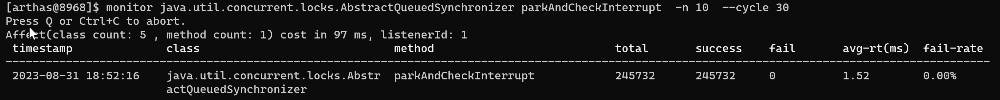
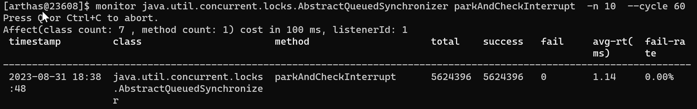
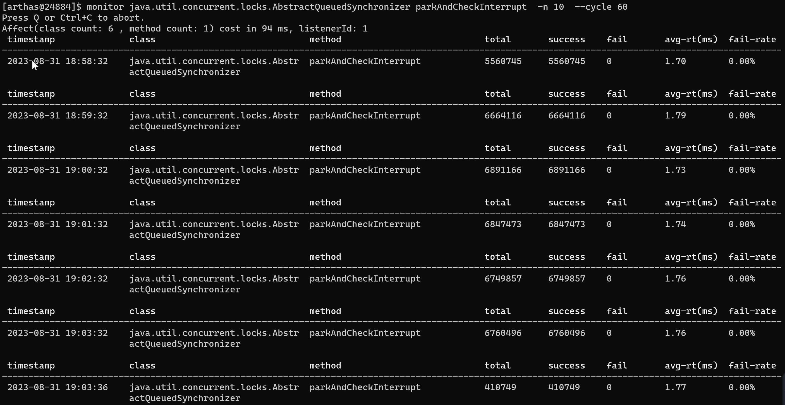

## 楔子

### 需求

有一个表的数据是1000万，访问时要求每条记录的访问是串行（需要加锁）的，多条记录的访问可以并行，同时数据主键是接口传过来的。

基于此需求，需要设计一个动态分配锁的分配器，需要实现的功能如下：

- 第一个线程访问时需要创建一把锁对象。
- 多个线程同时访问时，能获取到同一把锁
- 最后一个访问线程退出时，锁对象需要被回收。

### 接口

抽象出了一个接口，包含分配锁和释放锁的方法。使用者在临界区之前，根据name从LockAllocator分配一把锁，在临界区执行完成之后，释放与name绑定的锁。

```java
public interface LockAllocator<T extends Lock> {

    T allocateLock(String name);

    void releaseLock(String name);

}
```

### 测试

测试环境：AMD 4800H，Windows11，HotSpot 1.8.0_221。

为了测试安全性和分配性能，写了下面一段代码：

```java
/**
 * @author addenda
 * @since 2023/6/3 12:36
 */
public abstract class ReentrantLockAllocatorBaseTest {

    LockAllocator<? extends Lock> lockAllocator;

    public ReentrantLockAllocatorBaseTest(LockAllocator<? extends Lock> lockAllocator) {
        this.lockAllocator = lockAllocator;
    }

    public void baseTest() {
        List<Long> list = new ArrayList<>();
        for (int i = 0; i < 100; i++) {
            long start = System.currentTimeMillis();
            doTest();
            long end = System.currentTimeMillis();
            list.add(end - start);
        }
        list.sort(Comparator.naturalOrder());

        long sum = 0;
        for (int i = 5; i < 95; i++) {
            sum = list.get(i) + sum;
        }
        System.out.println("avg : " + sum / 90 + " ms");
    }

    private int THREAD_COUNT = 100;
    private int DATA_SIZE = 10;

    public void doTest() {
        long start = System.currentTimeMillis();
        int[] intArray = createIntArray(DATA_SIZE);

        List<Thread> threadList1 = multiThreadRun(f -> intArray[f]++);
        List<Thread> threadList2 = multiThreadRun(f -> intArray[f]--);

        for (int i = 0; i < 100; i++) {
            threadList1.get(i).start();
            threadList2.get(i).start();
        }

        join(threadList1);
        join(threadList2);

        assertResult(intArray);

        long end = System.currentTimeMillis();

//        System.out.printf(
//            "cost %s ms \t\t, result: %s"
//            , (end - start)
//            , Arrays.stream(intArray).mapToObj(String::valueOf).collect(Collectors.joining()));
//        System.out.println();

    }

    private void assertResult(int[] intArray) {
        for (int i = 0; i < DATA_SIZE; i++) {
            if (intArray[i] != 0) {
                throw new RuntimeException();
            }
        }
    }

    private List<Thread> multiThreadRun(Consumer<Integer> consumer) {
        List<Thread> threadList = new ArrayList<>();
        for (int i = 0; i < THREAD_COUNT; i++) {
            int finalI = i % 10;
            threadList.add(new Thread(() -> {
                for (int j = 0; j < 1000; j++) {
                    Lock test = lockAllocator.allocateLock("test" + finalI);
                    test.lock();
                    try {
                        consumer.accept(finalI);
                    } finally {
                        test.unlock();
                        lockAllocator.releaseLock("test" + finalI);
                    }
                }
            }));
        }
        return threadList;
    }

    private int[] createIntArray(int size) {
        int[] values = new int[size];
        for (int i = 0; i < size; i++) {
            values[i] = 0;
        }
        return values;
    }

    @SneakyThrows
    private void join(List<Thread> threadList) {
        for (Thread thread : threadList) {
            thread.join();
        }
    }

}
```

doTest()开了100个increment线程和100个decrement线程，一共有十个临界变量，每个变量被十个increment线程和十个decrement线程运算，每个increment/decrement线程执行1000次数学运算。

```java
/**
 * @author addenda
 * @since 2023/6/3 12:36
 */
public class ReentrantLockAllocatorBaseDataTest {

    public void baseTest() {
        List<Long> list = new ArrayList<>();
        for (int i = 0; i < 100; i++) {
            long start = System.currentTimeMillis();
            doTest();
            long end = System.currentTimeMillis();
            list.add(end - start);
        }
        list.sort(Comparator.naturalOrder());

        long sum = 0;
        for (int i = 5; i < 95; i++) {
            sum = list.get(i) + sum;
        }
        System.out.println("avg : " + sum / 90 + " ms");
    }

    private int THREAD_COUNT = 100;
    private int DATA_SIZE = 10;

    public void doTest() {
        long start = System.currentTimeMillis();
        int[] intArray = createIntArray(DATA_SIZE);

        List<Thread> threadList1 = multiThreadRun(f -> intArray[f]++);
        List<Thread> threadList2 = multiThreadRun(f -> intArray[f]--);

        for (int i = 0; i < 100; i++) {
            threadList1.get(i).start();
            threadList2.get(i).start();
        }

        join(threadList1);
        join(threadList2);

        long end = System.currentTimeMillis();

//        System.out.printf(
//            "cost %s ms \t\t, result: %s"
//            , (end - start)
//            , Arrays.stream(intArray).mapToObj(String::valueOf).collect(Collectors.joining()));
//        System.out.println();

    }

    private void assertResult(int[] intArray) {
        for (int i = 0; i < DATA_SIZE; i++) {
            if (intArray[i] != 0) {
                throw new RuntimeException();
            }
        }
    }

    private List<Thread> multiThreadRun(Consumer<Integer> consumer) {
        List<Thread> threadList = new ArrayList<>();
        for (int i = 0; i < THREAD_COUNT; i++) {
            int finalI = i % 10;
            threadList.add(new Thread(() -> {
                for (int j = 0; j < 1000; j++) {
                    consumer.accept(finalI);
                }
            }));
        }
        return threadList;
    }

    private int[] createIntArray(int size) {
        int[] values = new int[size];
        for (int i = 0; i < size; i++) {
            values[i] = 0;
        }
        return values;
    }

    @SneakyThrows
    private void join(List<Thread> threadList) {
        for (Thread thread : threadList) {
            thread.join();
        }
    }

}
```

doTest()一共运行了100次，去除耗时最小的5次和耗时最大的5次，其他的取平均数。

上面的这段代码测试无锁情况下，单纯执行同样多的increment和decrement操作性能是多少。

**基础执行时间的测试数据是11 ms。**


## 实现

### ReentrantLock

1. 首先需要有一个Map来存储与ID关联的锁。
2. 由于releaseLock()的时候需要保证对象能被回收，所以当没有线程在使用锁的时候需要将锁从Map中移出。
3. 使用ReentrantLock对临界区加锁。

```java
/**
 * @author addenda
 * @since 2023/5/30 22:51
 */
public class Impl_ReentrantLock implements LockAllocator<Lock> {

    private final Map<String, Binary<Lock, Integer>> lockMap = new HashMap<>();

    private final Lock lock = new ReentrantLock();

    @Override
    public Lock allocateLock(String name) {
        lock.lock();
        try {
            Binary<Lock, Integer> lockBinary = lockMap
                    .computeIfAbsent(name, s -> new Binary<>(new ReentrantLock(), 0));
            lockBinary.setF2(lockBinary.getF2() + 1);
            return lockBinary.getF1();
        } finally {
            lock.unlock();
        }
    }

    @Override
    public void releaseLock(String name) {
        lock.lock();
        try {
            Binary<Lock, Integer> lockBinary = lockMap.get(name);
            if (lockBinary == null) {
                String msg = String.format("锁 [%s] 不存在！", name);
                throw new ConcurrentException(msg);
            }

            lockBinary.setF2(lockBinary.getF2() - 1);
            int i = lockBinary.getF2();
            if (i == 0) {
                lockMap.remove(name);
            }
        } finally {
            lock.unlock();
        }
    }

    public Map<String, Binary<Lock, Integer>> getLockMap() {
        return lockMap;
    }
}
```

**代码的执行时间是20 ms。去除基础执行时间，分配时间为9ms。**

### ReentrantLock_Segment

1. 由于临界区是按ID区分的，所以想到了使用分段锁可以增强性能。
2. 使用分段锁之后，Map必须换成ConcurrentHashMap，这是因为：
   1. 虽然，同一个ID一定会加同一把锁，即releaseLock()里的if remove代码块一定是按ID串行执行。
   2. 但是多个ID对应的线程可以并发执行，即Map会被并发的get put。HashMap不支持并发的get put。

```java
/**
 * @author addenda
 * @since 2023/5/30 22:51
 */
public class Impl_ReentrantLock_Segment implements LockAllocator<Lock> {

    private final Map<String, Binary<Lock, AtomicInteger>> lockMap = new ConcurrentHashMap<>();

    private final Lock[] locks;

    public Impl_ReentrantLock_Segment() {
        locks = new Lock[2 << 4];
        for (int i = 0; i < 2 << 4; i++) {
            locks[i] = new ReentrantLock();
        }
    }

    @Override
    public Lock allocateLock(String name) {
        Lock lock = locks[index(name)];
        lock.lock();
        try {
            Binary<Lock, AtomicInteger> lockBinary = lockMap
                .computeIfAbsent(name, s -> new Binary<>(new ReentrantLock(), new AtomicInteger(0)));
            lockBinary.getF2().getAndIncrement();
            return lockBinary.getF1();
        } finally {
            lock.unlock();
        }
    }

    @Override
    public void releaseLock(String name) {
        Lock lock = locks[index(name)];
        lock.lock();
        try {
            Binary<Lock, AtomicInteger> lockBinary = lockMap.get(name);
            if (lockBinary == null) {
                String msg = String.format("锁 [%s] 不存在！", name);
                throw new ConcurrentException(msg);
            }
            int i = lockBinary.getF2().decrementAndGet();
            if (i == 0) {
                lockMap.remove(name);
            }
        } finally {
            lock.unlock();
        }
    }

    private int index(String name) {
        return name.hashCode() & ((2 << 4) - 1);
    }

    public Map<String, Binary<Lock, AtomicInteger>> getLockMap() {
        return lockMap;
    }

}
```

**代码的执行时间是17 ms。去除基础执行时间，分配时间为6ms。**

1. **加了分段锁之后，性能有了一定的提升，分配降低了33%（9ms -> 6ms）。**

### Synchronized

1. 有了ReentrantLock，肯定少不了synchronized。

```java
/**
 * @author addenda
 * @since 2023/8/28 12:14
 */
public class Impl_Synchronized implements LockAllocator<Lock> {

    private final Map<String, Binary<Lock, Integer>> lockMap = new HashMap<>();

    private final Lock lock = new ReentrantLock();

    @Override
    public Lock allocateLock(String name) {
        synchronized (lock) {
            Binary<Lock, Integer> lockBinary = lockMap
                .computeIfAbsent(name, s -> new Binary<>(new ReentrantLock(), 0));
            lockBinary.setF2(lockBinary.getF2() + 1);
            return lockBinary.getF1();
        }
    }

    @Override
    public void releaseLock(String name) {
        synchronized (lock) {
            Binary<Lock, Integer> lockBinary = lockMap.get(name);
            if (lockBinary == null) {
                String msg = String.format("锁 [%s] 不存在！", name);
                throw new ConcurrentException(msg);
            }

            lockBinary.setF2(lockBinary.getF2() - 1);
            int i = lockBinary.getF2();
            if (i == 0) {
                lockMap.remove(name);
            }
        }
    }
}
```

**代码的执行时间是36 ms。去除基础执行时间，分配时间为25ms。**

1. **使用synchronized相比于ReentrantLock，耗时大幅上升，增长了177%（9ms->25ms）。**

### Synchnorized_Segment

1. 有了ReentrantLock_Segment，肯定少不了synchronized。

```java
/**
 * @author addenda
 * @since 2023/5/30 22:51
 */
public class Impl_Synchronized_Segment implements LockAllocator<Lock> {

    private final Map<String, Binary<Lock, AtomicInteger>> lockMap = new ConcurrentHashMap<>(2048);

    private final Lock[] locks;

    public Impl_Synchronized_Segment() {
        locks = new Lock[2 << 4];
        for (int i = 0; i < 2 << 4; i++) {
            locks[i] = new ReentrantLock();
        }
    }

    @Override
    public Lock allocateLock(String name) {
        Lock lock = locks[index(name)];
        synchronized (lock) {
            Binary<Lock, AtomicInteger> lockBinary = lockMap
                .computeIfAbsent(name, s -> new Binary<>(new ReentrantLock(), new AtomicInteger(0)));
            lockBinary.getF2().getAndIncrement();
            return lockBinary.getF1();
        }
    }

    @Override
    public void releaseLock(String name) {
        Lock lock = locks[index(name)];
        synchronized (lock) {
            Binary<Lock, AtomicInteger> lockBinary = lockMap.get(name);
            if (lockBinary == null) {
                String msg = String.format("锁 [%s] 不存在！", name);
                throw new ConcurrentException(msg);
            }
            int i = lockBinary.getF2().decrementAndGet();
            if (i == 0) {
                lockMap.remove(name);
            }
        }
    }

    private int index(String name) {
        return name.hashCode() & ((2 << 4) - 1);
    }

    public Map<String, Binary<Lock, AtomicInteger>> getLockMap() {
        return lockMap;
    }

}
```

**代码的执行时间是16 ms。去除基础执行时间，分配时间为5ms。**

1. **使用Synchronized_Segment相比于ReentrantLock_Segment，分配时间降低了20%（6ms->5ms）。**
2. **使用Synchronized_Segment相比于synchronized，分配时间大幅降低。**
3. **从结果可以看出，synchronized在并发低的情况下性能比ReentrantLock要好，但是在并发高的情况下，性能比ReentrantLock差很多。这个结果可以理解，因为synchronized的实现里应用了偏向锁和轻量级锁提升在低并发下的性能，但是在高并发下大概率会进入重量级锁，此时轻量级锁和偏向锁两个步骤反而成为了额外的消耗。**

### ReentrantWriteReadLock

1. 观察allocateLock()和releaseLock()可知，前者的实现是支持多个线程并发执行的，但是后者的实现由于有if remove的存在不能并发执行。这种结构可以使用读写锁实现并发控制。
2. 使用ReentrantReadWriteLock之后，也必须使用ConcurrentHashMap，因为allocateLock()方法会被并发执行，HashMap不支持并发的put。

```java
/**
 * @author addenda
 * @since 2023/5/30 22:51
 */
public class Impl_ReentrantReadWriteLock implements LockAllocator<Lock> {

    private final Map<String, Binary<Lock, AtomicInteger>> lockMap = new ConcurrentHashMap<>();

    private final ReadWriteLock lock = new ReentrantReadWriteLock();

    @Override
    public Lock allocateLock(String name) {
        Lock readLock = lock.readLock();
        readLock.lock();
        try {
            Binary<Lock, AtomicInteger> lockBinary = lockMap
                .computeIfAbsent(name, s -> new Binary<>(new ReentrantLock(), new AtomicInteger(0)));
            lockBinary.getF2().getAndIncrement();
            return lockBinary.getF1();
        } finally {
            readLock.unlock();
        }
    }

    @Override
    public void releaseLock(String name) {
        Lock writeLock = lock.writeLock();
        writeLock.lock();
        try {
            Binary<Lock, AtomicInteger> lockBinary = lockMap.get(name);
            if (lockBinary == null) {
                String msg = String.format("锁 [%s] 不存在！", name);
                throw new ConcurrentException(msg);
            }
            int i = lockBinary.getF2().decrementAndGet();
            if (i == 0) {
                lockMap.remove(name);
            }
        } finally {
            writeLock.unlock();
        }
    }

}
```

**代码的执行时间是326 ms。去除基础执行时间，分配时间为315ms。**

1. **使用ReentrantReadWriteLock相比于ReentrantLock，分配耗时天量提高，提高了3400%（9ms->315ms）。**

分析原因：

ReentrantReadWriteLock相比于ReentrantLock，需要实现多线程同时读，所以在实现的时候引入了ThreadLocal来存储每个线程的重入次数。ThreadLocal的引入会消耗很多性能？需要测一下。

```java
/**
 * @author addenda
 * @since 2023/8/28 20:32
 */
public class ThreadLocalCostVsObjectFieldCostTest {

    private int value = 0;

    private ThreadLocalHoldCounter threadLocal = new ThreadLocalHoldCounter();

    /**
     * ThreadLocal subclass. Easiest to explicitly define for sake
     * of deserialization mechanics.
     */
    static final class ThreadLocalHoldCounter
        extends ThreadLocal<HoldCounter> {
        public HoldCounter initialValue() {
            return new HoldCounter();
        }
    }

    static final class HoldCounter {
        int count = 0;
        // Use id, not reference, to avoid garbage retention
    }


    @Test
    public void test() {
        for (int i = 0; i < 10; i++) {
            test1();
            test2();
        }
    }

    public void test1() {
        long start = System.currentTimeMillis();
        for (int i = 0; i < 200 * 1000 * 2 * 100; i++) {
            value = value + 1;
        }
        long end = System.currentTimeMillis();
        System.out.println("object field cost: " + (end - start) + "ms");
    }

    public void test2() {
        long start = System.currentTimeMillis();
        for (int i = 0; i < 200 * 1000 * 2  * 100; i++) {
            threadLocal.get().count++;
        }
        long end = System.currentTimeMillis();
        System.out.println("threadlocal cost: " + (end - start) + "ms");
    }

}
```

上面的代码循环的次数是 200线程 * 1000次迭代 * 每次迭代2次操作 * 100次测试。

```
object field cost: 1ms
threadlocal cost: 91ms
```

可以看到，threadlocal cost仅仅是91ms，平均每次不到1ms，所以不是这个引起的耗时。

我们都知道线程的等待和唤醒是非常耗时的，很多的框架在并发的时候都尽量让线程少等待和唤醒，经典做法是在多核CPU上采用自旋方案。所以是不是ReentrantReadWriteLock相比于ReentrantLock，陷入等待的次数会更多呢？我们也是测试一下。

AQS的代码里，实现线程陷入阻塞功能的方法是parkAndCheckInterrupt()。

```java
/**
  * Convenience method to park and then check if interrupted
  *
  * @return {@code true} if interrupted
  */
private final boolean parkAndCheckInterrupt() {
    LockSupport.park(this);
    return Thread.interrupted();
}
```

利用arthas统计ReentrantReadWriteLock实现和ReentrantLock实现下当前方法的执行次数。

ReentrantLock：



ReentrantReadWriteLock：



可以很明显的看到ReentrantReadWriteLock实现陷入等待的此次数是ReentrantLock实现的近22倍，所以ReentrantReadWriteLock耗时大幅提升的原因就是频繁陷入等待。不过，为什么会频繁陷入等待呢？

```java
static final class NonfairSync extends Sync {
    private static final long serialVersionUID = -8159625535654395037L;
    final boolean writerShouldBlock() {
        return false; // writers can always barge
    }
    final boolean readerShouldBlock() {
        /* As a heuristic to avoid indefinite writer starvation,
         * block if the thread that momentarily appears to be head
         * of queue, if one exists, is a waiting writer.  This is
         * only a probabilistic effect since a new reader will not
         * block if there is a waiting writer behind other enabled
         * readers that have not yet drained from the queue.
         */
        return apparentlyFirstQueuedIsExclusive();
    }
}
/**
  * Returns {@code true} if the apparent first queued thread, if one
  * exists, is waiting in exclusive mode.  If this method returns
  * {@code true}, and the current thread is attempting to acquire in
  * shared mode (that is, this method is invoked from {@link
  * #tryAcquireShared}) then it is guaranteed that the current thread
  * is not the first queued thread.  Used only as a heuristic in
  * ReentrantReadWriteLock.
  */
final boolean apparentlyFirstQueuedIsExclusive() {
    Node h, s;
    return (h = head) != null &&
        (s = h.next)  != null &&
        !s.isShared()         &&
        s.thread != null;
}
```

```java
final void lock() {
    if (compareAndSetState(0, 1))
        setExclusiveOwnerThread(Thread.currentThread());
    else
        acquire(1);
}
```

分析一下ReentrantReadWriteLock的源码可以发现，其为了防止写线程饥饿，读线程在发现等待队列的头节点为写线程时会进入等待。这种实现相比于ReentrantLock的上来就抢一下锁的实现，确实会更多的陷入等待。

ReentrantLock的公平锁实现中线程获取锁前会去看一下等待队列里是否存在其他等待的线程，所以会大大增加线程陷入等待的概览。测一下这个场景。

我们将ReentrantLock由非公平锁改为公平锁，代码的执行时间是3506 ms。去除基础执行时间，分配时间为3495ms。会发现其性能比ReentrantReadWriteLock还要差很多。



同时，通过arthas可以捕获到其陷入等待的次数为39,884,602。

需要提一嘴，读写锁的使用场景是提升读操作的并发性，往往读锁的临界区是比较耗时的，尤其是在读操作>>写操作时，读的并行进行会让性能的提升很高。上面测试代码读和写的比例是1比1，且临界期执行的速度很快，用读写锁提升性能本来就有限。

### ReentrantReadWriteLock_Segment

ReentrantReadWriteLock_Segment引入分段。

```java
/**
 * @author addenda
 * @since 2023/5/30 22:51
 */
public class Impl_ReentrantReadWriteLock_Segment implements LockAllocator<Lock> {

    private final Map<String, Binary<Lock, AtomicInteger>> lockMap = new ConcurrentHashMap<>();

    private final ReadWriteLock[] locks;

    private final int segmentSize;

    public Impl_ReentrantReadWriteLock_Segment(int segmentSize) {
        this.segmentSize = segmentSize;
        locks = new ReadWriteLock[segmentSize];
        for (int i = 0; i < segmentSize; i++) {
            locks[i] = new ReentrantReadWriteLock();
        }
    }

    public Impl_ReentrantReadWriteLock_Segment() {
        this(2 << 5);
    }

    @Override
    public Lock allocateLock(String name) {
        ReadWriteLock readWriteLock = locks[index(name)];
        Lock readLock = readWriteLock.readLock();
        readLock.lock();
        try {
            Binary<Lock, AtomicInteger> lockBinary = lockMap
                    .computeIfAbsent(name, s -> new Binary<>(new ReentrantLock(), new AtomicInteger(0)));
            lockBinary.getF2().getAndIncrement();
            return lockBinary.getF1();
        } finally {
            readLock.unlock();
        }
    }

    @Override
    public void releaseLock(String name) {
        ReadWriteLock readWriteLock = locks[index(name)];
        Lock writeLock = readWriteLock.writeLock();

        writeLock.lock();
        try {
            Binary<Lock, AtomicInteger> lockBinary = lockMap.get(name);
            if (lockBinary == null) {
                String msg = String.format("锁 [%s] 不存在！", name);
                throw new ConcurrentException(msg);
            }
            int i = lockBinary.getF2().decrementAndGet();
            if (i == 0) {
                i = lockBinary.getF2().get();
                if (i == 0) {
                    lockMap.remove(name);
                }
            }
        } finally {
            writeLock.unlock();
        }

    }

    private int index(String name) {
        return name.hashCode() & (segmentSize - 1);
    }

}
```

**代码的执行时间是58 ms。去除基础执行时间，分配时间为47ms。**

**引入分段之后，性能大幅度提升，说明分段对性能的优化是有帮助的 。**

### CAS

在ReentrantReadWriteLock的实现里说到，减少线程陷入等待的次数可以提升性能，那如果完全用CAS，不用锁性能会如何呢？

```java
/**
 * @author addenda
 * @since 2023/5/30 22:51
 */
public class Impl_CAS implements LockAllocator<Lock> {

    private final Map<String, Binary<Lock, Integer>> lockMap = new HashMap<>();

    private final AtomicInteger atomicInteger = new AtomicInteger(0);

    @Override
    public Lock allocateLock(String name) {
        while (!atomicInteger.compareAndSet(0, 1)) {
        }
        try {
            Binary<Lock, Integer> lockBinary = lockMap
                .computeIfAbsent(name, s -> new Binary<>(new ReentrantLock(), 0));
            lockBinary.setF2(lockBinary.getF2() + 1);
            return lockBinary.getF1();
        } finally {
            while (!atomicInteger.compareAndSet(1, 0)) {
            }
        }

    }

    @Override
    public void releaseLock(String name) {
        while (!atomicInteger.compareAndSet(0, 1)) {
        }
        try {
            Binary<Lock, Integer> lockBinary = lockMap.get(name);
            if (lockBinary == null) {
                String msg = String.format("锁 [%s] 不存在！", name);
                throw new ConcurrentException(msg);
            }

            lockBinary.setF2(lockBinary.getF2() - 1);
            int i = lockBinary.getF2();
            if (i == 0) {
                lockMap.remove(name);
            }
        } finally {
            while (!atomicInteger.compareAndSet(1, 0)) {
            }
        }
    }

    public Map<String, Binary<Lock, Integer>> getLockMap() {
        return lockMap;
    }
}
```

**代码的执行时间是 163 ms。去除基础执行时间，分配时间为 152ms。**

**可以看见，完全使用CAS，相比于ReentrantReadWriteLock这种频繁陷入等待的实现，性能要好，但是相比于ReentrantLock这种少量陷入等待的性能要差。**

### CAS_Segment

对CAS引入分段试试。

```java
/**
 * @author addenda
 * @since 2023/5/30 22:51
 */
public class Impl_CAS_Segment implements LockAllocator<Lock> {

    private final Map<String, Binary<Lock, Integer>> lockMap = new ConcurrentHashMap<>();

    private final AtomicInteger[] locks;

    public Impl_CAS_Segment() {
        locks = new AtomicInteger[2 << 4];
        for (int i = 0; i < 2 << 4; i++) {
            locks[i] = new AtomicInteger(0);
        }
    }

    @Override
    public Lock allocateLock(String name) {
        AtomicInteger atomicInteger = locks[index(name)];
        while (!atomicInteger.compareAndSet(0, 1)) {
        }
        try {
            Binary<Lock, Integer> lockBinary = lockMap
                .computeIfAbsent(name, s -> new Binary<>(new ReentrantLock(), 0));
            lockBinary.setF2(lockBinary.getF2() + 1);
            return lockBinary.getF1();
        } finally {
            while (!atomicInteger.compareAndSet(1, 0)) {
            }
        }

    }

    @Override
    public void releaseLock(String name) {
        AtomicInteger atomicInteger = locks[index(name)];
        while (!atomicInteger.compareAndSet(0, 1)) {
        }
        try {
            Binary<Lock, Integer> lockBinary = lockMap.get(name);
            if (lockBinary == null) {
                String msg = String.format("锁 [%s] 不存在！", name);
                throw new ConcurrentException(msg);
            }

            lockBinary.setF2(lockBinary.getF2() - 1);
            int i = lockBinary.getF2();
            if (i == 0) {
                lockMap.remove(name);
            }
        } finally {
            while (!atomicInteger.compareAndSet(1, 0)) {
            }
        }
    }

    public Map<String, Binary<Lock, Integer>> getLockMap() {
        return lockMap;
    }

    private int index(String name) {
        return name.hashCode() & ((2 << 4) - 1);
    }

}
```

**代码的执行时间是 20 ms。去除基础执行时间，分配时间为 9ms。**

**同样可以看出分段之后，分配时间大大减少。**

### 结论

ReentrantLock+分段锁+ConcurruentHashMap是性能最好的选择。


## 延迟回收

在生产使用过程中，我发现还有一种情况，就是最后一个访问线程退出临界区时不能立即回收对象。这种场景的使用案例为限流器（在请求全部串行的情况下，如果release之后再allocate就申请新的对象，会超出限流器的阈值）。其需求分解为：

- 第一个线程访问时
  - 如果延迟队列里没有对象，创建一个对象。
  - 如果延迟队列里有对象
    - 如果对象存活，从延迟队列中获取
    - 如果对象不存活，创建一个对象

- 多个线程同时访问时，能获取到同一对象。
- 最后一个访问线程退出临界区时，对象加入延迟回收队列并记录存活时间，一段时间后再被回收。

由于之前已经证明了，ReentrantLock+分段锁+ConcurruentHashMap是性能最好的选择，所以这里只实现了此种模式。

在具体实现的时候，只需要增加一个延迟回收队列即可。相关实现如下：

```java
/**
 * @author addenda
 * @since 2023/5/30 22:51
 */
@ToString(exclude = {"lockFactory"})
public abstract class ReferenceCountDelayReleasedAllocator<T>
        extends AbstractNamed
        implements DelayReleasedAllocator<T> {

  private final Map<String, Binary<T, AtomicInteger>> map = new ConcurrentHashMap<>();

  private final Map<String, Binary<T, Long>> releasedMap = new ConcurrentHashMap<>();

  private final Long delayReleaseTtl;

  @Setter
  private long cleaningFrequency = 100;

  private final AtomicLong count = new AtomicLong(0L);

  /**
   * lockFactory的作用是生产lock并且在执行{@link ReferenceCountDelayReleasedAllocator#allocate(String)}和{@link ReferenceCountDelayReleasedAllocator#release(String)}
   * 的时候保证并发安全。
   *
   * <ul>
   *   <li>如果不需要保证并发安全，使用{@link DumbLockFactory}</li>
   *   <li>如果需要保证全局并发安全，使用{@link ReentrantLockFactory}</li>
   *   <li>如果需要保证分段并发安全（相比于全局并发安全，可以提升性能），使用{@link ReentrantSegmentLockFactory}</li>
   * </ul>
   */
  private final LockFactory<String> lockFactory;

  protected ReferenceCountDelayReleasedAllocator(LockFactory<String> lockFactory, Long delayReleaseTtl) {
    this.lockFactory = lockFactory;
    this.delayReleaseTtl = delayReleaseTtl;
  }

  @Override
  public void releaseDelay(String name) {
    Lock lock = lockFactory.getLock(name);
    lock.lock();
    try {
      Binary<T, AtomicInteger> binary = map.get(name);
      if (binary == null) {
        String msg = String.format("资源 [%s] 不存在！", name);
        throw new AllocatorException(msg);
      }
      int i = binary.getF2().decrementAndGet();
      if (i == 0) {
        i = binary.getF2().get();
        if (i == 0) {
          Binary<T, AtomicInteger> removed = map.remove(name);
          releasedMap.put(name, new Binary<>(removed.getF1(), System.currentTimeMillis() + delayReleaseTtl));
        }
      }
    } finally {
      lock.unlock();
    }
  }

  @Override
  public T allocate(String name) {
    Lock lock = lockFactory.getLock(name);
    lock.lock();
    try {
      clear();

      Binary<T, AtomicInteger> binary = map
              .computeIfAbsent(name, new Function<String, Binary<T, AtomicInteger>>() {
                @Override
                public Binary<T, AtomicInteger> apply(String s) {
                  Binary<T, Long> releasedT = releasedMap.remove(s);
                  if (releasedT != null && System.currentTimeMillis() > releasedT.getF2()) {
                    releasedT = null;
                  }
                  if (releasedT == null) {
                    return new Binary<>(referenceFunction().apply(name), new AtomicInteger(0));
                  }
                  return new Binary<>(releasedT.getF1(), new AtomicInteger(0));
                }
              });
      binary.getF2().getAndIncrement();
      return binary.getF1();
    } finally {
      lock.unlock();
    }
  }

  @Override
  public void release(String name) {
    Lock lock = lockFactory.getLock(name);
    lock.lock();
    try {
      Binary<T, AtomicInteger> binary = map.get(name);
      if (binary == null) {
        String msg = String.format("资源 [%s] 不存在！", name);
        throw new AllocatorException(msg);
      }
      int i = binary.getF2().decrementAndGet();
      if (i == 0) {
        map.remove(name);
      }
    } finally {
      lock.unlock();
    }
  }

  private void clear() {
    long c = count.incrementAndGet();
    if (c % cleaningFrequency != 0) {
      return;
    }
    long now = System.currentTimeMillis();
    Iterator<Map.Entry<String, Binary<T, Long>>> iterator = releasedMap.entrySet().iterator();
    while (iterator.hasNext()) {
      Map.Entry<String, Binary<T, Long>> next = iterator.next();
      Long expire = next.getValue().getF2();
      if (now > expire) {
        iterator.remove();
      }
    }
  }

  /**
   * 如果{@link ReferenceCountDelayReleasedAllocator#map}里没有与name绑定的对象，通过此函数申请对象。
   * Function的参数是资源名称，返回值是资源。
   */
  protected abstract Function<String, T> referenceFunction();

}
```


## 空闲过期

还有一种场景，如果一个对象被allocate出去之后，如果长时间没有再allocate会自动过期。比如在长连接场景下，我希望一个session使用一段时间后能丢弃再开一个，以避免有可能的内存泄露问题。其需求分解为：

- 第一个线程访问时需要创建一个对象。并记录更新对象的存活时间。
- 多个线程同时访问时
  - 如果存储的对象存活，更新对象的存活时间。
  - 如果存储的对象不存活，创建一个新的对象，初始化对象的存活时间。
- 最后一个访问线程退出时，锁对象需要被回收。

具体实现是将原有的Binary\<T, 计数器>拓展为Ternary\<T, 计数器, 过期时间>。

```java
/**
 * @author addenda
 * @since 2023/9/13 21:35
 */
public abstract class ReferenceCountIdleExpirationAllocator<T>
        extends AbstractNamed
        implements IdelExpirationAllocator<T> {

  /**
   * key：名字
   * value: T,对象；Long,过期时间
   */
  private final Map<String, Ternary<T, AtomicInteger, Long>> map = new ConcurrentHashMap<>();

  /**
   * lockFactory的作用是生产lock并且在执行{@link ReferenceCountDelayedReleaseAllocator#allocate(String)}和{@link ReferenceCountDelayedReleaseAllocator#release(String)}
   * 的时候保证并发安全。
   *
   * <ul>
   *   <li>如果不需要保证并发安全，使用{@link DumbLockFactory}</li>
   *   <li>如果需要保证全局并发安全，使用{@link ReentrantLockFactory}</li>
   *   <li>如果需要保证分段并发安全（相比于全局并发安全，可以提升性能），使用{@link ReentrantSegmentLockFactory}</li>
   * </ul>
   */
  private final LockFactory<String> lockFactory;

  private final long ttl;

  private final boolean alwaysUpdateTtl;

  public ReferenceCountIdleExpirationAllocator(LockFactory<String> lockFactory, long ttl, boolean alwaysUpdateTtl) {
    this.lockFactory = lockFactory;
    this.ttl = ttl;
    this.alwaysUpdateTtl = alwaysUpdateTtl;
  }

  @Override
  public T allocate(String name) {
    return allocate(name, TimeUnit.DAYS, 3650);
  }

  @Override
  public T allocateWithDefaultTtl(String name) {
    return allocate(name, TimeUnit.MILLISECONDS, ttl);
  }

  @Override
  public void release(String name) {
    Lock lock = lockFactory.getLock(name);
    lock.lock();
    try {
      Ternary<T, AtomicInteger, Long> removed = map.get(name);
      if (removed == null) {
        String msg = String.format("资源 [%s] 不存在！", name);
        throw new AllocatorException(msg);
      }
      int i = removed.getF2().decrementAndGet();
      if (i == 0) {
        map.remove(name);
      }
    } finally {
      lock.unlock();
    }
  }

  @Override
  public T allocate(String name, TimeUnit timeUnit, long timeout) {
    Lock lock = lockFactory.getLock(name);
    lock.lock();
    try {
      long now = System.currentTimeMillis();
      long expire = timeUnit.toMillis(timeout) + now;
      Ternary<T, AtomicInteger, Long> oldTernary = map.remove(name);
      // 如果之前不存在，存数据及ttl
      if (oldTernary == null) {
        T apply = referenceFunction().apply(name);
        map.put(name, new Ternary<>(apply, new AtomicInteger(1), expire));
        return apply;
      }
      // 如果之前存在
      else {
        AtomicInteger f2 = oldTernary.getF2();
        f2.incrementAndGet();
        long oldExpire = oldTernary.getF3();
        T apply;
        if (now > oldExpire) {
          // ttl过期了： 新建一个对象替换旧对象，并更新ttl
          apply = referenceFunction().apply(name);
          map.put(name, new Ternary<>(apply, f2, expire));
        } else {
          // ttl没有过期
          apply = oldTernary.getF1();
          map.put(name, new Ternary<>(apply, f2, alwaysUpdateTtl ? expire : oldExpire));
        }
        return apply;
      }
    } finally {
      lock.unlock();
    }
  }

  protected abstract Function<String, T> referenceFunction();

}
```


## 附录

连续测试十次得到的各种实现的耗时数据。

```
------------------------------
BaseData : avg : 12 ms
ReentrantLock : avg : 20 ms
ReentrantLock_Segment : avg : 16 ms
Synchronized : avg : 34 ms
Synchronized_Segment : avg : 16 ms
ReentrantReadWriteLock : avg : 306 ms
ReentrantReadWriteLock_Segment : avg : 59 ms
CAS : avg : 157 ms
CAS_Segment : avg : 19 ms
------------------------------
BaseData : avg : 11 ms
ReentrantLock : avg : 20 ms
ReentrantLock_Segment : avg : 18 ms
Synchronized : avg : 35 ms
Synchronized_Segment : avg : 17 ms
ReentrantReadWriteLock : avg : 330 ms
ReentrantReadWriteLock_Segment : avg : 58 ms
CAS : avg : 125 ms
CAS_Segment : avg : 21 ms
------------------------------
BaseData : avg : 11 ms
ReentrantLock : avg : 20 ms
ReentrantLock_Segment : avg : 18 ms
Synchronized : avg : 35 ms
Synchronized_Segment : avg : 16 ms
ReentrantReadWriteLock : avg : 326 ms
ReentrantReadWriteLock_Segment : avg : 57 ms
CAS : avg : 149 ms
CAS_Segment : avg : 19 ms
------------------------------
BaseData : avg : 11 ms
ReentrantLock : avg : 20 ms
ReentrantLock_Segment : avg : 17 ms
Synchronized : avg : 36 ms
Synchronized_Segment : avg : 17 ms
ReentrantReadWriteLock : avg : 322 ms
ReentrantReadWriteLock_Segment : avg : 58 ms
CAS : avg : 128 ms
CAS_Segment : avg : 20 ms
------------------------------
BaseData : avg : 11 ms
ReentrantLock : avg : 20 ms
ReentrantLock_Segment : avg : 18 ms
Synchronized : avg : 35 ms
Synchronized_Segment : avg : 16 ms
ReentrantReadWriteLock : avg : 326 ms
ReentrantReadWriteLock_Segment : avg : 58 ms
CAS : avg : 153 ms
CAS_Segment : avg : 19 ms
------------------------------
BaseData : avg : 11 ms
ReentrantLock : avg : 20 ms
ReentrantLock_Segment : avg : 19 ms
Synchronized : avg : 37 ms
Synchronized_Segment : avg : 18 ms
ReentrantReadWriteLock : avg : 326 ms
ReentrantReadWriteLock_Segment : avg : 60 ms
CAS : avg : 141 ms
CAS_Segment : avg : 28 ms
------------------------------
BaseData : avg : 11 ms
ReentrantLock : avg : 20 ms
ReentrantLock_Segment : avg : 17 ms
Synchronized : avg : 35 ms
Synchronized_Segment : avg : 16 ms
ReentrantReadWriteLock : avg : 325 ms
ReentrantReadWriteLock_Segment : avg : 58 ms
CAS : avg : 163 ms
CAS_Segment : avg : 20 ms
------------------------------
BaseData : avg : 11 ms
ReentrantLock : avg : 20 ms
ReentrantLock_Segment : avg : 16 ms
Synchronized : avg : 38 ms
Synchronized_Segment : avg : 17 ms
ReentrantReadWriteLock : avg : 324 ms
ReentrantReadWriteLock_Segment : avg : 59 ms
CAS : avg : 142 ms
CAS_Segment : avg : 20 ms
------------------------------
BaseData : avg : 11 ms
ReentrantLock : avg : 20 ms
ReentrantLock_Segment : avg : 17 ms
Synchronized : avg : 36 ms
Synchronized_Segment : avg : 16 ms
ReentrantReadWriteLock : avg : 326 ms
ReentrantReadWriteLock_Segment : avg : 58 ms
CAS : avg : 163 ms
CAS_Segment : avg : 20 ms
------------------------------
BaseData : avg : 11 ms
ReentrantLock : avg : 20 ms
ReentrantLock_Segment : avg : 21 ms
Synchronized : avg : 38 ms
Synchronized_Segment : avg : 17 ms
ReentrantReadWriteLock : avg : 326 ms
ReentrantReadWriteLock_Segment : avg : 57 ms
CAS : avg : 139 ms
CAS_Segment : avg : 20 ms
```


