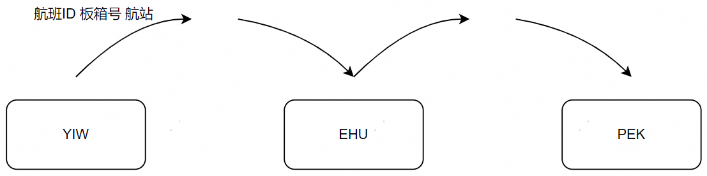
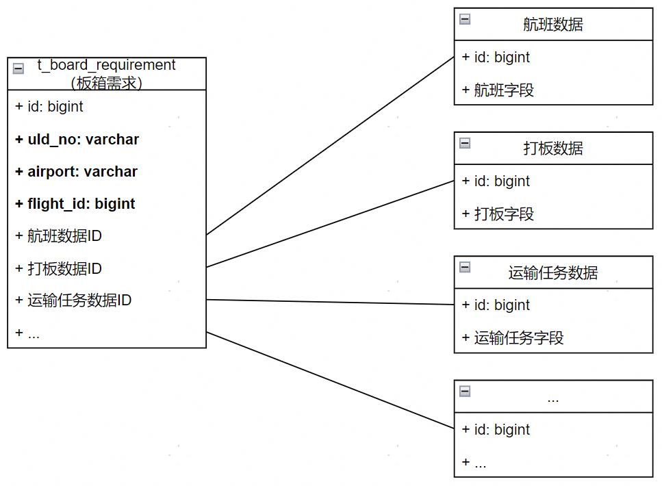
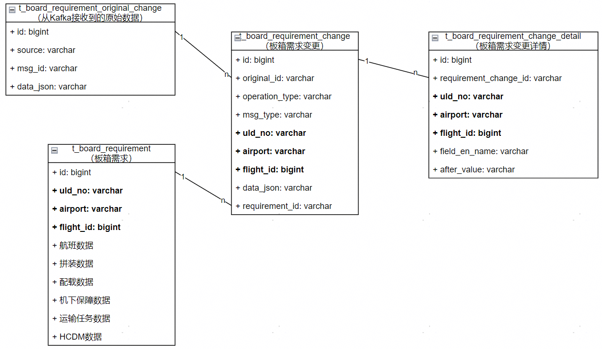
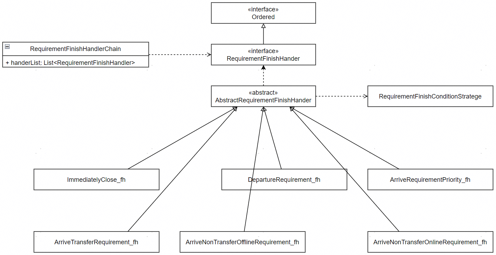

## 业务需求分析

快递被打包在一起后会放在特制的箱子里才能上飞机，这个箱子被我们成为板箱。

板箱在两个航站之间的运输有很多的保障节点，比如打板（把快递封装到板箱里）、出港运输（从快递区运送到机坪）、装机（将板箱从机坪上到飞机）、起飞（航班起飞）、落地（航班降落）、卸机（将板箱从飞机下到机坪）、进港运输（从机坪运送到快递区）、提货拆板（把快递从板箱里拆出来）。

前期我们已经做了很多套系统把业务流程线上化，但是没有一个系统能将完整的过程监控起来。所以产品设计了一个模块（命名为：需求池），希望能实时监控到板箱当前的状态。

板箱的保障流程可以分为三类：

1. 出港保障：打板 -> 出港运输 -> 装机 -> 起飞
2. 进港保障：落地 -> 卸机 -> 进港运输 -> 提货拆板
3. 中转保障：落地 -> 卸机 -> 装机 -> 起飞（从飞机A上卸下来，再装到飞机B上继续飞）

出港保障和进港保障的业务流程差异很大，无法将它们统一起来。中转保障可以看成是一次进港保障+一次出港保障（某些节点没有数据）。

在系统设计时，我们将`航班ID、板箱号、航站`作为保障的业务主键。

- 一次进港保障或一次出港保障都拥有一个唯一的业务主键。
- 一次中转保障拥有两个业务主键，其中数据写入时分别将出港和进港的数据写入到出港保障和进港保障的记录中；数据读取时，根据航班的起落航站可以将出港保障和进港保障在应用层关联起来。

<center><div>图1：业务主键的定义</div></center>

解释一下为什么`航班ID、板箱号、航站`可以作为业务主键：

1. 航班ID：一架飞机在两个航站之间飞行一次拥有一个唯一的ID
2. 板箱号：快递会被分别打包并放在不同的板箱里，这些板箱的编号都是互斥的。
3. 航站：机场三字码，每个机场都不同

系统在设计之初，我们就明确了一个核心的设计方向：降低写入复杂度。因为状态机的状态及状态的转换条件非常多，所以写入功能本身就很复杂。同时写入功能具有影响范围广的特点，尤其是生产出现脏数据后处理会很麻烦，所以为了防止后续需求变更时牵一发动全身，我们要尽可能用轻量级的流程固定下来状态机的流转过程，更多的逻辑在查询的时候进行。查询功能的变更往往只会影响到单个接口，生产出了问题，回滚或者修复都比较简单。

将中转保障拆分成进港保障和出港保障后，不需要重新为中转流程设计一套状态机，直接复用出港和进港的状态机。

名词解释：

1. 在内部，我们将一次保障称为一个（保障）需求。后面的代码或者图里会出现requirement这个单词，大家将需求（requirement）和保障混为一谈就好了。
2. 板箱在内部被翻译为uld或board，所以后面的代码或图里这两个单词也会混用，大家也是混为一谈即可。


## 状态机

### 消息驱动

各个业务系统将各自业务的状态数据推送至Kafka，需求池模块监听这些消息。有些系统此前已经发送过自己的业务数据到Kafka中，为了降低开发量，我们本次复用了这些数据。还有些系统没有发送或发送的数据不足以满足我们的需求，那就需要新开发数据推送逻辑了。

生产者数据推送的基本方案是对表进行埋点拦截，具体来说是在表进行增删改操作后将对应记录的最新数据发送到Kafka。这样的话每次发送到Kafka的数据是全量的数据，消费者只需要应用最新的数据即可。

新开发的数据推送功能，其推送的消息的格式是由我们定义的，所以能直接满足需要；旧的数据推送逻辑，他们的数据格式五花八门，所以我们使用适配器模式将其适配到我们定义的数据格式中。

由于每个业务系统负责的业务节点不同，所以监听或或适配出来的消息字段也不同。我们将消息的通用字段抽取出来，每个具体的消息继承通用字段后再添加自己的业务字段。通用字段如下：

```java
public class BaseRequirementMsg {
    private String msgId;

    private OperationType operationType;

    private MsgType msgType;

    private RequirementSource source;

    private String uldNo;

    private Long flightId;

    private String airport;

    private BusinessCode businessCode;

    private String operator;

    private LocalDateTime operationTime;
}
```

解释：

1. msgId：每个消息都有的一个唯一ID，做幂等时使用
2. operationType：增/删/改
3. msgType：消息的具体类型。指示从Kafka接收到消息后需要用哪个实体类接收。
4. source：消息来源哪个业务系统
5. uldNo：业务主键之板箱号
6. flightId：业务主键之航班ID
7. airport：业务主键之机场三字码
9. businessCode：消息对应的业务节点。
10. operator：操作人
11. operationTime：操作时间

这些字段确定了如何操作状态机。每个子类型会补充自己的业务字段。比如下面是板箱运输独有的业务字段。

```java
@Setter
@Getter
@ToString(callSuper = true)
public class BoardTransportMsg extends BaseRequirementMsg {

    @Mapped(fieldEnName = "realStartLocation", fieldCnName = "实际起始地")
    private String startLocation;

    @Mapped(fieldEnName = "realEndLocation", fieldCnName = "实际目的地")
    private String endLocation;

    @Mapped(fieldEnName = "currentDeliveryStatus", fieldCnName = "板箱当前运输状态")
    private DeliveryStatus deliveryStatus;

    @Mapped(fieldEnName = "driverId", fieldCnName = "司机工号")
    private String driverId;

    @Mapped(fieldEnName = "taskTypeId", fieldCnName = "任务类型ID")
    private Long taskTypeId;
    
    @Mapped(fieldEnName = "currentTaskmMainId", fieldCnName = "板箱当前运输主表ID")
    private Long boardTaskmMainId;

    @Mapped(fieldEnName = "firstHandoverTime", fieldCnName = "开始交接时间",
        msgCondition = "(#this.deliveryStatus != null)   && (#this.deliveryStatus.toString() EQ 'TASK_ALREADY_HANDOVER') && (#this.forceUpdateFirstHandoverTime EQ 'N')",
        requirementCondition = "#this.firstHandoverTime == null")
    private LocalDateTime firstHandoverTime;

    @Mapped(fieldEnName = "lastReachTime", fieldCnName = "最后送达时间",
        msgCondition = "(#this.deliveryStatus != null)       && ((#this.deliveryStatus.toString() EQ 'TASK_DELIVERED') or (#this.deliveryStatus.toString() EQ 'TASK_FORCE_DELIVERED'))")
    private LocalDateTime lastReachTime;

}
```

### 状态转换图

基于业务流程和消息，我们画出了完整的状态转换图。

<center><div>图2：状态机</div></center>

从图中可以看出来，我们对每个业务节点都进行了定义。节点之间的转换由一个确定类型的消息驱动。可以看出大部分的消息都是标准格式的消息，而转换到待进港、已出港、已开舱、已起飞这四个节点的消息是非标格式的数据，所以我们将其适配成了标准格式的类型再处理。

保障的状态转换是消息驱动的，保障记录的创建也基本是消息驱动的。但是不同类型的保障的创建时机是不同的：

- 普通出港保障：打板消息触发
- 普通进港保障：航班起飞消息触发。EHU飞PEK的航班，EHU起飞之后，PEK需要创建进港保障。
- 中转出港保障：中转进港保障完成时触发
- 中转进港保障：打板消息触发

中转出港保障的创建时机比较特殊。他不是由消息驱动的，而是根据条件（中转进港保障完成）触发的。

图2中橙色方块指的是状态转到这个节点后需要判断一下是否满足条件，如果满足则自动向结束节点转移。其中更特殊的是机下直转和联程板/同机中转/BAL这两个条件，它俩会将当前的进港保障结束，同时会创建对应的出港保障。我在图上也将这种类型保障的开始节点表为虚线，以表明和其他开始的不同。

保障的结束有两种场景：

1. 条件结束
2. 延迟结束

条件结束和条件创建是类似的，都是在状态转移到节点后判断一下是否满足结束条件。

延迟结束指的是状态在节点停留一段时间后结束。这个一段时间是根据每个场景独立配置的。为什么要这样设计呢？因为节点可回退！比如出港需求的最后一个业务节点是已起飞，那么保障状态转到这个节点之后是可以结束的，但是由于已起飞可能误录且误录之后会业务会取消起飞，所以真实的业务状态是可以从已起飞转到待起飞的。为了解决这个问题，有两个方案：

1. 状态可以从结束转为已起飞。
2. 延迟关闭。

我们最终选用了第二个方案。有两方面的考虑：

1. 研发复杂度：有很多节点（图2中的蓝色节点）都能进行回滚操作，每次回滚都只会回退一个节点。而从关闭状态回退到待起飞状态回退了两个节点。这会增加研发复杂度。 
2. 产品体验：需求一旦结束后，用户就会认为保障结束，进而不再关注这个保障。所以如果关闭之后过了几分钟转为已起飞，用户可能已离开他的工作地点（用户会在机坪上不断的移动，如果系统提示他保障已结束，他们会去保障下一个航班），此时再让人家回来，他们会吐槽的。

延迟关闭也有问题：不知道需要延迟多久。我们只能从历史数据中算一个95%分位的值配置进去。至于剩下的5%场景，我们会将事件详情通知到当班的领导，当班领导会安排人进行人工确认。

### 消息乱序的处理

图2里描述的顺序是理论上的业务发生顺序，但是实际上做不到有序。这里有两种原因：

1. 技术上：我们接受的消息来自多个topic，而Kafka只有同topic同partition才能保证有序性。所以消息的消费无法有序。
2. 业务上：业务人员会先做业务再后补系统数据（我们的业务系统没有限制），甚至有些人不知道怎么使用系统而乱录数据。

由于存在技术上和业务上的限制，我们状态图的转换不能受到当前状态的限制，那么系统在设计的时候规定：收到什么类型的消息，就将保障状态转移至对应的节点。这样系统中按时间记录下来的业务节点顺序会和预计的不一致，比如进港节点顺序：

- 本应该是：`待进港 -> 已进港 -> 已开舱`。
- 实际顺序是：`待进港 -> 已开舱 -> 已进港`。

我们最开始的设计是将业务节点按时间顺序展示给用户，这样后端返回给前端一个链表，前端按链表展示数据即可，进而这样后续状态节点的改变就不需要前端修改。但是由于消息会乱序，这种设计就不行了。最终实现的方案是，前端将静态的状态图画下来，后端返回的链表里哪个节点有值，哪个节点就点亮。

### 如何回滚

图2中的所有蓝色节点都是可回退的节点，即状态转移到这个节点之后，可能收到一个相反的消息将状态从当前节点移除。比如对于已开舱这个节点：

1. 进入的条件是：flight_schedule 传过来的数据格式是 `{"open_door": {"before":null, "after":202312201320}}`。
2. 回退条件的是：flight_schedule 传过来的数据格式是 `{"open_door": {"before":202312201320, "after":null}}`。

那么问题就是回退的时候需要退到哪个节点？

1. 时序上的上一个节点
2. 状态图的上一个状态

答案是1。因为消息是乱序的，状态图中`待进港 -> 已进港 -> 已开舱`的真实发生顺序有可能是`待进港 -> 已开舱`，如果在已开舱节点将状态回退到已进港节点，就会发现已进港节点事实上未发生过。所以回退需要回退到时序上的上一个节点。

消息乱序对回滚还会有一个影响：系统监控到的最新节点并不是事实上的最新节点。如实际业务发生的顺序是`待进港 -> 已进港 -> 已开舱`，而系统处理的顺序是`待进港 -> 已开舱 -> 已进港`。此时由于业务实际上在已开舱节点，所以可以发生已开舱回退的操作，但系统此时状态在已进港，按照回退到时序上上一个节点的方案，系统会退回到已开舱。所以回退的时候必须是当前状态处于对应的节点才能回退，即回退受到当前状态的限制。如果收到的回退消息无法应用，采用的方案依然是给当班领导发事件详情，进入人工处理流程。


## 存储方案

### 过程记录

从状态机部分的描述可以看出在前端展示和状态回滚两个功能里，需要使用到历史数据，所以历史数据是需要存储的。我们思考了两种存储的方案：

1. 对每种类型的消息分别做结构化，消息里的每个字段对应数据库里的每个字段。这样每条消息存一个记录，每个消息的每个字段值是Table的一个Cell。
2. 原始消息直接存Json，并将Json拆解成`<字段名称，字段值>`的数组。每个类型的消息生成的数组集合不一样。这样数组里的每个元素存一个记录，也即每个消息的每个字段值是Table的一个Row。

第一个方案是正常的关系型数据库设计方案，E-R图如图3。

<center><br><div>图3：全结构化</div></center>

全结构化的优势是常规，没有开发上的难点，便于后续维护。劣势是：

1. 我们有10种消息类型，所以数据表有10个。并且每次增加一种消息类型都需要新增一张表并开发一遍增删查改逻辑。
2. SQL查询需要使用大量join，性能不佳；代码做join，开发成本较高。
3. 历史数据会丢失。（参考半结构化的解释）

第二个方案是半结构化的方案，E-R图如图4所示。

<center><br><div>图4：半结构化</div></center>

半结构化的优势是：

1. 用四张表就可以完成所有消息类型的兼容。
2. 用大宽表存所有字段的最新数据，查询时无需join。（此表也是主表）
3. 过程记录无遗漏。全结构化方案里，假如运输任务创建了一条记录，后续运输任务字段的修改是对表做Update，旧数据就丢了；而半结构化的方案是存一条变更记录到 `requirement_change_detail` 表里，旧数据依然存在表里。
4. 由于表结构都固定下来了，所以我们可以使用通用的流程完成对所有字段的修改。（具体参考“实现-主表字段赋值”部分）

半结构化的劣势是：

1. 查询困难。假如我们希望查询某次保障创建了几个运输任务及其数据字段，全结构化方案的查询逻辑是按ID关联查询运输任务数据表即可。半结构化方案的查询逻辑是按业务主键在 `requirement_change_detail` 表里查询 `BoardTransportMsg#boardTaskmMainId` 出现了几次，再找到对应的 `requirement_change_id`，再去 `requirement_change_detail` 里按 `requirement_change_id` 查询记录，再将记录集合封装成Java对象。
2. 主表是大宽表，后续性能优化困难。
3. `requirement_change_detail` 表数据量巨大。

最终我们采用了半结构化的方案。主要考虑的是：

1. 全结构化会丢过程记录
2. 契合”业务需求分析”部分所讲的核心的设计方向：用统一的流程降低写入复杂度。
3. 合理使用索引可以控制查询性能。（[一次如何建立索引的分析及测试](https://github.com/zhanjinhao/java-backend-cases/tree/master/MySQL/研发-一次如何建立索引的分析及测试)）
   1. 主表年数据增长量是300万；
   2. requirement_change_detail 表年数据增长量大概5亿但表字段很少。
   3. 有非常明确的业务主键，且区分度高。


### E-R图

确定选用半结构化的存储方案后，我们设计了完整的E-R图。

<center><br><div>图5：E-R图</div></center>

E-R图里除了图4里描述过的四张表外，又增加了一张日志表。这张日志表是将每条 requirement_change 造成的变更转义成用户更好理解的形式。

最需要注意一点的是：所有的数据以字符串的形式存储，即 requirement_change_detail 的 before_value，now_value，after_value都是以字符串形式存储的。系统里分别有一个对象序列化为字符串的方法和字符串反序列化为对象的方法。

```java
@Override
public String format(Object object) {
    if (object == null) {
        return BoardRequirementChangeDetail.NULL;
    }
    if (object instanceof String && !StringUtils.hasLength((CharSequence) object)) {
        return BoardRequirementChangeDetail.NULL;
    }

    if (object instanceof Date) {
        return SFDateUtils.formatDateByStyle((Date) object, DateStyleConst.yMdHmsS_FORMATTER);
    }

    if (object instanceof LocalDateTime) {
        return Jdk8DateUtils.format((LocalDateTime) object, DateStyleConst.yMdHmsS_FORMATTER);
    }

    if (object instanceof LocalDate) {
        return Jdk8DateUtils.format((LocalDate) object, DateStyleConst.yMdHmsS_FORMATTER);
    }

    if (object instanceof LocalTime) {
        return Jdk8DateUtils.format((LocalTime) object, DateStyleConst.yMdHmsS_FORMATTER);
    }

    if (object instanceof Enum) {
        return ((Enum<?>) object).name();
    }

    return String.valueOf(object);
}

@Override
public Object parse(String value, Class<?> type) {
    if (BoardRequirementChangeDetail.NULL.equals(value)) {
        return null;
    }
    if (type.isAssignableFrom(Date.class)) {
        return SFDateUtils.formatStringToDate(value, DateStyleConst.yMdHmsS_FORMATTER);
    }
    if (type.isAssignableFrom(LocalDateTime.class)) {
        return Jdk8DateUtils.parseLdt(value, DateStyleConst.yMdHmsS_FORMATTER);
    }
    if (type.isAssignableFrom(LocalDate.class)) {
        return Jdk8DateUtils.parseLdt(value, DateStyleConst.yMdHmsS_FORMATTER);
    }
    if (type.isAssignableFrom(LocalTime.class)) {
        return Jdk8DateUtils.parseLdt(value, DateStyleConst.yMdHmsS_FORMATTER);
    }
    if (type.isAssignableFrom(String.class)) {
        return value;
    }
    if (type.isAssignableFrom(Long.class)) {
        return Long.valueOf(value);
    }
    if (type.isAssignableFrom(Integer.class)) {
        return Integer.valueOf(value);
    }
    if (type.isAssignableFrom(RequirementStatus.class)) {
        return RequirementStatus.valueOf(value);
    }
    if (type.isAssignableFrom(GuaranteeNode.class)) {
        return GuaranteeNode.valueOf(value);
    }
    if (type.isAssignableFrom(RequirementSource.class)) {
        return RequirementSource.valueOf(value);
    }
    if (type.isAssignableFrom(DeliveryStatus.class)) {
        return DeliveryStatus.valueOf(value);
    }

    log.error("无法解析的数据！值：{}，类型：{}。", value, type);
    return null;
}
```


## 实现

### 主表字段赋值

#### @Mapped

最常规的赋值方案是硬编码：

1. get消息对象的字段；
2. set到主表对象的字段里；
3. 生成 t_board_requirement_change_detail 的记录。

硬编码的拓展性不佳。我们基于注解设计了一套更具拓展性的方案。

```java
/**
 * 标记在 {@link BaseRequirementMsg} 及其子类的属性上。将消息的属性值映射为 {@link BoardRequirement} 的属性值。
 *
 * @author addenda
 * @since 2023/10/7 8:54
 */
@Inherited
@Target({ElementType.FIELD})
@Retention(RetentionPolicy.RUNTIME)
@Repeatable(MappedContainer.class)
public @interface Mapped {

    /**
     * 对应的{@link BoardRequirement}的属性名
     */
    String fieldEnName();

    /**
     * 对应的{@link BoardRequirement}的属性名的中文解释
     */
    String fieldCnName();

    /**
     * 如果不是空字符串，利用SpringEL表达式，对 {@link BaseRequirementMsg} 做运算并返回true时，才应用结果。
     */
    String msgCondition() default "";

    /**
     * 如果不是空字符串，利用SpringEL表达式，对 {@link BoardRequirement} 做运算并返回true时，才应用结果。
     */
    String requirementCondition() default "";

}
```

Kafka里接收到的数据会被转为标准格式的消息。每个消息都（BaseRequirementMsg及其子类）能唯一对应一个业务主键。

@Mapped注解标注在消息对象的字段上，最终将数据映射到 `BoardRequirement` 对应的字段上。

我们之前说过生产者埋点的基本逻辑：在表进行增删改操作后将对应记录的最新数据发送到Kafka。但是从Kafka里接收到的数据不能全部直接应用。所以设计了msgCondition字段和requirementCondition字段作为条件来计算能否应用。

一个应用msgCondition的例子是： `BoardWarehouseMsg#warehouseTime` 字段需要根据不同的状态被设置到 `BoardRequirement` 不同的字段里面。所以此时需要计算 `BoardWarehouseMsg#status` 来判断当前的 @Mapped 能不能被执行。

```java
@Setter
@Getter
@ToString(callSuper = true)
public class BoardWarehouseMsg extends BaseRequirementMsg {

    @Mapped(fieldEnName = "sortEndTime", fieldCnName = "CHS分拣结束时间", msgCondition = "(#this.status != null) && (#this.status == 2)")
    @Mapped(fieldEnName = "chsInTime", fieldCnName = "CHS入库时间", msgCondition = "(#this.status != null) && (#this.status == 1)")
    @Mapped(fieldEnName = "chsOutTime", fieldCnName = "CHS出库时间", msgCondition = "(#this.status != null) && (#this.status == 3)")
    private LocalDateTime warehouseTime;

    private Integer status;

}
```

一个应用requirementCondition的例子是：一次保障可能会创建多个运输任务，而只有第一次运输任务完成的时间能被设置到 `BoardRequirement#firstHandoverTime`。所以此时需要通过计算 `BoardRequirement#firstHandoverTime` 是否有值来判断 @Mapped 能不能被执行。

```java
@Setter
@Getter
@ToString(callSuper = true)
public class BoardTransportMsg extends BaseRequirementMsg {

    @Mapped(fieldEnName = "firstHandoverTime", fieldCnName = "开始交接时间",
        msgCondition = "(#this.deliveryStatus != null)   && (#this.deliveryStatus.toString() EQ 'TASK_ALREADY_HANDOVER') && (#this.forceUpdateFirstHandoverTime EQ 'N')",
        requirementCondition = "#this.firstHandoverTime == null")
    private LocalDateTime firstHandoverTime;

}
```

有了 @Mapped 注解之后，就可以通过反射比较 BaseRequirementMsg和BaseRequirement 来生成需要变更的字段，即 BoardRequirementChangeDetail 对象集合。

```java
// 此段代码设为：代码1
BoardRequirementChangeDetail detailTemplate = ...

List<BoardRequirementChangeDetail> detailList = new ArrayList<>();
ReflectionUtils.doWithFields(baseRequirementMsg.getClass(), new FieldCallback() {
    @Override
    public void doWith(Field field) throws IllegalArgumentException, IllegalAccessException {

        Mapped[] annotationsByType = field.getAnnotationsByType(Mapped.class);
        if (annotationsByType.length == 0) {
            return;
        }

        for (Mapped annotation : annotationsByType) {
            BoardRequirementChangeDetail detail = CloneUtils.copyProperties(detailTemplate, new BoardRequirementChangeDetail(ChangeStatus.NEW));

            String msgCondition = annotation.msgCondition();
            if (StringUtils.hasLength(msgCondition)) {
                Boolean object = SpELUtils.getObjectIgnoreException(msgCondition, baseRequirementMsg, Boolean.class);
                if (!Boolean.TRUE.equals(object)) {
                    log.debug("RequirementMsg 里不满足Msg条件[{}]。当前消息[{}]。", msgCondition, JsonUtils.convertObjectToJsonString(baseRequirementMsg));
                    continue;
                }
            }

            String requirementCondition = annotation.requirementCondition();
            if (StringUtils.hasLength(requirementCondition)) {
                Boolean object = SpELUtils.getObjectIgnoreException(requirementCondition, boardRequirement, Boolean.class);
                if (!Boolean.TRUE.equals(object)) {
                    log.debug("BoardRequirement 里不满足Requirement条件[{}]。当前消息[{}]。", requirementCondition, JsonUtils.convertObjectToJsonString(baseRequirementMsg));
                    continue;
                }
            }

            String fieldEnName = annotation.fieldEnName();
            if (boardRequirement != null) {
                Field fieldEnNameField = ReflectionUtils.findField(boardRequirement.getClass(), fieldEnName);
                if (fieldEnNameField == null) {
                    log.error("BoardRequirement 里不存在字段[{}]。当前消息[{}]。", fieldEnName, JsonUtils.convertObjectToJsonString(baseRequirementMsg));
                    continue;
                }
                ReflectionUtils.makeAccessible(fieldEnNameField);
                Object nowObject = ReflectionUtils.getField(fieldEnNameField, boardRequirement);
                detail.setNowValue(boardRequirementChangeDetailManager.format(nowObject));

                String beforeValue = boardRequirementChangeDetailManager.queryNewestValue(boardRequirement.toRequirementKey(), fieldEnName);
                detail.setBeforeValue(boardRequirementChangeDetailManager.format(beforeValue));
            } else {
                detail.setNowValue(BoardRequirementChangeDetail.NULL);
                detail.setBeforeValue(BoardRequirementChangeDetail.NULL);
            }

            detail.setFieldEnName(annotation.fieldEnName());
            detail.setFieldCnName(annotation.fieldCnName());

            ReflectionUtils.makeAccessible(field);
            Object afterObject = ReflectionUtils.getField(field, baseRequirementMsg);
            detail.setAfterValue(boardRequirementChangeDetailManager.format(afterObject));

            if (Objects.equals(boardRequirementChangeDetailManager.format(detail.getBeforeValue()), boardRequirementChangeDetailManager.format(afterObject))) {
                continue;
            }

            detailList.add(detail);
        }
    }
});
boardRequirementChangeDetailManager.batchInsert(detailList);
```

生成的 BoardRequirementChangeDetail 对象集合在这一步只会落库。将字段赋值到 BoardRequirement 里的操作被封装到状态机里面去了。具体看“实现-StateMachine”部分。

#### 控制层

光有@Mapped注解还是不够的，主表里一共80个字段，通过@Mapped注解能直接赋值的有60个，剩下的20个字段逻辑比较复杂。所以基于模板模式设计了一个控制层，给特殊字段使用。控制层的执行在@Mapped之前，这样由控制层手动修改的数据才能通过@Mapped生成详细的记录（注意：控制层不修改BoardRequirement，只修改消息的字段，最终依然通过@Mapped完成映射）。

控制层的顶层接口定义如下：

```java
public interface MsgBiz<T extends BaseRequirementMsg> {

    void save(T msg, BoardRequirement boardRequirement);

}
```

MsgBiz 有一个抽象的实现 AbstractMsgBiz。 

```java
/**
 * @author addenda
 * @since 2023/10/9 19:25
 */
@Slf4j
public abstract class AbstractMsgBiz<T extends BaseRequirementMsg> implements MsgBiz<T> {

    @Override
    public void save(T msg, BoardRequirement boardRequirement) {
        FlightScheduleBo flightSchedule = FlightUtils.getFlightSchedule(msg.getFlightId());
        if (!predicate(boardRequirement, msg, flightSchedule)) {
            return;
        }
        BoardRequirementChange change = msg.toBoardRequirementChange();

        boolean ifContinue = TransactionUtils.doTransaction(() -> {
            boolean b = preHandle(change, boardRequirement, msg, flightSchedule);
            if (b) {
                completeChange(change, boardRequirement, msg, flightSchedule);
                completeMsg(change, boardRequirement, msg, flightSchedule);
                // 存数据到boardRequirementChange表
                boardRequirementChangeManager.insert(change);
                // 存数据到boardRequirementChangeDetail表
                boardRequirementChangeDetailBiz.splitChangeAndSave(boardRequirement, msg, change);
            }
            return b;
        });

        // 状态机的应用不和消息的拆分放在同一个事务里
        // 状态机的应用后续会提供接口出来
        if (ifContinue) {
            determineStateMachine(change).applyChange(boardRequirement, change);
        }
    }

    protected void completeChange(BoardRequirementChange change, BoardRequirement boardRequirement, T requirementMsg, FlightScheduleBo flightSchedule) {
        // ...
    }

    /**
     * 此方法和 {@link AbstractMsgBiz#preHandle(BoardRequirementChange, BoardRequirement, BaseRequirementMsg, FlightScheduleBo)}
     * 都是判断是否需要继续走下去。但是此方法不会被包裹在事务中，用于简单的参数校验。
     */
    protected boolean predicate(BoardRequirement boardRequirement, T requirementMsg, FlightScheduleBo flightSchedule) {
        return true;
    }

    protected abstract void completeMsg(BoardRequirementChange change, BoardRequirement boardRequirement, T requirementMsg, FlightScheduleBo flightSchedule);

    /**
     * 此方法和 {@link AbstractMsgBiz#predicate(BoardRequirement, BaseRequirementMsg, FlightScheduleBo)}
     * 都是判断是否需要继续走下去。但是此方法不会被包裹在事务中，用于数据的校验。
     */
    protected boolean preHandle(BoardRequirementChange change, BoardRequirement boardRequirement, T requirementMsg, FlightScheduleBo flightSchedule) {
        return true;
    }

    protected StateMachine determineStateMachine(BoardRequirementChange boardRequirementChange) {
        return ...;
    }
}
```

AbstractMsgBiz 定义了 save() 的执行步骤：

1. predicate()：对数据格式做校验。防止某些业务模块发送了错误数据。
2. preHandle()：对数据做检验，判断能否应用这条消息。比如保障状态已经转为结束之后还收到了消息，需要给当班领导发送事件详情，而不能修改状态。
3. completeChange() & boardRequirementChangeManager.insert()：完善BoardRequirementChange对象并存储。
4. completeMsg()：完善发送过来的消息。比如某些字段在业务模块里计算比较复杂，就由他们传基础数据够来，我们来计算。这个方法就是用来处理剩下的20个不能直接被@Mapped操作的字段的，但是此方法只负责给消息对象的字段赋值，数据最终写入主表依然通过“实现-主表字段赋值”模块描述的过程实现。
5. boardRequirementChangeDetailBiz.splitChangeAndSave()：这段方案的实现就是代码1。目的是拆分并存储BoardRequirementChangeDetail。

### 并发

当多个消息同时到来的时候我们需要进行并发控制。从之前的描述中可以看到每个保障都是有业务主键的，那么自然考虑将保障的业务主键作为加锁的key。

但是不行！

因为我们从Kafka里拿到的数据并不完全存在业务主键的。比如上面出现过的open_doors数据格式里还存在一个航班ID的字段，即完整格式是：`{"open_door": {"before":null, "after":202312201320}, "flight_id": 123456789}`，但从Kafka接收到的数据里压根就没有板箱号和航站三字码。

我们的状态机和赋值逻辑都是以保障为维度设计开发的。所以，对于只有航班ID的场景，处理逻辑如下：

```
List<String> uldNoList = findUldNoListByFlightId(flightId);
String station3Code = findStation3CodeByFlightId(flightId);
for (String uldNo: uldNoList) {
	Key key = new Key(flightId, uldNo, station3Code)；
	handle(key);
}
```

此时可以看到，如果对key进行加锁，无法将findUldNoListByFlightId()和findStation3CodeByFlightId()覆盖进去，有可能和删除/新增逻辑冲突。比如：

1. 线程1执行第一行代码完成。
2. 线程2删除了一个保障keyB。
3. 线程1对uldNoList做循环。当处理到keyB的时候发现此保障在数据库中已经不存在了。

对单个航班ID加锁就可以解决大多数节点的并发，但是下面这两个节点需要对两个航班ID加锁。

> 其中更特殊的是 机下直转 和 联程板/同机中转/BAL 这两个条件，它俩会将当前的进港保障结束，同时会创建对应的出港保障。

对两个航班ID进行加锁可能产生死锁问题：

1. 线程1对keyA加锁 - 成功
2. 线程2对keyB加锁 - 成功
3. 线程1对keyA加锁 - 等待
4. 线程2对keyB加锁 - 等待

但是在我们业务场景中不存在循环加锁问题：状态机中只有进港保障会关联到出港保障，而出港保障不会关联到进港保障。所以不会产生循环加锁的问题。

总结：加锁是从Kafka收到数据后就按flightId加锁。

### 条件驱动

之前的描述中提到，除了消息可以驱动状态转换之外，条件也可以驱动状态转换（即图2里的橙色方框）。那么在哪里判断这个条件呢？

1. 在状态机里：当状态机将状态转移至某节点之后，主动判断一下需不需要进行条件判断及是否满足条件。
2. 在状态机外：将Kafka的数据解析为两个消息，分别应用。

原因有两个：

1. 状态机不是仅仅转换状态，还会写入数据。而一条消息只有转移一次状态所需的数据，没有转移第二次状态的数据。比如状态从A -> B -> C的过程，消息M1将状态从A驱动到B了，此时可以写入数据BD，因为M1可以携带BD。在状态机里将状态从B条件驱动到C，无法写入数据CD，因为M1里是没有CD数据的。
2. 整体设计会变复杂。本来应该是先根据Kafka收到的消息“判断怎么转换状态”，再生成消息驱动状态机的状态转换。在状态机内部引入条件驱动后，“判断怎么转换状态”的工作也在状态机内部进行了，这样状态机的职责就不单一了。在状态机外判断条件并组装对应的数据，状态机仅根据消息完成状态转换，这样设计可以实现驱动层和转换层的解耦。

### StateMachine

#### 创建/删除/前进/后退

从上面对整个流程的梳理可以看出来，状态机一共有四个核心方法：创建/删除/前进/后退。这些方法都被封装到StateMachine里了：

```java
/**
 * @author addenda
 * @since 2023/10/9 15:02
 */
public interface StateMachine {

    RequirementStatus rollBackRequirementStatus(BoardRequirement boardRequirement, CommonMsgBo commonMsgBo);

    void applyChange(BoardRequirement boardRequirement, BoardRequirementChange change);

    /**
     * 会同时删除requirement表、change表和detail表的数据
     */
    void deleteRequirement(Long id, CommonMsgBo commonMsgBo);

    void createRequirement(BoardRequirement boardRequirement, CommonMsgBo commonMsgBo);

}
```

其中createRequirement()和deleteRequirement()比较简单，不再赘述。

状态前进的方法是applyChange()，其作用是将 `boardRequirementChangeDetailBiz.splitChangeAndSave()` 存起来的变更应用到主表。实现如下：

```java
List<BoardRequirementChangeDetail> detailList = boardRequirementChangeDetailManager.queryByChangeId(change.getId());
for (BoardRequirementChangeDetail detail : detailList) {
    boardRequirementChangeDetailManager.setValue(boardRequirement, fieldEnName, detail.getAfterValue());
    detail.setStatus(ChangeStatus.AUTO_APPLIED);
}
```

```java
@Override
public Object setValue(BoardRequirement boardRequirement, String fieldEnName, String value) {
    Field field = ReflectionUtils.findField(BoardRequirement.class, fieldEnName);
    ReflectionUtils.makeAccessible(field);
    // “存储方案-E-R图”里的parse()方法。
    Object parse = parse(value, field.getType());
    ReflectionUtils.setField(field, boardRequirement, parse);
    return parse;
}
```

状态后退的方法是rollBackRequirementStatus()，其作用是将需求的状态回滚到按时序升序的倒数第二个节点。实现如下：

```java
public RequirementStatus rollBackRequirementStatus(BoardRequirement boardRequirement, CommonMsgBo commonMsgBo) {
    RequirementStatus requirementStatus = calculatePreStatus2(boardRequirement);
    if (requirementStatus == null) {
        log.error("需求[{}]的状态小于2个，无法回退。需求详情：{}。", boardRequirement.toRequirementKey().key(),
            JsonUtils.convertObjectToJsonString(boardRequirement), new RuntimeException("for purpose"));
        return null;
    }

    // 应用applyChange流程...
    return requirementStatus;
}

public RequirementStatus calculatePreStatus2(BoardRequirement boardRequirement, boolean rollBackCancel) {
    List<BoardRequirementChangeDetail> detailList =
        boardRequirementChangeDetailManager.queryByKey(boardRequirement.toRequirementKey(),
            ArrayUtils.asArrayList(ChangeStatus.AUTO_APPLIED, ChangeStatus.MANUAL_APPLIED),
            BoardRequirementChangeDetail.REQUIREMENT_STATUS_EN_NAME);
    // 计算按时序升序的倒数第二个节点
    List<RequirementStatus> requirementStatusList = detailList.stream()
        .filter(detail -> BoardRequirementChangeDetail.REQUIREMENT_STATUS_EN_NAME.equals(detail.getFieldEnName()))
        .sorted(Comparator.comparing(BoardRequirementChangeDetail::getId))
        .map(BoardRequirementChangeDetail::getAfterValue)
        .map(RequirementStatus::valueOf)
        .collect(Collectors.toList());
    if (requirementStatusList.size() < 2) {
        return null;
    }
    return requirementStatusList.get(requirementStatusList.size() - 2);
}
```

rollBackRequirementStatus()只回退状态，不回退数据。所以对于需要同时回退数据的节点来说，调用者需要自己清理状态。清理数据的工作需要在AbstractMsgBiz#completeMsg()里进行，这样才能走@Mapped的流程同步插入 requirement_change_detail 的数据。

#### 状态的顺序

有这么一个场景：出港保障创建后，如果需求的状态在运输中之前，需要删除需求；如果需求的状态在运输中及之后，需要取消需求。这就意味着，业务逻辑和需求当前的状态是有一定关系的。为了实现这种类型的需求，我们对状态图的里的每个状态都定义了相对顺序：

1. 状态1的order > 状态2的order：状态1 后于 状态2 发生；
2. 状态1的order < 状态2的order：状态1 先于 状态2 发生。

```java
/**
 * @author addenda
 * @since 2023/10/9 15:02
 */
public interface StateMachine {

    /**
     * a negative integer, zero, or a positive integer as requirementStatus1 is less than, equal to, or greater than the requirementStatus2.
     */
    int compare(RequirementStatus requirementStatus1, RequirementStatus requirementStatus2);

}
```

```java
/**
 * @author addenda
 * @since 2023/10/9 15:06
 */
@Component
@Slf4j
public class ArrivalStateMachine extends AbstractStateMachine {

    private static final Map<RequirementStatus, Integer> REQUIREMENT_STATUS_ORDER = new HashMap<>();

    static {
        REQUIREMENT_STATUS_ORDER.put(RequirementStatus.STOWAGED, DO_NOT_UPDATE_REQUIREMENT_STATUS_CONST);

        REQUIREMENT_STATUS_ORDER.put(RequirementStatus.TO_ARRIVE, 1);
        REQUIREMENT_STATUS_ORDER.put(RequirementStatus.ARRIVED, 2);
        REQUIREMENT_STATUS_ORDER.put(RequirementStatus.OPEN_DOORED, 3);
        REQUIREMENT_STATUS_ORDER.put(RequirementStatus.SCAN_UNLOADED, 4);
        REQUIREMENT_STATUS_ORDER.put(RequirementStatus.BOARD_TRANSPORTING, 5);
        REQUIREMENT_STATUS_ORDER.put(RequirementStatus.BOARD_TRANSPORTED, 6);
        REQUIREMENT_STATUS_ORDER.put(RequirementStatus.ULD_EXTRACTED, 7);

        REQUIREMENT_STATUS_ORDER.put(RequirementStatus.COMPLETE, 99);
        REQUIREMENT_STATUS_ORDER.put(RequirementStatus.CANCELED, 99);
        REQUIREMENT_STATUS_ORDER.put(RequirementStatus.CLOSED, 99);
    }

    @Override
    protected Map<RequirementStatus, Integer> requirementStatusOrderMap() {
        return REQUIREMENT_STATUS_ORDER;
    }

}
```

```java
/**
 * @author addenda
 * @since 2023/10/10 9:00
 */
@Component
@Slf4j
public class DepartureStateMachine extends AbstractStateMachine {

    private static final Map<RequirementStatus, Integer> REQUIREMENT_STATUS_ORDER;

    static {
        REQUIREMENT_STATUS_ORDER = new HashMap<>();
        REQUIREMENT_STATUS_ORDER.put(RequirementStatus.UPLOAD_BOARD_RECORDED, -100);
        REQUIREMENT_STATUS_ORDER.put(RequirementStatus.STOWAGED, -99);

        REQUIREMENT_STATUS_ORDER.put(RequirementStatus.IN_BOUNDED, -4);
        REQUIREMENT_STATUS_ORDER.put(RequirementStatus.START_SORT, -3);
        REQUIREMENT_STATUS_ORDER.put(RequirementStatus.SORTED, -2);
        REQUIREMENT_STATUS_ORDER.put(RequirementStatus.OUT_BOUNDED, -1);

        REQUIREMENT_STATUS_ORDER.put(RequirementStatus.CHANGE_ULDED, -1);
        REQUIREMENT_STATUS_ORDER.put(RequirementStatus.ADD_GOODSED, -1);

        REQUIREMENT_STATUS_ORDER.put(RequirementStatus.BOARD_TRANSPORTING, 3);
        REQUIREMENT_STATUS_ORDER.put(RequirementStatus.BOARD_TRANSPORTED, 4);
        REQUIREMENT_STATUS_ORDER.put(RequirementStatus.TO_SCAN_HARDSTAND, 5);
        REQUIREMENT_STATUS_ORDER.put(RequirementStatus.TO_SCAN_INSTALL, 6);
        REQUIREMENT_STATUS_ORDER.put(RequirementStatus.TO_DEPART, 7);
        REQUIREMENT_STATUS_ORDER.put(RequirementStatus.DEPARTED, 8);

        REQUIREMENT_STATUS_ORDER.put(RequirementStatus.COMPLETE, 99);
        REQUIREMENT_STATUS_ORDER.put(RequirementStatus.CANCELED, 99);
        REQUIREMENT_STATUS_ORDER.put(RequirementStatus.CLOSED, 99);
    }

    @Override
    protected Map<RequirementStatus, Integer> requirementStatusOrderMap() {
        return REQUIREMENT_STATUS_ORDER;
    }

}
```

从代码中可以看出：

1. 同一个状态在不同的状态机里的order是不一样的。这是因为状态机不是线性的，分支的多个后续流程的节点在相对顺序上是一样的。
2. 同一个状态机里存在order一样的状态。

### 活动图

分析过主表字段赋值过程和StateMachine后，我们可以画出完整的消息应用的活动图：

<center><br><div>图6：活动图</div></center>

将活动图的步骤和之前描述过的步骤对应一下：

1. 无
2. Kafka数据适配为消息
3. AbstractMsgBiz#predict()
4. AbstractMsgBiz#prehandle()
5. complateChange() & boardRequirementChangeManager.insert()
6. completeMsg()
7. boardRequirementChangeDetailBiz.splitChangeAndSave()
8. Statemachine#applyChange()
9. 无

### 结束的实现

保障结束有两种场景：

1. 延迟结束
2. 条件结束

由于主表每天的数据量不过万，所以延迟结束我们是使用的XXL轮询来进行的。

条件结束之前已经描述过：状态转移到某个节点后，再判断一下是否可以关闭。但这样实现就无法和延迟结束统一逻辑了。所以我们把条件结束也用XXL轮询来实现。只要频率高，体验上和条件结束差不多。

由于结束的条件场景很多，但是最终的目的一致，所以我们使用“模板+策略+责任链”的模式将每种场景都拆解出来：

<center><br><div>图7：需求关闭责任链</div></center>

XXL关闭需求和从Kafka变更需求是可能产生并发问题的。所以在关闭需求时需要加锁。加锁方案有两种。

第一种方案是：

1. 不加锁收集所有航班需要关闭的需求；
2. 再循环对需求加锁，将需求处理为关闭。

伪代码如下：

```
List<Requirement> requirementList = findRequirementListOfAllFlight();
for (Requirement item: requirementList) {
	lock(item.flightId) {
        // 关闭需求
	}
}
```

第二种方案是：

1. 将航班ID集合查出来
2. 循对为航班ID加锁
3. 按航班收集需要关闭的需求
4. 将需求处理为关闭。

伪代码如下：

```
List<Long> flightIdList = findAllFlightIdList();
for (Long flightId: flightIdList) {
	lock(flightId) {
		List<Requirement> requirementList = findRequirementListOfFlight(flightId);
		for (Requirement item: requirementList) {
            lock(item.key) {
            	// 关闭需求
	        }
		}
	}
}
```

第一种方案是有并发问题的：收集需要关闭的需求这一步是没有加锁的，所以收集出来的需求可能在真正关闭的时候状态已经变更了。

第二种方案无并发问题但也有缺陷：无效加锁较多。定时器一分钟执行一次，每次都几百个航班ID加锁，但是加锁一次大概率收集不出来一个需要关闭的需求。

我们最终选中的方案是第一种。为了解决状态变更的问题，我们在加锁之后又做了一次判断，只有加锁前后状态不变化的才能被关闭，伪代码如下：

```
List<Requirement> requirementList = findRequirementListOfAllFlightForClose();
for (Requirement item: requirementList) {
	lock(item.flightId) {
		if (item 满足 finish条件) {
		    // 关闭需求
		}
	}
}
```

加锁前后的状态组合有四种：

1. 无需关闭 & 无需关闭：不会加锁
2. 无需关闭 & 需关闭：不会加锁，下一次定时器启动时再关闭
3. 需关闭 & 无需关闭：加锁，不关闭，下一次定时器启动时继续判断是否需要关闭
4. 需关闭 & 需关闭：加锁，关闭

同时需要表扬一下策略模式。我们在实现的时候，将需求关闭的条件都封装到了 RequirementFinishConditionStrategy 里，所以二次判断需求是否满足需要关闭的条件并未增加太多的工作量。

### 包图

介绍完各部分的细节后，我们再看一下整个模块的包图。

<center><br><div>图8：包图</div></center>

从包图里可以看到整个模块的数据流有三条：

1. Kafka变更数据流：Kafka -> parser -> msgBiz -> StateMachine -> manager -> dao
2. XXL变更数据流：XXL -> msgBiz -> StateMachine -> manager -> dao
3. 查询数据流：controller -> httpBiz -> manager -> dao

除了需求变更Kafka外，其他部分上面都解释过，就不再一一分析了。

之前说过：所有对需求的变更操作都被封装到了StateMachine里，所以当我们需要把变更记录推送给下游系统时，只需要将StateMachine里的创建/删除/前进/后退拦截下来就好了。

具体实现时只需要在StateMachine的每个方法后插入一段代码拦截就好了。这种拦截不适合使用Spring AOP那样的工具，因为每种类型的变更操作都有独立的拦截逻辑。

图6中 t_board_requirement_operation_log 数据的产生也是使用手动拦截StateMachine的方式写入的。


## 参考

1. [责任链的2种实现方式，你更pick哪一种 - 知乎 (zhihu.com)](https://zhuanlan.zhihu.com/p/149723869)


