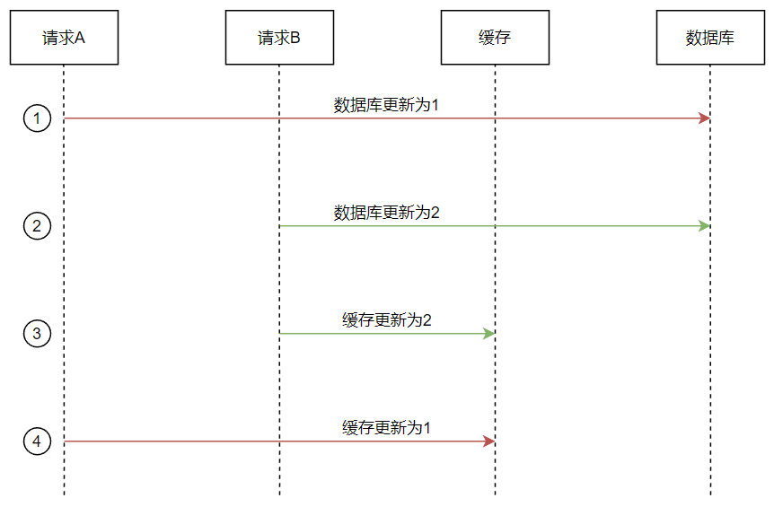
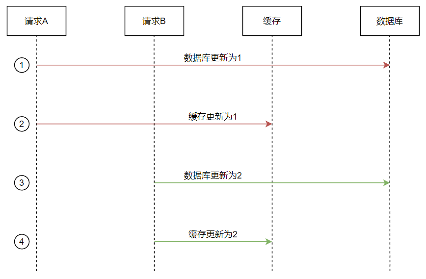
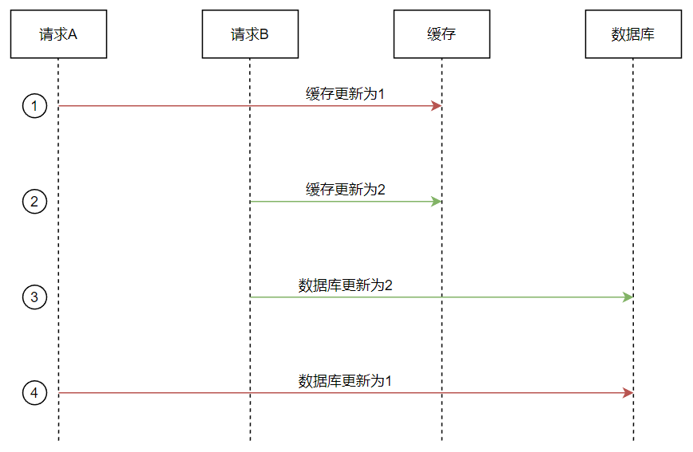
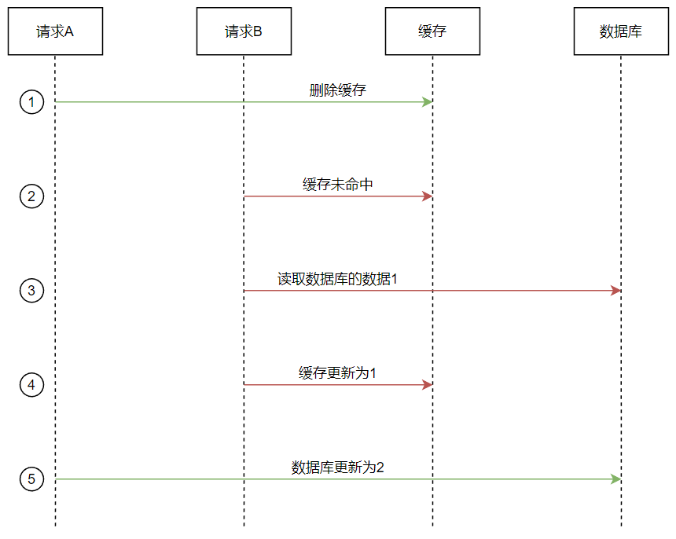
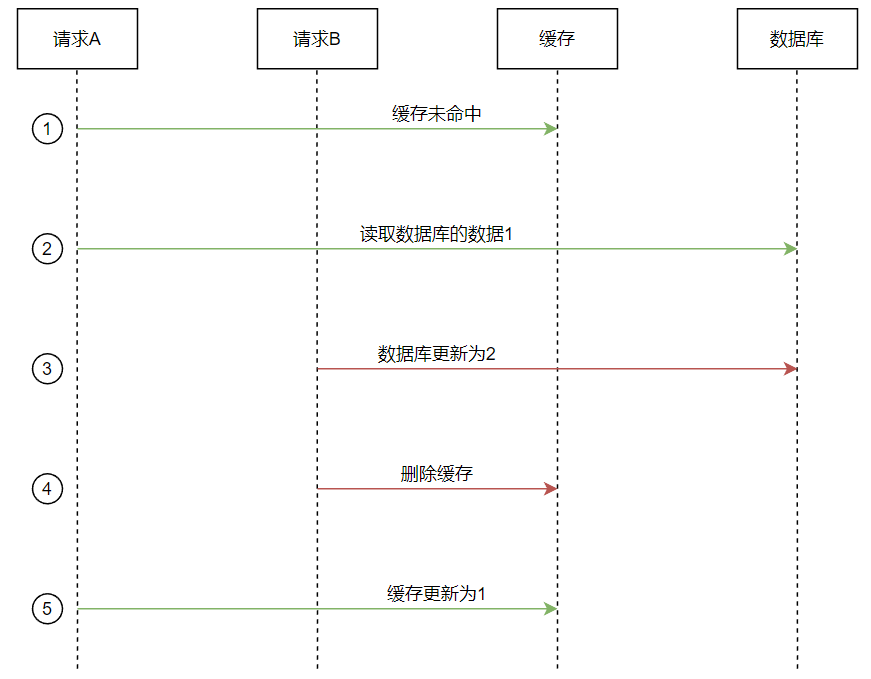
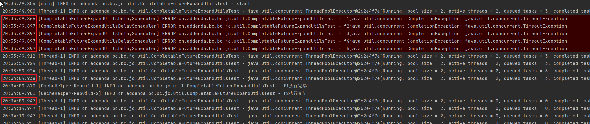

## 楔子

缓存和数据库的一致性是业务开发中非常常见的问题。在不引入分布式事务的前提下，无法实现两者的绝对一致，所以只能实现最终一致性。但是我们的目标是尽可能短的实现最终一致性，所以下面所提到的不一致指数据长时间不一致。

常见的方案有两种，一是**Cache Aside**，即由缓存的调用者在更新数据库的时候更新缓存，二是监听binlog更新缓存。第二种方式比较麻烦，往往是有单独的服务来实现。我们本次设计的是函数式的工具类，所以是实现了Cache Aside。

Cache Aside的实现思路有两种，一是在更新数据的时候更新缓存，二是在更新数据的时候删除缓存。同时还要考虑更新数据和更新缓存是否在同一个事务里。下面逐一分析。

### 更新更新

#### 更新数据库更新缓存

如果更新数据库和更新缓存不在同一个事务里，有可能产生下面的时序（时序1），此时会造成数据不一致。



如果更新数据库和更新缓存在同一个事务里，因为数据库更新会加锁且在事务提交后才释放，所以时序1里的4未执行完成的时候2是不会执行的，此时不会造成数据不一致。即时序（时序2）必然如下：



#### 更新缓存更新数据库

先更新缓存再更新数据库无论在不在事务里都可能出现下面的异常时序（时序3）



#### 问题

从上面的时序图可以看出只有先更新数据库再更新缓存且两者都处于事务当中才不会出现数据不一致问题，但是这样就限制了工具的使用范围，所以我们还是希望能支持无事务的场景。

在无事务的场景里，出现问题的两种时序出现的概率是不一样的，其中时序1出现的概率非常小，因为更新缓存的耗时远小于更新数据库，所以绝大多数情况下都是时序1-4执行完之后时序1-2和时序1-3才会执行。而时序3的概率就大了，因为时序3-4的执行耗时与时序1-2的执行耗时差距不大，所以是很有可能发生问题的。

那么我们是不是就选择先更新数据库在更新缓存的方案呢？其实不是的，而且**更新更新的方案都不能使用**。思考一下，为什么我们要引入缓存呢？其实是为了提升高频读的性能，同时我们知道内存的大小是有限的，所以使用缓存的时候都会配置过期策略，而更新更新的这种方案其实让缓存中的数据变成高频写的数据了，读数据的时候由于缓存没有，依然要从数据库里查询数据，即这种设计和我们引入缓存的前提相违背。

### 更新删除

更新数据时，不更新缓存，而是删除缓存中的数据。读取数据时，发现缓存中没了数据之后，再从数据库中读取数据，更新到缓存中。

#### 删除缓存更新数据库

先删除缓存再更新数据库的方案可能产生下面的异常时序（时序4）。



#### 更新数据库删除缓存

先更新数据库再删除缓存的方案可能产生下面的异常时序（时序5）。



#### 问题及处理

可以看到，无论是时序4还是时序5，都会发生数据不一致问题。但是时序5发生异常时序的概率小，因为时序5-5的执行耗时远小于时序5-3的执行耗时；而时序4发生的概率大，因为时序4-5的执行耗时远大于时序4-2的执行耗时。

更新删除时，无论是否被事务包裹都不影响时序5的执行，因为删除缓存是幂等操作。两个写操作有并发问题的时候是最终一致的。

所以我们的实现方案是：

- 写操作：采用先更新数据库再删除缓存的方案。
- 读操作：发现缓存中没了数据之后，再从数据库中读取数据，更新到缓存中。更新缓存一定要附带存活时间，这是最后的兜底策略。


## 写操作

### 实现细节

1. 写操作需要考虑缓存删除失败的问题。更新数据库和删除缓存在同一个事务里的情况下，如果删除产生异常，事务会回滚，此时不会有脏数据。更新数据库和删除缓存不在同一个事务里的情况下，如果删除出现异常，就会产生数据不一致的问题了。所以当删除出异常时，是一定需要重试的，如果重试失败，需要延迟删除。延迟删除的延时时间设置为时序5-3和时序5-4的时间之和。
2. 为了更大程度的降低数据不一致产生的概率，即使是时序5-4执行成功，也引入延迟删除，延迟删除的延时时间设置为时序5-3和时序5-4时间之和的两倍，这样可以解决大部分缓存不一致的场景。
3. 延迟删除还可以解决读写分离场景下的主从同步延迟问题。即写入主库的数据如果还未同步到从库，删除缓存后如果构建缓存的数据是从库的数据就会导致数据不一致。延迟删除的延迟只要大于主从同步的延迟可以解决此问题。这个功能只要调节细节2中延迟删除的时间就可以做到。
4. 延迟删除是要使用异步线程来执行删除操作的，所以需要对执行的过程进行监控。

延迟删除的实现使用延迟队列。所以定义延迟任务的数据结构如下：

```java
@Getter
@ToString
private static class DeleteTask implements Delayed {

  /**
   * 每一次写操作都会生成一个xId。一个xId表示一次更新数据库参数，多次缓存删除重试具备相同的xId。
   */
  private final String xId;

  private final String key;

  /**
   * 出生时间
   */
  private final long since;

  /**
   * 提交时间。由于存在重试场景，所以提交时间和出生时间不一致。
   */
  private final long start;

  /**
   * 更新数据库 + 删除缓存
   */
  private final long delay;

  /**
   * 预计执行时间
   */
  private final long expectedExecutionTime;

  @Setter
  private Long realExecutionTime;

  private DeleteTask(String xId, String key, long delay) {
    this.xId = xId;
    this.key = key;
    this.delay = delay;
    this.since = System.currentTimeMillis();
    this.start = since;
    this.expectedExecutionTime = calculateExpectedExecutionTime(delay);
  }

  private DeleteTask(String xId, String key, long since, long delay) {
    this.xId = xId;
    this.key = key;
    this.delay = delay;
    this.since = since;
    this.start = System.currentTimeMillis();
    this.expectedExecutionTime = calculateExpectedExecutionTime(delay);
  }

  public static long calculateExpectedExecutionTime(long delay) {
    return System.currentTimeMillis() + delay;
  }

  @Override
  public long getDelay(TimeUnit unit) {
    return unit.convert(expectedExecutionTime - System.currentTimeMillis(), unit);
  }

  @Override
  public int compareTo(Delayed o) {
    if (o == null) {
      throw new NullPointerException("arg can not be null!");
    }
    DeleteTask t = (DeleteTask) o;
    if (this.expectedExecutionTime - t.expectedExecutionTime < 0) {
      return -1;
    } else if (this.expectedExecutionTime == t.expectedExecutionTime) {
      return 0;
    } else {
      return 1;
    }
  }

  public long getTimeout() {
    return delay * 2;
  }

}
```

### 主流程

延迟任务最终是要提交到线程池中处理，所以我们先定义一个线程池。同时这个线程池也是整个工具类里公用的异步任务线程池。

```java
private final ExecutorService cacheHelperEs;

protected ExecutorService createCacheHelperEs() {
  return new ThreadPoolExecutor(
    2,
    2,
    30,
    TimeUnit.SECONDS,
    new LinkedBlockingQueue<>(100000),
    new SimpleNamedThreadFactory("CacheHelper"));
}
```

主流程的逻辑就是先更新数据库再删除缓存，需要注意一点细节的是，线程池关闭之后就不再提交延迟删除任务了，因为此时提交了也无法被执行。实现如下：

```java
private static final String CLEAR_CACHE_MSG = "清理缓存 [{}] [{}]。xId [{}]。预计 [{}] 执行 [{}]。";

private <I, R> R apply(String keyPrefix, I id, Function<I, R> function, String mode) {
  String key = formatKeyPrefix(keyPrefix) + mode + id;
  long now = System.currentTimeMillis();
  R apply = function.apply(id);
  doDelete(key, now, true);
  return apply;
}

private void doDelete(String key, long enterPoint, boolean ifDelayedDeletion) {
  String xId = UUID.randomUUID().toString();
  try {
    RetryUtils.retryWhenException(() -> expiredKVCache.delete(key), key);
    // 删除成功时，延迟删除的时间叠加系数
    long delay = 2 * (System.currentTimeMillis() - enterPoint);
    log.info(CLEAR_CACHE_MSG, key, "成功", xId, toDateTimeStr(DeleteTask.calculateExpectedExecutionTime(delay)), "延迟删除");
    if (ifDelayedDeletion) {
      DeleteTask deleteTask = new DeleteTask(xId, key, delay);
      if (cacheHelperEs != null && !cacheHelperEs.isShutdown()) {
        deleteTaskQueue.put(deleteTask);
      }
    }
  } catch (Throwable e) {
    // 删除失败时，延迟删除的时间不叠加系数
    long delay = (System.currentTimeMillis() - enterPoint);
    log.error(CLEAR_CACHE_MSG, key, "异常", xId, toDateTimeStr(delay), "重试", e);
    if (ifDelayedDeletion) {
      DeleteTask deleteTask = new DeleteTask(xId, key, DeleteTask.calculateExpectedExecutionTime(delay));
      if (cacheHelperEs != null && !cacheHelperEs.isShutdown()) {
        deleteTaskQueue.put(deleteTask);
      }
    }
  }
}
```

### 延迟删除

在实现延迟任务时，最开始是想开一个单独的线程（DeleteTaskConsumer）不断地从延迟队列里拿任务扔到线程池执行，再通过future获取执行结果。但是这样就失去了使用线程池的意义了，因为所有的任务都被阻塞在了DeleteTaskConsumer线程的Future#get()方法的调用这里。思考后利用CompletableFuture实现了无阻塞的结果回调处理。整体结构遵循生产者-消费者模型：

1. 启动一个线程不断地从延迟队列里获取可以执行的任务
2. 得到延迟任务之后，通过CompletableFuture将其提交到任务池里，并且根据任务的执行结果做后置操作
   1. 如果任务执行正常完成，打印info日志就好了。
   2. 如果线程池触发RejectedExecutionException，将打印error日志，但不重试，因为此时线程池已经过载了，需要研发介入调整参数了。
   3. 如果执行时发生异常，将打印error日志并重试直至正常完成或超时。
   4. 如果执行超时（执行时间超过2*delay），打印error日志，但不重试。

具体分析一下延迟任务执行超时的情况。

超时时间是2倍的delay。具体分析如下：

1. 对于正常的延迟删除：
   1. retryWhenException没有遇到异常：2 * (doDelete() + function.apply())
   2. retryWhenException遇到异常：2 * (2 * doDelete() + function.apply())
2. 对于异常的延迟删除：doDelete() + function.apply()

超时产生的原因有两个：

1. 一是之前的删除缓存操作执行的太慢，把线程池的线程阻塞了
2. 二是任务很多，在线程池里排队而无法被执行。

因为删除缓存的时间理论上远小于更新数据库的时间。所以这里出现超时大概率是任务排队导致的。这也是为什么超时时只打印error日志，但不重试的原因。因为重试只会加剧任务排队的问题，此时需要研发介入调整参数了。

```java
private static final String DELAY_CLEAR_CACHE_MSG = "延迟清理缓存 [%s] [%s]。xId[%s]。出生时间[%s]，提交时间[%s]，延迟[%s]ms，预期开始执行时间[%s]，实际开始执行时间[%s]，最大完成时间[%s]，当前时间[%s]。";

private DelayQueue<DeleteTask> deleteTaskQueue;
private Thread deleteTaskConsumer;

protected void initDeleteTaskConsumer() {
  deleteTaskQueue = new DelayQueue<>();
  deleteTaskConsumer = new Thread(() -> {
    while (true) {
      DeleteTask take = null;
      try {
        take = deleteTaskQueue.take();
        final DeleteTask finalTake = take;
        String key = finalTake.getKey();
        CompletableFutureUtils
          .orTimeout(CompletableFuture.runAsync(() -> {
            finalTake.setRealExecutionTime(System.currentTimeMillis());
            expiredKVCache.delete(key);
            log.info(getDelayDeleteMsg(key, finalTake, "成功"));
          }, cacheHelperEs), finalTake.getTimeout(), TimeUnit.MILLISECONDS)
          .exceptionally(
          throwable -> {
            if (throwable instanceof CompletionException && throwable.getCause() instanceof TimeoutException) {
              // 超时的时候不再二次加入延迟队列了，因为此时服务的压力已经很大了
              log.error(getDelayDeleteMsg(key, finalTake, "超时"));
            } else {
              deleteTaskQueue.put(new DeleteTask(finalTake.getXId(), finalTake.getKey(), finalTake.getSince(), finalTake.getDelay()));
              log.error(getDelayDeleteMsg(key, finalTake, "异常"), throwable);
            }
            return null;
          });
      } catch (RejectedExecutionException e) {
        if (take != null) {
          String key = take.getKey();
          log.error(getDelayDeleteMsg(key, take, "线程池触发拒绝策略"), e);
        }
      } catch (InterruptedException e) {
        log.debug("延迟删除线程关闭！");
        Thread.currentThread().interrupt();
        break;
      } catch (Throwable e) {
        if (take != null) {
          String key = take.getKey();
          log.error(getDelayDeleteMsg(key, take, "未知异常"), e);
        }
      }
    }
  });
  deleteTaskConsumer.setDaemon(true);
  deleteTaskConsumer.setName("CacheHelper-DelayedDeletionThread");
  deleteTaskConsumer.start();
}

private String getDelayDeleteMsg(String key, DeleteTask take, String prefix) {
  return String.format(DELAY_CLEAR_CACHE_MSG, key, prefix, take.getXId(), toDateTimeStr(take.getSince()),
                       toDateTimeStr(take.getStart()), take.getDelay(),
                       toDateTimeStr(take.getExpectedExecutionTime()),
                       take.getRealExecutionTime() == null ? "未执行" : toDateTimeStr(take.getRealExecutionTime()),
                       toDateTimeStr(take.getExpectedExecutionTime() + take.getTimeout()),
                       toDateTimeStr(System.currentTimeMillis()));
}
```

````java
/**
 * CompletableFuture 扩展工具
 *
 * @author zhangtianci7, addenda
 */
@NoArgsConstructor(access = AccessLevel.PRIVATE)
public class CompletableFutureUtils {

  /**
   * 如果在给定超时之前未完成，则异常完成此 CompletableFuture 并抛出 {@link TimeoutException} 。
   *
   * @param timeout 在出现 TimeoutException 异常完成之前等待多长时间，以 {@code unit} 为单位
   * @param unit    一个 {@link TimeUnit}，结合 {@code timeout} 参数，表示给定粒度单位的持续时间
   * @return 与入参CompletableFuture具有相同返回类型的future
   */
  public static <T> CompletableFuture<T> orTimeout(CompletableFuture<T> future, long timeout, TimeUnit unit) {
    Assert.notNull(future, "`future` can not be null!");
    Assert.notNull(future, "`unit` can not be null!");
    Assert.isTrue(timeout > -1, "`timeout` should be greater than -1!");
    if (future.isDone()) {
      return future;
    }

    return future.whenComplete(new Canceller(Delayer.delay(new Timeout(future), timeout, unit)));
  }


  /**
   * 如果在给定超时之前未完成，则使用默认值完成此 CompletableFuture。
   *
   * @param value   默认值
   * @param timeout 在出现 TimeoutException 异常完成之前等待多长时间，以 {@code unit} 为单位
   * @param unit    一个 {@link TimeUnit}，结合 {@code timeout} 参数，表示给定粒度单位的持续时间
   * @return 与入参CompletableFuture具有相同返回类型的future
   */
  public static <T> CompletableFuture<T> completeOnTimeout(CompletableFuture<T> future, T value, long timeout, TimeUnit unit) {
    Assert.notNull(future, "`future` can not be null!");
    Assert.notNull(future, "`unit` can not be null!");
    Assert.isTrue(timeout > -1, "`timeout` should be greater than -1!");
    if (future.isDone()) {
      return future;
    }
    return future.whenComplete(new Canceller(Delayer.delay(new DelayedCompleter<T>(future, value), timeout, unit)));
  }


  /**
   * 超时时异常完成的操作
   */
  static final class Timeout implements Runnable {
    final CompletableFuture<?> future;

    Timeout(CompletableFuture<?> future) {
      this.future = future;
    }

    public void run() {
      if (null != future && !future.isDone()) {
        future.completeExceptionally(new TimeoutException());
      }
    }
  }

  static final class DelayedCompleter<U> implements Runnable {
    final CompletableFuture<U> f;
    final U u;

    DelayedCompleter(CompletableFuture<U> f, U u) {
      this.f = f;
      this.u = u;
    }

    public void run() {
      if (f != null)
        f.complete(u);
    }
  }

  /**
   * 取消不需要的超时的操作
   */
  static final class Canceller implements BiConsumer<Object, Throwable> {
    final Future<?> future;

    Canceller(Future<?> future) {
      this.future = future;
    }

    public void accept(Object ignore, Throwable ex) {
      if (null == ex && null != future && !future.isDone()) {
        future.cancel(false);
      }
    }
  }

  /**
   * 单例延迟调度器，仅用于启动和取消任务，一个线程就足够
   */
  private static final class Delayer {
    static ScheduledFuture<?> delay(Runnable command, long delay, TimeUnit unit) {
      return delayer.schedule(command, delay, unit);
    }

    static final class DaemonThreadFactory implements ThreadFactory {
      public Thread newThread(Runnable r) {
        Thread t = new Thread(r);
        t.setDaemon(true);
        t.setName("CompletableFutureUtils-Delayer");
        return t;
      }
    }

    static final ScheduledThreadPoolExecutor delayer;

    static {
      delayer = new ScheduledThreadPoolExecutor(1, new DaemonThreadFactory());
      delayer.setRemoveOnCancelPolicy(true);
    }
  }

}
````

### CompletableFuture细节

#### 超时

需要补充一点CompletableFuture的超时知识：超时后，正在执行中的任务会执行完成，排队的任务不会被线程执行但是依然会在线程池的队列中排队。

这是因为CompletableFuture的cancel()无法从线程池中取消任务，它的取消实现只是**在任务被线程池调度之后不执行我们传入的函数**。基于被取消的任务依然会排队但取消的任务的执行不耗费时间，线程池的blocking queue要设置的大一些，要避免触发拒绝策略。

```java
@Test
public void test1() {

  ThreadPoolExecutor threadPoolExecutor = new ThreadPoolExecutor(
    2,
    2,
    30,
    TimeUnit.SECONDS,
    new LinkedBlockingQueue<>(10),
    new SimpleNamedThreadFactory("CacheHelper-Rebuild"));

  log.info("start ");
  CompletableFuture<Void> f1 = CompletableFuture.runAsync(new NamedRunnable("f1"), threadPoolExecutor);
  CompletableFutureExpandUtils.orTimeout(f1, 10, TimeUnit.SECONDS).handle(
    (unused, throwable) -> {
      log.error("f1" + throwable.toString());
      return null;
    });

  CompletableFuture<Void> f2 = CompletableFuture.runAsync(new NamedRunnable("f2"), threadPoolExecutor);
  CompletableFutureExpandUtils.orTimeout(f2, 10, TimeUnit.SECONDS).handle(
    (unused, throwable) -> {
      log.error("f2" + throwable.toString());
      return null;
    });

  CompletableFuture<Void> f3 = CompletableFuture.runAsync(new NamedRunnable("f3"), threadPoolExecutor);
  CompletableFutureExpandUtils.orTimeout(f3, 10, TimeUnit.SECONDS).handle(
    (unused, throwable) -> {
      log.error("f3" + throwable.toString());
      return null;
    });

  CompletableFuture<Void> f4 = CompletableFuture.runAsync(new NamedRunnable("f4"), threadPoolExecutor);
  CompletableFutureExpandUtils.orTimeout(f4, 10, TimeUnit.SECONDS).handle(
    (unused, throwable) -> {
      log.error("f4" + throwable.toString());
      return null;
    });

  CompletableFuture<Void> f5 = CompletableFuture.runAsync(new NamedRunnable("f5"), threadPoolExecutor);
  CompletableFutureExpandUtils.orTimeout(f5, 10, TimeUnit.SECONDS).handle(
    (unused, throwable) -> {
      log.error("f5" + throwable.toString());
      return null;
    });

  new Thread(new Runnable() {
    @Override
    public void run() {
      while (true) {
        SleepUtils.sleep(TimeUnit.SECONDS, 5);
        log.info(threadPoolExecutor.toString());
      }
    }
  }).start();

  // 结论：超时后，正在执行中的任务会执行完成，排队的任务不会被线程执行
  SleepUtils.sleep(TimeUnit.SECONDS, 300);

}

@ToString
private class NamedRunnable implements Runnable {

  private String name;

  public NamedRunnable(String name) {
    this.name = name;
  }

  @Override
  public void run() {
    SleepUtils.sleep(TimeUnit.SECONDS, 30);
    log.info(name + "执行完毕！");
  }
}
```



从执行结果中可以看出来在33:49的时候已经触发超时了，但是在34:04的时候线程池里排队的任务依然有三个，直到f1f2执行完成后线程池里才没有排队的任务。

#### 异常处理

如果是任务在执行过程中遇到的问题。我们通过exceptionally()可以异步的获取异常信息，此时执行异常处理的线程：

1. 线程池的线程：非TimeoutException。
2. delayer：TimeoutException

如果是任务提交到线程池之前遇到的问题。无法通过exceptionally()获取到信息，同时此时异常会由main线程抛出。

````java
public class RejectTest {

  static ExecutorService executorService = new ThreadPoolExecutor(
          1, 1, 1, TimeUnit.MINUTES, new ArrayBlockingQueue<>(1));

  public static void main(String[] args) {
    CompletableFuture.supplyAsync(new Supplier() {
      @Override
      public Object get() {
        SleepUtils.sleep(TimeUnit.DAYS, 1);
        return null;
      }

    }, executorService);
    CompletableFuture.supplyAsync(new Supplier() {
      @Override
      public Object get() {
        SleepUtils.sleep(TimeUnit.DAYS, 1);
        return null;
      }

    }, executorService);
    CompletableFuture.supplyAsync(new Supplier() {
      @Override
      public Object get() {
        SleepUtils.sleep(TimeUnit.DAYS, 1);
        return null;
      }

    }, executorService);
  }

}
````

````
Exception in thread "main" java.util.concurrent.RejectedExecutionException: Task java.util.concurrent.CompletableFuture$AsyncSupply@f6f4d33 rejected from java.util.concurrent.ThreadPoolExecutor@23fc625e[Running, pool size = 1, active threads = 1, queued tasks = 1, completed tasks = 0]
	at java.util.concurrent.ThreadPoolExecutor$AbortPolicy.rejectedExecution(ThreadPoolExecutor.java:2063)
	at java.util.concurrent.ThreadPoolExecutor.reject(ThreadPoolExecutor.java:830)
	at java.util.concurrent.ThreadPoolExecutor.execute(ThreadPoolExecutor.java:1379)
	at java.util.concurrent.CompletableFuture.asyncSupplyStage(CompletableFuture.java:1618)
	at java.util.concurrent.CompletableFuture.supplyAsync(CompletableFuture.java:1843)
	at cn.addenda.component.test.cachehelper.RejectTest.main(RejectTest.java:30)
````

### 延迟任务的关闭

当服务停止的时候，延迟队列里依然会有没被执行的任务，这些任务需要在服务关闭的时候立即执行。如果失败了，就仅打日志了，因为延迟任务本身就是处理小概率问题，不再做补偿了。

````java
@Override
public void destroy() throws Exception {
  if (deleteTaskConsumer != null) {
    deleteTaskConsumer.interrupt();
  }
  if (cacheHelperEs != null) {
    try {
      log.info("CacheHelper-Es 开始关闭。");
      // Disable new tasks from being submitted
      cacheHelperEs.shutdown();
      // Wait a while for existing tasks to terminate
      if (!cacheHelperEs.awaitTermination(30, TimeUnit.SECONDS)) {
        log.error("CacheHelper-Es 关闭后等待超过30秒未终止：{}。", cacheHelperEs);
        // Cancel currently executing tasks
        cacheHelperEs.shutdownNow();
        // Wait a while for tasks to respond to being cancelled
        cacheHelperEs.awaitTermination(30, TimeUnit.SECONDS);
      }
      log.info("CacheHelper-Es 正常关闭。");
    } catch (InterruptedException e) {
      // (Re-)Cancel if current thread also interrupted
      cacheHelperEs.shutdownNow();
      log.error("CacheHelper-Es 异常关闭：{}！", cacheHelperEs, e);
      // Preserve interrupt status
      Thread.currentThread().interrupt();
    }
  }
  executeRemainingDeleteTask();
}

private void executeRemainingDeleteTask() {
  if (deleteTaskQueue == null) {
    return;
  }
  DeleteTask[] array = deleteTaskQueue.toArray(new DeleteTask[]{});
  if (array.length > 0) {
    log.error("CacheHelper-Es 已关闭，还有{}个任务未被执行！", array.length);
    for (DeleteTask deleteTask : array) {
      try {
        RetryUtils.retryWhenException(() -> expiredKVCache.delete(deleteTask.getKey()), deleteTask.getKey());
      } catch (Throwable e) {
        log.error(getDelayDeleteMsg(deleteTask.getKey(), deleteTask, "服务关闭时延迟删除任务未执行！"), e);
      }
    }
  }
}
````


## 读操作

读操作需要解决缓存穿透和缓存击穿问题。

缓存穿透：当用户访问的数据不在数据库中，没办法构建缓存，所以每次请求都会打到数据库。两种方案：

- 缓存空值；
- 使用布隆过滤器。布隆过滤器可以做到，如果**布隆过滤器查询到数据不存在，数据库中一定就不存在这个数据**，所以布隆过滤器认为存在的再去查库。

虽然Redis提供了布隆过滤器，但是由于布隆过滤器不支持删除，所以一般都是定时重建布隆过滤器，所以实现起来比较复杂，所以这里采用的是缓存空值。

缓存击穿：如果缓存中的某个热点数据过期了，此时大量的请求访问了该热点数据，就无法从缓存中读取，直接访问数据库，数据库很容易就被大量的请求打满。两种方案：

- 给热点数据设置逻辑过期时间，由代码判断是否真的过期了，如果过期了启动后台线程构建缓存，当前线程仍然返回旧数据。
- 采用互斥锁保证同一时间只有一个业务线程更新缓存，未能获取互斥锁的请求，要么等待锁释放后重新读取缓存，要么就返回空值或者默认值。

第一种方案性能高但是会导致缓存数据跟新不及时，所以我命名为PERFORMANCE_FIRST，简称ppf。第而种方案性能差但是会导致缓存数据及时更新，所以我命名为REALTIME_DATA_FIRST，简称rdf。

### RDF

在RDF的实现细节中，需要考虑如下的问题：

1. 构建缓存时如果直接使用互斥锁，高流量的情况下会直接把服务hang住，但如果不限制构建缓存，又会把数据库打满，所以这里引入了限流器。如果没有被限流直接构建缓存，如果被限流了再用互斥锁保护数据库。
   1. 无论是加锁还是限流，都需要有粒度。实现的时候，可以选择以keyPrefix或key为粒度。

2. 如果从数据库拿到的是null，要存在缓存中存_NIL
3. 如果获取互斥锁获取不到，不是一直等待获取锁，因为这样会把线程hang住，所以此时线程睡眠一段时间后再重试，超过重试次数时对外抛出异常提醒开发者。

核心实现逻辑如下：

```java
private static final String CACHE_EXPIRED_OR_NOT_MSG = "从缓存获取到 [{}] 的数据 [{}] [{}]。";
private static final String BUILD_CACHE_SUCCESS_MSG = "构建缓存 [{}] [成功]，获取到数据 [{}]，缓存到期时间 [{}]。";
private static final String RDF_TRY_LOCK_FAIL_TERMINAL_MSG = "第 [{}] 次未获取到锁 [{}]，终止获取锁";
private static final String RDF_TRY_LOCK_FAIL_WAIT_MSG = "第 [{}] 次未获取到锁 [{}]，休眠 [{}]ms";
private static final String BUILD_CACHE_SUCCESS_MSG = "构建缓存 [{}] [成功]，获取到数据 [{}]，缓存到期时间 [{}]。";

/**
 * 实时数据优先的缓存查询方法，基于互持锁实现。
 *
 * @param keyPrefix 与id一起构成完整的键
 * @param id        键值
 * @param rType     返回值类型
 * @param rtQuery   查询实时数据
 * @param ttl       过期时间
 * @param itr       第几次尝试
 * @param cache     是否将实时查询的数据缓存
 * @param <R>       返回值类型
 * @param <I>       键值类型
 */
private <R, I> R doQueryWithRdf(
  String keyPrefix, I id, JavaType rType, Function<I, R> rtQuery, Long ttl, int itr, boolean cache) {
  String key = formatKeyPrefix(keyPrefix) + REALTIME_DATA_FIRST_PREFIX + id;
  // 1.查询缓存
  String resultJson = expiredKVCache.get(key);
  // 2.如果返回的是占位的空值，返回null
  if (NULL_OBJECT.equals(resultJson)) {
    log.debug("获取到 [{}] 的数据为空占位。", key);
    return null;
  }
  // 3.1如果字符串不为空，返回对象
  if (resultJson != null) {
    log.debug(CACHE_EXPIRED_OR_NOT_MSG, key, resultJson, "未过期");
    return JacksonUtils.toObj(resultJson, rType);
  }
  // 3.2如果字符串为空，进行缓存构建
  else {
    Supplier<R> supplier = () -> {
      R r = rtQuery.apply(id);
      if (cache) {
        LocalDateTime expireTime = LocalDateTime.now();
        if (r == null) {
          long realTtl = Math.min(cacheNullTtl, ttl);
          expireTime = expireTime.plus(realTtl, ChronoUnit.MILLIS);
          expiredKVCache.set(key, NULL_OBJECT, realTtl, TimeUnit.MILLISECONDS);
        } else {
          expireTime = expireTime.plus(ttl, ChronoUnit.MILLIS);
          expiredKVCache.set(key, JacksonUtils.toStr(r), ttl, TimeUnit.MILLISECONDS);
        }
        log.info(BUILD_CACHE_SUCCESS_MSG, key, r, toDateTimeStr(DateUtils.localDateTimeToTimestamp(expireTime)));
      }
      return r;
    };

    String lockKey = getLockKey(keyPrefix, key);
    RateLimiter rateLimiter = realQueryRateLimiterAllocator.allocate(lockKey);
    if (rateLimiter.tryAcquire()) {
      try {
        return supplier.get();
      } finally {
        realQueryRateLimiterAllocator.release(lockKey);
      }
    } else {
      realQueryRateLimiterAllocator.release(lockKey);

      // 4.1获取互斥锁，获取到进行缓存构建
      Lock lock = lockAllocator.allocate(lockKey);
      if (lock.tryLock()) {
        try {
          return supplier.get();
        } finally {
          try {
            lock.unlock();
          } finally {
            lockAllocator.release(lockKey);
          }
        }
      }
      // 4.2获取互斥锁，获取不到就休眠直至抛出异常
      else {
        lockAllocator.release(lockKey);
        itr++;
        if (itr >= rdfBusyLoop) {
          log.error(RDF_TRY_LOCK_FAIL_TERMINAL_MSG, itr, lockKey);
          if (useServiceException) {
            throw new ComponentServiceException("系统繁忙，请稍后再试！");
          } else {
            throw new CacheException("系统繁忙，请稍后再试！");
          }
        } else {
          log.info(RDF_TRY_LOCK_FAIL_WAIT_MSG, itr, lockKey, lockWaitTime);
          SleepUtils.sleep(TimeUnit.MILLISECONDS, lockWaitTime);
          // 递归进入的时候，当前线程的tryLock是失败的，所以当前线程不持有锁，即递归进入的状态和初次进入的状态一致
          return doQueryWithRdf(keyPrefix, id, rType, rtQuery, ttl, itr, cache);
        }
      }
    }
  }
}

private <R> void setCacheData(String key, R r, long ttl) {
  // 设置逻辑过期
  CacheData<R> newCacheData = new CacheData<>(r);
  if (r == null) {
    newCacheData.setExpireTime(LocalDateTime.now().plus(Math.min(ttl, cacheNullTtl), ChronoUnit.MILLIS));
  } else {
    newCacheData.setExpireTime(LocalDateTime.now().plus(ttl, ChronoUnit.MILLIS));
  }
  // 写缓存
  expiredKVCache.set(key, JacksonUtils.toStr(newCacheData), ttl * 2, TimeUnit.MILLISECONDS);
  log.info(BUILD_CACHE_SUCCESS_MSG, key, r, toDateTimeStr(DateUtils.localDateTimeToTimestamp(newCacheData.getExpireTime())));
}

public static final String CONCURRENCY_GRANULARITY_KEY = "CGK";

public static final String CONCURRENCY_GRANULARITY_PREFIX = "CGP";

private String concurrencyGranularity;

private String getLockKey(String keyPrefix, String key) {
  if (CONCURRENCY_GRANULARITY_PREFIX.equals(concurrencyGranularity)) {
    return keyPrefix + ":lock";
  } else if (CONCURRENCY_GRANULARITY_KEY.equals(concurrencyGranularity)) {
    return key + ":lock";
  }
  throw SystemException.unExpectedException();
}
```

### PPF

在PPF的实现细节中，需要考虑如下的问题：

1. 如果从缓存中拿到的时null，此时不能返回空，需要使用rdf模式构建缓存。
2. 逻辑过期时提交构建缓存任务的线程只需要有一个，其他的返回旧值就好了。
3. 提交异步构建缓存的任务之后不要立即返回，可以睡眠一段时间（lockWaitTime），即低并发下尽量返回及时数据。
4. 返回旧值的时候打印error日志，此时开发者需要判断lockWaitTime是否设置的合理。不过为了防止打印大量的相同日志，这里引入限流器对按业务域（prefix）进行限流。至于为什么选择prefix为单位而不是选择key为单位，是因为key很多会导致失去限流的意义，同一个业务域的数据来自同一张表或同一个rpc，响应时间往往差不多，所以按prefix为单位，依然可以反映超时问题。
5. 如果从数据库拿到的是null，要在缓存中存_NIL。
6. 虽然是逻辑过期，但是数据在缓存中也是要有存活时间的，否则缓存会被打满。存活时间必须比逻辑过期时间长，实现中设置为逻辑过期时间的两倍。
7. 提交的异步任务需要考虑执行异常，此时需要打error日志通知开发者排查问题。
8. 提交的异步任务不需要考虑执行超时。在写操作里，延迟删除异步任务超时后会触发取消，因为延迟删除只是做后置补偿，解决的是小概率问题，取消了影响不大。但是如果构建缓存的任务因超时被取消，会导致长时间的数据不一致。不过由于超时会阻塞后续的任务执行甚至提交，这里需要打error日志通知到开发者，进而进行服务扩容。

核心实现逻辑如下：

```java
private static final String CACHE_EXPIRED_OR_NOT_MSG = "从缓存获取到 [{}] 的数据 [{}] [{}]。";
private static final String PPF_SUBMIT_BUILD_CACHE_TASK_SUCCESS_MSG = "获取锁 [{}] [成功]，提交了缓存重建任务，返回过期数据 [{}]。";
private static final String PPF_SUBMIT_BUILD_CACHE_TASK_FAILED_MSG = "获取锁 [{}] [失败]，未提交缓存重建任务，返回过期数据 [{}]。";
private static final String CACHE_EXPIRED_OR_NOT_MSG = "从缓存获取到 [{}] 的数据 [{}] [{}]。";

/**
 * 性能优先的缓存查询方法，基于逻辑过期实现。
 *
 * @param keyPrefix 与id一起构成完整的键
 * @param id        键值
 * @param rType     返回值类型
 * @param rtQuery   查询实时数据
 * @param ttl       过期时间
 * @param <R>       返回值类型
 * @param <I>       键值类型
 */
public <R, I> R queryWithPpf(
  String keyPrefix, I id, JavaType rType, Function<I, R> rtQuery, Long ttl) {
  String key = formatKeyPrefix(keyPrefix) + PERFORMANCE_FIRST_PREFIX + id;
  // 1 查询缓存
  String cachedJson = expiredKVCache.get(key);
  // 2.1 缓存不存在则基于互斥锁构建缓存
  if (cachedJson == null) {
    // 查询数据库
    R r = queryWithRdf(keyPrefix, id, rType, rtQuery, ttl, false);
    // 存在缓存里
    setCacheData(key, r, ttl);
    return r;
  }
  // 2.2 缓存存在则进入逻辑过期的判断
  else {
    String lockKey = getLockKey(keyPrefix, key);
    // 3.1 命中，需要先把json反序列化为对象
    CacheData<R> cacheData = JacksonUtils.toObj(cachedJson, TypeFactoryUtils.constructParametricType(CacheData.class, rType));
    LocalDateTime expireTime = cacheData.getExpireTime();
    R data = cacheData.getData();
    // 4.1 判断是否过期，未过期，直接返回
    if (expireTime.isAfter(LocalDateTime.now())) {
      log.debug(CACHE_EXPIRED_OR_NOT_MSG, key, data, "未过期");
    }
    // 4.2 判断是否过期，已过期，需要缓存重建
    else {
      // 5.1 获取互斥锁，成功，开启独立线程，进行缓存重建
      Lock lock = lockAllocator.allocate(lockKey);
      if (lock.tryLock()) {
        try {
          AtomicBoolean newDataReady = new AtomicBoolean(false);
          AtomicReference<R> newData = new AtomicReference<>(null);
          submitPpfRebuildTask(key, id, ttl, rtQuery, newDataReady, newData);
          // 提交完缓存构建任务后休息一段时间，防止其他线程提交缓存构建任务
          SleepUtils.sleep(TimeUnit.MILLISECONDS, lockWaitTime);
          if (newDataReady.get()) {
            return newData.get();
          } else {
            log.info(PPF_SUBMIT_BUILD_CACHE_TASK_SUCCESS_MSG, lockKey, data);
          }
        } finally {
          try {
            lock.unlock();
          } finally {
            lockAllocator.release(lockKey);
          }
        }
      }
      // 5.2 获取互斥锁，未成功不进行缓存重建
      else {
        lockAllocator.release(lockKey);
        log.info(PPF_SUBMIT_BUILD_CACHE_TASK_FAILED_MSG, lockKey, data);

        // -----------------------------------------------------------
        // 提交重建的线程如果没有在等待时间内获取到新的数据，不会走下面的告警。
        // 这是为了防止低并发下输出不必要的日志。
        // -----------------------------------------------------------

        // 如果过期了，输出告警信息。
        // 使用限流器防止高并发下大量打印日志。
        RequestIntervalRateLimiter rateLimiter = rateLimiterMap.computeIfAbsent(
          keyPrefix + PERFORMANCE_FIRST_PREFIX, s -> new RequestIntervalRateLimiter(ppfExpirationDetectionInterval));
        if (rateLimiter.tryAcquire()) {
          log.error(CACHE_EXPIRED_OR_NOT_MSG, key, data, "已过期");
        }
      }
    }
    return data;
  }
}

private static final String PPF_BUILD_CACHE_MSG = "异步构建缓存 [{}] [{}]，提交时间[{}]，最大执行耗时[{}]ms，开始执行时间[{}]，最大完成时间[{}]，完成时间[{}]。";

private <R, I> void submitPpfRebuildTask(String key, I id, Long ttl, Function<I, R> rtQuery,
                                         AtomicBoolean newDataReady, AtomicReference<R> newData) {
  long now = System.currentTimeMillis();
  cacheHelperEs.submit(() -> {
    long start = System.currentTimeMillis();
    long maxCost = 2 * lockWaitTime;
    try {
      // 查询数据库
      R r = rtQuery.apply(id);
      // 存在缓存里
      newData.set(r);
      newDataReady.set(true);
      setCacheData(key, r, ttl);
      if (System.currentTimeMillis() - now > maxCost) {
        log.error(PPF_BUILD_CACHE_MSG, key, "超时", toDateTimeStr(now), maxCost, toDateTimeStr(start),
                  toDateTimeStr(now + maxCost), toDateTimeStr(System.currentTimeMillis()));
      }
    } catch (Throwable e) {
      log.error(PPF_BUILD_CACHE_MSG, key, "异常", toDateTimeStr(now), maxCost, toDateTimeStr(start),
                toDateTimeStr(now + maxCost), toDateTimeStr(System.currentTimeMillis()), e);
    }
  });
}
```


## 参考

1. 水滴与银弹-[缓存和数据库一致性问题，看这篇就够了 (qq.com)](https://mp.weixin.qq.com/s?__biz=Mzg5MDczNDI0Nw==&mid=2247483875&idx=1&sn=34d1326fadd57021b278ac2ec01c5a76&chksm=cfd9522bf8aedb3d73f627a1f045c2e3f33dbf2b6aacf8ea47af290c06c51f583c346a901a29&token=551917008&lang=zh_CN#rd)
1. [Java CompletableFuture 异步超时实现探索_Java_京东科技开发者_InfoQ写作社区](https://xie.infoq.cn/article/3e3029fac0e9d888bd879324f)
1. [什么是缓存雪崩、击穿、穿透？ | 小林coding (xiaolincoding.com)](https://www.xiaolincoding.com/redis/cluster/cache_problem.html#缓存穿透)
1. [数据库和缓存如何保证一致性？ | 小林coding (xiaolincoding.com)](https://www.xiaolincoding.com/redis/architecture/mysql_redis_consistency.html#如何保证两个操作都能执行成功)
1. [java-backend-cases/并发/研发-线程安全的引用计数分配器 at master · zhanjinhao/java-backend-cases (github.com)](https://github.com/zhanjinhao/java-backend-cases/tree/master/并发/研发-线程安全的引用计数分配器)