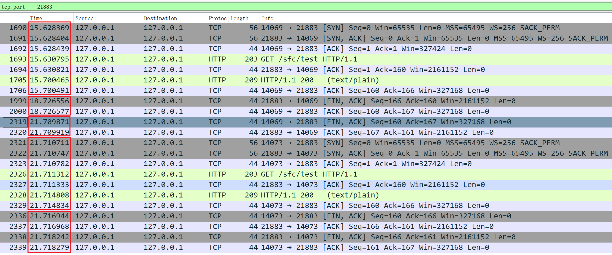
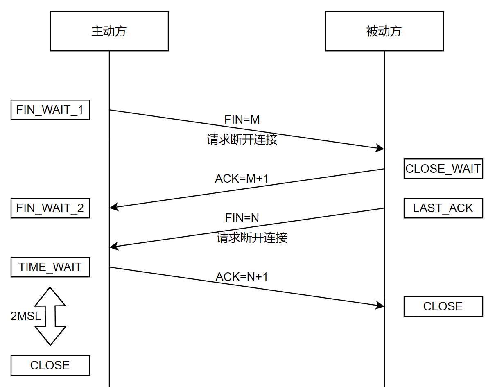
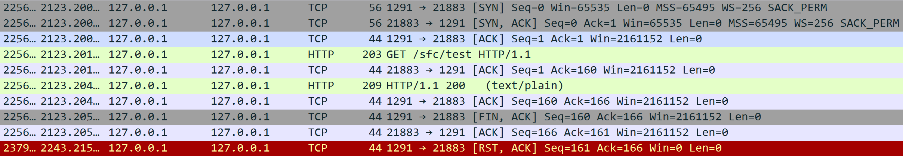
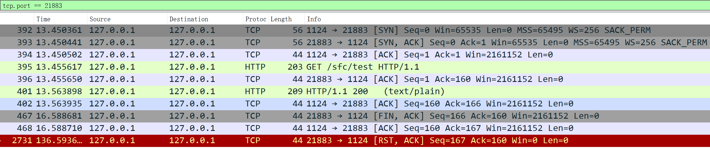
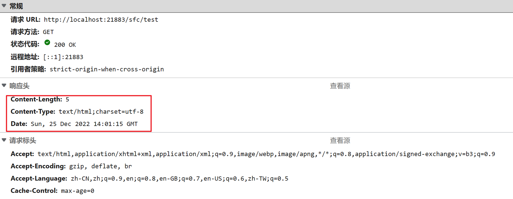

## 研发-HTTP的keep-alive

在HTTP1.1的规范中，keep-alive是一个默认开启的功能，它标识短时间内TCP连接复用，即希望可以短时间内在同一个连接上进行多次请求/响应。但是我其实一直有一些疑惑：

- TCP是什么时候关闭的？
- 关闭的时候会不会通知到客户端呢？
- 客户端的连接存活时间和服务器的能不能自动保持一致呢？

想要一探究竟，还是得测试一下。

### Tomcat

以我们最常使用的Tomcat作为服务器。

#### 服务器端

**pom.xml**

```xml
    <dependencies>
        <!--Spring依赖-->
        <dependency>
            <groupId>org.springframework.boot</groupId>
            <artifactId>spring-boot-starter-web</artifactId>
            <version>2.3.10.RELEASE</version>
        </dependency>

        <dependency>
            <groupId>org.springframework.boot</groupId>
            <artifactId>spring-boot-starter-test</artifactId>
            <scope>test</scope>
        </dependency>

        <dependency>
            <groupId>org.projectlombok</groupId>
            <artifactId>lombok</artifactId>
            <scope>provided</scope>
        </dependency>
    </dependencies>
```

**application.yaml**

```yaml
server:
  port: 21883
  servlet:
    context-path: /sfc

logging:
  config: classpath:logback-spring.xml

spring:
  application:
    name: sfc-tomcat-server
```

**controller**

```java
@RestController
public class TestController {
    @GetMapping("test")
    public String test() {
        return "hello";
    }
}
```

**application**

```java
@SpringBootApplication
public class SFCTomcatApplication {
    public static void main(String[] args) {
        SpringApplication.run(SFCTomcatApplication.class, args);
    }
}
```

**keep-alive配置**

```java
@Configuration
public class TomcatConfig {

    @Bean
    public TomcatConnectorCustomizer tomcatConnectorCustomizer() {
        return new KeepAliveTomcatConnectionCustomizer();
    }

    public class KeepAliveTomcatConnectionCustomizer implements TomcatConnectorCustomizer {
        public KeepAliveTomcatConnectionCustomizer() {
        }

        @Override
        public void customize(Connector connector) {
            // keep-alive时间为3秒
            ((AbstractHttp11Protocol) connector.getProtocolHandler()).setKeepAliveTimeout(3000);
        }
    }

}
```

#### 客户端

以Apache的另一个项目Apache HttpClient测试作为客户端。

```java
@SpringBootTest
@Slf4j
public class SFCTest {

    private CloseableHttpClient httpClient;

    @Before
    public void before() {
        RequestConfig config = RequestConfig.custom()
                // 连接超时时间 10s
                .setConnectTimeout(10 * 1000)
                // 读数据超时时间 6000s
                .setSocketTimeout(6000 * 1000)
                // 从连接池里拿连接的超时时间 10s
                .setConnectionRequestTimeout(10 * 1000)
                .build();
        // 存活时间10万秒，非常大，保证不会被客户端主动去除
        PoolingHttpClientConnectionManager poolManager =
                new PoolingHttpClientConnectionManager(100000, TimeUnit.SECONDS);
        // 每个<ip,port>的最大连接是多少
        poolManager.setDefaultMaxPerRoute(1000);
        // 所有<ip,port>的总共的最大连接是多少
        poolManager.setMaxTotal(1000);

        httpClient = HttpClientBuilder.create()
                .setDefaultRequestConfig(config)
                // 禁用自动重试
                .disableAutomaticRetries()
                .setConnectionManager(poolManager)
                // 连接建立后的存活时间，设为无限
                .setKeepAliveStrategy((response, context) -> -1)
                .build();
    }

    @Test
    public void test2() throws Exception {
        System.out.println(doGet("http://localhost:21883/sfc/test"));
        Thread.sleep(6000);
        System.out.println(doGet("http://localhost:21883/sfc/test"));
    }

    private String doGet(String url) throws Exception {

        HttpGet httpGet = null;
        try {
            Map<String, String> headerMap = new HashMap<>();
            headerMap.put("Connection", "keep-alive");
            httpGet = new HttpGet(url);
            Set<Map.Entry<String, String>> entries = headerMap.entrySet();
            for (Map.Entry<String, String> header : entries) {
                httpGet.setHeader(header.getKey(), header.getValue());
            }
            CloseableHttpResponse reponse = httpClient.execute(httpGet);
            int statusCode = reponse.getStatusLine().getStatusCode();
            String result = EntityUtils.toString(reponse.getEntity(), "UTF-8");
            if (HttpStatus.SC_OK == statusCode) {
                return result;
            } else {
                String errMsg = String.format(
                    "请求[%s]异常，服务端返回状态[%d]，异常信息为：%s。", url, statusCode, result);
                log.error(errMsg);
                throw new RuntimeException(errMsg);
            }
        } catch (Exception e) {
            String errMsg = String.format("请求[%s]失败。", url);
            log.error(errMsg);
            throw new RuntimeException(errMsg, e);
        } finally {
            if (httpGet != null) {
                httpGet.releaseConnection();
            }
        }
    }

    @After
    public void after() {
        try {
            httpClient.close();
        } catch (IOException e) {
            e.printStackTrace();
        }
    }
}
```

#### 抓包分析



从抓包的结果看出：

- 15秒的时候客户端以14069端口向服务器发出请求，经历了三次握手后发送GET请求并获取到响应；
- 18秒的时候，此连接的存活时间到了服务器设置的keep-alive的值，服务器主动发出FIN包断开连接（服务器的用户进程主动进行的），客户端响应ACK（客户端的操作系统进行的，用户进程无法控制）；
- 21秒的时候，客户端发出FIN包（客户端的用户进程主动进行的），服务器响应ACK（服务器的操作系统进行的，用户进程无法控制），至此四次挥手结束，连接断开。
- 仍然是21秒，客户端以14073端口再次发出请求，经历了三次握手后发送GET请求并获取到响应；
- 仍然是21秒，客户端主动发出FIN包断开连接，服务器响应ACK，紧随其后服务器发出FIN包断开连接，客户端响应ACK。至此四次挥手结束，连接断开。

从抓包结果可以看到，当服务器检测到连接超过了keep-alive的值时，就会主动发出FIN，但是客户端等了三秒才发出了FIN，这是因为在客户端线程sleep的时候无法执行socket的close()方法，等待线程重新执行之后检测到当前连接已经处于四次挥手期间，所以关闭了socket，重新三次握手建立新的连接发起GET请求。

在四次挥手的时候，被动方在ACK主动方的FIN之后，可以不立即发出FIN。但是FIN_WAIT_2是有限制的，超过时间就会发出RST。（win11下默认是120s，没找到在哪改这个参数）



客户端RST



服务器RST



#### 源码分析

看源码解决几个问题

##### **服务器如何检测keep-alive到期**

Tomcat的keep-alive检测是通过nio实现的。

在服务器启动的时候，NioEndpoint会开启一个poller线程。

```java
// org.apache.tomcat.util.net.NioEndpoint#startInternal
public void startInternal() throws Exception {
    if (!running) {
        
        // ......

        // Start poller thread
        poller = new Poller();
        Thread pollerThread = new Thread(poller, getName() + "-ClientPoller");
        pollerThread.setPriority(threadPriority);
        pollerThread.setDaemon(true);
        pollerThread.start();

        startAcceptorThread();
    }
}
```

线程会不停的从selector里面拿事件。

```java
// org.apache.tomcat.util.net.NioEndpoint.Poller#run
@Override
public void run() {
    // Loop until destroy() is called
    while (true) {

        boolean hasEvents = false;

        try {
            if (!close) {
                hasEvents = events();
                if (wakeupCounter.getAndSet(-1) > 0) {
                    // If we are here, means we have other stuff to do
                    // Do a non blocking select
                    keyCount = selector.selectNow();
                } else {
                    // 当没有事件的时候，等待1s
                    keyCount = selector.select(selectorTimeout);
                }
                wakeupCounter.set(0);
            }
            if (close) {
                events();
                timeout(0, false);
                try {
                    selector.close();
                } catch (IOException ioe) {
                    log.error(sm.getString("endpoint.nio.selectorCloseFail"), ioe);
                }
                break;
            }
            // Either we timed out or we woke up, process events first
            if (keyCount == 0) {
                hasEvents = (hasEvents | events());
            }
        } catch (Throwable x) {
            ExceptionUtils.handleThrowable(x);
            log.error(sm.getString("endpoint.nio.selectorLoopError"), x);
            continue;
        }

        Iterator<SelectionKey> iterator =
            keyCount > 0 ? selector.selectedKeys().iterator() : null;
        // Walk through the collection of ready keys and dispatch
        // any active event.
        while (iterator != null && iterator.hasNext()) {
            SelectionKey sk = iterator.next();
            iterator.remove();
            NioSocketWrapper socketWrapper = (NioSocketWrapper) sk.attachment();
            // Attachment may be null if another thread has called
            // cancelledKey()
            if (socketWrapper != null) {
                processKey(sk, socketWrapper);
            }
        }

        // Process timeouts
        timeout(keyCount,hasEvents);
    }

    getStopLatch().countDown();
}
```

每次处理完一次事件（也可能仅被唤醒，无事件可处理），就会处理一次timeout

```java
// org.apache.tomcat.util.net.NioEndpoint.Poller#timeout
protected void timeout(int keyCount, boolean hasEvents) {
    long now = System.currentTimeMillis();
    // This method is called on every loop of the Poller. Don't process
    // timeouts on every loop of the Poller since that would create too
    // much load and timeouts can afford to wait a few seconds.
    // However, do process timeouts if any of the following are true:
    // - the selector simply timed out (suggests there isn't much load)
    // - the nextExpiration time has passed
    // - the server socket is being closed
    if (nextExpiration > 0 && (keyCount > 0 || hasEvents) && (now < nextExpiration) && !close) {
        return;
    }
    int keycount = 0;
    try {
        for (SelectionKey key : selector.keys()) {
            keycount++;
            NioSocketWrapper socketWrapper = (NioSocketWrapper) key.attachment();
            try {
                if (socketWrapper == null) {
                    // We don't support any keys without attachments
                    cancelledKey(key, null);
                } else if (close) {
                    key.interestOps(0);
                    // Avoid duplicate stop calls
                    socketWrapper.interestOps(0);
                    cancelledKey(key, socketWrapper);
                // 如果socket关注了读事件或写事件，需要进入超时判断
                } else if ((socketWrapper.interestOps() & SelectionKey.OP_READ) 
                           == SelectionKey.OP_READ ||
                           (socketWrapper.interestOps() & SelectionKey.OP_WRITE) 
                           == SelectionKey.OP_WRITE) {
                    boolean readTimeout = false;
                    boolean writeTimeout = false;
                    // Check for read timeout
                    if ((socketWrapper.interestOps() & SelectionKey.OP_READ) == SelectionKey.OP_READ) {
                        long delta = now - socketWrapper.getLastRead();
                        long timeout = socketWrapper.getReadTimeout();
                        if (timeout > 0 && delta > timeout) {
                            readTimeout = true;
                        }
                    }
                    // Check for write timeout
                    if (!readTimeout && (socketWrapper.interestOps() & SelectionKey.OP_WRITE) 
                        										== SelectionKey.OP_WRITE) {
                        long delta = now - socketWrapper.getLastWrite();
                        long timeout = socketWrapper.getWriteTimeout();
                        if (timeout > 0 && delta > timeout) {
                            writeTimeout = true;
                        }
                    }
                    if (readTimeout || writeTimeout) {
                        key.interestOps(0);
                        // Avoid duplicate timeout calls
                        socketWrapper.interestOps(0);
                        socketWrapper.setError(new SocketTimeoutException());
                        if (readTimeout && socketWrapper.readOperation != null) {
                            if (!socketWrapper.readOperation.process()) {
                                // 取消key
                                cancelledKey(key, socketWrapper);
                            }
                        } else if (writeTimeout && socketWrapper.writeOperation != null) {
                            if (!socketWrapper.writeOperation.process()) {
                                cancelledKey(key, socketWrapper);
                            }
                        } else if (!processSocket(socketWrapper, SocketEvent.ERROR, true)) {
                            cancelledKey(key, socketWrapper);
                        }
                    }
                }
            } catch (CancelledKeyException ckx) {
                cancelledKey(key, socketWrapper);
            }
        }
    } catch (ConcurrentModificationException cme) {
        // See https://bz.apache.org/bugzilla/show_bug.cgi?id=57943
        log.warn(sm.getString("endpoint.nio.timeoutCme"), cme);
    }
    // For logging purposes only
    long prevExp = nextExpiration;
    nextExpiration = System.currentTimeMillis() +
        socketProperties.getTimeoutInterval();
    if (log.isTraceEnabled()) {
        log.trace("timeout completed: keys processed=" + keycount +
                  "; now=" + now + "; nextExpiration=" + prevExp +
                  "; keyCount=" + keyCount + "; hasEvents=" + hasEvents +
                  "; eval=" + ((now < prevExp) && (keyCount>0 || hasEvents) && (!close) ));
    }

}
```

取消key，也就是关闭socket。

```java
// org.apache.tomcat.util.net.NioEndpoint.Poller#cancelledKey
public void cancelledKey(SelectionKey sk, SocketWrapperBase<NioChannel> socketWrapper) {
    try {
        // If is important to cancel the key first, otherwise a deadlock may occur between the
        // poller select and the socket channel close which would cancel the key
        if (sk != null) {
            sk.attach(null);
            if (sk.isValid()) {
                sk.cancel();
            }
        }
    } catch (Throwable e) {
        ExceptionUtils.handleThrowable(e);
        if (log.isDebugEnabled()) {
            log.error(sm.getString("endpoint.debug.channelCloseFail"), e);
        }
    } finally {
        if (socketWrapper != null) {
            socketWrapper.close();
        }
    }
}
```

```java
// org.apache.tomcat.util.net.SocketWrapperBase#close
public void close() {
    if (closed.compareAndSet(false, true)) {
        try {
            getEndpoint().getHandler().release(this);
        } catch (Throwable e) {
            ExceptionUtils.handleThrowable(e);
            if (log.isDebugEnabled()) {
                log.error(sm.getString("endpoint.debug.handlerRelease"), e);
            }
        } finally {
            getEndpoint().countDownConnection();
            doClose();
        }
    }
}
```

```java
// org.apache.tomcat.util.net.NioEndpoint.NioSocketWrapper#doClose
@Override
protected void doClose() {
    if (log.isDebugEnabled()) {
        log.debug("Calling [" + getEndpoint() + "].closeSocket([" + this + "])");
    }
    try {
        getEndpoint().connections.remove(getSocket().getIOChannel());
        if (getSocket().isOpen()) {
            getSocket().close(true);
        }
        if (getEndpoint().running && !getEndpoint().paused) {
            if (nioChannels == null || !nioChannels.push(getSocket())) {
                getSocket().free();
            }
        }
    } catch (Throwable e) {
        ExceptionUtils.handleThrowable(e);
        if (log.isDebugEnabled()) {
            log.error(sm.getString("endpoint.debug.channelCloseFail"), e);
        }
    } finally {
        socketBufferHandler = SocketBufferHandler.EMPTY;
        nonBlockingWriteBuffer.clear();
        reset(NioChannel.CLOSED_NIO_CHANNEL);
    }
    try {
        SendfileData data = getSendfileData();
        if (data != null && data.fchannel != null && data.fchannel.isOpen()) {
            data.fchannel.close();
        }
    } catch (Throwable e) {
        ExceptionUtils.handleThrowable(e);
        if (log.isDebugEnabled()) {
            log.error(sm.getString("endpoint.sendfile.closeError"), e);
        }
    }
}
```

##### **客户端如何检测连接不可用**

客户端检测连接不可用的思路是尝试从socket里读一下数据，如果读到的字节数为-1，就认为连接关闭了.

```java
public int read(byte b[]) throws IOException {
    // ...
}
public int read(byte b[], int off, int len) throws IOException {
    // ...
}
```

> Returns: the total number of bytes read into the buffer, or -1 if there is no more data because the end of the stream has been reached.

HttpClient的请求执行入口如下

```java
// org.apache.http.impl.execchain.MainClientExec#execute
@Override
public CloseableHttpResponse execute(
    final HttpRoute route,
    final HttpRequestWrapper request,
    final HttpClientContext context,
    final HttpExecutionAware execAware) throws IOException, HttpException {
    // ...
    final HttpClientConnection managedConn;
    try {
        final int timeout = config.getConnectionRequestTimeout();
        // 从线程池里面拿连接
        managedConn = connRequest.get(timeout > 0 ? timeout : 0, TimeUnit.MILLISECONDS);
    } catch(final InterruptedException interrupted) {
        Thread.currentThread().interrupt();
        throw new RequestAbortedException("Request aborted", interrupted);
    } catch(final ExecutionException ex) {
        Throwable cause = ex.getCause();
        if (cause == null) {
            cause = ex;
        }
        throw new RequestAbortedException("Request execution failed", cause);
    }
}
```

```java
// org.apache.http.conn.ConnectionRequest#get
@Override
public HttpClientConnection get(
    final long timeout,
    final TimeUnit timeUnit) throws 
    	InterruptedException, ExecutionException, ConnectionPoolTimeoutException {
    
    // 
    final HttpClientConnection conn = leaseConnection(future, timeout, timeUnit);
    if (conn.isOpen()) {
        final HttpHost host;
        if (route.getProxyHost() != null) {
            host = route.getProxyHost();
        } else {
            host = route.getTargetHost();
        }
        final SocketConfig socketConfig = resolveSocketConfig(host);
        conn.setSocketTimeout(socketConfig.getSoTimeout());
    }
    return conn;
}
```

```java
// org.apache.http.impl.conn.PoolingHttpClientConnectionManager#leaseConnection
protected HttpClientConnection leaseConnection(
    final Future<CPoolEntry> future,
    final long timeout,
    final TimeUnit timeUnit) throws InterruptedException, ExecutionException, ConnectionPoolTimeoutException {
    final CPoolEntry entry;
    try {
        entry = future.get(timeout, timeUnit);
        if (entry == null || future.isCancelled()) {
            throw new ExecutionException(new CancellationException("Operation cancelled"));
        }
        Asserts.check(entry.getConnection() != null, "Pool entry with no connection");
        if (this.log.isDebugEnabled()) {
            this.log.debug("Connection leased: " + format(entry) + formatStats(entry.getRoute()));
        }
        return CPoolProxy.newProxy(entry);
    } catch (final TimeoutException ex) {
        throw new ConnectionPoolTimeoutException("Timeout waiting for connection from pool");
    }
}
```

```java
// org.apache.http.pool.AbstractConnPool#lease
@Override
public Future<E> lease(final T route, final Object state, final FutureCallback<E> callback) {
    Args.notNull(route, "Route");
    Asserts.check(!this.isShutDown, "Connection pool shut down");

    return new Future<E>() {
        // ...

        @Override
        public E get() throws InterruptedException, ExecutionException {
            try {
                return get(0L, TimeUnit.MILLISECONDS);
            } catch (final TimeoutException ex) {
                throw new ExecutionException(ex);
            }
        }

        @Override
        public E get(final long timeout, final TimeUnit timeUnit) 
            	throws InterruptedException, ExecutionException, TimeoutException {
            for (;;) {
                synchronized (this) {
                    try {
                        final E entry = entryRef.get();
                        if (entry != null) {
                            return entry;
                        }
                        if (done.get()) {
                            throw new ExecutionException(operationAborted());
                        }
                        final E leasedEntry = getPoolEntryBlocking
                            	(route, state, timeout, timeUnit, this);
                        if (validateAfterInactivity > 0)  {
                            if (leasedEntry.getUpdated() + validateAfterInactivity 
                                	<= System.currentTimeMillis()) {
                                // 验证是否可用
                                if (!validate(leasedEntry)) {
                                    leasedEntry.close();
                                    release(leasedEntry, false);
                                    continue;
                                }
                            }
                        }
                        if (done.compareAndSet(false, true)) {
                            entryRef.set(leasedEntry);
                            done.set(true);
                            onLease(leasedEntry);
                            if (callback != null) {
                                callback.completed(leasedEntry);
                            }
                            return leasedEntry;
                        } else {
                            release(leasedEntry, true);
                            throw new ExecutionException(operationAborted());
                        }
                    } catch (final IOException ex) {
                        if (done.compareAndSet(false, true)) {
                            if (callback != null) {
                                callback.failed(ex);
                            }
                        }
                        throw new ExecutionException(ex);
                    }
                }
            }
        }

    };
}
```

验证连接是否可用

```java
// org.apache.http.impl.conn.CPool#validate
@Override
protected boolean validate(final CPoolEntry entry) {
    return !entry.getConnection().isStale();
}
```

```java
// org.apache.http.impl.BHttpConnectionBase#isStale
@Override
public boolean isStale() {
    if (!isOpen()) {
        return true;
    }
    try {
        // 从socket里面读数据，timeout为1s
        final int bytesRead = fillInputBuffer(1);
        // 如果返回的是-1，表示读取不到数据，那么此连接就是旧的
        return bytesRead < 0;
    } catch (final SocketTimeoutException ex) {
        return false;
    } catch (final IOException ex) {
        return true;
    }
}
```

```java
// org.apache.http.impl.BHttpConnectionBase#fillInputBuffer
private int fillInputBuffer(final int timeout) throws IOException {
    final Socket socket = this.socketHolder.get();
    final int oldtimeout = socket.getSoTimeout();
    try {
        socket.setSoTimeout(timeout);
        return this.inBuffer.fillBuffer();
    } finally {
        socket.setSoTimeout(oldtimeout);
    }
}
```

##### **服务器如何知道客户端发起了挥手**

当客户端向服务器发出回收信号时，tomcat从selector那里会获取到读事件，这时tomcat就会去读取数据，如果它发现读到的字节数为-1，就会认为这是对方发来的FIN包，那么自己也要关闭连接了。思路和客户端判断连接是否关闭一致。

Tomcat用于获取监听事件的代码：

```java
// org.apache.tomcat.util.net.NioEndpoint.Poller#run
public void run() {
    // Loop until destroy() is called
    while (true) {

        boolean hasEvents = false;

        // ..

        Iterator<SelectionKey> iterator =
            keyCount > 0 ? selector.selectedKeys().iterator() : null;
        // Walk through the collection of ready keys and dispatch
        // any active event.
        while (iterator != null && iterator.hasNext()) {
            SelectionKey sk = iterator.next();
            iterator.remove();
            NioSocketWrapper socketWrapper = (NioSocketWrapper) sk.attachment();
            // Attachment may be null if another thread has called
            // cancelledKey()
            if (socketWrapper != null) {
                // 处理事件
                processKey(sk, socketWrapper);
            }
        }

        // Process timeouts
        timeout(keyCount,hasEvents);
    }

    getStopLatch().countDown();
}
```

最终会一直调用到

```java
// org.apache.tomcat.util.net.NioEndpoint.SocketProcessor#doRun
protected void doRun() {
    Poller poller = NioEndpoint.this.poller;
    if (poller == null) {
        socketWrapper.close();
        return;
    }

    try {
        int handshake = -1;
        // ....
        if (handshake == 0) {
            SocketState state = SocketState.OPEN;
            // Process the request from this socket
            if (event == null) {
                state = getHandler().process(socketWrapper, SocketEvent.OPEN_READ);
            } else {
                // 处理读事件
                state = getHandler().process(socketWrapper, event);
            }
            if (state == SocketState.CLOSED) {
                poller.cancelledKey(getSelectionKey(), socketWrapper);
            }
        } else if (handshake == -1 ) {
            getHandler().process(socketWrapper, SocketEvent.CONNECT_FAIL);
            poller.cancelledKey(getSelectionKey(), socketWrapper);
        } else if (handshake == SelectionKey.OP_READ){
            socketWrapper.registerReadInterest();
        } else if (handshake == SelectionKey.OP_WRITE){
            socketWrapper.registerWriteInterest();
        }
    } 
    // ...
}
```

处理读事件，也就是开始从socket中读取数据

```java
// org.apache.coyote.http11.Http11Processor#service
public SocketState service(SocketWrapperBase<?> socketWrapper)
    throws IOException {
    // Parsing the request header
    try {
        // 解析头信息
        if (!inputBuffer.parseRequestLine(keptAlive, protocol.getConnectionTimeout(),
                                          protocol.getKeepAliveTimeout())) {
            if (inputBuffer.getParsingRequestLinePhase() == -1) {
                return SocketState.UPGRADING;
            } else if (handleIncompleteRequestLineRead()) {
                break;
            }
        }

        // ....
    } catch (IOException e) {
        if (log.isDebugEnabled()) {
            log.debug(sm.getString("http11processor.header.parse"), e);
        }
        setErrorState(ErrorState.CLOSE_CONNECTION_NOW, e);
        break;
    }

}
```

在解析头信息前会从socket中读取数据。

```java
// org.apache.coyote.http11.Http11InputBuffer#fill
private boolean fill(boolean block) throws IOException {
    
  	// ...
    
    int nRead = -1;
    byteBuffer.mark();
    try {
        if (byteBuffer.position() < byteBuffer.limit()) {
            byteBuffer.position(byteBuffer.limit());
        }
        byteBuffer.limit(byteBuffer.capacity());
        SocketWrapperBase<?> socketWrapper = this.wrapper;
        if (socketWrapper != null) {
            // 读取数据
            nRead = socketWrapper.read(block, byteBuffer);
        } else {
            throw new CloseNowException(sm.getString("iib.eof.error"));
        }
    } finally {
        byteBuffer.limit(byteBuffer.position()).reset();
    }

    if (nRead > 0) {
        return true;
    } else if (nRead == -1) {
        throw new EOFException(sm.getString("iib.eof.error"));
    } else {
        return false;
    }

}
```

tomcat在读取读到数据时会抛出一个EOFException。将日志级别设置为trace即可看见。

```java

private int fillReadBuffer(boolean block, ByteBuffer to) throws IOException {
    int nRead;
    NioChannel socket = getSocket();
    if (socket == NioChannel.CLOSED_NIO_CHANNEL) {
        throw new ClosedChannelException();
    }
    if (block) {
        Selector selector = null;
        try {
            selector = pool.get();
        } catch (IOException x) {
            // Ignore
        }
        try {
            nRead = pool.read(to, socket, selector, getReadTimeout());
        } finally {
            if (selector != null) {
                pool.put(selector);
            }
        }
    } else {
        nRead = socket.read(to);
        if (nRead == -1) {
            // EOFException
            throw new EOFException();
        }
    }
    return nRead;
}
```

#### Apache HttpClient对keep-alive的处理

HttpClient可以根据response里的响应头keep-alive: timeout=XXX设置连接的存活时间：org.apache.http.impl.client.HttpClientBuilder#setKeepAliveStrategy。

```java
// org.apache.http.impl.execchain.MainClientExec#execute

@Override
public CloseableHttpResponse execute(
    final HttpRoute route,
    final HttpRequestWrapper request,
    final HttpClientContext context,
    final HttpExecutionAware execAware) throws IOException, HttpException {
   
    // ...
    
    final ConnectionHolder connHolder = new ConnectionHolder(this.log, this.connManager, managedConn);
    try {
        if (execAware != null) {
            execAware.setCancellable(connHolder);
        }

        HttpResponse response;
        for (int execCount = 1;; execCount++) {
            // ...
            response = requestExecutor.execute(request, managedConn, context);

            // The connection is in or can be brought to a re-usable state.
            if (reuseStrategy.keepAlive(response, context)) {
                // Set the idle duration of this connection
                final long duration = keepAliveStrategy.getKeepAliveDuration(response, context);
                if (this.log.isDebugEnabled()) {
                    final String s;
                    if (duration > 0) {
                        s = "for " + duration + " " + TimeUnit.MILLISECONDS;
                    } else {
                        s = "indefinitely";
                    }
                    this.log.debug("Connection can be kept alive " + s);
                }
                connHolder.setValidFor(duration, TimeUnit.MILLISECONDS);
                connHolder.markReusable();
            } else {
                connHolder.markNonReusable();
            }
			// ....
        }

        // ...
    } 
    // ...
}
```

ConnectionHolder存储keep-alive时间。

```java
// org.apache.http.impl.execchain.ConnectionHolder#setValidFor
public void setValidFor(final long duration, final TimeUnit timeUnit) {
    synchronized (this.managedConn) {
        this.validDuration = duration;
        this.timeUnit = timeUnit;
    }
}
```

HttpClient的连接池实现是org.apache.http.impl.conn.CPool，每个连接的对象是org.apache.http.impl.conn.CPoolEntry，他有一个参数org.apache.http.pool.PoolEntry#expiry用于标识连接过期的时间。

```java
// org.apache.http.pool.PoolEntry#isExpired
public synchronized boolean isExpired(final long now) {
    return now >= this.expiry;
}
```

当使用org.apache.http.util.EntityUtils#toString从response里读取数据完成后会按照ConnectionHolder的timeUnit更新expiry。

```java
// org.apache.http.util.EntityUtils#toString(org.apache.http.HttpEntity, java.lang.String)
public static String toString(
    final HttpEntity entity, final String defaultCharset) throws IOException, ParseException {
    return toString(entity, defaultCharset != null ? Charset.forName(defaultCharset) : null);
}
```

```java
// org.apache.http.impl.execchain.ResponseEntityProxy#eofDetected
public boolean eofDetected(final InputStream wrapped) throws IOException {
    try {
        // there may be some cleanup required, such as
        // reading trailers after the response body:
        if (wrapped != null) {
            wrapped.close();
        }
        // 这里是设置连接的入口
        releaseConnection();
    } catch (final IOException ex) {
        abortConnection();
        throw ex;
    } catch (final RuntimeException ex) {
        abortConnection();
        throw ex;
    } finally {
        cleanup();
    }
    return false;
}
```

```java
// org.apache.http.impl.execchain.ConnectionHolder#releaseConnection(boolean)
private void releaseConnection(final boolean reusable) {
    if (this.released.compareAndSet(false, true)) {
        synchronized (this.managedConn) {
            if (reusable) {
                // validDuration ：从response头拿到的存活时间
                this.manager.releaseConnection(this.managedConn,
                	this.state, this.validDuration, this.timeUnit);
            } else {
                try {
                    this.managedConn.close();
                    log.debug("Connection discarded");
                } catch (final IOException ex) {
                    if (this.log.isDebugEnabled()) {
                        this.log.debug(ex.getMessage(), ex);
                    }
                } finally {
                    this.manager.releaseConnection(
                        this.managedConn, null, 0, TimeUnit.MILLISECONDS);
                }
            }
        }
    }
}
```

```java
// org.apache.http.impl.conn.PoolingHttpClientConnectionManager#releaseConnection
@Override
public void releaseConnection(
    final HttpClientConnection managedConn,
    final Object state,
    final long keepalive, final TimeUnit timeUnit) {
    Args.notNull(managedConn, "Managed connection");
    synchronized (managedConn) {
        // ...
        final ManagedHttpClientConnection conn = entry.getConnection();
        try {
            if (conn.isOpen()) {
                final TimeUnit effectiveUnit = timeUnit != null ? timeUnit : TimeUnit.MILLISECONDS;
                entry.setState(state);
                // 更新CPoolEntry的存活时间
                entry.updateExpiry(keepalive, effectiveUnit);
                // ...
            }
        } finally {
            // ...
        }
    }
}
```

需要注意，如果发起一个请求之后，不去读取请求的返回数据，是不会触发按照keep-alive更新存活时间这一步骤的。

HttpClient默认的存活策略是使用keep-alive作为连接存活时间，但是这样会有一个问题，就是HttpClient发送包的时候的连接未过期，但包发送到服务器端时，服务器的连接已经过期了，服务器就不会再响应请求了，客户端会报NoHttpResponseException。所以我们可以将keep-alive的一半作为连接存活时间，这样虽然连接创建的频繁一些，但是可以避免异常。

```java
@Contract(threading = ThreadingBehavior.IMMUTABLE)
public class HalfConnectionKeepAliveStrategy implements ConnectionKeepAliveStrategy {

    public static final HalfConnectionKeepAliveStrategy INSTANCE = new HalfConnectionKeepAliveStrategy();

    @Override
    public long getKeepAliveDuration(final HttpResponse response, final HttpContext context) {
        Args.notNull(response, "HTTP response");
        final HeaderElementIterator it = new BasicHeaderElementIterator(
            response.headerIterator(HTTP.CONN_KEEP_ALIVE));
        while (it.hasNext()) {
            final HeaderElement he = it.nextElement();
            final String param = he.getName();
            final String value = he.getValue();
            if (value != null && param.equalsIgnoreCase("timeout")) {
                try {
                    return Long.parseLong(value) * 1000 / 2;
                } catch(final NumberFormatException ignore) {
                }
            }
        }
        return -1;
    }
}
```

### Jetty的不同

#### response不存在keep-alive头

jetty的response不存在keep-alive: timeout=XXX这个响应头。所以如果使用jetty还想使用KeepAliveStrategy，只能在springboot这种上层框架处理。



#### idleTimeoutException

application.yaml

```java
server:
  port: 21883
  jetty:
    connection-idle-timeout: 1000
  servlet:
    context-path: /sfc

logging:
  config: classpath:logback-spring.xml

spring:
  application:
    name: piparbac-service
```

jetty没有keepAliveTimeout配置，但是提供了一个connection-idle-timeout的配置，它的作用和keepAliveTimeout一致（抓包的结果一致），如果一个连接在timeout时间内没有请求，会被关闭。它是靠延迟任务实现的。

当一个新的EndPoint被创建时，会启动一个timeout的延时任务。

```java
// org.eclipse.jetty.server.ServerConnector#newEndPoint
protected ChannelEndPoint newEndPoint(SocketChannel channel, ManagedSelector selectSet, SelectionKey key) throws IOException
{
    SocketChannelEndPoint endpoint = new SocketChannelEndPoint(channel, selectSet, key, getScheduler());
    // 处理空闲时间
    endpoint.setIdleTimeout(getIdleTimeout());
    return endpoint;
}
```

```java
// org.eclipse.jetty.io.IdleTimeout#scheduleIdleTimeout
private void scheduleIdleTimeout(long delay)
{
    Scheduler.Task newTimeout = null;
    if (isOpen() && delay > 0 && _scheduler != null)
        newTimeout = _scheduler.schedule(this::idleCheck, delay, TimeUnit.MILLISECONDS);
    Scheduler.Task oldTimeout = _timeout.getAndSet(newTimeout);
    if (oldTimeout != null)
        oldTimeout.cancel();
}
```

定时任务是通过字段org.eclipse.jetty.io.IdleTimeout#_idleTimestamp的时间和当前时间比较，判断是否过期

```java
// org.eclipse.jetty.io.IdleTimeout#checkIdleTimeout
private volatile long _idleTimestamp = System.nanoTime();
protected long checkIdleTimeout()
{
    if (isOpen())
    {
        long idleTimestamp = _idleTimestamp;
        long idleElapsed = TimeUnit.NANOSECONDS.toMillis(System.nanoTime() - idleTimestamp);
        long idleTimeout = getIdleTimeout();
        long idleLeft = idleTimeout - idleElapsed;

        if (LOG.isDebugEnabled())
            LOG.debug("{} idle timeout check, elapsed: {} ms, remaining: {} ms", this, idleElapsed, idleLeft);

        if (idleTimeout > 0)
        {
            if (idleLeft <= 0)
            {
                if (LOG.isDebugEnabled())
                    LOG.debug("{} idle timeout expired", this);
                try
                {
                    onIdleExpired(new TimeoutException("Idle timeout expired: " + idleElapsed + "/" + idleTimeout + " ms"));
                }
                finally
                {
                    notIdle();
                }
            }
        }

        return idleLeft >= 0 ? idleLeft : 0;
    }
    return -1;
}
```

当空闲时间到达时，会调用onIdleExpired方法。

```java
// org.eclipse.jetty.io.AbstractEndPoint#onIdleExpired
@Override
protected void onIdleExpired(TimeoutException timeout)
{
    Connection connection = _connection;
    if (connection != null && !connection.onIdleExpired())
        return;

    boolean outputShutdown = isOutputShutdown();
    boolean inputShutdown = isInputShutdown();
    // 处理读空闲
    boolean fillFailed = _fillInterest.onFail(timeout);
    // 处理写空闲
    boolean writeFailed = _writeFlusher.onFail(timeout);
    // ...
    if (isOpen() && (outputShutdown || inputShutdown) && !(fillFailed || writeFailed))
        // 当过期时关闭socket
        close();
    else
        LOG.debug("Ignored idle endpoint {}", this);
}
```

读空闲时会调用一个注册的回调方法，最终调用到这里：

```java
// org.eclipse.jetty.io.AbstractConnection#onFillInterestedFailed
protected void onFillInterestedFailed(Throwable cause)
{
    if (LOG.isDebugEnabled())
        LOG.debug("{} onFillInterestedFailed {}", this, cause);
    if (_endPoint.isOpen())
    {
        boolean close = true;
        if (cause instanceof TimeoutException)
            close = onReadTimeout(cause);
        if (close)
        {
            // 输出流关闭时，连接close
            if (_endPoint.isOutputShutdown())
                _endPoint.close();
            // 没有关闭输出流时，关闭数据流，也就是这里服务器主动发出FIN包
            else
            {
                _endPoint.shutdownOutput();
                fillInterested();
            }
        }
    }
}
```

org.eclipse.jetty.io.IdleTimeout#notIdle方法用于刷新_idleTimestamp的时间，

```java
public void notIdle() {
    _idleTimestamp = System.nanoTime();
}
```

比如从channel里读数据时，如果读到了就会刷新

```java
// org.eclipse.jetty.io.ChannelEndPoint#fill
@Override
public int fill(ByteBuffer buffer) throws IOException
{
    if (isInputShutdown())
        return -1;

    int pos = BufferUtil.flipToFill(buffer);
    int filled;
    try
    {
        filled = _channel.read(buffer);
        if (filled > 0)
            // 如果读取到了数据就刷新_idleTimestamp
            notIdle();
        else if (filled == -1)
            shutdownInput();
    }
    catch (IOException e)
    {
        LOG.debug(e);
        shutdownInput();
        filled = -1;
    }
    finally
    {
        BufferUtil.flipToFlush(buffer, pos);
    }
    if (LOG.isDebugEnabled())
        LOG.debug("filled {} {}", filled, BufferUtil.toDetailString(buffer));
    return filled;
}
```

### 小结

- TCP在keep-alive到期的时候会主动关闭连接，Tomcat是基于Nio的selector阻塞时间做的，Jetty是通过延迟任务做的。
- 服务器主动关闭连接的时候可以通知的到客户端的OS，但是无法通知到用户进程，用户进程在从socket中读数据读不到时判断连接关闭。
- 客户端主动关闭连接的时候可以通知的到服务器的OS，但是无法通知到用户进程，用户进程在从socket中读数据读不到时判断连接关闭。
- tomcat的返回头默认存在keep-alive: timeout=XXX，客户端可以根据这个配置连接的存活时间。jetty默认没有。


